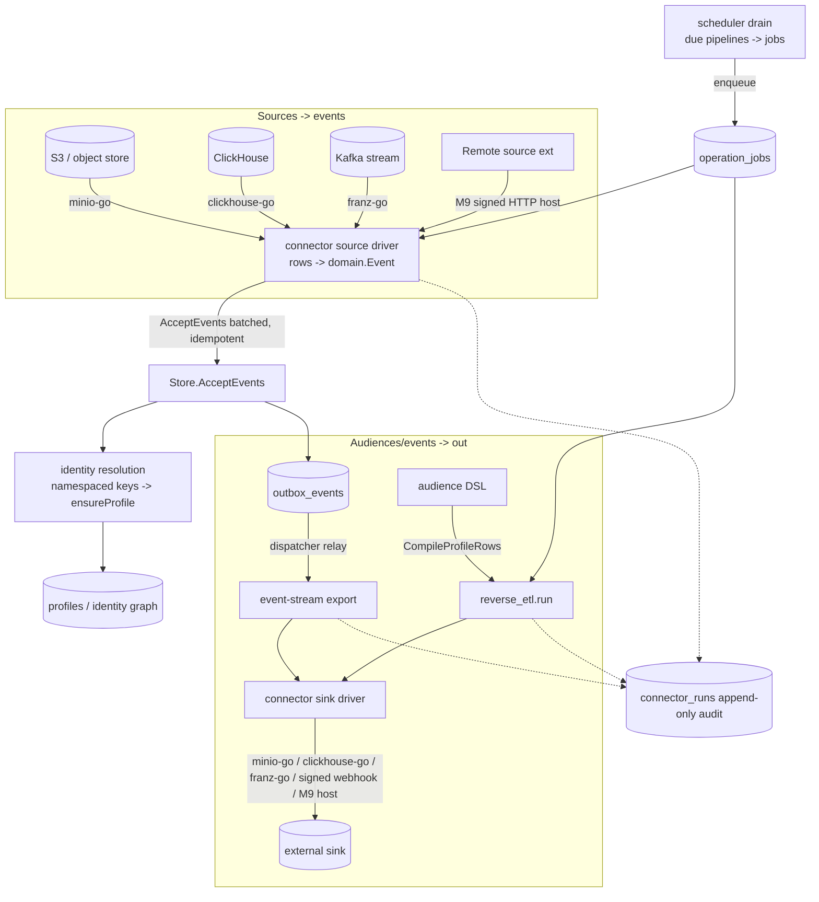

# Phase 4/§5.4 (slice) Implementation Plan: Data Platform & Connectors — Warehouse/Object-Storage Sources, Reverse-ETL Sinks, Event-Stream Export & Identity Resolution

Status: not started. Implements the **"Warehouse and CDP connectors" + "Cloud event streams"** of
`plan.md §5.4`, the **identify/merge identity graph** of `plan.md §5.2`, and the object-storage
import/export ownership of `plan.md §7.3–7.4`, on top of Milestones 1–9. Turns OpenJourney's event
pipeline into a **two-way data platform**: pull data in from warehouses/object-storage/streams,
push audiences and events back out to external sinks, and resolve identities across namespaces —
all **governed, bounded, and event-sourced** exactly like every other write in the system.

Delivers:
1. **First-class connectors** — a connector is an **extension of `kind='connector'`** (reusing all of
   M9's signing, scopes, config-secret-refs, audit, kill switch, health, and budget governance) with
   a new `transport='native'` (built-in driver) alongside M9's `remote_http`. A **driver registry**
   (`internal/connector/registry.go`) mirrors `channels.Registry`; native drivers reuse deps already
   in `go.mod` (`minio-go` for S3, `ClickHouse-go` for warehouse, `franz-go` for Kafka); third-party
   connectors bridge to the **M9 signed-HTTP host**.
2. **Pipelines** — a blob-frozen `connector_pipelines` definition (`direction ∈ {source, sink, export}`)
   binding a connector + a **mapping** (audience for reverse-ETL, object/query for sources, topics for
   export) + an optional **schedule**. A new **leased scheduler** (none exists today) enqueues due runs.
3. **Sources** — object-storage (S3/CSV/JSONL), warehouse (ClickHouse), and cloud event-stream (Kafka)
   ingestion that maps rows → `domain.Event` and rides `Store.AcceptEvents` (the M8-import shape),
   deterministic-idempotent, batched, with rejected rows quarantined to object storage.
4. **Sinks + export** — **reverse-ETL** (compile an audience → materialize rows → push to a sink) and a
   **Currents-style event-stream export** (reuse the `outbox_events` fan-out — at-least-once already
   solved by `internal/dispatcher`). Every sink write is bounded, signed, SSRF-guarded, and audited.
5. **Identity resolution** — extend the existing `identity_aliases`/`identity_merges` scaffolding into
   **namespaced identity keys** (email/phone/user_id/custom) resolved **before** `ensureProfile`, a
   **deterministic merge policy** with **reversible provenance** (tombstone, not hard-delete), and
   explicit **identify/merge/unmerge** commands emitted as events.
6. **M9 security closeout** (`15.0`) — folds the eleven findings from the Milestone 9 static review.

This is a **recipe book**, like the Phase 2–9 plans. Every task references a recipe and ends with a
**Done when** check. **If a task feels ambiguous, open the named existing file, copy it, rename, and
change the fields.** Recipes 6.1–6.44 from prior plans still apply verbatim; this plan adds recipes
6.45–6.51.

> **This is a large, data-heavy milestone.** Security closeout (`15.0`) and the connector foundation
> (`15.1`: registry + pipeline + freeze) land first. Then the scheduler (`15.2`), then sources
> (`15.3–15.4`), then sinks + export (`15.5–15.7`), then identity (`15.8–15.9`), then governance/UI/
> closeout (`15.10–15.12`). Treat `15.3`-green (an object-storage source round-trips rows → events →
> profiles, idempotently) as the checkpoint. Each direction ships independently.

> **`15.0` and `15.1` come first and are non-negotiable.** No connector runs before the governed,
> scope-granted, versioned foundation exists; and the M9 gaps (`15.0`) are pre-existing security holes
> the new connector paths would otherwise inherit (unenforced scopes, conditional signing, enable
> bypass, silent-no-op audit).

## Design decisions (locked)

1. **A connector IS an extension of `kind='connector'`.** Do **not** build a parallel registry/table
   system. Reuse `extensions` + `extension_versions` (`041_extensions.sql`), widening
   `extension_versions.transport` CHECK to add `'native'` (DROP/ADD like `041:65-68`). **Native**
   connectors register an in-repo driver and are **first-party trusted** (pre-seeded install, signed
   with the operator's own trusted key from `15.0.2`, or an explicit `is_builtin` trust path);
   **remote** connectors reuse the M9 signed-HTTP host unchanged. All M9 governance — JWS signature,
   scope intersection, `*_ref` secrets, `extension_activity` audit, circuit breaker, kill switch,
   rate/budget — applies to connectors for free.
2. **No new `go.mod` or `web/package.json` dependency — stricter than M9's "one".** S3 uses
   `github.com/minio/minio-go/v7` (present), warehouse uses `github.com/ClickHouse/clickhouse-go/v2`
   (present), stream export/ingest uses `github.com/twmb/franz-go` (present, already the dispatcher's
   Kafka client). **Snowflake, BigQuery, and Parquet are remote connectors** (signed HTTP to a
   sidecar) or documented later-native work — **never** a heavy new driver in v1. If a task seems to
   need a new dependency, it is out of scope: use a remote connector instead.
3. **Everything rides the event pipeline; nothing writes `profiles`/`identity_*` directly.** A source
   builds `[]domain.Event` and calls `Store.AcceptEvents` — exactly the M8 importer
   (`internal/operations/operations.go:192`). Deterministic idempotency key
   `"<connector>:<pipeline_version>:<cursor>:<row>"` so re-runs dedup at the
   `(tenant_id,app_id,idempotency_key)` constraint (`store.go:238`). Batch up to
   `tenant_quotas.max_batch_size` (`store.go:216`). Rejected rows are **quarantined** to object storage
   with redacted diagnostics (`plan.md §5.4`), never dropped silently. The **only** sanctioned direct
   profile writer remains `UpdateProfileAttributes` (`journey_runtime.go:644`); connectors MUST NOT add
   a second bypass.
4. **Reverse-ETL = compile an audience → materialize rows → push to a sink.** Reuse
   `audience.CompileProfile` (`internal/audience/compile_pg.go:9`) through a **widened projection**
   (`CompileProfileRows(node, fields)` selecting mapped columns instead of only `external_id`); every
   mapped field name MUST pass `fieldSafetyRegex` (`compile_pg.go:143`) and every value stays
   parameterized. Suppression-aware via `CompileConsent` (`compile_pg.go:145`). The sink write is
   upsert-keyed + bounded like a connector call. Reverse-ETL **never** mutates OpenJourney source data.
5. **Currents-style export reuses the outbox, not a new bus.** At-least-once is already solved by
   `outbox_events` (`002_phase1.sql:105`) + `internal/dispatcher/dispatcher.go:17` → Kafka. Export adds
   new outbox **topics** (a second `INSERT INTO outbox_events` in the relevant writer — no schema change,
   `UNIQUE(topic,event_id)` already supports per-event fan-out) and/or a second consumer that pushes to
   an export sink (Kafka topic / S3 / signed webhook). An `export.replay` job backfills a window.
6. **Identity resolution/merge extends the existing scaffolding, event-sourced.** Build on
   `identity_aliases`/`identity_merges` (`002_phase1.sql:81,93`) and the `identity.alias`/`identity.merge`
   `ProjectEvent` cases (`store.go:594,611`). Add **namespaced identity keys** (email/phone/user_id/
   custom, priority-ordered) resolved **before** `ensureProfile`; a **deterministic merge policy**
   (winner by policy/version + attribute conflict rule); and **reversible provenance** — a merge
   **tombstones** the source profile (`profiles.merged_into`) and snapshots pre-merge state
   (`identity_merges.reversal_ref` blob) instead of hard-deleting, so an `identity.unmerge` event can
   restore it. Identify/merge/unmerge are **explicit commands emitted as events**. Concurrent updates
   use the existing optimistic `profiles.version`.
7. **Scheduling is a new minimal leased mechanism (none exists today — confirmed).** Add
   `schedule_interval_seconds` + `next_run_at` + `schedule_enabled` columns to `connector_pipelines`
   and an `internal/scheduler` drain that atomically claims due pipelines
   (`SELECT ... WHERE schedule_enabled AND next_run_at <= now() FOR UPDATE SKIP LOCKED`), advances
   `next_run_at`, and enqueues the `warehouse.sync`/`reverse_etl.run` job — mirroring the leased queue
   (`internal/postgres/operations.go:13`). It runs as a `-watch` worker like `cmd/operations`. **No cron
   dependency.**
8. **Governance is uniform.** New scopes `connectors:read/write/run` wired in **THREE places**
   (`rbac.go:12-29` allowlist, the `api_keys` DEFAULT array **re-declared in full** in the new migration,
   the `s.authenticate("connectors:...", ...)` route guards). New job types `warehouse.sync`,
   `reverse_etl.run`, `export.replay` added to the `operation_jobs.job_type` CHECK (DROP/ADD like
   `041:65-68`) **and** a `FailOperationJob` terminal-failure branch (`operations.go:66`). Every value the
   code writes appears in its CHECK. **Publish/enable** of a connector or pipeline requires the
   **human-actor gate** (`journeys.go:80`). Every run is recorded in the **append-only** `connector_runs`
   table (with a `BEFORE UPDATE OR DELETE` trigger + `REVOKE`, per `15.0.3`). Credentials are `*_ref`
   references only (`resolver.go:44`) — never raw. All native egress obeys the SSRF/allowlist dial guard
   (`host.go:35-84`); native endpoints are config-pinned + allowlisted.

## 1. Architecture

Governance choke point: every native/remote connector call is dispatched through the **M9
`extension.Host`** (`host.go:101`) or a native driver that reuses the same SSRF-guarded `http.Client`
and the same `extension_activity` audit + circuit breaker; pipelines add `connector_runs` on top.

### 1.1 New dependency

**None.** Unlike every prior milestone this one adds **zero** `go.mod` and **zero** `web/package.json`
dependencies. All I/O uses clients already present: `minio-go/v7` (S3-compatible object storage),
`ClickHouse-go/v2` (warehouse), `franz-go` (Kafka), and the M9 signed-HTTP host for everything else.
`go mod tidy` MUST show no additions; a task that appears to need Snowflake/BigQuery/Parquet drivers is
implemented as a **remote connector**, not a native one.

## 2. Schema (new migrations)

### 2.1 `043_connectors.sql`

- Widen `extension_versions.transport` CHECK: DROP/ADD to `IN ('remote_http','wasm','native')`.
- `connector_pipelines` — `id uuid PK`, `tenant_id`/`workspace_id`/`app_id uuid NOT NULL`,
  `connector_extension_id uuid NOT NULL REFERENCES extensions(id)`, `name text`,
  `direction text CHECK IN ('source','sink','export')`, `status text CHECK IN ('draft','enabled','disabled')`,
  `current_version_id uuid`, `schedule_enabled bool DEFAULT false`,
  `schedule_interval_seconds int`, `next_run_at timestamptz`, `last_run_at timestamptz`,
  `created_at`/`updated_at timestamptz DEFAULT now()`, `UNIQUE(tenant_id,app_id,name)`.
  Index `connector_pipelines_due_idx (schedule_enabled, next_run_at)`.
- `connector_pipeline_versions` — immutable: `id uuid PK`, `pipeline_id uuid REFERENCES`,
  `version int`, `mapping_key text` (blob-frozen definition), `mapping jsonb` (summary),
  `definition_sha text`, `created_by_user_id uuid`, `created_at timestamptz`,
  `UNIQUE(pipeline_id,version)`. Append-only trigger + REVOKE UPDATE/DELETE (per `15.0.3`).
- Scopes: add `connectors:read`, `connectors:write`, `connectors:run` to the `api_keys.scopes`
  DEFAULT array — **re-declare the ENTIRE array from `041:70-85`** plus the three new values.
- Widen `operation_jobs.job_type` CHECK: DROP/ADD adding `'warehouse.sync'`, `'reverse_etl.run'`,
  `'export.replay'` to the current `041:65-68` set.

> **Migration numbering note:** task `15.0.3` (M9 audit hardening) added
> `044_extension_activity_hardening.sql` (a `REVOKE` on `extension_activity`), so the connector-runs
> and identity migrations below take the **next available** numbers `045` and `046`. Always use the
> next zero-padded number on disk, not a hard-coded one.

### 2.2 `045_connector_runs.sql`

- `connector_runs` — append-only audit: `id uuid PK`, `tenant_id`/`workspace_id`/`app_id uuid`,
  `pipeline_id uuid REFERENCES connector_pipelines(id)`, `pipeline_version_id uuid`,
  `job_type text`, `status text CHECK IN ('running','succeeded','failed','dead')`,
  `cursor text`, `rows_in bigint DEFAULT 0`, `rows_out bigint DEFAULT 0`,
  `rows_rejected bigint DEFAULT 0`, `reject_blob_key text`, `error text`,
  `started_at timestamptz DEFAULT now()`, `finished_at timestamptz`.
  `BEFORE UPDATE OR DELETE` trigger raising `connector_runs is append-only` **and** an accompanying
  `REVOKE UPDATE, DELETE ON connector_runs FROM ...` (fixing the M9 gap — see `15.0.3`). Insert an
  in-progress `running` row, then the run writes a terminal `succeeded/failed` row (append, not update).
  Index `connector_runs_pipeline_idx (pipeline_id, started_at DESC)`.

### 2.3 `046_identity_resolution.sql`

- `identity_namespaces` — per-tenant config: `id uuid PK`, `tenant_id`/`app_id uuid`,
  `namespace text` (e.g. `email`, `phone`, `user_id`), `priority int` (merge-winner tiebreak),
  `is_unique bool DEFAULT true`, `UNIQUE(tenant_id,app_id,namespace)`. Seed defaults.
- `profiles`: add `merged_into uuid` (tombstone → the surviving profile; NULL = live) +
  index `profiles_merged_into_idx`. A merged profile is retained, not deleted (reversible provenance).
- `identity_merges`: add `winner_policy text DEFAULT 'v1'`, `reversible bool DEFAULT true`,
  `reversal_ref text` (blob key of the pre-merge source snapshot), `undone_at timestamptz`,
  `actor_user_id uuid`, `actor_type text`.
- `identity_aliases` already carries `(namespace, value, profile_id)` — reused as the lookup table;
  no structural change beyond a covering index `identity_aliases_lookup_idx (tenant_id,app_id,namespace,value)`
  if absent.

## 3. The seams to get right

### 3.1 Connector = extension of `kind='connector'`, `transport='native'`

The driver registry (`internal/connector/registry.go`) mirrors `channels.Registry` (`registry.go:9`):
`type ConnectorDriver interface { Read(ctx, cfg, cursor) (rows, nextCursor, error); Write(ctx, cfg, rows) (written, error) }`,
a `DefaultRegistry()` with `s3`/`clickhouse`/`kafka`/`webhook`/`fake`, `For(driver)`, and `Register`. A
`RegisterNativeConnectors(...)`/remote bridge mirrors `extension/channel.go:111` `RegisterChannelProviders`.
Remote connectors (`transport='remote_http'`) call `host.Invoke(ctx, p, extID, "read"|"write", input)`
(bounded + audited by M9); native drivers reuse `NewHost`'s SSRF-guarded client (`host.go:35-84`).

### 3.2 Source → events (the M8-import shape)

`warehouse.sync` executor (new `execute` case, `operations.go:111` switch) mirrors `executeImport`
(`operations.go:192`): open the pipeline + connector config, driver `Read` a bounded page, map each row
→ `domain.Event` per the mapping, deterministic idempotency key `"<connector>:<version>:<cursor>:<row>"`,
`store.AcceptEvents(Principal{ActorType:"connector"}, batch)`, tally, quarantine rejects to object
storage, advance/persist the cursor on the `connector_runs` row, re-enqueue the next page (or let the
scheduler do it). Never write `profiles` directly.

### 3.3 Reverse-ETL & export → sink

`reverse_etl.run` executor compiles the pipeline's audience via `CompileProfileRows(node, fields)`
(widened `compile_pg.go`), streams rows, and calls the sink driver `Write` (upsert-keyed, bounded,
signed). Export reuses `outbox_events`: a new topic INSERT (in `AcceptEvents`/delivery writers) + a
second `internal/dispatcher`-style relay that pushes to the export sink; `export.replay` backfills.

### 3.4 Identity resolution (pre-`ensureProfile`)

A `resolveIdentity(tx, event)` helper runs **before** `ensureProfile` (`store.go:684`): for each
namespaced key on the event (email/phone/user_id), look up `identity_aliases`; if it resolves to an
existing profile, use it; on conflict apply the deterministic merge policy. Merge tombstones the loser
(`profiles.merged_into`), snapshots it to `reversal_ref`, re-points aliases/consent, records
`identity_merges`. `identity.unmerge` restores from the snapshot. All via `ProjectEvent` cases — no
direct table writes outside the projector.

## 4. Exit-criteria traceability (`plan.md §5.2`, §5.4, §5.5, §7.3–7.4 + §14 Phase 4 "connectors")

| plan.md requirement | Milestone task |
|---|---|
| Warehouse and CDP connectors; cloud event streams (§5.4) | 15.1, 15.3, 15.4, 15.7 |
| CSV/JSONL/Parquet imports from object storage (§5.4) | 15.3 (CSV/JSONL native; Parquet = remote) |
| Deduplicate by tenant/source/idempotency key; preserve event vs ingestion time (§5.4) | 15.3, D.D. 3 |
| Quarantine invalid data with redacted diagnostics + replay (§5.4) | 15.3, 15.10 |
| Catalog/warehouse synchronization (§5.5) | 15.5, 15.7 |
| Audience/broadcast manifests + exports in object storage (§7.3) | 15.5, 15.6 |
| `exports.events.v1` stream family; outbox/inbox at boundaries (§7.4) | 15.6 |
| Identification and merge are explicit commands with deterministic policy (§5.2) | 15.8, 15.9 |
| Merge stores source identities, winner, policy, actor, reversible provenance (§5.2) | 15.9 |
| Events before identification join through audited identity edges (§5.2) | 15.8 |
| M9 extension protocol security closeout | 15.0 |

## 5. Implementation recipes (new; 6.1–6.44 from prior plans still apply)

### 6.45 Native connector driver
Copy a `channels` adapter (`internal/channels/httpprovider.go`) for the SSRF-guarded client shape and
`internal/channels/registry.go` for the registry. Implement `ConnectorDriver.Read`/`Write` per backend
using the already-present client (`minio-go`/`clickhouse-go`/`franz-go`). Config via `ResolveConfigMap`
(`resolver.go:65`) `*_ref` secrets. Register in ONE place in `DefaultRegistry()`.

### 6.46 Connector pipeline + freeze
Copy `internal/extension/registry.go:24` (`Publish`): canonical JSON of the mapping definition →
`sha256` → `blobs.Put("connectors/<tenant>/<pipeline>/defs/<sha>.json")` → insert an immutable
`connector_pipeline_versions` row. Human-actor gate on publish/enable (`journeys.go:80`).

### 6.47 Leased scheduler
Copy `internal/postgres/operations.go:13` (`ClaimOperationJob`): a due-check
`... WHERE schedule_enabled AND next_run_at <= now() FOR UPDATE SKIP LOCKED LIMIT N`, advance
`next_run_at = now() + interval '1 second' * schedule_interval_seconds`, enqueue the job. Drain loop +
`cmd/scheduler/main.go` copied from `cmd/operations/main.go`.

### 6.48 Source executor
Copy `executeImport` (`internal/operations/operations.go:192`) end-to-end: request row → blob/driver →
per-row `domain.Event` → deterministic idempotency key → `AcceptEvents` → status/reject tally. Swap the
CSV reader for the driver `Read`.

### 6.49 Reverse-ETL projection
Copy `internal/audience/compile_pg.go:9` (`CompileProfile`) into `CompileProfileRows(node, fields)`:
same recursive `compileProfileNode`, but `SELECT` the mapped `fields` (each validated by
`fieldSafetyRegex`, `compile_pg.go:143`; JSONB keys interpolated, values parameterized) instead of only
`external_id`. Suppression filter via `CompileConsent` (`compile_pg.go:145`).

### 6.50 Event-stream export
Copy the outbox write (`store.go:286`) for a new topic and `internal/dispatcher/dispatcher.go:17`
(`Drain`) for a second relay to the export sink. At-least-once + dedup already handled by
`outbox_events` `UNIQUE(topic,event_id)` + `ClaimOutboxEvent`.

### 6.51 Identity resolution + reversible merge
Extend the `identity.alias`/`identity.merge` cases (`store.go:594,611`): add `resolveIdentity` before
`ensureProfile` (`store.go:684`), tombstone via `profiles.merged_into` + snapshot to `reversal_ref`
instead of `DELETE`, add an `identity.unmerge` case that restores from the snapshot. Deterministic
winner by `identity_namespaces.priority` + policy version.

## 6. Task list

### Milestone 15.0 — Security closeout of the M9 Extension Ecosystem — DO FIRST
1. [x] **Enable-gate + scope enforcement.** Add the human-actor gate (`p.ActorType != "user" || p.UserID == ""`
   → 403 `human_approval_required`) to the enable path (`UpdateExtension` when `status` transitions to
   `enabled`, `internal/httpapi/extensions.go:72` / `internal/postgres/extensions.go:84`). Wire a real
   `requiredScope` into every invocation site so `denied_scope` actually fires: `channel.go:60`,
   `template.go:56,70`, `httpapi/ingestion.go:33`, `journey/nodes.go:384`, `operations.go:154` call
   `InvokeWithScope` (not bare `Invoke`), and reuse `deriveAgent` (`internal/ai/tools/tools.go:133`) so
   the derived principal is intersected with the caller's scopes too.
   *Done when:* a non-human `extensions:write` key gets 403 re-enabling a disabled extension; a test
   proves an over-scoped extension invocation is rejected `denied_scope` + audited on a real seam (not
   only via `InvokeWithScope` in a unit test). — done: HTTP human-actor gate and audited channel scope-denial tests pass; full Go build/vet/test and tidy show no dependency diff.
2. [x] **Signing hardening.** Wire operator trusted publisher keys from config into
   `SetTrustedPublisherKeys` (`internal/postgres/store.go:62`) at a `cmd/` boot site so installs work in
   prod; restrict the accepted JWS algorithm allowlist (`extensions.go:267`) to **asymmetric-only** (drop
   `HS256/384/512`); make remote HMAC signing **mandatory** — reject a `remote_http` config lacking
   `hmac_secret`/`hmac_secret_ref` at publish/enable rather than sending unsigned (`host.go:310`).
   *Done when:* an install with a valid operator-trusted asymmetric key succeeds; an HMAC/symmetric
   "publisher key" is rejected; a remote extension config without an HMAC secret fails validation; tests
   cover all three. — done: API boot loads asymmetric JWK trust keys; asymmetric-only JWS, required HMAC refs, and config/integration tests pass.
3. [x] **Audit integrity + append-only enforcement.** Write an `extension_activity` row on the first
   resolution failure (`GetExtension`, `host.go:103`); make a failed `recordActivity` **fail the
   invocation** (return an error / same-tx write) so no call ever succeeds without a durable audit row
   (`host.go:260`); add `REVOKE UPDATE, DELETE` to the `extension_activity` append-only table
   (`042:24-29`) and apply the same to `connector_runs`; **redact secrets** from `input_ref`/`output_ref`
   (`host.go:337-345`) — store a blob reference or redacted digest, not raw payload JSON.
   *Done when:* a forced audit-insert failure aborts the invocation; `UPDATE`/`DELETE` on the audit table
   is rejected even by the app role; a payload secret does not appear verbatim in `extension_activity`.
   — done: `host.go` records a best-effort audit row on first-resolution failure, fails the invocation
   when the success-path audit write errors, and redacts `input_ref`/`output_ref` to a
   `redacted:sha256:` digest (`redactActivityPayload`); migration `044_extension_activity_hardening.sql`
   REVOKEs UPDATE/DELETE on `extension_activity`; `connector_runs`' own REVOKE ships with its migration
   (§2.2). Tests: `TestHostInvoke_AuditWriteFailureAbortsInvocation`,
   `TestHostInvoke_PayloadSecretsRedacted`, `TestHostInvoke_FirstResolutionFailureAudited`.
4. [x] **Bounded-failure completeness.** The `connector.run` path (`operations.go:129-155`) must degrade
   deterministically: a disabled/failing connector marks the run failed and does **not** dead-letter the
   host loop as an unbounded stall (bound the retry, or mark terminal without re-queuing on `disabled`).
   Template-function extensions (`template.go:57,71`) get a configured deterministic fallback and the
   render deadline `ctx` is propagated (not `context.Background()`). Ingestion infra errors
   (`ingestion.go:25-32`) honor the manifest `on_error` (passthrough) instead of always rejecting `422`.
   *Done when:* a disabled connector's job resolves terminally without infinite retry; a broken template
   extension renders its fallback; a store blip during ingestion transform passes through per `on_error`;
   tests cover each. — done: disabled connector terminal-job and template fallback tests pass; ingestion
   passthrough coverage passes; full Go build/vet/test and tidy show no dependency diff.

### Milestone 15.1 — Connector foundation: driver registry + pipeline + freeze + scopes
1. [x] **Migration `043_connectors.sql`** (§2.1): widen `extension_versions.transport` to add `'native'`;
   `connector_pipelines` + `connector_pipeline_versions`; `connectors:read/write/run` in `rbac.go:12-29`
   **and** the re-declared `api_keys` DEFAULT array; widen `operation_jobs.job_type` with `warehouse.sync`,
   `reverse_etl.run`, `export.replay`; add the `FailOperationJob` terminal branch (`operations.go:66`) for
   the new job types' request table (`connector_runs`).
   *Done when:* migration applies cleanly; the CHECK accepts every new value and rejects an unknown one;
   `rbac.go` accepts the three new scopes; `go test ./internal/postgres/...` green. — done: 043 migration,
   connector scopes, terminal connector-job handling, and integration assertions added; full Go build/vet/test
   and tidy pass with no dependency diff (DB integration skipped because OPENJOURNEY_TEST_DATABASE_URL is unset).
2. [x] **Driver registry + ports + store** (Recipe 6.45): `internal/connector/registry.go` (`ConnectorDriver`
   interface, `DefaultRegistry` with `fake` + stubs, `For`, `Register`), a `RegisterNativeConnectors`/remote
   bridge (mirror `extension/channel.go:111`), and `ports.Store` + `internal/postgres` methods for pipelines
   (`CreateConnectorPipeline`, `ListConnectorPipelines`, `GetConnectorPipeline`).
   *Done when:* the registry resolves `fake` and falls back for unknown; a pipeline round-trips through the
   store; unit tests green. — done: fake/fallback registry test and PostgreSQL pipeline create/get/list round-trip integration test pass; full Go build/vet/test and tidy show no dependency diff (DB integration skips when OPENJOURNEY_TEST_DATABASE_URL is unset).
3. **Pipeline HTTP + freeze** (Recipe 6.46): routes `GET/POST /v1/connectors/pipelines`,
   `POST /v1/connectors/pipelines/{id}/publish`, `PUT .../{id}` guarded by `connectors:read`/`connectors:write`
   (`server.go:216` style); publish freezes the mapping definition (canonical JSON → sha256 → `blobs.Put` →
   immutable version row) and requires the human-actor gate.
   *Done when:* a non-human actor is 403 on publish/enable; publishing writes an immutable version + blob;
   the definition sha is stable for identical input; httpapi tests green. — done: connector pipeline CRUD/
   publish routes, canonical blob freeze, immutable version persistence, human publish/enable gates, and
   `TestPublishConnectorPipelineFreezesCanonicalDefinitionAndRequiresHuman` pass; full Go build/vet/test and
   tidy pass with no dependency diff.

### Milestone 15.2 — Leased scheduler (recurring runs)
1. [x] **Scheduler drain + worker** (Recipe 6.47): `internal/scheduler` claims due pipelines
   (`schedule_enabled AND next_run_at <= now() FOR UPDATE SKIP LOCKED`), advances `next_run_at` by
   `schedule_interval_seconds`, and enqueues the direction's job (`warehouse.sync`/`reverse_etl.run`);
   `cmd/scheduler/main.go` copied from `cmd/operations/main.go` (`-watch` loop, restart-friendly).
   *Done when:* a due pipeline enqueues exactly one job and its `next_run_at` advances; two concurrent
   scheduler instances never double-enqueue (SKIP LOCKED); a test proves both. — done: atomic
   PostgreSQL claim/advance/enqueue plus restart-friendly scheduler worker; unit and PostgreSQL
   concurrency tests cover one-job scheduling and SKIP LOCKED behavior.

### Milestone 15.3 — Object-storage source (S3 / CSV / JSONL → events)
1. [x] **`s3` source driver** (Recipe 6.45, `minio-go`): list/stream objects by prefix, parse CSV/JSONL,
   cursor = `<object_key>:<row>`; config `endpoint`/`bucket`/`prefix` + `access_key_ref`/`secret_key_ref`;
   egress pinned + allowlisted.
   *Done when:* the driver reads a fixture bucket (fake/minio) into rows deterministically with a resumable
   cursor; unit test green. — done: MinIO-backed S3 driver with guarded endpoint/ref validation and deterministic CSV/JSONL cursor-resume test passes; full Go build/vet/test and tidy show no dependency diff.
2. [x] **`warehouse.sync` source executor** (Recipe 6.48): map rows → `domain.Event` per the pipeline mapping,
   deterministic idempotency key, `AcceptEvents` batched to `max_batch_size`, quarantine rejects to object
   storage, write a `connector_runs` row (running → terminal).
   *Done when:* a source run round-trips rows → events → profiles; re-running the SAME objects is a no-op
   (idempotent); rejected rows land in the quarantine blob with counts on the run; integration test green.
   — done: `warehouse.sync` maps bounded driver pages into batched `AcceptEvents`, writes append-only running/terminal `connector_runs`, quarantines rejected rows, and `TestWarehouseSyncIsEventSourcedAndIdempotent` proves replay deduplication; full Go build/vet/test and tidy pass with no dependency diff.

### Milestone 15.4 — Warehouse & cloud-stream sources
1. [x] **`clickhouse` source driver** (Recipe 6.45, `clickhouse-go`): a bounded parameterized `SELECT` with a
   watermark cursor (e.g. `updated_at > $cursor`), rows → events via the executor.
   *Done when:* a ClickHouse source run ingests rows past a watermark and advances the cursor; re-run is
   idempotent; integration test (or a fake-backed unit test) green. — done: bounded parameterized ClickHouse
   source driver with SSRF/allowlist and `*_ref` validation; deterministic watermark/cursor and unsafe-query
   tests pass; full Go build/vet/test and tidy show no dependency diff.
2. [x] **`kafka` cloud event-stream source** (Recipe 6.45, `franz-go`): a bounded consumer that maps stream
   records → events, committing offsets only after `AcceptEvents` succeeds (at-least-once, idempotent).
   *Done when:* consumed records become accepted events exactly once per idempotency key even on redelivery;
   test green. — done: bounded franz-go source with SSRF-guarded broker dialing and post-AcceptEvents manual
   commit; redelivery/commit-order and private-broker tests pass; full Go build/vet/test and tidy show no
   dependency diff.

### Milestone 15.5 — Reverse-ETL sink (audience → sink)
1. **`CompileProfileRows` projection** (Recipe 6.49): widen `internal/audience/compile_pg.go` to select
   mapped fields (each via `fieldSafetyRegex`), suppression-aware via `CompileConsent`.
   *Done when:* a compiled query returns the mapped columns for members of an audience and excludes
   suppressed profiles; a field name failing the regex is rejected; unit test green.
2. **`reverse_etl.run` executor**: materialize rows via the projection, call the sink driver `Write`
   (upsert-keyed, bounded, per-connector budget/rate), write a `connector_runs` row; schedulable.
   *Done when:* an audience materializes and pushes rows to a `fake` sink; a second run with unchanged
   membership is an idempotent upsert (no dupes at the sink); it never writes OpenJourney source tables;
   integration test green.

### Milestone 15.6 — Currents-style event-stream export
1. **Event-stream export** (Recipe 6.50): add export outbox topic(s) (`exports.events.v1`) as a second
   `outbox_events` INSERT + an `internal/dispatcher`-style relay that pushes to an export sink
   (`kafka`/`s3`/signed `webhook`), bounded + signed; an `export.replay` job backfills a time window from
   `accepted_events`.
   *Done when:* every accepted event is delivered to the export sink at-least-once with per-event dedup
   (`UNIQUE(topic,event_id)`); `export.replay` re-emits a window without duplicating live delivery;
   integration test green.

### Milestone 15.7 — Native sinks + remote connectors
1. **`s3` / `clickhouse` / `webhook` sink drivers** (Recipe 6.45): idempotent object write (content-addressed
   or run-scoped key), warehouse batched `INSERT`, and HMAC-signed webhook (reuse `webhook.go:134`), each
   bounded + allowlisted.
   *Done when:* each sink driver writes idempotently to its fake/local backend; a redelivery does not
   duplicate rows; unit tests green.
2. **Remote connector bridge**: `transport='remote_http'` pipelines invoke via `host.Invoke(..., "read"|"write", ...)`
   (M9 bounded/audited); document Snowflake/BigQuery/Parquet as remote-connector configs (no native driver).
   *Done when:* a `fake` remote connector performs a source read and a sink write through the M9 host, is
   audited in `extension_activity`, and honors its kill switch; test green; `go mod tidy` shows no new dep.

### Milestone 15.8 — Identity resolution: namespaced keys + pre-`ensureProfile` resolution
1. **Migration `046_identity_resolution.sql`** (§2.3): `identity_namespaces` (+ seed), `profiles.merged_into`,
   `identity_merges` provenance columns, `identity_aliases` lookup index.
   *Done when:* migration applies; a merged profile can be tombstoned without deletion; CHECKs accept every
   written value.
2. **Namespaced resolution before `ensureProfile`** (Recipe 6.51): a `resolveIdentity(tx, event)` that resolves
   email/phone/user_id/custom via `identity_aliases`, generalizing the anon→known stitch (`store.go:687`) to
   any configured namespace; events arriving before identification associate to the anonymous subject and are
   re-pointed through audited identity edges on later identify.
   *Done when:* two events with different namespaced keys resolving to the same subject land on one profile;
   a pre-identification event is retro-associated on identify; nothing writes `profiles` outside the projector;
   integration test green.

### Milestone 15.9 — Deterministic merge policy + reversible provenance
1. **Deterministic merge**: on a resolution conflict, pick the winner by `identity_namespaces.priority` +
   policy version, apply a deterministic attribute conflict rule, tombstone the loser (`profiles.merged_into`),
   snapshot pre-merge state to `identity_merges.reversal_ref` (blob), re-point aliases/consent — **no
   hard-delete** (replace the `store.go:611` merge's `DELETE`).
   *Done when:* the same two profiles merge to the same winner regardless of arrival order; the loser is
   tombstoned + snapshotted (not deleted); provenance records source/winner/policy/actor/timestamp; test green.
2. **`identity.unmerge` command + identify/merge/unmerge HTTP**: an `identity.unmerge` `ProjectEvent` case that
   restores the tombstoned profile from `reversal_ref` and marks `undone_at`; event-sourced
   `POST /v1/identity/{identify,merge,unmerge}` endpoints (emit events, human-actor gate on merge/unmerge).
   *Done when:* an unmerge restores the original two profiles and their edges from provenance; merge→unmerge→
   merge is deterministic; endpoints emit events (never direct writes); integration test green.

### Milestone 15.10 — Governance: runs audit, budget/rate, kill switch, quarantine
1. **Connector governance**: every source/sink/export run writes an append-only `connector_runs` row on every
   path (running → succeeded/failed/dead); per-pipeline/connector budget + rate + kill switch reuse the M9
   extension governance (`host.go` circuit breaker + `extension_configs` limits); reject-quarantine + a replay
   control (re-run a failed run's rejected rows).
   *Done when:* a disabled connector's pipeline run is refused + audited; exceeding a per-connector budget is
   `denied_budget` + audited; a run's rejected rows can be replayed; `connector_runs` rejects UPDATE/DELETE;
   tests cover each.

### Milestone 15.11 — UI (Connectors)
1. **Connectors section**: a `web/src/sections/Connectors.tsx` (list connectors, create source/sink/export
   pipelines, edit mapping, toggle schedule, view run history + reject counts) + an identity merge/unmerge
   viewer; `web/src/api.ts` client block (mirror `api.ts:423-434`) + `App.tsx` wiring (lazy import, `View`
   type, `viewTitles`, nav, render branch). No new npm dependency; theme-aware.
   *Done when:* `cd web && npm run typecheck && npm run build && npm test` green; the section lists pipelines,
   creates one, and shows run history end-to-end against the API.

### Milestone 15.12 — Integration, security & audit closeout
1. **Data round-trip E2E**: an object-storage source ingests rows → events → profiles; a replay of the same
   source is a no-op; a reverse-ETL pipeline materializes an audience and upserts to a `fake` sink without
   duplication.
   *Done when:* the end-to-end source→profile and audience→sink flows pass, both idempotent.
2. **Identity E2E**: multi-namespace resolution, deterministic order-independent merge, reversible unmerge,
   and the "nothing writes profiles directly" invariant (all four identity tables mutated only inside
   `ProjectEvent`) hold under test.
   *Done when:* the identity E2E passes and a grep/assertion confirms no new direct `profiles`/`identity_*`
   writer was introduced outside the projector (only the pre-existing `UpdateProfileAttributes` bypass remains).
3. **Security E2E**: connector credentials are `*_ref` only (a raw-secret config is rejected); all native +
   remote egress is SSRF/allowlist-guarded; connector scopes are intersection-enforced; publish/enable is
   human-actor-gated; `connector_runs` + `extension_activity` are append-only and REVOKE-protected.
   *Done when:* each property has a test proving it (a raw-secret config rejected; a private-IP sink endpoint
   blocked; an over-scoped connector `denied_scope`; a non-human publish 403; an audit UPDATE rejected).
4. **Run the suite**: `go build ./... && go vet ./... && go test ./...`, `go mod tidy` (**MUST show no new
   dependency**), `cd web && npm run typecheck && npm run build && npm test`.
   *Done when:* all green and `git diff go.mod go.sum web/package.json` is empty of additions.
5. **Audit doc** `docs/milestones/v1-milestone-10-audit.md` in the M2–M9 table format, one row per task with
   evidence (file:line + test name).
   *Done when:* the doc exists with a row per `15.x` task and its verifying test.

## 7. Carry-over hazards & invariants

1. **Nothing writes `profiles`/`identity_*` directly.** Sources emit events into `AcceptEvents`; identity
   resolution/merge happens only inside `ProjectEvent`/`resolveIdentity`. The **only** sanctioned bypass is
   `UpdateProfileAttributes` (`journey_runtime.go:644`) — do not add another. (Confirmed by mapping.)
2. **Deterministic idempotency everywhere.** Source rows dedup by `(tenant,app,idempotency_key)`; sink writes
   are upsert-keyed; export dedups by `UNIQUE(topic,event_id)`; merges are order-independent. Re-running any
   pipeline is a no-op, not a duplication. **No `math/rand`, no wall-clock in identity/merge decisions.**
3. **Every connector call is bounded + governed + audited** — via the M9 host or a native driver reusing the
   same SSRF-guarded client, circuit breaker, budget/rate, kill switch, and `extension_activity`; pipelines add
   `connector_runs`. A connector failure **never** stalls or dead-letters the host loop unbounded (this is
   exactly the M9 `15.0.4` gap — do not reintroduce it).
4. **Scopes in THREE places** (`rbac.go`, the re-declared `api_keys` DEFAULT array in the newest migration, the
   route guards). **Every job type in the `operation_jobs.job_type` CHECK + a `FailOperationJob` branch.** Every
   enum value the code writes appears in its CHECK.
5. **Credentials are `*_ref` references, never raw** (`resolver.go:44`). Publish/enable is human-actor-gated.
   Append-only audit tables carry a trigger **and** a REVOKE (M9 `15.0.3` fix).
6. **No new dependency.** `go mod tidy` and `web/package.json` unchanged. Snowflake/BigQuery/Parquet = remote
   connectors. A task that seems to need a native driver not already in `go.mod` is out of scope as written.
7. **Reverse-ETL/export never mutate OpenJourney source data**; they are read-only over `profiles`/
   `accepted_events`/`outbox_events`. Suppression is respected on reverse-ETL (`CompileConsent`).
8. **The M9 security closeout (`15.0`) lands first** — the new connector egress/scope/audit paths inherit its
   fixes (enforced scopes, mandatory signing, durable append-only audit, deterministic bounded failure).

## 8. Open items to confirm before coding

1. **Native driver depth vs. remote.** v1 native drivers: `s3` (minio-go), `clickhouse` (clickhouse-go),
   `kafka` (franz-go), `webhook`, `fake`. Everything else (Snowflake, BigQuery, Parquet, Segment) is a remote
   connector. Confirm this split (locked in D.D. 2) is acceptable for v1.
2. **Identity namespace defaults.** Seed `email`, `phone`, `user_id` with a default priority order — confirm
   the tiebreak (e.g. `user_id` > `email` > `phone`) and whether email/phone are `is_unique` per tenant.
3. **Export topic scope.** v1 export = `exports.events.v1` (accepted events). Confirm whether delivery/
   engagement events (`delivery.attempts.v1`, `engagement.events.v1`) are in-scope for M10 or deferred.
4. **Scheduler placement.** New `cmd/scheduler` worker vs. folding the due-check into `cmd/operations`.
   Defaulting to a separate `-watch` worker (D.D. 7) for blast-radius isolation; confirm.
5. **Reverse-ETL row width.** `CompileProfileRows` selects mapped profile attributes; confirm whether M10
   needs joins to companies/events for the sink projection or attributes-only is sufficient for v1.
