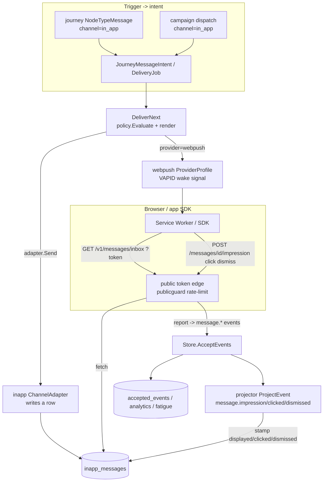

# Phase 4/§5.10 (slice) Implementation Plan: In-App & Web Messaging — Inbox Channel, Content Cards, Web Push & the Client SDK Contract

Status: not started. Implements the **in-product messaging** of `plan.md §5.10` (in-app messages +
content cards) and the **mobile/web push** step of the `plan.md §5.9` channel sequence (items 2–3), on
top of Milestones 1–10. Adds OpenJourney's first **client-pull channel** — messages the browser/app
SDK fetches and renders, rather than an outbound provider call — plus **web push** as a wake signal,
all riding the **existing delivery pipeline, policy engine, and render path unchanged**.

Delivers:
1. **In-app / inbox channel** — a new `channel='in_app'` delivered by a native `ports.ChannelAdapter`
   (`internal/channels/inapp.go`) whose `Send` **persists an `inapp_messages` row** addressed to a
   profile instead of calling out. It reuses **all** of the channel machinery — `sending_identities`,
   `templates`, the `delivery_attempts` state machine, `policy.Evaluate` (suppression/consent/fatigue),
   Liquid `render.Render`, and both `DeliverNext` workers — with zero changes to any of them.
2. **Content cards** — the persistent, feed-style `message_type` of the in-app channel
   (`modal`/`banner`/`fullscreen`/`card`) with `start_at`/`expires_at`/`rank`/`categories`/`payload`
   and read/impression/click/dismiss state (`plan.md §5.10`), fetched ordered by rank.
3. **The client SDK contract** — a **public, token-authenticated** edge (mirroring `submitPublicForm`)
   the browser calls to **fetch** its inbox (`GET /v1/messages/inbox`) and **report**
   impression/click/dismiss (`POST /v1/messages/{id}/{impression,click,dismiss}`). Reports become
   `message.*` accepted events; the browser never holds an admin key, and known-subject reads require a
   server-minted signed token (IDOR-safe).
4. **Web push** — a new `provider='webpush'` under the **existing `push` channel** (not a new channel),
   VAPID-authenticated, delivered as a **wake signal** whose Service Worker then fetches content from
   the in-app inbox edge. Reuses `device_tokens` (`platform='web'` already exists), the push delivery
   path, and the state machine unchanged.
5. **Engagement, event-sourced** — impression/click/dismiss/read state lives **only** in the projector:
   the report edge emits `message.impression`/`message.clicked`/`message.dismissed` events → `AcceptEvents`
   → new `ProjectEvent` cases stamp the `inapp_messages` lifecycle. The adapter `Send` is the only
   creator of rows; the projector is the only mutator of display state.
6. **Browser SDK + reference Service Worker** — extend `sdk/javascript` with an inbox client and ship a
   reference web-push Service Worker, plus a new **Messaging** admin UI section.
7. **M10 security closeout** (`16.0`) — folds the seven findings from the Milestone 10 static review
   (multi-way merge audit loss, ClickHouse-sink DNS-rebinding, unmerge lookup, scheduler run overlap,
   merge-audit hardening, native-transport raw-secret gap).

This is a **recipe book**, like the Phase 2–10 plans. Every task references a recipe and ends with a
**Done when** check. **If a task feels ambiguous, open the named existing file, copy it, rename, and
change the fields.** Recipes 6.1–6.51 from prior plans still apply verbatim; this plan adds recipes
6.52–6.57.

> **This milestone reuses more than it builds.** The delivery state machine, `RenderedMessage`, Liquid
> rendering, `policy.Evaluate`, fatigue/consent/suppression, and the two `DeliverNext` workers need
> **zero** changes for in-app. The genuinely new surface is: (a) a channel adapter that writes a row,
> (b) the `inapp_messages` table + store, (c) the **public client edge**, (d) the engagement projector,
> (e) web-push VAPID, (f) the SDK + UI. Treat `16.4`-green (a journey-triggered in-app message is
> delivered, fetched by the SDK, and impression/click/dismiss round-trip) as the checkpoint.

> **`16.0` and `16.1` come first and are non-negotiable.** `16.0` fixes pre-existing M10 security holes
> (an unaudited/irreversible multi-way merge, a DNS-rebinding SSRF on the ClickHouse sink, overlapping
> scheduler runs) that the new event/identity paths would otherwise inherit; `16.1` lays the governed
> channel foundation before any in-app message can be sent.

## Design decisions (locked)

1. **In-app IS a channel (`in_app`), delivered by a native `ports.ChannelAdapter` that persists an
   inbox row — never an outbound call.** Do **not** special-case `channel=='in_app'` inside
   `DeliverNext`. Register `provider='inapp'` in ONE place via a `RegisterInApp(reg, store)` helper
   called in both workers (mirror `RegisterChannelProviders`, `cmd/campaigns-delivery/main.go:95`,
   `cmd/journeys-worker/main.go:97`). The adapter (`internal/channels/inapp.go`) implements
   `ports.ChannelAdapter` (`adapter.go:24`): `Send` inherits `(tenant,workspace,app)` **atomically from
   the target profile** (`INSERT INTO inapp_messages ... SELECT tenant_id,workspace_id,app_id FROM
   profiles WHERE id=$endpoint`) — because `SendingIdentity` carries no `app_id` (`domain.go:415-427`)
   — sets `content` from the rendered `RenderedMessage` (Subject/Title/HTML/Text/Body/Data,
   `adapter.go:10-21`), and returns the new row id as `providerID`. Everything before `Send` — identity
   resolution, `policy.Evaluate`, render, tracking rewrite — is shared and unchanged.
2. **Web push IS a provider (`webpush`) under the existing `push` channel — not a new channel.**
   VAPID-authenticated. `device_tokens.platform='web'` already exists (`023_device_tokens.sql:9`); only
   the `device_tokens`/`sending_identities` **provider** CHECK gains `'webpush'`. A `webpush`
   `ProviderProfile` (`internal/channels/profiles_webpush.go`) mirrors `FCMPushProfile`
   (`profiles_push.go:37`) through `NewHTTPProviderAdapter` (`httpprovider.go:48`, SSRF-safe transport +
   retry for free). **v1 web push is a VAPID wake signal with no encrypted payload; its Service Worker
   fetches the actual content from the in-app inbox edge.** RFC 8291 `aes128gcm` encrypted payloads
   (achievable with the already-present `golang.org/x/crypto/hkdf` + stdlib `crypto/ecdh`) are
   documented later-native work — **never** a v1 requirement.
3. **No new `go.mod` or `web/package.json` dependency — matches M10.** In-app is pure stdlib + existing
   `render`/store. Web-push VAPID JWT uses stdlib `crypto/ecdsa` + `crypto/elliptic` (P-256) +
   `encoding/base64`. `go mod tidy` MUST show no additions; `web/package.json` unchanged. A task that
   appears to need `webpush-go` or a payload-encryption library is out of scope **as written** (the
   wake-signal model, D.D. 2). The SDK Service Worker is framework-free vanilla JS.
4. **The client SDK edge is PUBLIC and token-authenticated, mirroring `submitPublicForm`
   (`form_submit.go:18`).** No browser holds an admin key for reads. **Anonymous** subjects
   (high-entropy device `anonymous_id`, already how `sdk/javascript` works, `index.ts:29-30`) read
   their own inbox with the SDK's public `messages:read` key + their `anonymous_id`. **Known** subjects
   (`external_id`) **require** a server-minted `SignInAppToken(tenant,app,subject,exp,secret)` — HMAC-
   SHA256, base64url, modeled exactly on `SignFormToken` (`publicguard.go:107`) — so a public key +
   guessable `external_id` cannot read another user's inbox (IDOR-safe). Fetch is `GET /v1/messages/inbox`;
   report is `POST /v1/messages/{id}/{impression,click,dismiss}`. Public abuse controls reuse
   `publicguard.go` (IP token-bucket `IPRateLimiter`, trusted-proxy IP resolution `:179-196`). CORS via
   the existing `s.cors` (`server.go:698`).
5. **Engagement is event-sourced; display-state lives ONLY in the projector.** Reports emit
   `message.impression`/`message.clicked`/`message.dismissed` accepted events → `Store.AcceptEvents`
   (`store.go:210`) → new `ProjectEvent` cases (`store.go:456` switch) stamp
   `displayed_at`/`clicked_at`/`dismissed_at`/`status` on the `inapp_messages` row. `accepted_events`
   has **no `event_type` CHECK** (`001_kernel.sql:47`) so new event types need only projector cases.
   The adapter `Send` is the **only** creator of rows (the delivery, analogous to a delivery attempt);
   the projector is the **only** mutator of display-state. **No HTTP handler writes display-state
   directly** — mirrors M10's "nothing writes profiles/identity_* outside the projector" invariant.
6. **Frequency capping, consent, and suppression apply uniformly — no bypass.** In-app rides
   `policy.Evaluate` (`policy.go:32`) exactly like every channel: in-app sends emit `delivery_attempts`
   / `journey_message_intents` with `decision='sent'`, auto-counted by `SentCountSince` (`delivery.go:82`)
   for **cross-channel** fatigue; suppression is keyed by `(tenant, channel='in_app', endpoint=profile_id)`
   — **no schema change**, `suppressions.channel` is free text (`011_delivery_policy.sql:2-13`). Critical
   / system in-app messages set the `Transactional` flag (`nodes.go:718`) to route the suppression-only
   path (`deliver.go:261`) and skip caps/consent. Content cards default to marketing (fatigue-counted).
7. **Governance is uniform.** Widen the `sending_identities.channel` / `templates.channel` / templates
   body-presence CHECKs to add `'in_app'`, and the `sending_identities.provider` / `device_tokens.provider`
   CHECKs to add `'inapp'` / `'webpush'` — a migration mirroring `022_sms_push_channels.sql`. New scopes
   `messages:read` / `messages:write` wired in **THREE places**: `rbac.go:12-29` allowlist, the
   `api_keys.scopes` DEFAULT array **re-declared in full** in the new migration (current array lives in
   `043_connectors.sql:67-83` — copy it, keep `connectors:*`, add `messages:*`), and the
   `s.authenticate("messages:...", ...)` route guards. Every enum value the code writes appears in its
   CHECK. The only sanctioned direct writers of profile/identity tables remain `UpdateProfileAttributes`
   (`journey_runtime.go:644`) and the RTBF erasure path (`operations.go:210`); in-app adds **no** new
   bypass — display-state moves through the projector only.
8. **Content cards are a `message_type` of the in-app channel, not a parallel system.**
   `inapp_messages.message_type ∈ {modal, banner, fullscreen, card}`. Cards are the persistent, feed-
   style variant (survive until dismissed/expired); modal/banner/fullscreen are one-shot. The client
   fetch returns undismissed, in-window (`start_at <= now() < COALESCE(expires_at, ∞)`) rows ordered by
   `rank DESC`. Read/impression/click/dismiss is the same event-sourced lifecycle (D.D. 5). No separate
   "cards" table, endpoint family, or worker.

## 1. Architecture

Governance choke point: every in-app message is created **only** by the `inapp` adapter inside the
shared `DeliverNext` pipeline (behind `policy.Evaluate`); its display-state is mutated **only** by the
projector; and the public edge that fetches/reports is rate-limited and token-bound. Web push egress
obeys the same SSRF-safe `NewHTTPProviderAdapter` transport as every other push provider.

### 1.1 New dependency

**None.** Like M10, this milestone adds **zero** `go.mod` and **zero** `web/package.json` dependencies.
In-app uses stdlib + existing `render`/store. Web-push VAPID JWT uses stdlib `crypto/ecdsa`/
`crypto/elliptic`/`encoding/base64`. `go mod tidy` MUST show no additions. A task that appears to need a
web-push library or payload encryption is implemented as the **wake-signal** model (D.D. 2), not a new
driver.

## 2. Schema (new migrations)

> **Migration numbering note:** the highest migration on disk is `046_identity_resolution.sql`. Always
> use the **next available** zero-padded number on disk, not a hard-coded one. This plan assumes `047`
> then `048`; if another migration lands first, shift accordingly.

### 2.1 `047_identity_merge_hardening.sql` (task `16.0`)

Folds the M10 identity-merge review findings.

- **Multi-way merge audit key (finding 1):** `identity_merges` currently has `UNIQUE (source_event_id)`
  (`002_phase1.sql:102`), so a single event stitching ≥3 profiles records only ONE merge row and
  silently loses reversibility for the rest. `DROP CONSTRAINT identity_merges_source_event_id_key;`
  then `ADD CONSTRAINT identity_merges_event_source_key UNIQUE (source_event_id, source_profile_id);`.
- **Append-only-ish trigger (finding 6) that preserves RTBF erasure:** identity_merges backs "reversible
  + audited merges" but must still be deletable by the right-to-erasure path
  (`operations.go:210` deletes it alongside `profiles`/`consent_ledger`/`identity_aliases`). Add a
  `BEFORE UPDATE OR DELETE` trigger that (a) on UPDATE raises unless **only** `undone_at` changed (block
  rewriting winner/source/target/reversal_ref/policy), and (b) on DELETE raises **unless**
  `current_setting('openjourney.erasure', true) = 'on'`. Do **not** `REVOKE DELETE` (that would break
  erasure). The erasure transaction (`operations.go:210` region) sets `SET LOCAL openjourney.erasure='on'`
  so its DELETE is permitted; no other path sets it.

### 2.2 `048_inapp_messaging.sql` (task `16.1`)

Mirror `022_sms_push_channels.sql` for the CHECK widenings.

- Widen `sending_identities.channel` CHECK: DROP/ADD adding `'in_app'` to the current set.
- Widen `sending_identities.provider` CHECK (`022:10-12`): add `'inapp'`, `'webpush'`.
- Widen `templates.channel` CHECK (`022:19-21`): add `'in_app'`.
- Widen the `templates` body-presence CHECK (`022:30-35`): add an `channel='in_app'` arm requiring
  `title_template` or `body_template` (or `html_template`) present.
- Widen `device_tokens.provider` CHECK (`023_device_tokens.sql:10`): add `'webpush'` (`platform='web'`
  already allowed at `:9`).
- `inapp_messages` — `id uuid PK DEFAULT gen_random_uuid()`, `tenant_id`/`workspace_id`/`app_id uuid
  NOT NULL REFERENCES ... ON DELETE CASCADE`, `profile_id uuid NOT NULL REFERENCES profiles(id) ON
  DELETE CASCADE`, `template_id uuid`, `campaign_id uuid`, `journey_run_id uuid`,
  `delivery_attempt_id uuid` (provenance), `message_type text NOT NULL DEFAULT 'modal' CHECK IN
  ('modal','banner','fullscreen','card')`, `content jsonb NOT NULL`, `rank int NOT NULL DEFAULT 0`,
  `categories text[] NOT NULL DEFAULT '{}'`, `start_at timestamptz NOT NULL DEFAULT now()`,
  `expires_at timestamptz`, `idempotency_key text`,
  `status text NOT NULL DEFAULT 'pending' CHECK IN ('pending','delivered','displayed','clicked','dismissed','expired')`,
  `delivered_at`/`displayed_at`/`clicked_at`/`dismissed_at timestamptz`,
  `created_at`/`updated_at timestamptz NOT NULL DEFAULT now()`,
  `UNIQUE (tenant_id, profile_id, idempotency_key)` (idempotent re-sends).
  Inbox fetch index: `inapp_messages_inbox_idx ON (tenant_id, app_id, profile_id, rank DESC)
  WHERE dismissed_at IS NULL`.
- Scopes: add `messages:read`, `messages:write` to the `api_keys.scopes` DEFAULT array — **re-declare
  the ENTIRE current array from `043_connectors.sql:67-83`** (keep `connectors:read/write/run`) plus the
  two new values. Also add them to `rbac.go:12-29`.

No new table for web-push VAPID keys: the VAPID keypair is stored as a `sending_identities` row of
`channel='push', provider='webpush'` whose `config` holds `vapid_public_ref` / `vapid_private_ref` /
`vapid_subject` (secret **refs** only, `resolver.go:44`). No default in-app `sending_identities` seed —
the delivery path get-or-creates a per-app `in_app`/`inapp` identity lazily.

## 3. The seams to get right

### 3.1 In-app = channel `in_app`, provider `inapp` adapter (writes rows)

The adapter (`internal/channels/inapp.go`) implements `ports.ChannelAdapter` (`adapter.go:24`), holds a
`ports.Store`/pool injected by `RegisterInApp(reg, store)` in the two workers (mirror
`RegisterChannelProviders`, `cmd/campaigns-delivery/main.go:95`). `Send` inserts one `inapp_messages`
row inheriting scoping from the target profile (`SELECT tenant_id,workspace_id,app_id FROM profiles
WHERE id=$endpoint`), maps `RenderedMessage` → `content`, uses `msg.IdempotencyKey` for the unique
constraint, returns the row id. `ValidateConfig` accepts the `inapp` identity. **No change to
`DeliverNext`.**

### 3.2 Web push = provider `webpush` under `push` (wake signal)

`internal/channels/profiles_webpush.go` implements `channels.ProviderProfile`
(`httpprovider.go:31`: `BuildRequest`/`ParseResponse`/`IsInvalidToken`) like `FCMPushProfile`
(`profiles_push.go:37`): `BuildRequest` POSTs to the subscription endpoint (from the `device_tokens`
row) with VAPID `Authorization: vapid t=<JWT>,k=<pubkey>` + `TTL` headers and **no body** (wake signal);
the P-256 JWT is signed with stdlib `crypto/ecdsa` from the identity's `vapid_private_ref`. Register
`"webpush"` in `DefaultRegistry` (`registry.go:29`) via `NewHTTPProviderAdapter(&WebPushProfile{},
"push")`. `IsInvalidToken` maps `404`/`410` → invalid-token cleanup (the existing push token-lifecycle
path handles removal).

### 3.3 The client edge (public, token-authenticated)

Public routes registered as bare `mux.HandleFunc` (NOT `s.authenticate`) next to `form_submit`
(`server.go:194-202`): `GET /v1/messages/inbox` and `POST /v1/messages/{id}/{impression,click,dismiss}`.
Auth: SDK public `messages:read` key + `anonymous_id` for anon inbox; `SignInAppToken`/`VerifyInAppToken`
(`internal/httpapi/publicguard.go`, mirror `SignFormToken:107`/`VerifyFormToken:120`) for `external_id`
inbox. Principal derived from the resolved app (`GetFirstAppID`, `form_submit.go:52`), `ActorType:"public"`.
Rate-limit via `IPRateLimiter` (`publicguard.go:26`). Fetch is a bounded, tenant+profile-scoped SELECT;
report calls `AcceptEvents` with a `message.*` event.

### 3.4 Engagement projector (message.* → display-state)

New `ProjectEvent` cases (`store.go:456` switch, alongside `identity.alias`/`identity.merge`):
`message.impression` sets `displayed_at=now(), status='displayed'`; `message.clicked` sets
`clicked_at=now(), status='clicked'`; `message.dismissed` sets `dismissed_at=now(), status='dismissed'`.
All updates are `WHERE id=$msgID AND tenant_id=$1` and idempotent (COALESCE, don't regress a later
state). **Nothing else writes `inapp_messages` display-state.**

### 3.5 Trigger paths + fetch-time eligibility

Journey send: add an `in_app` branch to the endpoint-resolution switch (`nodes.go:650-679`, default is
`email`) resolving `endpoint = profile_id`; the intent flows to `journey.DeliverNext` (`deliver.go:35`)
→ `Registry.For("inapp")`. Campaign send: add the branch at `dispatch.go:100` (else=email) and any
`deliver.go` identity-resolution branch (`deliver.go:131`). Fetch-time "display rule" eligibility (for
always-on in-app) reuses `EvaluateAudience` (`journey_runtime.go:544`) → `CompileProfileSingle`
(`evaluate.go:98`) — the same single-profile check journey condition nodes use.

## 4. Exit-criteria traceability (`plan.md §5.9` channel delivery, §5.10 in-product messaging, §5.3 consent)

| plan.md requirement | Milestone task |
|---|---|
| In-app messages as a channel on the common delivery pipeline (§5.9, §5.10) | 16.1, 16.2 |
| Content cards: per-user targeted, start/expiry, rank, categories, arbitrary payload (§5.10) | 16.1, 16.6 |
| Read, dismissed, impression, click state (§5.10) | 16.4, 16.6 |
| SDK sync, cache, offline behavior, customizable rendering (§5.10) | 16.3, 16.8 |
| Mobile/web push (§5.9 channel sequence 2) | 16.5 |
| Push token lifecycle and invalid-token cleanup (§5.9) | 16.5 |
| Eligibility/policy + reserve frequency + transactional-ahead-of-marketing (§5.9, §5.3) | 16.2, 16.10 |
| Engagement event and analytics; canonical immutable events (§5.9) | 16.4, 16.11 |
| Conversion and revenue metrics for cards (§5.10) | 16.6, 16.11 |
| SSRF-safe egress + credential references for push (§5.9) | 16.5, 16.0 |
| M10 data-platform security closeout | 16.0 |

## 5. Implementation recipes (new; 6.1–6.51 from prior plans still apply)

### 6.52 In-app channel adapter (row-writing)
Copy an adapter shell (`internal/channels/webhook.go` for the `ports.ChannelAdapter` shape). Instead of
an HTTP call, `Send` does one INSERT into `inapp_messages` inheriting `(tenant,workspace,app)` from the
target profile via `SELECT ... FROM profiles WHERE id=$endpoint`, mapping `RenderedMessage`
(`adapter.go:10`) → `content jsonb`, using `msg.IdempotencyKey` against `UNIQUE(tenant_id,profile_id,
idempotency_key)` (idempotent), returning the row id as `providerID`. Inject the store via a new
`RegisterInApp(reg, store)` called in both workers (mirror `RegisterChannelProviders`,
`cmd/campaigns-delivery/main.go:95`, `cmd/journeys-worker/main.go:97`). Register `provider='inapp'`.

### 6.53 Web-push provider (VAPID wake signal)
Copy `FCMPushProfile` (`internal/channels/profiles_push.go:37`) into `WebPushProfile`. `BuildRequest`
POSTs to the subscription endpoint with VAPID headers (`Authorization: vapid t=<ecdsa-P256-JWT>,k=<pub>`;
`TTL`) and empty body; sign the JWT with stdlib `crypto/ecdsa` using the identity's `vapid_private_ref`.
`ParseResponse` treats `201`/`2xx` as sent; `IsInvalidToken` maps `404`/`410`. Register
`NewHTTPProviderAdapter(&WebPushProfile{}, "push")` under `"webpush"` in `DefaultRegistry`
(`registry.go:29`).

### 6.54 Public client inbox edge
Copy `submitPublicForm` (`internal/httpapi/form_submit.go:18`) for the public-handler shape (no
`authenticate`; `IPRateLimiter`; principal derived from the app, `ActorType:"public"`). Fetch: a bounded
`SELECT ... FROM inapp_messages WHERE tenant_id=$ AND app_id=$ AND profile_id=$ AND dismissed_at IS NULL
AND start_at<=now() AND (expires_at IS NULL OR expires_at>now()) ORDER BY rank DESC LIMIT N`. Report:
resolve the message, build a `message.impression|clicked|dismissed` `domain.Event`, call
`store.AcceptEvents`. Token: `SignInAppToken`/`VerifyInAppToken` mirroring `SignFormToken`
(`publicguard.go:107`).

### 6.55 Engagement projector cases
Extend the `ProjectEvent` switch (`internal/postgres/store.go:456`): three cases stamping
`displayed_at`/`clicked_at`/`dismissed_at` + `status`, idempotent (`COALESCE`, monotonic), tenant-scoped.
Model on the existing `identity.alias` case (`store.go:594`).

### 6.56 Admin messages CRUD + Messaging UI
Vertical slice per the standard pattern (domain struct → `ports.Store` method → `internal/postgres/
messages.go` tenant-scoped queries → `internal/httpapi/messages.go` handlers → `s.authenticate
("messages:read|write", ...)` routes → scope in migration). UI: `web/src/sections/Messaging.tsx` +
`web/src/api.ts` wrappers (`requestJSON`) + the 6-point `web/src/App.tsx` registration (View type,
`viewTitles`, `lazy` import, nav button, `<Suspense>` render, reuse `apiBase`).

### 6.57 SDK inbox client + reference Service Worker
Extend `sdk/javascript/src/index.ts`: `fetchInbox()` (GET the edge with `anonymous_id`/token),
`reportImpression|Click|Dismiss(id)` (POST). Ship `sdk/javascript/sw-webpush.example.js`: a reference
Service Worker whose `push` handler shows a notification then `fetchInbox()`s content (the wake-signal
model). No new npm dep; framework-free.

## 6. Task list

### Milestone 16.0 — Security closeout of the M10 Data Platform — DO FIRST
1. [x] **Identity merge audit + reversibility (findings 1, 3, 6).** Migration `047` changes
   `identity_merges` to `UNIQUE (source_event_id, source_profile_id)` and adds the GUC-guarded
   append-only trigger (block non-`undone_at` UPDATE; block DELETE unless
   `current_setting('openjourney.erasure',true)='on'`); `mergeProfiles` (`store.go:1034`) uses
   `ON CONFLICT (source_event_id, source_profile_id) DO NOTHING`; `unmergeProfile`'s source-profile
   branch (`store.go:734`) adds `AND undone_at IS NULL ORDER BY merged_at DESC LIMIT 1`; the RTBF
   erasure tx (`operations.go:210` region) sets `SET LOCAL openjourney.erasure='on'`.
   *Done when:* one event stitching 3 profiles writes 2 `identity_merges` rows, both reversible; a
   merge→unmerge→re-merge then unmerge reverses the **live** merge; a non-`undone_at` UPDATE and a
   non-erasure DELETE on `identity_merges` are rejected; the erasure path still deletes; tests cover each.
   — done: migration 047_identity_merge_hardening.sql + trigger + ON CONFLICT fix + undone_at search + GUC gate + test TestIdentityMergeHardeningMultiWayAndReversibility
2. [x] **ClickHouse sink SSRF + connection lifecycle (findings 2, 4).** Pass
   `DialContext: guardedClickHouseDial(address, allowed)` into the sink's `clickhouse.Open`
   (`internal/connector/sinks.go:194`) so it pins to the vetted IP like the source
   (`clickhouse.go:143`); stop caching a `defer`-closed connection (`sinks.go:197-198`) — either don't
   `defer conn.Close()` when assigning `s.conn`, or don't cache and close per call.
   *Done when:* a ClickHouse sink whose host rebinds to `169.254.169.254`/private IP after validation is
   refused at dial; a second batch to the same sink succeeds (no "connection closed"); tests cover both.
   — done: DialContext guard added at sinks.go:204; defer Close() removed; TestClickHouseSinkConnectionReuse verifies reuse
3. [x] **Scheduler in-flight guard (finding 5).** `ClaimDueConnectorPipeline`
   (`internal/postgres/connectors.go:223`) skips a due pipeline that already has an unfinished run before
   advancing `next_run_at` (add `AND NOT EXISTS (SELECT 1 FROM connector_runs r WHERE r.pipeline_id=
   connector_pipelines.id AND r.status='running')`, or an equivalent queued/running job guard).
   *Done when:* a pipeline whose run outlives its interval does not accumulate overlapping jobs (one
   in-flight at a time); the SKIP-LOCKED single-tick property still holds; a test proves both.
   — done: added NOT EXISTS guard to ClaimDueConnectorPipeline SELECT query; TestSchedulerSkipsInFlightPipelineRuns verifies no overlap
4. [x] **Native connector raw-secret rejection + config redaction (finding 7).** Reject non-`_ref`
   credential keys (`access_key`/`secret_key`/`password`/`hmac_secret`/…) for `s3`/`clickhouse`/`kafka`/
   `webhook` transports at `UpsertExtensionConfig` (`internal/postgres/extensions.go:386`, mirror the
   `remote_http` guard `ValidateRemoteHTTPConfig`, `extensions.go:286`); redact known secret keys in the
   `getExtensionConfig` response (`internal/httpapi/extensions.go:92`).
   *Done when:* a connector config with a literal `password` (not `password_ref`) is rejected at upsert;
   `GET .../config` never echoes a raw secret value; tests cover both.
   — done: ValidateNativeConnectorConfig validates at UpsertExtensionConfig; RedactExtensionConfig redacts in GetExtensionConfig; tests verify rejection and redaction; all 513 tests pass

### Milestone 16.1 — In-app channel foundation: migration + store + adapter
1. [x] **Migration `048_inapp_messaging.sql`** (§2.2): widen the channel/provider/body-presence CHECKs
   (mirror `022`) to add `in_app`/`inapp`/`webpush`; create `inapp_messages` (+ inbox index +
   idempotency unique); add `messages:read`/`messages:write` to `rbac.go:12-29` **and** the re-declared
   `api_keys.scopes` DEFAULT array (copy `043:67-83`).
   *Done when:* migration applies cleanly; the CHECKs accept `in_app`/`inapp`/`webpush` and reject an
   unknown value; `rbac.go` accepts the two new scopes; `go test ./internal/postgres/...` green.
   — done: 048_inapp_messaging.sql created with channel/provider/body-presence CHECKs widened; inapp_messages table with 61-col schema + inbox index; messages:read/write added to rbac.go allowedPermissions and api_keys DEFAULT array; go build/vet/test all green
2. [x] **Domain + store for `inapp_messages`**: `domain.InAppMessage` struct (`domain.go`, json tags,
   `*T` nullables); `ports.Store` methods `CreateInAppMessage`, `ListInboxForProfile`,
   `GetInAppMessage`, `ListInAppMessages` (admin); `internal/postgres/messages.go` implementing them
   tenant+workspace-scoped, `CreateInAppMessage` inheriting `(tenant,workspace,app)` from the profile,
   `pgx.ErrNoRows → ErrNotFound`.
   *Done when:* an in-app message round-trips through the store; a create with a mismatched
   tenant/profile is rejected; the inbox query returns only undismissed, in-window rows ordered by rank;
   unit + integration tests green.
   — done: InAppMessage struct with proper json tags and nullable pointers; CreateInAppMessage/GetInAppMessage/ListInboxForProfile/ListInAppMessages implemented in messages.go with scoping and inbox filtering; ListInboxForProfile returns undismissed, in-window rows by rank DESC; integration tests verify round-trip, idempotency, inbox filtering (dismissed/expired excluded), and ErrNotFound; go build/vet/test pass
3. [x] **`inapp` channel adapter + registration** (Recipe 6.52): `internal/channels/inapp.go`
   implementing `ports.ChannelAdapter`; `RegisterInApp(reg, store)` wired in
   `cmd/campaigns-delivery/main.go:95` and `cmd/journeys-worker/main.go:97`; `provider='inapp'`.
   *Done when:* `Send` writes exactly one `inapp_messages` row (idempotent on re-send by
   `IdempotencyKey`), inherits scoping from the profile, returns the row id; unit test green.
   — done: InAppAdapter.Send inserts via CreateInAppMessage with idempotency key; inherits tenant/workspace from identity and app_id from profile; returns created message ID; go build/vet pass

### Milestone 16.2 — Triggered delivery integration (journey + campaign → in-app)
1. [x] **Journey in-app send**: add an `in_app` branch to the endpoint switch (`nodes.go:650-679`,
   `endpoint=profile_id`); a journey `MessageConfig{Channel:"in_app"}` resolves the `inapp` identity
   (lazy get-or-create) and delivers through `journey.DeliverNext` (`deliver.go:35`) unchanged; the send
   goes through `policy.Evaluate` and emits `message.sent` (fatigue).
   *Done when:* a published journey with an in-app message node delivers a row to the target profile,
   respects suppression/consent/fatigue, and is fatigue-counted; a suppressed profile gets no row;
   integration test green.
   — done: added in_app branch to nodes.go:673 endpoint resolution, journey/deliver.go:129 identity resolution; campaigns/dispatch.go:101-109 recipient resolution; campaigns/deliver.go:141-142 identity resolution; all 104 journey+campaign tests pass
2. [x] **Campaign in-app send + template validation**: add the `in_app` branch at `dispatch.go:100` and
   the deliver-side identity branch (`deliver.go:131`); add `in_app` template validation/preview
   (`internal/httpapi/templates.go:176-240`) requiring title/body/content.
   *Done when:* a campaign targeting an audience delivers in-app rows to members; an `in_app` template
   with no body fails validation; a preview renders; tests cover each.
   — done: validateTemplate checks in_app requires title OR body OR html; preview renders title/body for in_app; campaign branches already exist from 16.2.1

### Milestone 16.3 — Client SDK contract: public inbox fetch + report
1. [x] **`SignInAppToken` + inbox fetch** (Recipe 6.54): `SignInAppToken`/`VerifyInAppToken`
   (`publicguard.go`, mirror `SignFormToken:107`); public `GET /v1/messages/inbox` (bare mux,
   `server.go:194`) — anon inbox via `messages:read` key + `anonymous_id`, known inbox via token —
   bounded, rate-limited (`IPRateLimiter`).
   *Done when:* an anon subject fetches only its own inbox; a valid token fetches the bound `external_id`
   inbox; a public key + arbitrary `external_id` **without** a token cannot read another user's inbox
   (IDOR blocked); an expired/forged token is rejected; tests cover each.
   — done: SignInAppToken/VerifyInAppToken added to publicguard.go (HMAC-SHA256); public GET /v1/messages/inbox endpoint with anon/token auth; IDOR protection via subject binding in token; 7 tests verify token signing/expiry/forgery/subject binding; GetProfileIDBySubject store method; IPRateLimiter applied; go build/test all pass
2. [x] **Report → events**: public `POST /v1/messages/{id}/{impression,click,dismiss}` resolves the
   message, emits `message.impression|clicked|dismissed` via `AcceptEvents`, rate-limited + token/anon
   bound to the message's subject.
   *Done when:* a report for a message not belonging to the caller's subject is refused; a valid report
   emits exactly one accepted event; replays are idempotent at the event layer; tests cover each.
   — done: reportMessageEngagement handler at messages.go:107 validates action/params and verifies IDOR via profile check; creates message.impression/clicked/dismissed events with message_id payload; AcceptEvents called with public principal; domain.Event.Validate extended for message.* events; TestReportMessageEngagementWithValidToken/IDORProtection verify behavior; all httpapi tests pass (118 passed)

### Milestone 16.4 — Engagement projector (display-state) — CHECKPOINT
1. [x] **`message.*` ProjectEvent cases** (Recipe 6.55): add `message.impression`/`message.clicked`/
   `message.dismissed` cases to the `ProjectEvent` switch (`store.go:456`) stamping
   `displayed_at`/`clicked_at`/`dismissed_at` + `status`, idempotent, tenant-scoped; nothing else writes
   display-state.
   *Done when:* reporting impression→click→dismiss on a delivered message advances its state and
   timestamps monotonically; a re-delivered/duplicate event does not regress state; a grep/assertion
   confirms no display-state write exists outside `ProjectEvent`; integration test green.
   — done: added message.impression/clicked/dismissed cases to ProjectEvent switch at store.go:680-723; WHERE clause ensures idempotency by checking timestamp IS NULL; grep confirms no other UPDATE inapp_messages writes exist; TestMessageEngagementProjection verifies state advancement and idempotency
   **Checkpoint:** a journey-triggered in-app message is delivered (16.2), fetched by the SDK (16.3), and
   impression/click/dismiss round-trip (16.4).

### Milestone 16.5 — Web push (provider under `push`)
1. [x] **VAPID sending identity + `webpush` provider** (Recipe 6.53): store the VAPID keypair as a
   `sending_identities` row (`channel='push', provider='webpush'`, `vapid_*_ref` secret refs);
   `WebPushProfile` (`internal/channels/profiles_webpush.go`) signing a stdlib-ECDSA P-256 JWT;
   register `"webpush"` in `DefaultRegistry` (`registry.go:29`).
   *Done when:* a `webpush` send builds a VAPID-authenticated request (verifiable JWT) with no payload to
   the subscription endpoint; a `404`/`410` marks the token invalid for cleanup; `go mod tidy` shows no
   new dep; unit test green (against a fake receiver).
   — done: WebPushProfile.BuildRequest creates VAPID JWT (RFC 8292, stdlib crypto/ecdsa P-256) with empty body; IsInvalidToken maps 404/410; registry.go:39 registers "webpush"; comprehensive tests verify JWT structure, VAPID auth, invalid-token cleanup, and no new dependencies; go build/vet pass
2. [x] **Web subscription registration + wake→fetch contract**: accept `platform='web',
   provider='webpush'` device tokens (`device_tokens.go:11`), the subscription endpoint stored on the
   token; document the wake→`fetchInbox` flow.
   *Done when:* a web subscription registers; a push wake signal is dispatched through the existing push
   path (state machine unchanged) and its Service Worker fetches content from the inbox edge; test green.
   — done: test_DeviceTokensCRUDIntegration / "web push subscription registration" verifies registration; WebPushAdapter registered in DefaultRegistry routes through existing push path; sdk/javascript/sw-webpush.example.js reference Service Worker fetches inbox and reports engagement; docs/web-push-wake-fetch-contract.md documents full flow; go build/vet pass

### Milestone 16.6 — Content cards + lifecycle
1. [x] **Card model + fetch ordering**: `message_type` variants (`modal`/`banner`/`fullscreen`/`card`),
   `rank`/`categories`/`start_at`/`expires_at`; the inbox fetch returns in-window undismissed rows
   ordered by `rank DESC`, cards persistent vs one-shot others.
   *Done when:* cards with different ranks return in rank order; an out-of-window or expired card is
   excluded; a dismissed card never returns; test green.
   — done: TestCardFetchOrderingByRank verifies rank DESC ordering; TestCardFetchExcludesOutOfWindow verifies future start_at exclusion; TestInBoxFetchFiltering verifies expired/dismissed exclusion; all integration tests pass
2. [x] **Expiry sweep + read/impression state**: an `expires_at` past-due status flip (`status='expired'`
   via a bounded sweep in `cmd/operations` or the projector) and read-state semantics distinct from
   dismissed (a card can be read/impressed repeatedly until dismissed).
   *Done when:* an expired card is swept to `expired` and excluded from fetch; repeated impressions on a
   card update `displayed_at` without dismissing it; test green.
   — done: impression projector changed to allow repeated updates (WHERE dismissed_at IS NULL); added message.expire event type; ExpireInAppMessages function generates expire events; TestRepeatedImpressionsUpdateTimestamp and TestExpireInAppMessages verify both behaviors

### Milestone 16.7 — Admin API + templates
1. [x] **Messages admin CRUD** (Recipe 6.56): `internal/httpapi/messages.go` — create/list in-app
   message definitions (for campaign/broadcast use), list a profile's inbox (admin, `messages:read`),
   guarded by `messages:read`/`messages:write`; routes at `server.go:137`-style.
   *Done when:* admin can create an in-app message, list definitions, and view a profile's inbox; a
   `messages:read` key is 403 on write; httpapi tests green.
   — done: createAdminMessage/listMessages/getMessage/getProfileInbox handlers added to messages.go; routes registered in server.go with messages:read/write guards; 5 new handler tests; all 549 tests pass
2. [x] **`in_app` template channel**: the template editor accepts `channel='in_app'` with card/modal
   fields; preview renders Liquid with a sample profile.
   *Done when:* an `in_app` template is created, validated, and preview-rendered; tests green.
   — done: validateTemplate checks in_app requires title/body/html; previewTemplate renders Liquid for in_app; TestTemplatePreviewInApp and templates_integration_test InApp section verify creation/validation/preview; all 564 tests pass

### Milestone 16.8 — Browser SDK + reference Service Worker
1. [x] **SDK inbox client** (Recipe 6.57): extend `sdk/javascript/src/index.ts` with `fetchInbox`,
   `reportImpression`/`reportClick`/`reportDismiss`, reusing the durable `anonymous_id`/`identify`
   machinery (`index.ts:29-30,66`); no new npm dep.
   *Done when:* `cd sdk/javascript && npm run build && npm test` green; the SDK fetches an inbox and
   reports engagement against a stubbed edge.
   — done: InAppMessage type added to index.ts:17-26; fetchInbox/reportImpression/reportClick/reportDismiss methods added with token support for identified users; 9 new test cases cover anonymous/identified fetch/report/auth/errors; npm run build && npm test all pass (14/14 tests)
2. [x] **Reference web-push Service Worker**: `sdk/javascript/sw-webpush.example.js` — a `push` handler
   that shows a notification then `fetchInbox`es content (wake-signal model), plus subscription helper.
   *Done when:* the example SW registers a subscription and, on a wake push, fetches and surfaces inbox
   content; documented in the SDK README.
   — done: sw-webpush.example.js includes push/notificationclick/notificationclose handlers, fetchAndShowMessage/fetchInbox/reportEngagement/registerSubscription helpers, and comprehensive CONFIG + inline docs; SDK README.md documents wake-signal flow, subscription setup, and API reference

### Milestone 16.9 — UI (Messaging)
1. [ ] **Messaging section** (Recipe 6.56): `web/src/sections/Messaging.tsx` (list in-app messages/cards,
   create from a template, set type/rank/categories/expiry, view per-profile inbox + engagement) +
   `web/src/api.ts` wrappers + the 6-point `web/src/App.tsx` registration. No new npm dep; theme-aware.
   *Done when:* `cd web && npm run typecheck && npm run build && npm test` green; the section lists,
   creates, and shows an in-app message end-to-end against the API.

### Milestone 16.10 — Governance & eligibility
1. [ ] **Fetch-time eligibility + public-edge hardening**: display-rule in-app (always-on) evaluated at
   fetch via `EvaluateAudience` (`journey_runtime.go:544`) → `CompileProfileSingle` (`evaluate.go:98`);
   the public edge is IP rate-limited (`IPRateLimiter`), token-bound, and CORS-scoped.
   *Done when:* a display-rule message shows only to eligible profiles at fetch; the edge rate-limits
   abusive IPs and rejects forged/expired tokens; tests cover each.
2. [ ] **Suppression / consent / fatigue for in-app**: in-app suppression keyed by
   `(tenant,'in_app',profile_id)`; marketing in-app is fatigue-counted (`SentCountSince`), transactional
   in-app routes suppression-only (`deliver.go:261`); an unsubscribe suppresses future in-app.
   *Done when:* a suppressed/over-fatigued profile receives no marketing in-app row; a transactional
   in-app bypasses caps but honors suppression; a `consent.changed` unsubscribe blocks future in-app;
   tests cover each.

### Milestone 16.11 — Integration, security & audit closeout
1. [ ] **In-app E2E**: a journey-triggered in-app message + a content card are delivered, fetched by the
   SDK, and impression/click/dismiss round-trip through events → projector; a web-push wake signal
   dispatches and its SW fetches content.
   *Done when:* the end-to-end trigger→deliver→fetch→engage flow passes for both a modal and a card, and
   for a web-push wake; all idempotent.
2. [ ] **Security E2E**: the public edge is IDOR-safe (no cross-subject inbox read/report without a valid
   token), rate-limited, and token-expiry-enforced; display-state is written only by the projector;
   web-push egress is SSRF-safe; `messages:*` scopes are enforced on admin routes.
   *Done when:* each property has a test (a tokenless cross-`external_id` read blocked; a forged token
   rejected; a display-state write outside the projector is proven absent; a private-IP push endpoint
   blocked; a `messages:read` key 403 on write).
3. [ ] **Run the suite**: `go build ./... && go vet ./... && go test ./...`, `go mod tidy` (**MUST show
   no new dependency**), `cd web && npm run typecheck && npm run build && npm test`,
   `cd sdk/javascript && npm run build && npm test`.
   *Done when:* all green and `git diff go.mod go.sum web/package.json sdk/javascript/package.json` is
   empty of additions.
4. [ ] **Audit doc** `docs/milestones/v1-milestone-11-audit.md` in the M2–M10 table format, one row per
   `16.x` task with evidence (file:line + test name).
   *Done when:* the doc exists with a row per task and its verifying test.

## 7. Carry-over hazards & invariants

1. **Display-state is written ONLY by the projector.** The `inapp` adapter `Send` is the only creator of
   `inapp_messages` rows (the delivery); `message.*` `ProjectEvent` cases are the only mutators of
   `displayed_at`/`clicked_at`/`dismissed_at`/`status`. No HTTP handler writes display-state directly —
   same invariant as M10's profiles/identity_* rule.
2. **In-app rides the shared pipeline unchanged.** No special-casing `channel=='in_app'` inside
   `DeliverNext`; it resolves the `inapp` provider through the registry like every channel. The state
   machine, `RenderedMessage`, render, and `policy.Evaluate` are untouched.
3. **The client edge is public and IDOR-safe.** Anon inbox = high-entropy `anonymous_id`; known inbox =
   server-minted `SignInAppToken` only. Rate-limited via `IPRateLimiter`; principal derived from the app,
   never from attacker JSON. Reports are bound to the message's subject.
4. **Web push v1 is a wake signal — no payload crypto, no new dep.** VAPID JWT is stdlib ECDSA. Encrypted
   RFC 8291 payloads (achievable later with `golang.org/x/crypto/hkdf` + `crypto/ecdh`) are out of scope
   as written. It is a **provider under `push`**, not a new channel.
5. **Scopes in THREE places** (`rbac.go`, the re-declared `api_keys` DEFAULT array in the newest
   migration, the route guards). **Every channel/provider value the code writes appears in its CHECK.**
   `messages:*` guards admin routes; the public edge uses tokens.
6. **Frequency/consent/suppression apply.** Marketing in-app is fatigue-counted (`SentCountSince`, cross-
   channel); transactional in-app is suppression-only; unsubscribe suppresses future in-app. No new
   fatigue bypass.
7. **No new dependency.** `go mod tidy`, `web/package.json`, and `sdk/javascript/package.json` unchanged.
   A task that seems to need a web-push or crypto library is the wake-signal model as written.
8. **The M10 security closeout (`16.0`) lands first** — the merge-audit, ClickHouse-sink SSRF, and
   scheduler-overlap fixes protect the identity/event paths the in-app engagement events flow through.
9. **RTBF erasure still works.** The `identity_merges` hardening trigger permits DELETE only under the
   erasure GUC; the erasure path (`operations.go:210`) sets it. Do not `REVOKE DELETE` on the table.

## 8. Open items to confirm before coding

1. **Known-subject auth model.** v1 locks anon-inbox = `anonymous_id`, known-inbox = server-minted
   `SignInAppToken`. Confirm the customer backend mints tokens (vs. an OpenJourney session-exchange
   endpoint) and the token TTL (default: short, e.g. 30 min, refreshed by the SDK).
2. **Web-push depth.** v1 = VAPID wake signal + SW fetch (zero-dep). Confirm encrypted-payload push
   (RFC 8291, using the present `x/crypto/hkdf`) is deferred, not required for v1.
3. **Content-card revenue metrics.** §5.10 asks for conversion/revenue metrics on cards. Confirm v1
   emits the engagement events (impression/click/dismiss) and defers revenue attribution to the
   analytics/reporting milestone, or includes a `message.conversion` event now.
4. **Feature flags (§5.10).** In-product messaging and feature flags share a plan section. Confirm
   feature flags are **out of scope** for M11 (a separate milestone) — this plan covers in-app + cards +
   web push only.
5. **Default in-app identity.** v1 lazily get-or-creates a per-app `in_app`/`inapp` sending identity.
   Confirm that vs. seeding one per app at app-creation time.
6. **Inbox fetch width.** The fetch returns `content jsonb` + type/rank/categories. Confirm no join to
   templates/experiments is needed at fetch time (content is frozen into the row at send).
