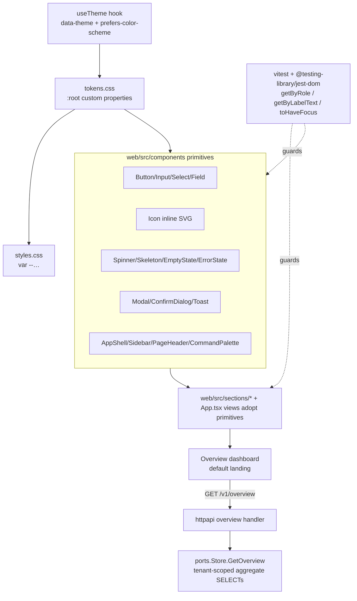

# Phase 4/§15 (slice) Implementation Plan: Console UX & Design System — Tokens, Primitives, Shared UX States, IA & Accessibility

Status: not started. Implements the **operator-console usability** the product spec assumes throughout
(`plan.md §5.x` admin surfaces, `§15` workstreams) — turning OpenJourney's admin console from a
functional-but-ad-hoc set of 22 hand-styled sections into a **coherent, accessible, delightful**
product, on top of Milestones 1–11. This is a **cross-cutting quality milestone**: it adds no new
product capability; it makes every capability already shipped *pleasant and safe to use*.

Delivers:
1. **A design-token foundation** — replace 225 hardcoded hex literals (the accent `#6f5cff` copy-pasted
   13×) with a single `:root` CSS custom-property layer (color / space / radius / shadow / typography /
   motion), so the whole console themes from one place. Zero new dependencies.
2. **App-wide theming** — promote the Reports-only local dark mode (`Reports.tsx:98`) to a global
   `data-theme` on the document root + `prefers-color-scheme` default + persisted toggle + a `useTheme`
   hook, so every view is theme-aware, not just Reports.
3. **A real component library** (`web/src/components/`, which does not exist today) — `Button`, `Input`,
   `Select`, `Textarea`, `Field`, `Icon` (in-repo inline SVG), `Badge`, `Card`, `DataTable` — built
   from raw React + CSS, consolidating the four divergent tab implementations, the per-section `.pill`
   variants, and the hand-rolled `<form><label><input>` blocks into typed, accessible primitives.
4. **Shared UX-state primitives** — the console has **no** spinner/skeleton (zero CSS animations today),
   ~27 ad-hoc empty states, a one-line error helper, and **no toast system**. Add `Spinner`, `Skeleton`,
   `EmptyState`, `ErrorState` (with retry), and an app-level `ToastProvider`/`useToast`, replacing the
   ephemeral inline strings and the raw `alert()` (`App.tsx:701`).
5. **A modal & confirm system** — there is **no** modal today; destructive actions use native
   `window.confirm` (and several — revoke API key `App.tsx:433`, discard DLQ `App.tsx:579` — don't
   confirm at all). Add an accessible `Modal` (portal, focus trap, focus restore, Esc-to-close) and a
   `ConfirmDialog` used for every destructive action.
6. **Form validation & structured entry** — a small in-repo `useForm`/validation helper giving
   inline per-field errors + disabled-until-valid, and a guarded JSON editor replacing the
   power-user-hostile "JSON blob in a `<textarea>`" pattern (segments DSL `App.tsx:723`, schemas,
   scoring).
7. **Shell, IA & a command palette** — extract the monolithic inline shell (`App.tsx:252-306`) into
   `AppShell`/`Sidebar`/`PageHeader`, group the 22 flat nav items into labeled categories, and add a
   **⌘K command palette** over all views + common actions.
8. **Mobile & responsive** — the sidebar never collapses (it becomes a stuck 2-col grid ≤760px,
   `styles.css:294`) and the journey builder is desktop-locked (`styles.css:210`). Add a hamburger/
   off-canvas drawer and a graceful narrow-viewport story for the builder.
9. **A home / overview dashboard** — the app opens on a bare profile-lookup form (`App.tsx:118`). Add a
   read-only `/v1/overview` aggregate endpoint and an `Overview` landing view (cards + hand-rolled SVG
   sparklines reusing the Reports chart style) as the new default.
10. **Accessibility hardening** — a global `:focus-visible` ring (today `outline:none` at `styles.css:61`
    with **no** button focus style), `prefers-reduced-motion` guards, a skip-to-content link, a
    conformant ScopeSelector combobox, and focus-management tests via the already-present
    `@testing-library/jest-dom` `toHaveFocus()` — **no `jest-axe`**, no new dependency.
11. **M11 security closeout** (`17.0`) — folds the findings from the Milestone 11 static review of the
    in-app/web-messaging surface (the public IDOR-safe edge, web-push SSRF, the event-sourced projector,
    scope enforcement). Populated from the post-loop review; the property-verification tasks below hold
    regardless.

This is a **recipe book**, like the Phase 2–11 plans. Every task references a recipe and ends with a
**Done when** check. **If a task feels ambiguous, open the named existing file, copy its pattern, and
change the fields.** Recipes 6.1–6.57 from prior plans still apply where relevant; this plan adds
frontend recipes 6.58–6.67.

> **This is a foundation-first, incremental, NON-BREAKING milestone.** Tokens (`17.1`) and primitives
> (`17.2`) land before anything adopts them; every task must leave `npm run typecheck && npm run build
> && npm test` green. The console's test suite already queries by accessibility semantics (~65
> `getByRole`, ~43 `getByLabelText`) — that harness is the **safety net**: a primitive that keeps the
> same roles/labels is a drop-in. Treat `17.2`-green (Button/Input/Field render, keyboard- and
> label-correct, adopted by one section with no test churn) as the checkpoint.

> **`17.0` and `17.1` come first.** `17.0` closes the M11 messaging-security review; `17.1` is the token
> layer every later task builds on. No component is built before the tokens exist, and no risky
> messaging-surface gap is carried forward.

## Design decisions (locked)

1. **Build the design system IN-REPO from raw React + CSS — zero new dependencies (matches M10/M11).**
   No MUI/Chakra/Radix/shadcn/Tailwind, no icon package, no charting or form library, no `clsx`.
   `web/package.json` and `web/package-lock.json` MUST be unchanged; `npm ls` shows no additions. Icons
   are a small in-repo inline-SVG `Icon` component. Charts reuse the existing hand-rolled SVG approach
   (`Reports.tsx`). A task that seems to need a library is built from primitives instead, or is out of
   scope as written. Accessibility is tested with the already-present `@testing-library/jest-dom`
   (`toHaveFocus`, roles, labels) — **not** `jest-axe`.
2. **Tokens first, as CSS custom properties on `:root`.** A new `web/src/tokens.css` (imported before
   `styles.css` at `main.tsx:4`) defines `--color-*` (surface/ink/muted/border/accent/danger/success/
   warn + `-bg` pairs), `--space-*` (a 4px scale), `--radius-*`, `--shadow-*`, `--font-*`, `--motion-*`.
   `styles.css` and components reference `var(--…)`; the 13× `#6f5cff` and the core literals are replaced
   with `var(--color-accent)` etc. **No component hardcodes a hex.** This is the single foundation
   everything else builds on.
3. **Theming is global via `data-theme` on the document root + `prefers-color-scheme`.** Promote the
   Reports-local `useState<Theme>` (`Reports.tsx:98`, `data-theme` at `:164`) to a `useTheme` hook that
   (a) defaults to the OS preference, (b) persists the user's choice to `localStorage`, (c) sets
   `data-theme` on `document.documentElement`. `tokens.css` defines both palettes:
   `:root { … }` (light) and `:root[data-theme="dark"] { … }`, plus an `@media (prefers-color-scheme:
   dark)` default for first paint. Reports' local toggle is refactored to consume the global hook (no
   behavior regression).
4. **Incremental & non-breaking; the test harness is the contract.** Each primitive preserves the
   existing accessible role/label so the ~65 `getByRole` / ~43 `getByLabelText` assertions keep passing.
   Adoption is section-by-section; a section is migrated only when its tests stay green. **Never** change
   a section's behavior or copy while swapping in a primitive unless the task says so. No task may leave
   the suite red (this is the load-bearing invariant for the Ralph loop).
5. **Accessibility is a first-class exit criterion, not a nice-to-have.** Every interactive element gets
   a visible `:focus-visible` ring (replacing `outline:none`, `styles.css:61`). Modals trap focus,
   restore it to the trigger on close, and close on Esc. Icon-only buttons carry an accessible name.
   Motion is gated by `prefers-reduced-motion`. Each a11y task ships a `toHaveFocus`/role/name test.
6. **No modal/confirm bypass.** Once `Modal`/`ConfirmDialog` exist (`17.4`), **no** `window.confirm`,
   `window.alert`, or unstyled native dialog may remain, and every destructive/irreversible action
   (delete, revoke, retire, discard, unmerge) MUST route through `ConfirmDialog` — including the ones
   that don't confirm today (`App.tsx:433` revoke key, `App.tsx:579` discard DLQ).
7. **No shared UX-state left ad-hoc.** Once `17.3` ships, loading is `Spinner`/`Skeleton` (not "Loading…"
   text), empties are `EmptyState` (not inline `
`), fetch failures are `ErrorState`
   with a working retry, and success/transient feedback is a `useToast()` toast (not an inline `.success`
   string or `alert()`). The duplicated `message()`/`errorMessage()` helper is centralized into one
   `web/src/errors.ts`.
8. **Backend touch is minimal and follows the standard vertical slice.** The only server change is a
   read-only `GET /v1/overview` aggregate (no migration, no new table — it SELECTs counts from existing
   tables), guarded by an existing read scope, tenant-scoped from the principal, following the
   domain→`ports.Store`→`internal/postgres`→`internal/httpapi`→route pattern (the M10/M11 template) with
   an httpapi fake-store unit test and a postgres integration test. Everything else is `web/` only.

## 1. Architecture

Governance choke point: there is exactly ONE token source (`tokens.css`), ONE theme controller
(`useTheme`), ONE of each primitive in `web/src/components/`, and ONE overview endpoint. Sections consume
them; nothing re-implements a button, a modal, a toast, or a hex color.

### 1.1 New dependency

**None.** Like M10 and M11, this milestone adds **zero** `web/package.json` dependencies and zero
`go.mod` dependencies. The design system is raw React + CSS + inline SVG; charts reuse the existing
hand-rolled SVG; a11y is tested with the already-present `@testing-library/jest-dom`. `npm ls` and
`go mod tidy` MUST show no additions. A task that appears to need a UI/icon/chart/form/a11y library is
built from in-repo primitives or is out of scope as written.

## 2. Schema (backend touch)

**No migration.** The only backend change (`17.8`) is a read-only aggregate endpoint:

- `ports.Store.GetOverview(ctx, principal) (domain.Overview, error)` — a handful of tenant-scoped
  `SELECT count(*)`/recent-window queries over existing tables (`profiles`, `journeys`, `campaigns`,
  `delivery_attempts`, `inapp_messages`, `connector_runs`), aggregated into a `domain.Overview` struct.
  No new table, no new column, no CHECK. Reuses an existing read scope (e.g. `reports:read` or a new
  `overview:read` added in the THREE places if a distinct scope is preferred — default: reuse
  `reports:read` to avoid a migration).

## 3. The seams to get right

### 3.1 Token layer (`17.1`)
`web/src/tokens.css`, imported at `main.tsx:4` **before** `styles.css`. Defines the `:root` variables
(light) + `:root[data-theme="dark"]` (dark) + `@media (prefers-color-scheme: dark)` default. Then
`styles.css` is swept to replace literals with `var(--…)` — the accent (`#6f5cff` ×13 at
`styles.css:63,62,…`), surfaces, borders, the Reports-local `--report-*` vars folded into the global
set. Grep guard: no `#[0-9a-fA-F]{3,6}` remains in component code (a few in `styles.css` transitional).

### 3.2 Primitives (`17.2`) — `web/src/components/`
New directory (absent today). Each primitive: a typed default/`named` export, token-styled via a
class + `tokens.css`, forwards refs, preserves accessible semantics. `Button` (variants primary/
secondary/danger/ghost, `size`, `loading` → inline `Spinner`), `Input`/`Select`/`Textarea`, `Field`
(wraps label + help + inline error, wiring `htmlFor`/`id`/`aria-describedby`/`aria-invalid`), `Icon`
(inline-SVG glyph set, `aria-hidden` when decorative, `aria-label` + `role="img"` when labeled),
`Badge` (the `.pill` variants), `Card`, `DataTable`. Adoption starts with ONE section (e.g. `Connectors.tsx`
or `Governance.tsx`) whose tests must stay green.

### 3.3 UX-state primitives (`17.3`)
`Spinner`/`Skeleton` (first CSS `@keyframes`, gated by `prefers-reduced-motion`), `EmptyState`
(icon + title + description + optional `cta`), `ErrorState` (`onRetry` re-runs the loader),
`ToastProvider` (a portal region `role="status"` `aria-live="polite"`, stacking, auto-dismiss,
reduced-motion) + `useToast()`. Centralize `message()` into `web/src/errors.ts`.

### 3.4 Overlay & focus management (`17.4`)
`Modal` (`createPortal` into a root node, `role="dialog"` `aria-modal="true"`, a focus trap that cycles
Tab within the dialog, focus restore to the opener on close, Esc + backdrop-click to close).
`ConfirmDialog` builds on `Modal`. Replace every `window.confirm`/`alert` and add confirmation to the
currently-unconfirmed destructive actions.

### 3.5 Shell, IA, command palette (`17.6`)
Extract `AppShell`/`Sidebar`/`PageHeader` from `App.tsx:252-306`. `Sidebar` renders the 22 views grouped
into labeled categories (see D.D. task) with accessible active state. `CommandPalette` (built on `Modal`)
lists all views + common actions, filters on type, navigates on Enter, closes on Esc, opens on ⌘K/Ctrl-K.
Routing stays the existing `view` state mirrored to `location.hash` (`App.tsx:118,152-165`) — the palette
calls the same `setView`.

### 3.6 Overview endpoint + landing (`17.8`)
Standard vertical slice for `GetOverview`; `Overview` section (default view, replacing `profiles` at
`App.tsx:118`) renders `Card`s of counts + a couple of SVG sparklines, links into sections, and a
friendly onboarding `EmptyState` for an empty workspace.

## 4. Exit-criteria traceability (`plan.md §5.x` admin surfaces + §15 workstreams; usability is implicit throughout)

| Requirement | Milestone task |
|---|---|
| One coherent visual language across all admin surfaces | 17.1, 17.2, 17.11 |
| Light/dark theming, OS-aware, persisted | 17.1 (theming) |
| Consistent, accessible feedback (loading/empty/error/success) | 17.3 |
| Safe destructive actions (confirm before irreversible) | 17.4 |
| Usable data entry with validation and structured editors | 17.5 |
| Navigable IA at 22+ views; fast access (command palette) | 17.6 |
| Usable on tablet/mobile | 17.7 |
| An at-a-glance workspace overview | 17.8 |
| WCAG-aligned keyboard + screen-reader support | 17.1, 17.4, 17.9 |
| M11 in-app/web-messaging security closeout | 17.0 |

## 5. Implementation recipes (new; 6.1–6.57 from prior plans still apply)

### 6.58 Design tokens
Create `web/src/tokens.css` with `:root` custom properties + a `[data-theme="dark"]` block + a
`prefers-color-scheme` default. Import it at `web/src/main.tsx:4` before `styles.css`. Sweep `styles.css`
replacing hex literals with `var(--…)`. No component hardcodes a color.

### 6.59 A primitive component
In `web/src/components/`, copy the shape of an existing tiny inline component (`ScopeSelector`
`App.tsx:1770` for structure) into a standalone typed file: props interface, a class name styled in
`tokens.css`/`styles.css`, `React.forwardRef`, preserved role/label. Export default. Add a co-located
`*.test.tsx` querying by role/label.

### 6.60 useTheme hook
Copy the Reports theme state (`Reports.tsx:98,164,175`) into `web/src/useTheme.ts`: read
`localStorage` then `matchMedia('(prefers-color-scheme: dark)')`, set `data-theme` on
`document.documentElement`, expose `{theme, setTheme, toggle}`. Refactor Reports to consume it.

### 6.61 UX-state primitive
`Spinner`/`Skeleton` = a class + `@keyframes` in `styles.css` guarded by `@media (prefers-reduced-motion:
reduce)`. `EmptyState`/`ErrorState` = presentational components taking `title`/`description`/`cta`/
`onRetry`. Replace inline `
No X
` / `{loading && 
Loading…
}` occurrences.

### 6.62 Toast provider
A React context `ToastProvider` mounted once in `App.tsx` around the shell; `useToast()` returns
`push({kind, message})`. Render a fixed portal region `role="status" aria-live="polite"`; auto-dismiss
via `setTimeout`; entrance transition gated by reduced-motion. Replace `alert()` (`App.tsx:701`) and
ephemeral inline `.success` strings.

### 6.63 Modal + focus trap
`web/src/components/Modal.tsx`: `createPortal`, `role="dialog" aria-modal`, a keydown handler trapping
Tab within the dialog's focusable set, `useEffect` capturing `document.activeElement` on open and
restoring it on unmount, Esc + backdrop close. `ConfirmDialog` wraps it with title/body/confirm/cancel.

### 6.64 useForm validation
`web/src/useForm.ts`: a minimal hook holding `values`/`errors`/`touched`, a `validate` map of
field→predicate→message, `isValid` for disabled-until-valid, and per-field `error` surfaced by `Field`.
No dependency. Apply to Campaigns (`App.tsx:1666`) and Segments (`App.tsx:723`).

### 6.65 Command palette
`web/src/components/CommandPalette.tsx` on top of `Modal`: an input + a filtered list of
`{label, action}` items (all 22 views + common actions), arrow-key selection, Enter to run, Esc to close;
a global `keydown` listener for ⌘K/Ctrl-K mounted in `AppShell`.

### 6.66 App shell extraction
Move `App.tsx:252-306` into `web/src/components/AppShell.tsx` (+ `Sidebar`, `PageHeader`), taking
`view`/`setView`/`viewTitles`/children as props. Behavior identical; `App.tsx` gets thinner. Group the
`Sidebar` items into labeled categories.

### 6.67 Overview vertical slice
`domain.Overview` struct → `ports.Store.GetOverview` → `internal/postgres/overview.go` (tenant-scoped
count SELECTs) → `internal/httpapi/overview.go` (`s.authenticate("reports:read", …)`) → route at
`server.go` → `web/src/api.ts` `getOverview` wrapper → `web/src/sections/Overview.tsx`. httpapi
fake-store unit test + postgres integration test (the M10/M11 template).

## 6. Task list

### Milestone 17.0 — M11 In-App & Web Messaging security closeout — DO FIRST
> Populated from the post-M11 static review (as `16.0` was from the M10 review). The review found a
> CRITICAL IDOR + 2 more defects on the messaging edge; those were **already fixed on `main` in commit
> `bd12506`** (column-pinned inbox lookup, `VerifyInAppToken` last-`.` split, admin-create display-state
> clamp) with regression tests `TestFetchInboxRejectsExternalIDSmuggledViaAnonymousID` and
> `TestCreateAdminMessageCannotForgeDisplayState`. Tasks `17.0.1`–`17.0.3` VERIFY those properties hold
> (run the tests, confirm, mark done; fix only if regressed). Tasks `17.0.4`–`17.0.6` are the residual
> lower-severity findings still open.
1. [x] **Verify inbox edge is IDOR-safe (fixed in `bd12506`).** Confirm `GetProfileIDBySubject`
   (`internal/postgres/messages.go`) pins the lookup to the ONE authenticated column (`byExternalID`) —
   never `external_id OR anonymous_id` — so a tokenless `anonymous_id` param cannot smuggle a victim's
   `external_id`; and `VerifyInAppToken` (`publicguard.go`) splits on the LAST `.` so dotted (email)
   subjects verify.
   *Done when:* `TestFetchInboxRejectsExternalIDSmuggledViaAnonymousID` passes (attack blocked, email
   token path works); a forged/expired token is rejected; the edge is IP rate-limited. (Re-fix if regressed.)
   — done: TestFetchInboxRejectsExternalIDSmuggledViaAnonymousID passes, GetProfileIDBySubject pins to one column, VerifyInAppToken splits on LAST `.`, publicLimiter enforces IP rate-limiting, TestForgedTokenRejected passes
2. [ ] **Verify display-state is projector-only + web-push SSRF-safe.** Confirm `createAdminMessage`
   (`internal/httpapi/messages.go`) clamps to a delivered baseline (no forged `status`/`*_at`) so
   `inapp_messages` display-state is written ONLY by the `message.*` `ProjectEvent` cases; and the
   `webpush` provider dials through the SSRF-guarded transport (a private-IP subscription endpoint is
   refused, per review verified-safe).
   *Done when:* `TestCreateAdminMessageCannotForgeDisplayState` passes; a grep confirms no display-state
   writer outside `ProjectEvent`; a private-IP push endpoint is blocked by a test.
3. [ ] **Verify scopes enforced + no new dependency (M11).** `messages:read`/`messages:write` guard the
   admin routes (a `messages:read` key is 403 on write); no dependency was added across M11.
   *Done when:* the scope-enforcement test passes and `git diff` shows no additions to `go.mod`/`go.sum`/
   `web/package.json`/`sdk/javascript/package.json` from M11.
4. [ ] **Impression projection is idempotent + monotonic (review finding #3).** The `message.impression`
   `ProjectEvent` case (`internal/postgres/store.go:~689`) is guarded only by `dismissed_at IS NULL` —
   unlike `message.clicked` (`clicked_at IS NULL`) and `message.dismissed` — so a replayed impression
   overwrites `displayed_at` with a fresh `now()`, and an out-of-order impression after a click regresses
   `status` `clicked → displayed`. Add `AND displayed_at IS NULL` and a status-rank guard so status only
   advances, mirroring the click/dismiss handlers.
   *Done when:* a test proves a replayed impression does not move `displayed_at`, and an impression
   arriving after a click does not regress `status`; the click/dismiss cases stay idempotent.
5. [ ] **Admin create validates the target profile's tenant/app (review finding #4).** `createAdminMessage`
   (`internal/httpapi/messages.go`) trusts `input.ProfileID`; verify the profile exists under
   `principal.TenantID`/`WorkspaceID`/`input.AppID` (e.g. via `GetProfileByIDSystem`) before insert, so a
   foreign profile id cannot create a mis-scoped `inapp_messages` row.
   *Done when:* a create with a profile id not under the caller's tenant/app is rejected (404/422); a
   valid same-tenant profile still succeeds; test covers both.
6. [ ] **SDK render contract + required params (review finding #5 + SDK mismatch).** Document (and enforce
   in the SDK) that `inapp_messages.content.html` is rendered as text/sanitized-only — never injected via
   `innerHTML`/`dangerouslySetInnerHTML` — to preclude a future stored-XSS path; and fix
   `sdk/javascript` `fetchInbox`/`reportEngagement` to send the server-required `tenant`/`app` params (and
   `external_id` in token mode) so identified-user calls don't 400.
   *Done when:* the SDK sends the required params (unit test), a known-subject fetch/report succeeds
   end-to-end against the edge, and the text/sanitized-only render contract is documented in the SDK README.

### Milestone 17.1 — Design tokens & app-wide theming
1. [ ] **Token layer** (Recipe 6.58): `web/src/tokens.css` with the `:root` color/space/radius/shadow/
   typography/motion variables; imported at `main.tsx:4`; `styles.css` swept so the accent (`#6f5cff` ×13)
   and core literals use `var(--…)`.
   *Done when:* `npm run typecheck && npm run build && npm test` green; no hex literal remains in
   component `.tsx`; the app is visually unchanged in light mode (existing tests pass unmodified).
2. [ ] **Global theming** (Recipe 6.60): `useTheme` hook (OS default + persisted + `data-theme` on
   `documentElement`); `tokens.css` dark palette; a theme toggle in the shell; Reports refactored to
   consume the global hook.
   *Done when:* toggling restyles the WHOLE app (not just Reports); first load respects
   `prefers-color-scheme`; the choice persists across reload; a test asserts `data-theme` flips and
   Reports still renders.
3. [ ] **Focus-visible + reduced-motion baseline**: replace `outline:none` (`styles.css:61`) with a
   global `:focus-visible` ring token on all interactive elements (`button`, `a`, `.resource-row`, tabs,
   `.icon-button`); add `@media (prefers-reduced-motion: reduce)` guarding existing transforms.
   *Done when:* every interactive element shows a visible keyboard focus ring (asserted via a
   `:focus-visible` style + a `toHaveFocus` test on a nav button); reduced-motion disables the hover
   transforms; tests green.

### Milestone 17.2 — Core primitives — CHECKPOINT
1. [ ] **Button/Input/Select/Textarea/Field** (Recipe 6.59): typed, token-styled, ref-forwarding,
   accessible primitives in `web/src/components/`; `Field` wires `htmlFor`/`id`/`aria-describedby`/
   `aria-invalid`.
   *Done when:* primitives render; a `Field` associates label+help+error; unit tests query by role/label;
   one section (e.g. `Governance.tsx`) is migrated to them with its existing tests **unchanged and green**.
   **Checkpoint:** primitives exist, are keyboard/label-correct, and drop into a real section with no test churn.
2. [ ] **Icon set**: an in-repo inline-SVG `Icon` component with the ~12 glyphs the app needs (search,
   close, check, chevron, plus, trash, warn, info, menu, external, sun, moon); decorative→`aria-hidden`,
   labeled→`role="img"`+`aria-label`.
   *Done when:* `Icon` renders named glyphs; a labeled icon exposes an accessible name; no icon dependency
   added; test asserts both modes.
3. [ ] **Badge/Card/DataTable**: consolidate the `.pill` status variants into `<Badge kind>`, `.card`
   into `<Card>`, and the repeated table markup into `<DataTable>`.
   *Done when:* `Badge` covers the existing status variants (draft/published/active/paused/waiting…); a
   section adopts `Card`/`DataTable`/`Badge` with no visual regression; tests green.

### Milestone 17.3 — Shared UX-state primitives
1. [ ] **Spinner + Skeleton** (Recipe 6.61): the first CSS `@keyframes`, reduced-motion-guarded; used in
   at least one lazy section's Suspense fallback and one list load.
   *Done when:* a section shows a `Skeleton` instead of "Loading…" text; reduced-motion renders a static
   fallback; tests green.
2. [ ] **EmptyState**: `<EmptyState icon title description cta>` replacing ~27 ad-hoc
   `
No X yet
`; adopted in 3+ sections.
   *Done when:* empty lists render a consistent `EmptyState` with a CTA where relevant; a test asserts the
   CTA is reachable by role; the ad-hoc `muted` empties in the migrated sections are gone.
3. [ ] **ErrorState + retry + centralized errors**: `<ErrorState onRetry>` generalizing `ErrorMessage`
   (`App.tsx:830`); centralize the duplicated `message()`/`errorMessage()` into `web/src/errors.ts`.
   *Done when:* a failed fetch shows a retry control that re-runs the loader; `errors.ts` is imported
   (not copy-pasted) in the migrated sections; tests cover the retry path.
4. [ ] **Toast system** (Recipe 6.62): `ToastProvider` + `useToast()`; replace `alert()` (`App.tsx:701`)
   and ephemeral inline `.success` strings in 3+ sections.
   *Done when:* an action fires an auto-dismissing toast in a live region; `alert()` is gone; a test
   asserts the toast text via `role="status"`; reduced-motion disables the entrance animation.

### Milestone 17.4 — Modal & confirmation
1. [ ] **Modal primitive** (Recipe 6.63): accessible `Modal` (portal, `role="dialog" aria-modal`, focus
   trap, focus restore, Esc + backdrop close).
   *Done when:* opening traps Tab within the dialog, Esc closes it, focus returns to the trigger; tests
   assert the dialog role, Esc-close, and `toHaveFocus` on the restored trigger.
2. [ ] **ConfirmDialog everywhere**: replace every `window.confirm` (`App.tsx:1075,1170,1437`;
   `Journeys.tsx:388`) with `ConfirmDialog`, AND add confirmation to the unconfirmed destructive actions
   (revoke API key `App.tsx:433`, discard DLQ `App.tsx:579`, extension enable/disable).
   *Done when:* every destructive action opens a styled confirm with confirm+cancel; **no**
   `window.confirm`/`alert` remains anywhere (grep proves it); tests cover confirm and cancel for two
   actions.

### Milestone 17.5 — Form validation & structured entry
1. [ ] **useForm + inline validation** (Recipe 6.64): field-level errors + disabled-until-valid applied
   to Campaigns (`App.tsx:1666`) and Segments (`App.tsx:723`) via `Field`.
   *Done when:* an invalid field shows an inline message tied to the input (`aria-describedby`), submit is
   gated on validity, and the imperative `throw` validation is replaced; tests assert the inline message.
2. [ ] **Guarded JSON editor**: a `JsonField` primitive (validate-on-blur, inline error, format button)
   replacing the raw JSON `<textarea>` in Segments DSL (`App.tsx:723`), Schemas, and Scoring.
   *Done when:* invalid JSON shows an inline error without throwing/blanking the form; valid JSON
   round-trips; a format button pretty-prints; tests cover invalid + valid.

### Milestone 17.6 — App shell, IA & command palette
1. [ ] **Extract AppShell/Sidebar/PageHeader** (Recipe 6.66): move `App.tsx:252-306` into components;
   behavior identical.
   *Done when:* the shell is a component, `App.tsx` is thinner, all 22 views still render and route via
   hash; the full `App.test.tsx` passes unmodified.
2. [ ] **Grouped navigation**: group the 22 flat views (`App.tsx:49,257-260`) into labeled categories
   (e.g. Overview · Audiences · Messaging · AI · Data · Governance · Settings) with accessible section
   headers and active state.
   *Done when:* the nav renders grouped sections with headers; keyboard navigation reaches every item;
   the active view is programmatically determinable; tests assert grouping + active state.
3. [ ] **Command palette** (Recipe 6.65): ⌘K/Ctrl-K opens a searchable palette over all views + common
   actions, built on `Modal`, keyboard-first.
   *Done when:* ⌘K opens the palette, typing filters, ↑/↓ selects, Enter navigates, Esc closes; a test
   drives it entirely by keyboard.

### Milestone 17.7 — Mobile & responsive
1. [ ] **Collapsible mobile nav**: turn the sidebar into a hamburger/off-canvas drawer ≤760px (replacing
   the stuck 2-col grid, `styles.css:294`), with focus trap + Esc + backdrop, reusing the Modal focus
   utilities.
   *Done when:* below the breakpoint the nav is a toggled drawer (trapped focus, Esc closes); above it is
   the sidebar; a test asserts the toggle and the trapped-focus behavior.
2. [ ] **Journey builder narrow-viewport story**: a graceful fallback for the desktop-locked builder
   (`styles.css:210` `min-width:900px`) — a read-only/scrollable summary or an explicit "best viewed on a
   larger screen" affordance instead of silent horizontal scroll.
   *Done when:* on a narrow viewport the builder shows a usable, labeled fallback (not a broken layout);
   the desktop experience is unchanged; test asserts the fallback appears below the breakpoint.

### Milestone 17.8 — Home / overview dashboard
1. [ ] **Overview endpoint** (Recipe 6.67, backend): `domain.Overview` + `ports.Store.GetOverview`
   (tenant-scoped count SELECTs over existing tables) + `internal/httpapi/overview.go` guarded by
   `reports:read` + route; no migration.
   *Done when:* `GET /v1/overview` returns tenant-scoped aggregates; a `reports:read`-scoped key succeeds
   and an unscoped key is 403; httpapi fake-store unit test + postgres integration test green; `go build
   ./... && go vet ./... && go test ./...` green with no new dep.
2. [ ] **Overview landing view**: `web/src/sections/Overview.tsx` (Cards of counts + 1–2 hand-rolled SVG
   sparklines reusing the Reports chart style + links into sections), wired via the 6-point `App.tsx`
   registration and made the **default** view (replacing `profiles` at `App.tsx:118`).
   *Done when:* the app opens on Overview; cards show live counts from the endpoint; an empty workspace
   shows a friendly onboarding `EmptyState`; `npm run typecheck && npm run build && npm test` green.

### Milestone 17.9 — Accessibility hardening
1. [ ] **Focus-management + ScopeSelector combobox**: assert Esc-to-close, focus-trap, and focus-restore
   across `Modal`/`ConfirmDialog`/`CommandPalette`/mobile-drawer via `toHaveFocus`; make `ScopeSelector`
   (`App.tsx:1770-1817`) a conformant combobox (`aria-expanded`/`aria-haspopup`/`role="listbox"`, Esc-to-
   close, ↑/↓ nav).
   *Done when:* the keyboard journeys are tested green (`toHaveFocus`); `ScopeSelector` exposes the ARIA
   combobox contract and is keyboard-operable; tests assert `aria-expanded` toggling.
2. [ ] **Skip-link + landmark/name audit**: add a skip-to-content link; verify a single `main`/`h1` and
   labeled `nav` landmark; ensure every icon-only button has an accessible name.
   *Done when:* the skip link moves focus to `main`; landmarks are unique and labeled; a test asserts
   every interactive control has an accessible name (`getByRole(..., {name})`); tests green.

### Milestone 17.10 — Integration & audit closeout
1. [ ] **Adoption sweep**: migrate any remaining sections to the primitives; de-inline the login screen +
   sidebar sign-out (`App.tsx:194-266`) onto tokens/primitives; remove leftover bespoke `.pill`/button
   markup.
   *Done when:* a grep shows no stray inline hex in the `App.tsx` login/sidebar and no un-migrated raw
   `
` empties/`window.confirm`; the app is visually coherent across every view;
   tests green.
2. [ ] **Run the suite**: `cd web && npm run typecheck && npm run build && npm test`,
   `cd sdk/javascript && npm run build && npm test`, `go build ./... && go vet ./... && go test ./...`;
   confirm `git diff web/package.json web/package-lock.json go.mod go.sum` is empty of additions.
   *Done when:* all green and no dependency additions.
3. [ ] **Audit doc** `docs/milestones/v1-milestone-12-audit.md` in the M2–M11 table format, one row per
   `17.x` task with evidence (file:line + test name).
   *Done when:* the doc exists with a row per task and its verifying test.

## 7. Carry-over hazards & invariants

1. **No new dependency.** `web/package.json`/`web/package-lock.json`/`go.mod`/`go.sum`/`sdk/javascript`
   unchanged. Icons = inline SVG, charts = hand-rolled SVG, a11y = existing `@testing-library/jest-dom`
   (`toHaveFocus`), no `jest-axe`. A task that seems to need a library is built from primitives or out of
   scope as written.
2. **Every task leaves the suite green.** `npm run typecheck && npm run build && npm test` must pass on
   every commit; the ~65 `getByRole`/~43 `getByLabelText` assertions are the contract — a primitive that
   changes a role/label/copy without the task calling for it is a regression. **Non-breaking, incremental.**
3. **One token source, one theme controller, one of each primitive.** No hex literals in component code;
   no per-section re-implementation of buttons/tabs/badges/modals/toasts; `data-theme` + `prefers-color-
   scheme` drive theming globally.
4. **No native dialog / ad-hoc UX-state after its primitive ships.** After `17.3`/`17.4`: no `alert()`/
   `window.confirm`, no inline `
` empties, no "Loading…" text — use `Toast`/
   `ConfirmDialog`/`EmptyState`/`Spinner`/`Skeleton`/`ErrorState`. Every destructive action confirms.
5. **Accessibility is an exit criterion.** Visible `:focus-visible` everywhere, focus trap+restore in
   overlays, Esc-to-close, reduced-motion guards, accessible names on icon-only controls, a skip link.
   Each a11y task ships a `toHaveFocus`/role/name test.
6. **Backend touch is one read-only endpoint.** `GET /v1/overview` follows the standard vertical slice,
   is tenant-scoped from the principal, guarded by `reports:read`, adds no migration/table/column, and
   ships both an httpapi unit test and a postgres integration test.
7. **The M11 closeout (`17.0`) lands first** — the messaging surface's IDOR/SSRF/projector-idempotency/
   scope properties are verified (and fixed if needed) before the UX work builds on top.

## 8. Open items to confirm before coding

1. **Nav grouping taxonomy.** Confirm the category grouping for the 22 views (proposed: Overview ·
   Audiences [profiles, segments, scoring, acquisition] · Messaging [templates, campaigns, journeys,
   experiments, connectors, suppressions, sender-identities, device-tokens] · AI [copilots] · Insights
   [reports] · Data [schemas] · Governance [governance, extensions, privacy, access, audit, operations] ·
   Settings [api-keys]). Adjust to taste.
2. **Overview scope.** v1 reuses `reports:read` for `/v1/overview` (no migration). Confirm that vs. a
   dedicated `overview:read` scope (which would add the THREE-places wiring + a migration).
3. **Default landing.** v1 makes `Overview` the default view (replacing `profiles`). Confirm, and whether
   the last-visited view should be remembered instead.
4. **Dark-mode scope.** v1 themes the entire console. Confirm the journey builder canvas (React Flow,
   `Journeys.tsx`) is in-scope for dark theming or explicitly deferred (its canvas styling is library-driven).
5. **Command-palette scope.** v1 = navigate-to-view + a few common actions. Confirm whether resource
   search (e.g. jump to a specific profile/campaign) is in-scope for M12 or deferred.
6. **Mobile depth.** v1 delivers a responsive shell + drawer + a builder fallback, not a full mobile
   redesign of every dense table/editor. Confirm that scoping.
