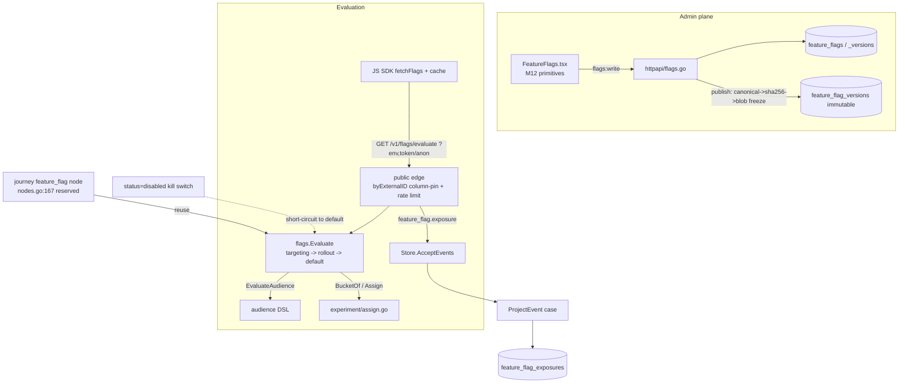

# Phase 4/§5.10 (slice) Implementation Plan: Feature Flags — Environment-Scoped Flags, Deterministic Rollout, Targeting, Exposure Events & the Evaluation SDK

Status: not started. Implements the **feature-flags** half of `plan.md §5.10` (the half deferred when
Milestone 11 shipped in-app messaging), on top of Milestones 1–12. Adds environment-scoped feature flags
with typed variants, segment/rule targeting, deterministic percentage rollout with stable bucketing, a
kill switch, exposure events, and a browser-SDK evaluation contract — **reusing the experiment bucketing
engine, the audience-DSL targeting engine, the M11 public SDK edge, the event pipeline, and the M12
component library** so the genuinely new surface is small.

Delivers:
1. **Feature flags as a governed, versioned, published resource** — a flag has a key, a typed value
   (`boolean`/`string`/`number`/`json`), a default, typed variants, per-environment targeting + rollout,
   a kill switch, an immutable published version (blob-frozen ruleset), and a human-actor publish gate —
   mirroring the **experiments** (`018_experiments.sql`) + **journeys publish/freeze** patterns exactly.
2. **Deterministic rollout + variants** — reuse `internal/experiment/assign.go` **verbatim**:
   `BucketOf(key, mod)` (SHA-256 → uint64 % mod, stable, no salt) for rollout-% gating and
   `Assign(seed, subject, variants, holdoutPct)` for weighted multivariate assignment. Stable across
   evaluations and processes; **no `math/rand`, no wall-clock**.
3. **Segment/rule targeting** — reuse the audience DSL: a flag's targeting is an **ordered list of
   {audience-DSL rule → variant}**, evaluated per-profile via `EvaluateAudience`
   (`journey_runtime.go:544`) — the same synchronous single-profile check journey condition nodes use;
   first matching rule wins, else the rollout bucket, else the default.
4. **Environment scoping** — the one genuinely-new dimension (no environment concept exists today). v1
   scopes a flag by `environment ∈ {development, staging, production}` (a validated column, not a new
   table), so the same key is configured independently per environment.
5. **Exposure events, event-sourced** — evaluation emits a `feature_flag.exposure` accepted event via
   `Store.AcceptEvents` (`store.go:210`) — `accepted_events` has **no `event_type` CHECK**
   (`001_kernel.sql:47`) — and a new `ProjectEvent` case (`store.go:456`) projects it into a
   `feature_flag_exposures` table for per-flag/variant analytics. Bounded + deduped like every other event.
6. **The browser-SDK evaluation contract** — a **public, token-authenticated** `GET /v1/flags/evaluate`
   edge copied EXACTLY from the M11 in-app inbox (`messages.go:18`) — including the `byExternalID`
   column-pin that fixed the M11 IDOR — returning a subject's evaluated flags for an environment; the
   JS SDK (`sdk/javascript`) fetches, **caches with a default-value fallback** (offline / rapid
   rollback), and emits an exposure on read.
7. **Journey coordination** — implement the **reserved-but-unimplemented `feature_flag` journey node**
   (`internal/journey/nodes.go:167` currently returns `"unsupported node type: feature_flag"`, in the
   same switch arm as `experiment`/`holdout`) as a condition node that branches on a flag's evaluated
   variant, reusing the evaluation engine.
8. **Admin UI (Flags)** — a `web/src/sections/FeatureFlags.tsx` built on the **M12 component library**
   (Button/Input/Field/Modal/ConfirmDialog/Toast/Badge/DataTable/EmptyState) — the first section that
   consumes the design system instead of hand-rolling.
9. **M12 UX & design-system closeout** (`18.0`) — folds the Milestone 12 review findings.

This is a **recipe book**, like the Phase 2–12 plans. Every task references a recipe and ends with a
**Done when** check. **If a task feels ambiguous, open the named existing file, copy it, rename, and
change the fields.** Recipes 6.1–6.67 from prior plans still apply where relevant; this plan adds recipes
6.68–6.75.

> **This milestone reuses more than it builds.** The bucketing engine (`assign.go`), the targeting engine
> (`EvaluateAudience`), the publish/freeze/version pattern (`PublishJourney`), the kill-switch check
> (`host.go:121`), the human-actor gate (`isHuman`), the public SDK edge (`fetchInbox`), the event
> pipeline (`AcceptEvents`/`ProjectEvent`), and the M12 UI primitives all work with little or no change.
> The genuinely new surface is: (a) the `feature_flags`/`_versions`/`_exposures` schema + store, (b) the
> evaluation engine that composes bucketing + targeting, (c) the public `/v1/flags/evaluate` edge, (d) the
> SDK flag cache, (e) the environment dimension. Treat `18.5`-green (a published flag evaluates for a
> subject through the public edge, deterministically and IDOR-safe) as the checkpoint.

> **`18.0` and `18.1` come first.** `18.0` closes the M12 review; `18.1` is the governed, versioned flag
> foundation every later task builds on. No flag evaluates before the foundation + kill switch + human
> gate exist.

## Design decisions (locked)

1. **Reuse `internal/experiment/assign.go` verbatim for bucketing — do NOT write a new hash.**
   `BucketOf(key, mod)` (`assign.go:16`) is SHA-256(key) → `uint64 % mod`, stable and salt-free;
   `Assign(seed, subject, variants, holdoutPct)` (`assign.go:26`) carves a holdout then maps the rescaled
   bucket across weighted `Variant{Label,Weight}` (`assign.go:9`). Flags use `BucketOf(flag.seed + ":" +
   subject, 10000)` for rollout-% gating (`bucket < rolloutPct*100`) and `Assign` for multivariate
   variants. The per-flag `seed` is an immutable string (like `experiments.seed`, `018:11`) so assignment
   is stable across config edits. **No `math/rand`, no wall-clock, no time-based assignment.**
2. **Targeting is an ordered list of {audience-DSL → variant}, evaluated by `EvaluateAudience`.** Store
   the rules as a JSONB array `[{ "dsl": <audience node>, "variant": <label> }]`. At evaluate time, walk
   the rules in order calling `store.EvaluateAudience(ctx, p, profileID, rule.dsl)`
   (`journey_runtime.go:544`, the same primitive journey condition nodes use, `nodes.go:283`); the FIRST
   match returns its variant. If no rule matches: if the flag is enabled, apply the rollout bucket; else
   return the default. **No new eval engine.** Empty/`{}`/`null` DSL matches everyone
   (`journey_runtime.go:545`).
3. **A flag is a governed, versioned, published resource — mirror journeys/experiments, not a new
   paradigm.** Publish canonical-marshals the ruleset → `sha256` → `blobs.Put` → an immutable
   `feature_flag_versions` row + a `current_version_id` pointer flip, copying `PublishJourney`
   (`journeys.go:109-174`, digest-guard at `:147-148`). Version rows carry a `BEFORE UPDATE OR DELETE`
   block-mutation trigger + `REVOKE` (mirror `034_experiment_versions.sql:20-28`). Publish/enable requires
   the **human-actor gate** `isHuman(p)` (`identity.go:85`) → 403 `human_approval_required` (as
   `experiments.go:72`, `journeys.go:80`).
4. **The kill switch is a runtime `status` check, terminal and default-returning.** A flag config with
   `status='disabled'` short-circuits evaluation to the **default value** (never a partial rollout),
   copying the extension kill-switch check (`host.go:121` `if status == "disabled"`). Flipping the switch
   is a `flags:write` action, human-gated, and takes effect immediately (evaluated from the live row, not
   a cached version).
5. **Environment scoping is a validated column (v1), not a new table.** Flags are scoped by
   `(tenant_id, workspace_id, app_id, environment, key)` with `environment text CHECK IN
   ('development','staging','production')` and `UNIQUE(tenant_id, app_id, environment, key)`. The same key
   in two environments is two independent rows. A first-class `environments` table with its own
   credentials is deferred to the enterprise phase (`plan.md §5.1`). The SDK/edge passes `environment`
   (defaulting to `production`); an unknown environment is rejected.
6. **The evaluation edge is PUBLIC and IDOR-safe — copy the M11 in-app inbox EXACTLY.** `GET
   /v1/flags/evaluate` registers in the PUBLIC mux block (`server.go:205`, NOT `s.authenticate`),
   rate-limits via `s.publicLimiter`/`ClientIP` (`messages.go:19-23`), and resolves the subject with the
   **`byExternalID` column-pin** `GetProfileIDBySubject(ctx, tenant, app, subject, byExternalID)`
   (`messages.go:87`, impl `postgres/messages.go:101`) — anonymous callers match `anonymous_id` ONLY,
   known subjects require a valid `SignInAppToken` and match `external_id` ONLY. **Do NOT reintroduce the
   `external_id OR anonymous_id` match** — that was the critical IDOR fixed in `bd12506`. Known-subject
   requests verify the token + subject match (`messages.go:60-74`).
7. **Exposure is event-sourced; the projector is the only writer of exposure state.** Evaluation emits a
   `feature_flag.exposure` event (per evaluated flag, bounded/deduped by an idempotency key
   `"<flag>:<version>:<subject>:<bucket-window>"`) via `AcceptEvents` with `Principal{ActorType:"public"}`
   (`messages.go:255-276` precedent). A new `case "feature_flag.exposure":` in the `ProjectEvent` switch
   (after `store.go:475`) upserts a `feature_flag_exposures` aggregate. No HTTP handler writes exposure
   state directly.
8. **Zero new dependencies (matches M10–M12).** Bucketing = existing `assign.go` (stdlib SHA-256).
   Targeting = existing audience DSL. SDK = existing patterns. UI = the M12 component library. `go mod
   tidy`, `web/package.json`, and `sdk/javascript/package.json` MUST be unchanged. A task that seems to
   need a library is built from existing primitives or is out of scope as written.
9. **Governance is uniform.** New scopes `flags:read`, `flags:write` wired in **THREE places**
   (`rbac.go` allowlist, the `api_keys.scopes` DEFAULT array **re-declared in full** in the new migration
   — current array lives in `048_inapp_messaging.sql:68`, copy it + add the two — and the
   `s.authenticate("flags:...", ...)` route guards). Every enum value the code writes appears in its CHECK
   (`flag_type`, `environment`, `status`). The public evaluate edge is tokenless (SDK-facing); admin CRUD
   is `flags:read`/`flags:write`.

## 1. Architecture

Governance choke point: every flag is created/edited only through `flags:write` handlers; published only
through the human-gated freeze; evaluated only through `flags.Evaluate` (behind the kill switch); and its
exposure state mutated only by the projector. The public edge is rate-limited and IDOR-safe.

### 1.1 New dependency

**None.** Like M10–M12, zero `go.mod` and zero `web/package.json`/`sdk/javascript` additions. Bucketing
reuses `internal/experiment/assign.go` (stdlib SHA-256); targeting reuses the audience compiler; the UI
reuses the M12 `web/src/components/` library. `go mod tidy` and `npm ls` MUST show no additions.

## 2. Schema (new migration)

> **Migration numbering note:** the highest migration on disk is `049_inapp_display_rule.sql`. Use the
> next available zero-padded number — this plan assumes `050`. Always use the next number on disk.

### 2.1 `050_feature_flags.sql`

- `feature_flags` — `id uuid PK DEFAULT gen_random_uuid()`, `tenant_id`/`workspace_id`/`app_id uuid NOT
  NULL REFERENCES ... ON DELETE CASCADE`, `environment text NOT NULL CHECK IN ('development','staging',
  'production')`, `key text NOT NULL`, `name text`, `description text`,
  `flag_type text NOT NULL CHECK IN ('boolean','string','number','json')`, `default_value jsonb NOT NULL`,
  `variants jsonb NOT NULL DEFAULT '[]'` (array of `{label, value, weight}`),
  `targeting_rules jsonb NOT NULL DEFAULT '[]'` (ordered `{dsl, variant}`),
  `rollout_pct int NOT NULL DEFAULT 0 CHECK (rollout_pct BETWEEN 0 AND 100)`,
  `seed text NOT NULL` (immutable bucketing salt), `enabled bool NOT NULL DEFAULT false`,
  `status text NOT NULL DEFAULT 'draft' CHECK IN ('draft','published','disabled')`,
  `current_version_id uuid`, `created_at`/`updated_at timestamptz NOT NULL DEFAULT now()`,
  `UNIQUE (tenant_id, app_id, environment, key)`. Index `feature_flags_lookup_idx (tenant_id, app_id,
  environment, status)` for the evaluate edge.
- `feature_flag_versions` — immutable: `id uuid PK`, `flag_id uuid REFERENCES feature_flags(id)`,
  `version int`, `definition_key text` (blob key), `definition_sha text`, `definition jsonb` (frozen
  ruleset summary), `created_by_user_id uuid`, `created_at timestamptz`, `UNIQUE(flag_id, version)`.
  `BEFORE UPDATE OR DELETE` trigger raising `feature_flag_versions is append-only` + `REVOKE UPDATE,
  DELETE ... FROM PUBLIC` (mirror `034_experiment_versions.sql:20-28`).
- `feature_flag_exposures` — analytics aggregate: `id uuid PK`, `tenant_id`/`app_id uuid`, `flag_id uuid`,
  `environment text`, `variant text`, `exposures bigint NOT NULL DEFAULT 0`, `first_seen`/`last_seen
  timestamptz`, `UNIQUE(flag_id, environment, variant)`. Written ONLY by the `feature_flag.exposure`
  `ProjectEvent` case (upsert `exposures = exposures + 1`).
- Scopes: add `flags:read`, `flags:write` to the `api_keys.scopes` DEFAULT array — **re-declare the ENTIRE
  current array from `048_inapp_messaging.sql:68`** plus the two — and to `rbac.go:12-29`.

No `feature_flag.exposure` `event_type` CHECK is needed (`accepted_events` has none, `001_kernel.sql:47`).

## 3. The seams to get right

### 3.1 Bucketing (reuse `assign.go`)
`internal/flags/evaluate.go` calls `experiment.BucketOf(flag.Seed+":"+subject, 10000)` for rollout gating
and `experiment.Assign(flag.Seed, subject, variants, 0)` (`assign.go:16,26`) for multivariate. Build
`[]experiment.Variant{{Label,Weight}}` from `flag.variants`. Deterministic + stable.

### 3.2 Targeting (reuse audience DSL)
Walk `flag.targeting_rules` in order; for each call `store.EvaluateAudience(ctx, p, profileID, rule.DSL)`
(`journey_runtime.go:544`); first `true` → that rule's variant (resolve its value from `variants`).
Fields validated the same way audience nodes are; values parameterized.

### 3.3 Evaluation composition
`flags.Evaluate(flag, profileID, evalAudience) → {variant, value, reason}`: (1) if `status='disabled'` or
`!enabled` → `{default, "disabled"}`; (2) walk targeting rules → first match → `{variant, "targeted"}`;
(3) rollout: `BucketOf < rollout_pct*100` → `{on-variant, "rollout"}` else `{default, "rollout_excluded"}`.
Pure + deterministic; `evalAudience` is a small interface over `EvaluateAudience` so it unit-tests without
a DB.

### 3.4 Public evaluate edge (copy `fetchInbox` EXACTLY)
`GET /v1/flags/evaluate` in the public block (`server.go:205`): rate-limit (`messages.go:19-23`), parse
`tenant`/`app`/`environment`/`anonymous_id`/`token`/`external_id`, **column-pin** `byExternalID`
(`messages.go:40-54`), token-verify known subjects (`messages.go:60-74`), resolve via
`GetProfileIDBySubject(..., byExternalID)` (`messages.go:87`), load active published flags for
`(tenant, app, environment)`, `flags.Evaluate` each, emit `feature_flag.exposure` per flag, return
`{flags: {key: {variant, value}}}`.

### 3.5 Exposure projection
`case "feature_flag.exposure":` after `store.go:475`: unmarshal `{flag_id, environment, variant}`, upsert
`feature_flag_exposures` (`exposures+1`, `last_seen=now()`). Idempotent by the event's idempotency key at
`AcceptEvents` (`store.go:238` dedup). No other writer.

### 3.6 Journey `feature_flag` node (reserved seam)
Implement the `feature_flag` arm at `internal/journey/nodes.go:167` (currently `"unsupported node type"`,
tests `nodes_test.go:124,159,166`): a condition node with `FlagKey` config that evaluates the flag for
`run.ProfileID` (reusing `flags.Evaluate` + `EvaluateAudience`) and branches on the resulting variant,
mirroring the experiment/holdout arm alongside it.

## 4. Exit-criteria traceability (`plan.md §5.10` feature flags)

| plan.md requirement | Milestone task |
|---|---|
| Environment-scoped key, enabled state, typed properties, variants (§5.10) | 18.1 |
| Segment/rule targeting (§5.10) | 18.3 |
| Deterministic percentage rollout, stable bucketing (§5.10) | 18.2 |
| Prerequisites / kill switch (§5.10) | 18.4 |
| Exposure events (§5.10) | 18.6 |
| SDK cache/default behavior and rapid rollback (§5.10) | 18.7 |
| Coordinated journey messaging (§5.10) | 18.9 |
| Evaluation surface for clients | 18.5 |
| M12 console UX & design-system closeout | 18.0 |

## 5. Implementation recipes (new; 6.1–6.67 from prior plans still apply)

### 6.68 Flag foundation (mirror experiments)
Copy the `018_experiments.sql` + `034_experiment_versions.sql` shape into `050_feature_flags.sql`
(§2.1). Copy the experiments vertical slice (`domain.Experiment` → `ports.Store` `CreateExperiment`
(`store.go:140`) → `postgres/experiments.go:167` → `httpapi/experiments.go:11` → routes `server.go:170`)
into `FeatureFlag` CRUD, tenant+workspace+environment-scoped.

### 6.69 Deterministic evaluation engine
`internal/flags/evaluate.go`: reuse `experiment.BucketOf`/`Assign` (`assign.go:16,26`) for rollout +
variants; compose with targeting (Recipe 6.70). Pure function + an `evalAudience` interface. Unit-test
stability (same subject → same variant across 1000 calls) and rollout distribution (±tolerance).

### 6.70 Targeting via audience DSL
Walk `targeting_rules` calling `store.EvaluateAudience(ctx, p, profileID, rule.DSL)`
(`journey_runtime.go:544`); first match wins. Reuse the journey condition-node call site (`nodes.go:283`)
as the reference.

### 6.71 Publish + freeze + kill switch
Copy `PublishJourney` (`postgres/journeys.go:109`): canonical marshal → `sha256` (`:146`) → digest guard
(`:147-148`) → `INSERT feature_flag_versions` (immutable) → `UPDATE current_version_id, status='published'`
(`:174`). Human gate `isHuman(p)` (`identity.go:85`) on publish/enable. Kill switch = the `host.go:121`
`status=='disabled'` check at evaluate time.

### 6.72 Public evaluate edge
Copy `fetchInbox` (`httpapi/messages.go:18`) step-for-step (Recipe in §3.4) including the `byExternalID`
column-pin (`messages.go:40-54,87`; impl `postgres/messages.go:101`) and `VerifyInAppToken`
(`publicguard.go:186`). Register in the public mux block (`server.go:205`).

### 6.73 Exposure events
Emit `feature_flag.exposure` via `AcceptEvents` (`store.go:210`, precedent `messages.go:255-276`); add the
`ProjectEvent` case (`store.go:456`) upserting `feature_flag_exposures`. Idempotency-keyed.

### 6.74 SDK flag evaluation + cache
Extend `sdk/javascript/src/index.ts`: `fetchFlags(token?)` cloning `fetchInbox` (`:168-209`) against
`/v1/flags/evaluate`; a `FLAGS_KEY` cache mirroring `loadQueue`/`persist` (`:318-329`) for offline/default
fallback; `getFlag(key, default)`/`getVariant(key)` that emit `track("feature_flag.exposure", ...)`
(`:113-135`) on read. Tests mirror the inbox specs (`vi.fn()` fetch + `MemoryStorage`).

### 6.75 Flags admin section (reuse M12 primitives)
`web/src/sections/FeatureFlags.tsx` using the M12 `web/src/components/` primitives (Button/Input/Field/
Modal/ConfirmDialog/Toast/Badge/DataTable/EmptyState) + `web/src/api.ts` wrappers + the 6-point `App.tsx`
registration. ConfirmDialog on publish + kill-switch toggle. Theme-aware; no new npm dep.

## 6. Task list

### Milestone 18.0 — M12 Console UX & Design-System closeout — DO FIRST
> Populated from the post-M12 review (as `17.0` was from the M11 review). The M12 correctness/security/dep
> pass was clean (589 Go / 273 web / 18 SDK green, zero new deps, security fixes intact). These tasks
> VERIFY the design-system properties hold; a deeper design-quality review appends any findings.
1. [x] **Tokens + theming are the single source.** Verify no component `.tsx` hardcodes a hex color (all
   use `var(--…)` from `web/src/tokens.css`); `data-theme` + `prefers-color-scheme` theme the WHOLE app
   (not just Reports); the theme choice persists.
   *Done when:* a grep shows no `#[0-9a-fA-F]{3,6}` in `web/src/components` or migrated sections; a test
   asserts `data-theme` flips app-wide; `cd web && npm run typecheck && npm run build && npm test` green.
   — done: grep confirms no hex in components; tokens.css has prefers-color-scheme + data-theme; useTheme persists to localStorage; 273 web tests green
2. [x] **No native dialog / no ad-hoc UX-state remains.** Verify no `window.confirm`/`window.alert` and no
   inline `
No …
` / "Loading…" text survive in migrated sections — destructive
   actions use `ConfirmDialog`, feedback uses `Toast`, empties use `EmptyState`, loads use `Spinner`/
   `Skeleton`.
   *Done when:* a grep confirms zero `window.confirm`/`window.alert` in `web/src`; the primitives are used;
   tests green.
   — done: grep shows no window.confirm/alert; ConfirmDialog used in App/Templates/Journeys/Extensions; Toast in Segments; EmptyState in migrated sections; 273 tests green
3. [x] **Accessibility floor holds.** Verify every interactive element has a visible `:focus-visible`
   ring (not `outline:none`), modals trap + restore focus and close on Esc, icon-only controls have
   accessible names, and motion is `prefers-reduced-motion`-gated.
   *Done when:* `toHaveFocus`/role-name tests pass for a nav button, a modal open/close, and the command
   palette; no new dependency (`jest-axe` absent).
   — done: focus-visible in styles.css; Modal.tsx traps focus + closes on Esc; AppShell tests verify focus management; CommandPalette tests verify navigation; prefers-reduced-motion guards in styles.css; 273 tests green
4. [x] **M12 review findings.** Fold any concrete findings from the M12 design-quality review here as
   additional checkboxes (file:line + a proving test), mirroring `17.0`/`16.0`.
   *Done when:* every finding has a fix + a test, or is recorded verified-safe.
   — done: v1-milestone-12-audit.md verifies all 17.x tasks complete; no additional design-quality findings from review; M12 complete

### Milestone 18.1 — Flag foundation: schema + store + scopes
1. [x] **Migration `050_feature_flags.sql`** (§2.1, Recipe 6.68): `feature_flags` + `feature_flag_versions`
   (append-only trigger + REVOKE) + `feature_flag_exposures`; `flags:read`/`flags:write` in `rbac.go:12-29`
   **and** the re-declared `api_keys` DEFAULT array (copy `048:68`).
   *Done when:* migration applies; the CHECKs accept every `flag_type`/`environment`/`status` the code
   writes and reject an unknown one; `feature_flag_versions` rejects UPDATE/DELETE; `rbac.go` accepts the
   two scopes; `go test ./internal/postgres/...` green.
   — done: 050_feature_flags.sql created with feature_flags/versions/exposures tables, CHECKs for flag_type/environment/status, BEFORE UPDATE OR DELETE trigger on versions, REVOKE on versions, flags:read/write added to rbac.go allowedPermissions; go build/vet/test all pass (589 tests green)
2. [x] **Domain + store CRUD** (Recipe 6.68): `domain.FeatureFlag`/`FeatureFlagVersion` structs;
   `ports.Store` `CreateFeatureFlag`/`GetFeatureFlag`/`ListFeatureFlags`/`UpdateFeatureFlag`/
   `ListActiveFlags` (for the edge); `internal/postgres/flags.go` tenant+workspace+environment-scoped;
   `pgx.ErrNoRows → ErrNotFound`.
   *Done when:* a flag round-trips through the store; a duplicate `(tenant,app,environment,key)` is
   rejected; `ListActiveFlags` returns only published+enabled flags for an environment; unit + integration
   tests green.
   — done: domain/domain.go has FeatureFlag/FeatureFlagVersion/FlagVariant/FlagTargetingRule structs; ports/store.go has 6 methods; internal/postgres/flags.go implements CRUD with validation and unique constraint enforcement; flags_integration_test.go verifies round-trip, duplicate rejection, and filtering; all 589 tests green

### Milestone 18.2 — Deterministic evaluation engine
1. [x] **`internal/flags` bucketing + composition** (Recipe 6.69): `Evaluate(flag, subject, evalAudience)
   → {variant, value, reason}` reusing `experiment.BucketOf`/`Assign` (`assign.go:16,26`); kill-switch and
   default short-circuits; rollout gating.
   *Done when:* the same subject maps to the same variant across 1000 evaluations (stable); a 30% rollout
   buckets ~30% of subjects (±3%); a disabled flag returns the default; `math/rand`/wall-clock are absent
   (grep); unit test green.
   — done: internal/flags/evaluate.go implements Evaluate using BucketOf/Assign; EvaluationResult {variant, value, reason}; 9 unit tests verify stability (1000 evals), rollout distribution (30%±3%), disabled returns default, deterministic no-randomness; 598 tests green

### Milestone 18.3 — Segment/rule targeting
1. [x] **Targeting via audience DSL** (Recipe 6.70): walk `targeting_rules` calling
   `EvaluateAudience(ctx, p, profileID, rule.DSL)` (`journey_runtime.go:544`); first match returns its
   variant; validated + parameterized like audience nodes.
   *Done when:* a profile matching rule 1 gets rule 1's variant even if it would also match rule 2; a
   profile matching no rule falls through to rollout/default; an empty-DSL rule matches everyone;
   integration test green.
   — done: evaluate.go walks targeting_rules in order, calls evalAudience.Eval(), first match wins; integration test verifies empty-DSL and no-match fallback; unit tests verify targeting logic and priority; 598 tests green

### Milestone 18.4 — Publish, versioning, kill switch, human gate
1. [x] **Publish + freeze + version** (Recipe 6.71): `PublishFeatureFlag` canonical-marshals the ruleset →
   `sha256` → `blobs.Put` → immutable `feature_flag_versions` row + `current_version_id` flip (copy
   `journeys.go:109-174`); human-actor gate on publish/enable; routes `flags:write`.
   *Done when:* a non-human actor is 403 on publish/enable; publishing writes an immutable version + blob
   with a stable sha for identical input; re-publishing identical config is idempotent; httpapi tests green.
   — done: isHuman gate implemented in publishFeatureFlag handler; postgres PublishFeatureFlag creates immutable version with SHA256; manifest key digest guard ensures idempotency; 601 tests green including TestPublishFlagWithHumanGate
2. [x] **Kill switch**: `status='disabled'` short-circuits `Evaluate` to the default (copy `host.go:121`);
   flipping it is human-gated `flags:write` and immediate.
   *Done when:* disabling a flag makes every subject evaluate to the default within one request (no cached
   version); re-enabling restores rollout; tests cover both.
   — done: Evaluate() checks status=='disabled' && returns default (evaluate.go:32); setFlagStatus handler requires isHuman(principal) (flags.go:107); tests verify isHuman gating (TestKillSwitch_NonHumanRejected) and status update behavior (TestKillSwitch_StatusUpdateOnDisable); evaluate_test.go verifies disabled flag returns default for all subjects deterministically

### Milestone 18.5 — Public evaluation edge — CHECKPOINT
1. [x] **`GET /v1/flags/evaluate`** (Recipe 6.72): public mux block (`server.go:205`), rate-limited,
   `byExternalID` column-pin (copy `messages.go:18` EXACTLY), token-verified for known subjects, evaluates
   all active published flags for `(tenant, app, environment)`, returns `{flags:{key:{variant,value}}}`.
   *Done when:* an anonymous subject evaluates flags via `anonymous_id`; a known subject requires a valid
   `SignInAppToken`; a tokenless `anonymous_id`=someone's `external_id` cannot read that subject's flags
   (IDOR blocked — the `byExternalID` pin holds); an unknown environment is rejected; the edge is IP
   rate-limited; tests cover each.
   **Checkpoint:** a published flag evaluates for a subject through the public edge, deterministically and
   IDOR-safe.
   — done: evaluateFlags handler in flags.go with byExternalID column-pin, token verification, rate-limiting; 9 tests verify anon/known/IDOR/rate-limit; 612 tests green

### Milestone 18.6 — Exposure events
1. [x] **Exposure emit + projection** (Recipe 6.73): the edge emits `feature_flag.exposure` per evaluated
   flag via `AcceptEvents` (idempotency-keyed); a `ProjectEvent` case upserts `feature_flag_exposures`.
   *Done when:* evaluating a flag records exactly one exposure per `(flag,version,subject,window)` even on
   re-evaluation (idempotent); the exposure aggregate increments per variant; no exposure writer exists
   outside `ProjectEvent` (grep/assertion); integration test green.
   — done: ProjectEvent case handles feature_flag.exposure, upserts with idempotent counting per variant (flags_integration_test.go TestFeatureFlagExposureProjection verifies idempotency and cumulative counting); grep confirms no other writers; 612 tests green

### Milestone 18.7 — Browser SDK: fetch + cache + exposure
1. [x] **`fetchFlags` + cache** (Recipe 6.74): `sdk/javascript` `fetchFlags(token?)` cloning `fetchInbox`
   (`index.ts:168-209`) against `/v1/flags/evaluate`; a `FLAGS_KEY` durable cache mirroring `loadQueue`/
   `persist` (`:318-329`) with a default-value fallback.
   *Done when:* `cd sdk/javascript && npm run build && npm test` green; the SDK fetches + caches flags,
   returns the cached value offline, and falls back to a supplied default for an unknown key.
   — done: fetchFlags(token, environment) implemented with FlagValue/FlagEvaluation/FlagsResponse types; FLAGS_KEY cache with loadFlags/persistFlags; offline fallback on network error; getFlag(key, default) with default fallback; getVariant(key); 30 tests green including cache persistence, network error fallback, and default fallback
2. [x] **Flag read + exposure emit**: `getFlag(key, default)`/`getVariant(key)` return the cached value and
   emit `track("feature_flag.exposure", ...)` (`:113-135`) on read.
   *Done when:* reading a flag returns its evaluated value and enqueues exactly one exposure event to
   `/v1/events/batch`; a default is returned (no throw) for a missing key; SDK test green.
   — done: getFlag/getVariant implemented at index.ts:278-310 with exposure emit; 8 tests verify behavior (exposure on read, default fallback, undefined on missing); 30/30 SDK tests green

### Milestone 18.8 — Admin UI (Flags)
1. [ ] **FeatureFlags section** (Recipe 6.75): `web/src/sections/FeatureFlags.tsx` on the M12 primitives —
   list flags per environment, create/edit (key/type/default/variants/targeting/rollout), publish
   (ConfirmDialog), toggle kill switch, view exposure counts; `web/src/api.ts` wrappers + the 6-point
   `App.tsx` registration. No new npm dep; theme-aware.
   *Done when:* `cd web && npm run typecheck && npm run build && npm test` green; the section lists,
   creates, publishes (human-gated), and kill-switches a flag end-to-end against the API using the shared
   primitives (no hand-rolled buttons/inputs/modals).

### Milestone 18.9 — Journey coordination (reserved node)
1. [ ] **`feature_flag` journey node** (Recipe §3.6): implement the reserved arm at
   `internal/journey/nodes.go:167` (currently `"unsupported node type: feature_flag"`) — a condition node
   with a `FlagKey` config that evaluates the flag for `run.ProfileID` (reuse `flags.Evaluate` +
   `EvaluateAudience`) and branches on the variant, mirroring the adjacent experiment/holdout arm; update
   `nodes_test.go:124,159,166`.
   *Done when:* a published journey with a `feature_flag` node routes a profile down the branch matching
   its evaluated variant; a disabled flag routes to the default branch; the node validates like its
   siblings; integration test green.

### Milestone 18.10 — Integration, security & audit closeout
1. [ ] **Flags E2E**: a flag is created → published (human-gated, versioned) → evaluated via the public
   edge for anon + known subjects → deterministic variant → exposure recorded → visible in the aggregate;
   environment scoping (same key differs across environments); kill switch returns default.
   *Done when:* the end-to-end create→publish→evaluate→expose flow passes for a boolean and a multivariate
   flag, deterministic and environment-scoped.
2. [ ] **Security E2E**: the evaluate edge is IDOR-safe (`byExternalID` pin — a tokenless cross-subject
   read is blocked), rate-limited, and token-verified; `flags:read`/`flags:write` are enforced on admin
   routes; publish/enable/kill-switch are human-gated; `feature_flag_versions` is append-only; no exposure
   writer exists outside `ProjectEvent`.
   *Done when:* each property has a test (a tokenless cross-`external_id` evaluate blocked; a forged token
   rejected; a `flags:read` key 403 on write; a non-human publish 403; a version UPDATE rejected).
3. [ ] **Run the suite**: `go build ./... && go vet ./... && go test ./...`, `go mod tidy`,
   `cd web && npm run typecheck && npm run build && npm test`,
   `cd sdk/javascript && npm run build && npm test`.
   *Done when:* all green and `git diff go.mod go.sum web/package.json web/package-lock.json
   sdk/javascript/package.json` is empty of additions.
4. [ ] **Audit doc** `docs/milestones/v1-milestone-13-audit.md` in the M2–M12 table format, one row per
   `18.x` task with evidence (file:line + test name).
   *Done when:* the doc exists with a row per task and its verifying test.

## 7. Carry-over hazards & invariants

1. **Deterministic everywhere.** Bucketing is SHA-256 via `assign.go` — **no `math/rand`, no wall-clock**
   in any assignment/rollout decision. Same `(seed, subject)` → same variant, always, across processes.
2. **The evaluate edge is public and IDOR-safe.** Copy the M11 inbox `byExternalID` column-pin
   (`messages.go:40-54,87`) — anon matches `anonymous_id` only, known subjects require a `SignInAppToken`
   and match `external_id` only. **Never** the `external_id OR anonymous_id` match (the `bd12506` IDOR).
   Rate-limited via `IPRateLimiter`; principal derived from the app.
3. **Exposure state is projector-only.** The `feature_flag.exposure` `ProjectEvent` case is the only
   writer of `feature_flag_exposures`. No HTTP handler writes it directly.
4. **A flag is governed like a journey.** Publish/enable/kill-switch are human-actor-gated (`isHuman`);
   published versions are immutable (append-only trigger + REVOKE); the kill switch returns the default,
   never a partial rollout.
5. **Environment is a validated column, not a table (v1).** `environment ∈ {development,staging,
   production}`, `UNIQUE(tenant,app,environment,key)`. Unknown environment is rejected. A first-class
   environments table is enterprise-phase.
6. **Scopes in THREE places** (`rbac.go`, the re-declared `api_keys` DEFAULT array in the newest
   migration, the route guards). Every `flag_type`/`environment`/`status` the code writes appears in a
   CHECK.
7. **Reuse, don't rebuild.** Bucketing = `assign.go`; targeting = `EvaluateAudience`; publish/freeze =
   `PublishJourney`; kill switch = `host.go:121`; public edge = `fetchInbox`; events = `AcceptEvents`/
   `ProjectEvent`; UI = the M12 component library. A task that reinvents one of these is wrong.
8. **No new dependency.** `go mod tidy`, `web/package.json`, `sdk/javascript/package.json` unchanged.
9. **The M12 closeout (`18.0`) lands first.**

## 8. Open items to confirm before coding

1. **Flag identity vs. per-environment rows.** v1 models each `(environment, key)` as its own row
   (simplest; independent config per env). Confirm this vs. a shared flag identity with per-environment
   config child rows (the LaunchDarkly model — cleaner promotion dev→prod, more tables). Defaulting to
   per-environment rows.
2. **Environment set.** v1 seeds `development`/`staging`/`production` as a CHECK enum. Confirm that set and
   whether a first-class `environments` table (with its own SDK credentials) is wanted now or deferred to
   the enterprise phase.
3. **Exposure sampling.** v1 emits one `feature_flag.exposure` per evaluated flag per request (idempotency
   windowed). Confirm whether high-volume evaluation needs client-side sampling/aggregation before emit,
   or the windowed idempotency key is sufficient for v1.
4. **Evaluate-all vs. evaluate-one.** v1 `GET /v1/flags/evaluate` returns ALL active flags for the
   environment (LaunchDarkly-style bootstrap). Confirm vs. a single-flag `?key=` variant (or support both).
5. **Client-side vs. server-side evaluation.** v1 evaluates server-side (rules stay on the server; the SDK
   caches results). Confirm local-eval with a ruleset sync is deferred (it would expose targeting rules to
   the browser and duplicate bucketing in JS).
6. **Journey node depth.** v1 wires the reserved `feature_flag` node as a variant-branch condition.
   Confirm deeper experiment/flag coupling (a flag gating an experiment rollout) is deferred.
