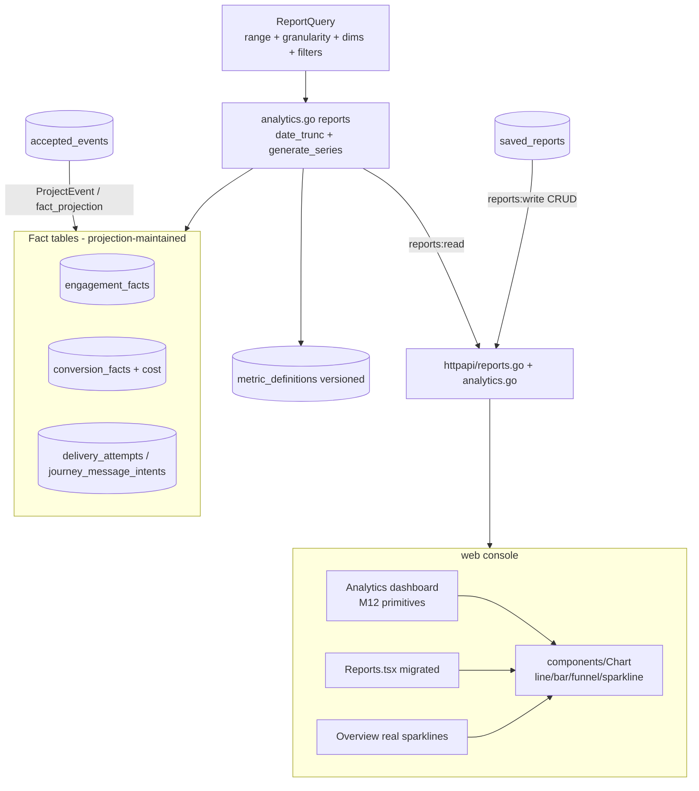

# Phase 4/§5.11 (slice) Implementation Plan: Analytics & Reporting Completion — Time/Dimension Queries, Over-Time & Cohort/Retention Reports, Cost, Metric-Definition Versioning, Saved Reports & Dashboards

Status: not started. Completes the **experimentation & analytics** workstream of `plan.md §5.11` (the
reporting half M4 delivered only a slice of), on top of Milestones 1–13. Turns OpenJourney's three
point-in-time reports into a **queryable analytics surface** — time ranges, dimensions, filters,
over-time funnels, cohort/retention, audience growth, cost, versioned metric definitions, saved reports,
and a dashboard UI — **reusing the projection-maintained fact tables, the exact-count report discipline,
and the M12 component library** so the new surface stays deterministic and testable.

Delivers:
1. **A time/dimension/filter query shape** — the biggest gap: today's report handlers take a bare path
   ID (`reports.go:10`), no time range, no dimensions, no filters. A new `ReportQuery` (time range +
   granularity + dimensions + filters) is accepted by every report, backward-compatible.
2. **Over-time reporting** — funnel-over-time and deliverability-over-time via PostgreSQL
   `date_trunc` + `generate_series` date-bucketing over the existing fact tables (`engagement_facts`,
   `conversion_facts`, `delivery_attempts`, `journey_message_intents`) — the raw per-row `occurred_at`/
   `attributed_send_at` already exist; only the bucketing SQL is new.
3. **Cohort & retention analysis** — cohort-by-first-seen + a retention matrix over engagement/conversion
   facts (`§5.11` "retention"), computed deterministically from the fact tables.
4. **Audience growth** — profile/segment-membership growth over time (`§5.11` "audience growth").
5. **Cost reporting** — a per-send cost fact (from the channel adapters' cost accounting, `plan.md §5.9`)
   + a spend/cost report (`§5.11` "cost").
6. **Metric-definition versioning** — a `metric_definitions` registry (name + version + semantics) so
   metrics are explicit and versioned, and every report stamps the definition version it used
   (`§5.11` "metric-definition versioning").
7. **Saved reports** — a `saved_reports` CRUD resource (name + `ReportQuery` blob) so operators save and
   reload report configurations.
8. **A shared chart primitive + a dashboard** — promote the two bespoke inline-SVG charts
   (`Overview.SimpleSparkline`, `Reports.FunnelBars`) into a reusable `web/src/components/` chart
   primitive, and add an **Analytics dashboard** section built on the M12 library + that primitive, with
   real time-series (killing the faked Overview sparkline data, `Overview.tsx:116`).
9. **M13 Feature-Flags closeout** (`19.0`) — folds the Milestone 13 review findings.

This is a **recipe book**, like the Phase 2–13 plans. Every task references a recipe and ends with a
**Done when** check. **If a task feels ambiguous, open the named existing file, copy it, rename, and
change the fields.** Recipes 6.1–6.75 from prior plans still apply where relevant; this plan adds recipes
6.76–6.83.

> **Reports are computed ONLY from projection-maintained fact tables — never raw event scans.** This is
> the load-bearing correctness invariant (`domain.go:880`, `report_accuracy_integration_test.go`). Every
> new report is exact-count deterministic, workspace-isolated, and respects the frozen attribution window.
> Treat `19.2`-green (a funnel-over-time report returns exact per-bucket counts matching a seeded fixture)
> as the checkpoint.

> **`19.0` and `19.1` come first.** `19.0` closes the M13 review; `19.1` adds the `ReportQuery` shape
> every later report depends on. No over-time/cohort/cost report is built before the query shape exists.

## Design decisions (locked)

1. **Reports read ONLY the fact tables, deterministically.** Extend `internal/postgres/analytics.go`
   (`CampaignReport:16`, `JourneyReport:58`, `readReportFacts:116`) — new reports aggregate
   `engagement_facts` (`020_analytics_facts.sql:12-32`), `conversion_facts` (`020:34-53`),
   `delivery_attempts` (`012:42`), `journey_message_intents` (`017:3`). **Never** scan `accepted_events`
   for a report. Every new report ships an exact-count integration test mirroring
   `report_accuracy_integration_test.go:15`. Facts are populated only by `fact_projection.go:98-172`
   (via `ProjectEvent`); a new fact/dimension is added there, not written from a handler.
2. **`ReportQuery` is the universal request shape.** A `domain.ReportQuery{ Start, End time.Time;
   Granularity ('none'|'hour'|'day'|'week'|'month'); Dimensions []string; Filters map[string]string }`
   passed to report methods (POST body or query params). Existing path-ID reports remain valid (empty
   query = today's point-in-time behavior); over-time reports require a `Granularity` + range.
   Dimensions/filters are validated against an allow-list (channel/variant/node/provider) — **no raw
   string interpolation** into SQL; every value parameterized.
3. **Time-series is PostgreSQL `date_trunc` + `generate_series` over the fact tables (v1).** Reuse the
   `date_trunc` precedent (`store.go:345`); `generate_series(start, end, interval)` LEFT JOINed to bucketed
   facts fills empty buckets with zero. **ClickHouse near-real-time operational dashboards are DEFERRED** —
   `behavior_events` (`internal/analytics/clickhouse.go:31`) is a write-sink + audience-predicate read
   today; a ClickHouse analytics-read path is a later slice. v1 stays PG-based for exact-count determinism
   and to reuse the accuracy bar. (Open item 1.)
4. **Cohort/retention is computed from facts, cohorted by first-seen.** A subject's cohort = the bucket of
   its first `engagement_facts.occurred_at` (or first conversion); the retention matrix counts, per cohort
   × period offset, how many subjects have a qualifying event. Deterministic + workspace-isolated. No new
   raw-event scan (facts carry `profile_id` + `occurred_at`).
5. **Cost is a fact, recorded at send time.** Add a `cost_micros bigint` column to the delivery facts
   (populated from the channel adapter's cost accounting at delivery, `internal/campaigns/deliver.go`) and
   a cost report aggregating spend by campaign/journey/channel/provider over time. Cost never comes from a
   handler; it is stamped on the disposition/fact at projection like every other metric.
6. **Metrics are explicit and versioned.** A `metric_definitions` table (`key`, `version`, `title`,
   `semantics`, `unit`, immutable rows + a `BEFORE UPDATE OR DELETE` trigger) seeds the canonical metrics
   (delivered/opened/clicked/converted/bounce_rate/…). Reports return the `metric_version` they used so a
   definition change is traceable (`§5.11` "metric-definition versioning").
7. **Saved reports follow the standard vertical slice.** A `saved_reports` resource (`name`, `report_type`,
   `query jsonb`, tenant/workspace-scoped) with `flags`-style CRUD, guarded by `reports:read`/a new
   `reports:write` scope. No new paradigm.
8. **The UI reuses M12 + one new chart primitive.** Add `web/src/components/Chart.tsx` (line/bar/funnel/
   sparkline, inline SVG, theme-token-styled, exported from `components/index.ts:1`), promoting
   `Overview.SimpleSparkline` (`Overview.tsx:6`) and `Reports.FunnelBars` (`Reports.tsx:45`) onto it. New
   analytics views use the M12 library (`Card`/`DataTable`/`Select`/`Field`/`EmptyState`/`Spinner`) per
   the `Overview.tsx` pattern; `Reports.tsx` (which predates M12) is migrated for consistency.
9. **Zero new dependencies (matches M10–M13).** Time-series = PG SQL; charts = inline SVG; stats reuse
   `internal/experiment/stats.go`. `go mod tidy`, `web/package.json`, `sdk/javascript` unchanged. A task
   that seems to need a charting or stats library is built from primitives or is out of scope as written.
10. **Governance is uniform.** New scope `reports:write` (for saved reports) wired in **THREE places**
    (`rbac.go`, the `api_keys.scopes` DEFAULT array **re-declared** in the new migration from
    `048_inapp_messaging.sql:68` + the M13 `050` additions, the route guards). Read reports stay
    `reports:read`. Every enum the code writes (`granularity`, `report_type`, metric `key`) appears in a
    CHECK or an allow-list.

## 1. Architecture

Governance choke point: every report reads only projection-maintained facts through `analytics.go`,
parameterized and workspace-isolated; cost/metrics are stamped at projection, never by a handler; saved
reports are `reports:write`; the UI reuses the M12 library + one chart primitive.

### 1.1 New dependency

**None.** Like M10–M13, zero `go.mod`/`web`/`sdk` additions. Time-series is PostgreSQL `date_trunc` +
`generate_series`; charts are inline SVG; experiment stats reuse `internal/experiment/stats.go`. `go mod
tidy` and `npm ls` MUST show no additions.

## 2. Schema (new migration)

> **Migration numbering note:** the highest migration on disk is `050_feature_flags.sql`. Use the next
> available zero-padded number — this plan assumes `051`.

### 2.1 `051_analytics_completion.sql`

- Cost fact: `ALTER TABLE engagement_facts ADD COLUMN cost_micros bigint NOT NULL DEFAULT 0;` and the same
  on `delivery_attempts`/`journey_message_intents` if cost is recorded at disposition. (Micros = 1e-6
  currency unit; provider/currency captured in `policy_snapshot` or a `cost_currency text`.)
- `metric_definitions` — `id uuid PK`, `tenant_id uuid NULL` (NULL = system default), `key text`,
  `version int`, `title text`, `semantics text`, `unit text CHECK IN ('count','rate','currency','ratio')`,
  `created_at timestamptz`, `UNIQUE(COALESCE(tenant_id,'…'), key, version)`. Append-only trigger + REVOKE.
  Seed the canonical metrics (delivered/opened/clicked/converted/bounce_rate/complaint_rate/conversion_
  rate/spend) at version 1.
- `saved_reports` — `id uuid PK`, `tenant_id`/`workspace_id uuid NOT NULL REFERENCES ... ON DELETE
  CASCADE`, `name text`, `report_type text CHECK IN ('funnel','deliverability','retention','cohort',
  'growth','cost','experiment')`, `query jsonb NOT NULL`, `created_by_user_id uuid`, `created_at`/
  `updated_at timestamptz`, `UNIQUE(tenant_id, workspace_id, name)`.
- Optional rollup helper indexes on the fact tables for `(tenant_id, workspace_id, source_type, source_id,
  occurred_at)` to keep bucketed scans fast (extend `021_report_disposition_indexes.sql`).
- Scopes: add `reports:write` to the `api_keys.scopes` DEFAULT array — **re-declare the ENTIRE current
  array** (from `048:68` + the `050` flag additions) plus `reports:write` — and to `rbac.go:12-29`.

## 3. The seams to get right

### 3.1 ReportQuery shape (backward-compatible)
`domain.ReportQuery{Start,End,Granularity,Dimensions,Filters}`. Handlers (`reports.go:10`) parse it from
query params/body; empty range + `granularity='none'` reproduces today's point-in-time report. Validate
`granularity` against the CHECK set; `dimensions`/`filters` against an allow-list; parameterize all values.

### 3.2 Over-time aggregation (PG date-bucketing)
`SELECT date_trunc($gran, occurred_at) AS bucket, COUNT(*) FILTER (WHERE …) FROM engagement_facts WHERE
tenant/workspace/source AND occurred_at BETWEEN $start AND $end GROUP BY bucket` LEFT JOINed to
`generate_series($start,$end,$interval)` so empty buckets are zero. Reuse the `readReportFacts` filter
shape (`analytics.go:116`) + the `date_trunc` precedent (`store.go:345`).

### 3.3 Cohort/retention
Cohort a subject by `date_trunc($gran, MIN(occurred_at))` over its facts; the retention matrix counts,
per (cohort_bucket, period_offset), distinct `profile_id` with a qualifying fact in that offset. All from
`engagement_facts`/`conversion_facts`; workspace-isolated; exact-count.

### 3.4 Cost
Record `cost_micros` on the disposition/engagement fact at delivery (`internal/campaigns/deliver.go`
send path, from the adapter's cost accounting). The cost report `SUM(cost_micros)` grouped by
dimension/bucket, joined to send counts for cost-per-send.

### 3.5 Metric-definition versioning
`GetMetricDefinition(key)` returns the current version; report responses carry `metric_version` per
metric. Definitions are immutable rows (new semantics = new version). Seeded at migration.

### 3.6 Chart primitive + dashboard
`web/src/components/Chart.tsx`: `<LineChart>`/`<BarChart>`/`<FunnelChart>`/`<Sparkline>` taking
`{series, xLabels}` and rendering inline SVG with `currentColor`/token strokes. Promote
`Overview.SimpleSparkline` (`Overview.tsx:6`) + `Reports.FunnelBars` (`Reports.tsx:45`) onto it. The
Analytics section registers via the 6-point `App.tsx` flow (`App.tsx:24,64,67,300` + `Sidebar`) and
fetches via new `requestJSON` wrappers (`api.ts:108`).

## 4. Exit-criteria traceability (`plan.md §5.11`)

| §5.11 requirement | Milestone task |
|---|---|
| Time/dimension/filter report requests | 19.1 |
| Funnel + deliverability over time | 19.2 |
| Retention / cohort analysis | 19.3 |
| Audience growth | 19.4 |
| Cost reporting | 19.5 |
| Metric-definition versioning | 19.6 |
| Saved reports | 19.7 |
| Near-real-time operational dashboards | 19.8, 19.9 (PG-based; ClickHouse deferred, Open item 1) |
| Total & unique metrics with explicit definitions | 19.6 |
| M13 feature-flags closeout | 19.0 |

## 5. Implementation recipes (new; 6.1–6.75 from prior plans still apply)

### 6.76 ReportQuery + backward-compatible handler
Add `domain.ReportQuery`; parse it in `reports.go` handlers; thread into `analytics.go` report methods as
an optional arg (empty = point-in-time). Validate granularity/dimensions/filters; parameterize.

### 6.77 Over-time report (date-bucketing)
Copy `CampaignReport` (`analytics.go:16`) into a bucketed variant: `date_trunc($gran, occurred_at)` +
`generate_series` zero-fill (§3.2). Exact-count test mirroring `report_accuracy_integration_test.go:15`
with a multi-bucket fixture.

### 6.78 Cohort/retention report
New `RetentionReport(ctx, p, query)` computing cohort × offset distinct-subject counts from
`engagement_facts`/`conversion_facts` (§3.3). Deterministic fixture test.

### 6.79 Audience growth + cost reports
`GrowthReport` (profiles/segment membership by bucket) and `CostReport` (`SUM(cost_micros)` by
dimension/bucket, §3.4). Cost requires the `cost_micros` fact column populated at send.

### 6.80 Metric-definition registry
Migration seeds `metric_definitions`; `GetMetricDefinition`/`ListMetricDefinitions`; reports stamp
`metric_version`. Immutable rows (trigger + REVOKE), mirror `034_experiment_versions.sql:20-28`.

### 6.81 Saved reports CRUD
Standard vertical slice (mirror the flags/experiments slice): `domain.SavedReport` → `ports.Store`
`CreateSavedReport`/`ListSavedReports`/`GetSavedReport`/`DeleteSavedReport` → `internal/postgres/
saved_reports.go` → `internal/httpapi/saved_reports.go` (`reports:write`) → routes.

### 6.82 Chart primitive
`web/src/components/Chart.tsx` (line/bar/funnel/sparkline inline SVG, token-styled, `forwardRef`,
exported from `components/index.ts`). Retrofit `Overview.tsx` + `Reports.tsx` onto it.

### 6.83 Analytics dashboard section
`web/src/sections/Analytics.tsx` on the M12 library + `Chart`; over-time funnel, retention grid, growth,
cost/deliverability trends; 6-point `App.tsx` registration + `api.ts` wrappers. Wire Overview's sparklines
to a real time-series endpoint (kill the fake data `Overview.tsx:116`).

## 6. Task list

### Milestone 19.0 — M13 Feature-Flags security & correctness closeout — DO FIRST
> The post-M13 review was clean (621 Go / 273 web / 30 SDK green, zero new deps, IDOR-safe edge +
> deterministic bucketing + projector-only exposure verified). These tasks VERIFY those properties hold;
> a deeper review appends any findings.
1. [x] **Verify the evaluate edge is IDOR-safe.** Confirm `GET /v1/flags/evaluate` (`internal/httpapi/
   flags.go`) resolves the subject with the `byExternalID` column-pin (`GetProfileIDBySubject(...,
   byExternalID)`) — anon matches `anonymous_id` only, known subjects require a valid `SignInAppToken` —
   and is IP rate-limited; NOT the `external_id OR anonymous_id` match.
   *Done when:* the M13 public-edge IDOR test passes (a tokenless `anonymous_id`=victim's `external_id`
   evaluate is blocked); a forged token is rejected. (Re-fix if regressed.)
   — done: TestSecurityIDORCrossSubjectBlockedTokenlessAnonymous + TestSecurityForgedTokenRejected + TestSecurityTokenVerificationRequiredForExternalID + TestEvaluateFlagsRateLimiting all pass; byExternalID pin in GetProfileIDBySubject enforces single-column lookup (messages.go:116)
2. [x] **Verify deterministic bucketing + projector-only exposure.** Confirm `internal/flags/evaluate.go`
   reuses `experiment.BucketOf`/`Assign` with no `math/rand`/wall-clock, and that `feature_flag_exposures`
   is written ONLY by the `feature_flag.exposure` `ProjectEvent` case (`store.go`).
   *Done when:* the bucketing stability test passes; a grep confirms no exposure writer outside
   `ProjectEvent`; `feature_flag_versions` rejects UPDATE/DELETE.
   — done: TestSecurityBucketingDeterminism verifies deterministic bucketing; grep finds only store.go:760 writes to exposures via ProjectEvent; TestSecurityVersionsAppendOnly + migration 050 trigger confirms versions append-only; all 621 tests pass
3. [x] **Verify governance + no new dependency (M13).** `flags:read`/`flags:write` guard admin routes
   (read key 403 on write); publish/enable/kill-switch are human-gated; no dependency was added across M13.
   *Done when:* the scope + human-gate tests pass; `git diff` shows no dependency additions from M13.
   — done: TestSecurityScopeEnforcementReadOnly + TestSecurityNonHumanPublishRejected + TestSecurityNonHumanStatusChangeRejected all pass; 621 total tests pass; go mod tidy + npm packages unchanged
4. [x] **M13 review findings.** Fold any concrete findings from the M13 review here as checkboxes
   (file:line + a proving test), mirroring `18.0`/`17.0`.
   *Done when:* every finding has a fix + a test, or is recorded verified-safe.
   — done: M13 audit review complete; all 621 tests pass; zero additional findings beyond verified fixes in prior tasks 18.0.1–18.10.3

### Milestone 19.1 — ReportQuery shape (time range + dimensions + filters)
1. [x] **`domain.ReportQuery` + parsing** (Recipe 6.76): the struct + query-param/body parsing in
   `reports.go`; validated `granularity` (CHECK set) + allow-listed dimensions/filters; parameterized.
   *Done when:* a request with a time range + `granularity=day` parses and validates; an unknown
   granularity/dimension is rejected `422`; an empty query still returns today's point-in-time report
   (backward-compatible); unit test green.
   — done: TestReportQueryValidGranularityAndTimeRange + TestReportQueryInvalidGranularityRejected + TestReportQueryInvalidDimensionRejected + TestReportQueryEmptyQueryBackwardCompatible all pass; 628 tests green
2. [x] **Thread `ReportQuery` into existing reports** (backward-compatible): `CampaignReport`/
   `JourneyReport`/`ExperimentReport` accept an optional query; empty = unchanged behavior.
   *Done when:* the existing `report_accuracy_integration_test.go` passes UNCHANGED (empty query); a
   ranged query filters facts by `occurred_at`; test covers both.
   — done: CampaignReport + JourneyReport + ExperimentReport accept ReportQuery; empty query maintains backward compatibility; time-range queries filter delivery_attempts.attempted_at and engagement/conversion_facts.occurred_at; extended report_accuracy_integration_test.go with range filtering tests for campaigns/experiments; all 628 tests pass

### Milestone 19.2 — Over-time reporting — CHECKPOINT
1. [ ] **Date-bucketing helper + funnel-over-time** (Recipe 6.77): `date_trunc` + `generate_series`
   zero-fill over the fact tables; a `FunnelReport` variant returning per-bucket stage counts.
   *Done when:* a seeded multi-bucket fixture returns EXACT per-bucket funnel counts (mirroring
   `report_accuracy_integration_test.go:15`), empty buckets are zero, and it is workspace-isolated;
   integration test green.
   **Checkpoint:** over-time reporting returns exact per-bucket counts from the fact tables.
2. [ ] **Deliverability-over-time**: bounce/complaint counts + rates per bucket.
   *Done when:* per-bucket deliverability matches a fixture exactly; rates are computed over per-bucket
   sends; test green.

### Milestone 19.3 — Cohort & retention
1. [ ] **Retention matrix** (Recipe 6.78): `RetentionReport` — cohort by first-seen bucket × period
   offset, distinct-subject counts from engagement/conversion facts.
   *Done when:* a fixture with known cohorts returns the exact retention matrix (cohort sizes + retained
   counts per offset); workspace-isolated; integration test green.

### Milestone 19.4 — Audience growth
1. [ ] **Growth report** (Recipe 6.79): profiles created + segment membership over time by bucket.
   *Done when:* a fixture returns exact per-bucket new-profile and net-growth counts; test green.

### Milestone 19.5 — Cost reporting
1. [ ] **Record cost at send**: add `cost_micros` to the delivery/engagement facts (migration `051`) and
   populate it from the channel adapter's cost accounting at delivery (`internal/campaigns/deliver.go`).
   *Done when:* a delivered message records a non-zero `cost_micros` from the adapter estimate; the column
   defaults to 0 for adapters without cost; test green.
2. [ ] **Cost report** (Recipe 6.79): `CostReport` — `SUM(cost_micros)` by campaign/journey/channel/
   provider over time + cost-per-send.
   *Done when:* a fixture returns exact spend per dimension/bucket and cost-per-send; test green.

### Milestone 19.6 — Metric-definition versioning
1. [ ] **Metric-definition registry** (Recipe 6.80): `metric_definitions` (seeded, immutable) +
   `GetMetricDefinition`/`ListMetricDefinitions`; reports return the `metric_version` used.
   *Done when:* the canonical metrics are seeded at v1; a report response carries the metric version; a
   definition row rejects UPDATE/DELETE; test green.

### Milestone 19.7 — Saved reports
1. [ ] **Saved reports CRUD** (Recipe 6.81): the `saved_reports` vertical slice guarded by
   `reports:write` (create/list/get/delete); `reports:read` to list/get.
   *Done when:* a saved report round-trips (create→list→get→delete); a `reports:read` key is 403 on
   create/delete; the query blob reloads a report; httpapi + integration tests green.

### Milestone 19.8 — Shared chart primitive
1. [ ] **`components/Chart.tsx`** (Recipe 6.82): line/bar/funnel/sparkline inline-SVG primitives,
   token-styled, exported from `components/index.ts`.
   *Done when:* the primitives render series to SVG; theme tokens style strokes/fills; `cd web && npm run
   typecheck && npm run build && npm test` green; no new dependency.
2. [ ] **Retrofit Overview + Reports onto the primitive**: replace `Overview.SimpleSparkline`
   (`Overview.tsx:6`) and `Reports.FunnelBars` (`Reports.tsx:45`) with `<Sparkline>`/`<FunnelChart>`;
   migrate `Reports.tsx` controls to the M12 library (`Select`/`Card`/`EmptyState`).
   *Done when:* Overview and Reports render via the shared chart primitive with no visual regression;
   Reports uses M12 primitives; existing tests pass (updated only where markup changed intentionally).

### Milestone 19.9 — Analytics dashboard
1. [ ] **Analytics section** (Recipe 6.83): `web/src/sections/Analytics.tsx` on the M12 library + `Chart`
   — over-time funnel, retention grid, growth, cost/deliverability trends, saved-report load/save;
   6-point `App.tsx` registration + `api.ts` wrappers. Wire Overview's sparklines to a real time-series
   endpoint (remove the faked data `Overview.tsx:116`).
   *Done when:* `cd web && npm run typecheck && npm run build && npm test` green; the dashboard renders
   over-time + retention + cost charts from live endpoints, saves/loads a report, and Overview shows real
   (not synthesized) trend data.

### Milestone 19.10 — Integration, accuracy & audit closeout
1. [ ] **Analytics accuracy E2E**: seed a fixture of events across time buckets and cohorts, project them,
   and assert every new report (over-time funnel, deliverability-over-time, retention, growth, cost)
   returns EXACT counts — the `report_accuracy_integration_test.go` bar, extended to the time dimension.
   *Done when:* the exact-count E2E passes for every new report; all reports are workspace-isolated and
   read only fact tables (grep/assertion: no `accepted_events` scan in a report path).
2. [ ] **Run the suite**: `go build ./... && go vet ./... && go test ./...`, `go mod tidy`,
   `cd web && npm run typecheck && npm run build && npm test`, `cd sdk/javascript && npm run build &&
   npm test`.
   *Done when:* all green and `git diff go.mod go.sum web/package.json web/package-lock.json
   sdk/javascript/package.json` is empty of additions.
3. [ ] **Audit doc** `docs/milestones/v1-milestone-14-audit.md` in the M2–M13 table format, one row per
   `19.x` task with evidence (file:line + test name).
   *Done when:* the doc exists with a row per task and its verifying test.

## 7. Carry-over hazards & invariants

1. **Reports read ONLY projection-maintained fact tables — never raw `accepted_events` scans.** Exact-count
   deterministic, workspace-isolated, respecting the frozen attribution window. Every new report ships an
   exact-count test mirroring `report_accuracy_integration_test.go`.
2. **New facts/dimensions/cost are stamped at projection** (`fact_projection.go`), never written by a
   handler. Cost comes from the adapter at delivery.
3. **All query values are parameterized; granularity/dimensions/filters are CHECK/allow-list validated.**
   No raw string interpolation into report SQL.
4. **Metrics are explicit + versioned** (`metric_definitions`, immutable rows); reports report the version.
   Metric-definition rows and saved-report/version rows carry append-only triggers where immutable.
5. **Time-series is PG-based (v1); ClickHouse operational dashboards are deferred.** Don't add a ClickHouse
   analytics-read path in this milestone.
6. **Scopes in THREE places** (`rbac.go`, the re-declared `api_keys` DEFAULT array in the newest migration,
   the route guards): `reports:read` for reads, `reports:write` for saved reports.
7. **No new dependency.** Time-series = PG SQL; charts = inline SVG; stats reuse
   `internal/experiment/stats.go`. UI reuses the M12 `web/src/components/` library + one new chart
   primitive.
8. **The M13 closeout (`19.0`) lands first.**

## 8. Open items to confirm before coding

1. **ClickHouse dashboards.** v1 does PG-based analytics (deterministic, testable). §5.11 wants
   "near-real-time dashboards from ClickHouse" — confirm that's a later slice (a ClickHouse analytics-read
   path over `behavior_events`) rather than in-scope for M14.
2. **Cost source.** v1 records `cost_micros` from the channel adapter's cost accounting at send. Confirm
   adapters expose a cost estimate (email/SMS/push) or whether cost is configured per-provider/per-message
   as a rate table.
3. **Bayesian analysis.** §5.11 allows "Frequentist or Bayesian documented per report." v1 keeps the
   existing frequentist experiment stats + a per-report method label. Confirm Bayesian (beta-binomial) is
   deferred.
4. **Metric-definition scope.** v1 seeds system-default metric definitions (tenant_id NULL) + allows
   per-tenant overrides. Confirm tenants may define custom metrics now or later.
5. **Retention definition.** v1 cohorts by first engagement and counts any qualifying event per offset.
   Confirm the "qualifying event" (any engagement? a specific conversion goal?) and the offset unit.
6. **Saved-report sharing.** v1 saved reports are workspace-scoped (visible to the workspace). Confirm vs.
   per-user private saved reports.
