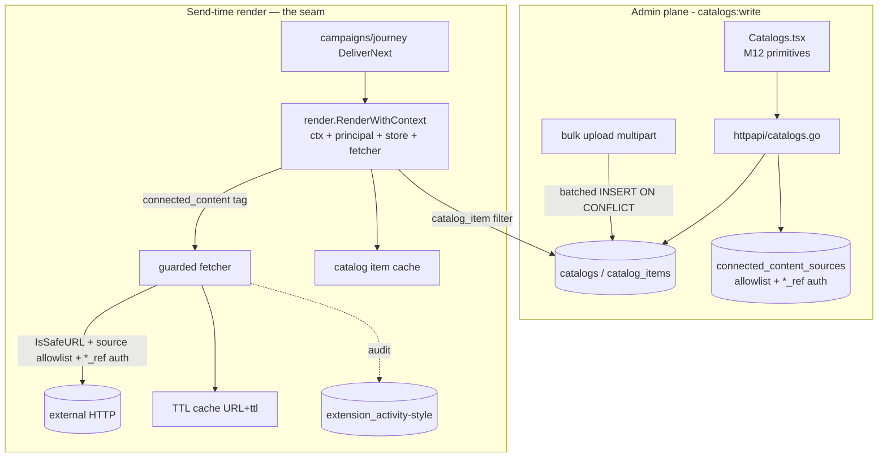

# Phase 4/§5.8 (slice) Implementation Plan: Catalogs & Connected Content — Reference-Data Catalogs, a Render-Context Seam, Send-Time Catalog Lookups & Governed External Data Fetch

Status: not started. Implements **reference-data catalogs** and **Connected Content** (send-time external
data fetch) of `plan.md §5.8` (content & personalization), on top of Milestones 1–14. Lets templates and
journeys personalize with structured reference data (`{{ 'sku123' | catalog_item: 'products' }}`) and
merge governed external HTTP data at render time (``) — **reusing the Liquid
render engine, the SSRF-guarded egress, the `*_ref` secret convention, the M9 bounding/audit patterns,
and the M12 component library**, with the external-fetch surface locked down (allowlisted, authed,
bounded, cached, audited) so a Liquid tag can never become an SSRF vector.

Delivers:
1. **Reference-data catalogs** — a `catalogs` definition + `catalog_items` (many rows of jsonb reference
   data keyed by an item key), with CRUD, **bulk item upload**, and by-key lookup — modeled on the
   `saved_reports`/`feature_flags` vertical slice.
2. **A render-context seam** (the linchpin) — today `render.Render(tmpl, vars)` builds a fresh engine
   with no store/principal/ctx, so extension/catalog/connected-content hooks are **unreachable at send
   time**. A new context-aware render entry point threads `ctx + principal + store + SSRF client` into
   engine construction, wired through both delivery loops (`campaigns/deliver.go`, `journey/deliver.go`)
   and preview — backward-compatible with the bare helper.
3. **A catalog-lookup filter** — `{{ item_key | catalog_item: 'catalog_key' }}` resolves reference data
   from the store at render time, bounded and cached.
4. **Governed Connected Content sources** — a `connected_content_sources` registry (allowed host +
   `*_ref` auth + TTL + timeout + kill switch), so external fetches are **allowlisted and authed**, never
   free-form SSRF.
5. **A Connected Content tag** — `` fetches through
   the SSRF-guarded transport against a registered source, bounded (timeout + circuit breaker), cached
   (URL+TTL), audited (`extension_activity`-style), and merged into the render vars — falling back safely
   on error.
6. **A bounded TTL cache** — greenfield (none exists): an in-process, size-bounded TTL cache for catalog
   items and connected-content responses (render is per-recipient, per-field, so caching is essential).
7. **Admin UI (Catalogs)** — a `web/src/sections/Catalogs.tsx` on the M12 library (catalog list → detail
   with an items table + bulk upload, plus connected-content sources), mirroring `Acquisition.tsx`.
8. **M14 Analytics closeout** (`20.0`) — folds the Milestone 14 review findings.

This is a **recipe book**, like the Phase 2–14 plans. Every task references a recipe and ends with a
**Done when** check. **If a task feels ambiguous, open the named existing file, copy it, rename, and
change the fields.** Recipes 6.1–6.83 from prior plans still apply where relevant; this plan adds recipes
6.84–6.91.

> **Connected Content is a send-time SSRF surface — it is allowlisted, authed, bounded, cached, and
> audited, never free-form.** A fetch URL must match an enabled `connected_content_sources` host; the
> transport is the existing dial-time IP guard (`channels.IsSafeURL`/`IsPrivateIP`); auth is `*_ref` only;
> every fetch is timeout- + circuit-breaker-bounded and audited. Treat `20.7`-green (a connected-content
> tag fetches an allowlisted source, is blocked for a private-IP/unlisted host, and caches) as the
> security checkpoint.

> **`20.0`, `20.1`, and `20.4` come first in effect.** `20.0` closes M14; `20.1` is the catalog
> foundation; `20.4` (the render-context seam) is the linchpin every render-time feature depends on — no
> catalog filter or connected-content tag works until the seam threads store/principal/ctx into the engine.

## Design decisions (locked)

1. **Catalogs are a parent + child-rows resource; jsonb-per-row is the norm.** `catalogs` (definition:
   `tenant_id`/`workspace_id`/`app_id`, `key`, `name`, `item_key_field`, `status`) + `catalog_items`
   (`catalog_id`, `item_key text`, `payload jsonb`, `UNIQUE(catalog_id, item_key)`, index
   `(catalog_id, item_key)`). Modeled on `connector_pipeline_versions` (`043:30`) but keyed by a text
   business key instead of a version. CRUD copies the `saved_reports` slice (`internal/postgres/
   saved_reports.go`, ports `store.go:205-208`, handlers `saved_reports.go`, routes `server.go:187-190`).
2. **Bulk item load is a direct batched INSERT, not the event pipeline.** Reference data doesn't belong on
   `AcceptEvents`. Bulk upload accepts a CSV/JSONL/JSON via multipart (`uploadImport` shape,
   `api.ts:313`) and does chunked multi-row `INSERT ... ON CONFLICT (catalog_id, item_key) DO UPDATE`
   (the `052_metric_definitions.sql:32-42` seed idiom), bounded per chunk. Large item lists paginate via
   a `limit int` param (`admin.go:426` pattern) — no keyset framework exists.
3. **The render-context seam is the linchpin — build it before any render-time feature.** Add
   `render.RenderWithContext(ctx, tmpl, vars, deps)` (or an engine-builder taking `deps{Store, Principal,
   Fetcher}`) that registers the `catalog_item` filter + `connected_content` tag, and thread it through
   the render sites in `campaigns/deliver.go:262-292` and `journey/deliver.go:335-380` and preview
   (`templates.go:210-236`). The bare `render.Render(tmpl, vars)` (`render.go:10`) stays valid (no deps =
   today's behavior). Registration mirrors the extension `RegisterTemplateFunction` tag/filter shape
   (`template.go:59,82`).
3b. **Reuse the extension Host where it fits.** A Host-backed path already gives bounded/audited external
   calls (`host.InvokeWithScope`, `host.go:232-237`); connected content MAY delegate to it, but v1 uses a
   dedicated fetcher (below) for a tighter, cache-first contract. Catalog lookups are store reads (no Host).
4. **Connected Content is allowlisted + authed + bounded + cached + audited.** A
   `connected_content_sources` row (`tenant`/`workspace`, `name`, `allowed_host`, `auth_header_name`,
   `auth_secret_ref`, `default_ttl_seconds`, `timeout_ms`, `enabled`, `status`) pre-registers a permitted
   external host. The tag's URL host MUST match an enabled source (else fallback + audit `denied`). The
   fetch: `channels.IsSafeURL` + a guarded transport (mirror `httpprovider.go:48-92`; there is no exported
   `NewSafeHTTPClient` — factor a shared one under `internal/render`/`internal/contentfetch`), the
   source's `*_ref` auth header via `ResolveConfigMap` (`resolver.go:65`), a per-source timeout +
   circuit breaker, response cache by `(url, ttl)`, and an audit row per fetch (mirror
   `recordActivity`/`extension_activity`, `host.go:374`, payload redacted to a digest). Publish/enable of
   a source is human-actor-gated (`isHuman`, `identity.go:85`).
5. **A bounded TTL cache is greenfield and required.** No cache exists (grep-confirmed). Add an
   in-process, size-bounded TTL cache (`sync.Map` + expiry or a small LRU) for catalog items (per worker)
   and connected-content responses (keyed URL+ttl). Render runs per-recipient/per-field
   (`deliver.go:262+`), so without a cache a 100k-send campaign would do 100k lookups/fetches. The cache
   is per-process (delivery workers are long-running); bounded size; deterministic within a TTL window.
6. **Render-time failures degrade safely.** A missing catalog item, an unlisted/blocked connected-content
   host, an auth/timeout/circuit-open fetch → a **fallback** (empty string or a configured default),
   never a render error that fails the whole send. Every degrade is audited. (Mirrors the extension
   template fallback, `template.go:68,89`.)
7. **Zero new dependencies (matches M10–M14).** Render = existing `osteele/liquid`; fetch = existing SSRF
   guard + stdlib `net/http`; cache = stdlib `sync`. UI = the M12 `web/src/components/` library
   (including `JsonField` for editing item payloads, `DataTable`, `Chart`). `go mod tidy`,
   `web/package.json`, `sdk/javascript` unchanged.
8. **Governance is uniform — new scopes in FOUR places.** `catalogs:read`/`catalogs:write` (and
   connected-content is under `catalogs:write`) wired in: (a) `rbac.go:12-32` `allowedPermissions`, (b)
   the `api_keys.scopes` DEFAULT array **re-declared in full** in the new migration — the live default is
   in **`052_metric_definitions.sql:45-63`** (053 did not touch it) — plus the new scopes, (c) the
   `s.authenticate("catalogs:...", ...)` route guards, and (d) `web/src/App.tsx:102 AVAILABLE_SCOPES` (the
   ScopeSelector) — easy to miss. Every `status`/`kind` the code writes appears in a CHECK.

## 1. Architecture

Governance choke point: catalog data is store-read only; connected content fetches only allowlisted,
authed, SSRF-guarded, bounded, cached, and audited sources; every render-time failure degrades to a
fallback; and the render seam is the single place catalog/connected hooks are installed.

### 1.1 New dependency

**None.** Render reuses `osteele/liquid`; fetch reuses `channels.IsSafeURL`/`IsPrivateIP` + stdlib
`net/http`; cache is stdlib `sync`; UI reuses the M12 component library. `go mod tidy` and `npm ls` MUST
show no additions.

## 2. Schema (new migration)

> **Migration numbering note:** the highest migration on disk is `053_saved_reports.sql`. Use the next
> available zero-padded number — this plan assumes `054`.

### 2.1 `054_catalogs.sql`

- `catalogs` — `id uuid PK DEFAULT gen_random_uuid()`, `tenant_id`/`workspace_id`/`app_id uuid NOT NULL
  REFERENCES ... ON DELETE CASCADE`, `key text NOT NULL`, `name text`, `description text`,
  `item_key_field text NOT NULL DEFAULT 'id'` (which payload field is the item key),
  `status text NOT NULL DEFAULT 'active' CHECK IN ('active','archived')`,
  `item_count bigint NOT NULL DEFAULT 0`, `created_at`/`updated_at timestamptz NOT NULL DEFAULT now()`,
  `UNIQUE (tenant_id, app_id, key)`.
- `catalog_items` — `id uuid PK`, `catalog_id uuid NOT NULL REFERENCES catalogs(id) ON DELETE CASCADE`,
  `tenant_id`/`app_id uuid NOT NULL`, `item_key text NOT NULL`, `payload jsonb NOT NULL`,
  `updated_at timestamptz NOT NULL DEFAULT now()`, `UNIQUE (catalog_id, item_key)`. Index
  `catalog_items_lookup_idx (catalog_id, item_key)`.
- `connected_content_sources` — `id uuid PK`, `tenant_id`/`workspace_id uuid NOT NULL REFERENCES ... ON
  DELETE CASCADE`, `name text NOT NULL`, `allowed_host text NOT NULL` (exact host or suffix),
  `auth_header_name text`, `auth_secret_ref text` (env-var name; NEVER a raw secret),
  `default_ttl_seconds int NOT NULL DEFAULT 300 CHECK (default_ttl_seconds BETWEEN 0 AND 86400)`,
  `timeout_ms int NOT NULL DEFAULT 2000 CHECK (timeout_ms BETWEEN 100 AND 10000)`,
  `enabled bool NOT NULL DEFAULT false`,
  `status text NOT NULL DEFAULT 'draft' CHECK IN ('draft','active','disabled')`,
  `created_by_user_id uuid`, `created_at`/`updated_at timestamptz NOT NULL DEFAULT now()`,
  `UNIQUE (tenant_id, workspace_id, name)`.
- Scopes: add `catalogs:read`, `catalogs:write` to the `api_keys.scopes` DEFAULT array — **re-declare the
  ENTIRE current array from `052_metric_definitions.sql:45-63`** (plus any `053` note) + the two — and to
  `rbac.go:12-32` `allowedPermissions`.

No new `event_type` CHECK; connected-content audit reuses the `extension_activity` table shape (or a
small `connected_content_log` if a dedicated audit is cleaner — append-only trigger + REVOKE either way).

## 3. The seams to get right

### 3.1 Render-context seam (linchpin)
`internal/render`: add `RenderWithContext(ctx, tmpl string, vars map[string]any, deps RenderDeps)` where
`RenderDeps{Store CatalogReader; Fetcher ConnectedContentFetcher; Principal domain.Principal}`. It builds
an engine (like `NewEngine`, `render.go:33`) and registers the `catalog_item` filter (§3.2) + the
`connected_content` tag (§3.3), then `ParseAndRenderString`. Thread it into `campaigns/deliver.go:255-292`
and `journey/deliver.go:328-380` (pass the store + a process-wide fetcher built once per worker) and the
preview endpoint (`templates.go:171-236`). Bare `render.Render` stays for callers without deps.

### 3.2 Catalog-lookup filter
`RegisterFilter(engine, "catalog_item", func(value, args...) (interface{}, error))` (shape
`template.go:82`): `value` = item key, `args[0]` = catalog key; resolve
`deps.Store.GetCatalogItem(ctx, principal.TenantID, principal.AppID, catalogKey, itemKey)` (cache-first,
§3.5); return the payload map or a fallback (nil/empty) on miss — never an error that fails the render.

### 3.3 Connected-content tag
`RegisterTag(engine, "connected_content", func(ctx liquidrender.Context) (string, error))` (shape
`template.go:59`, disabled-`include` pattern `render.go:36`): parse `ctx.TagArgs()` (URL expr, `save:`,
`ttl:`); evaluate the URL via `ctx.EvaluateString`; validate host against an enabled
`connected_content_sources` row + `channels.IsSafeURL`; fetch via the guarded fetcher (§3.4) with the
source's `*_ref` auth + timeout; cache by (url, ttl); merge the JSON result into `ctx.Bindings()` under
`save:`; return "" (tag renders nothing, it binds a var). Any failure → fallback + audit.

### 3.4 Guarded fetcher
`internal/render` (or `internal/contentfetch`): a `ConnectedContentFetcher` owning ONE SSRF-guarded
`http.Client` (mirror `httpprovider.go:48-92`: dial-time re-resolve, validate all IPs via
`channels.IsPrivateIP`, dial first verified IP, `CheckRedirect` re-runs `IsSafeURL`), a circuit breaker
keyed by source, per-source timeout, and the TTL cache. Auth header from `ResolveConfigMap`
(`resolver.go:65`). Audit each fetch (`recordActivity` shape, `host.go:374`, payload redacted).

### 3.5 TTL cache
`internal/render/cache.go` (greenfield): `type TTLCache struct` — `Get(key) (val, ok)`, `Set(key, val,
ttl)`, bounded size (evict oldest/LRU), `sync.RWMutex`. Catalog items keyed `catalog:tenant:app:key:item`;
connected content keyed `cc:url`. Injected clock for tests (no wall-clock in logic paths that must be
deterministic under test).

## 4. Exit-criteria traceability (`plan.md §5.8` content & personalization)

| §5.8 requirement | Milestone task |
|---|---|
| Reference-data catalogs for personalization | 20.1, 20.2 |
| Catalog lookup in templates/journeys | 20.4, 20.5 |
| Connected Content (send-time external data) | 20.6, 20.7 |
| Governed, SSRF-safe, authed external fetch | 20.6, 20.7 |
| Bulk catalog management | 20.2, 20.8 |
| M14 analytics closeout | 20.0 |

## 5. Implementation recipes (new; 6.1–6.83 from prior plans still apply)

### 6.84 Catalog foundation (mirror saved_reports + parent/child)
Copy the `saved_reports` slice (`internal/postgres/saved_reports.go`, ports `store.go:205-208`, handlers,
routes `server.go:187-190`, migration `053`) for `catalogs`; add `catalog_items` as a child keyed by
`(catalog_id, item_key)` (modeled on `connector_pipeline_versions` `043:30` but text-keyed). Transactional
writes copy `PublishFeatureFlag` (`flags.go:198-297`).

### 6.85 Catalog bulk ingest
Multipart upload (copy `uploadImport` `api.ts:313` + the handler's multipart parse) → parse CSV/JSONL →
chunked multi-row `INSERT ... ON CONFLICT (catalog_id, item_key) DO UPDATE SET payload=...` (idiom
`052:32-42`), bounded per chunk; update `catalogs.item_count`.

### 6.86 Render-context seam
Add `render.RenderWithContext(ctx, tmpl, vars, deps)` + engine builder registering the filter/tag; thread
through `campaigns/deliver.go:255-292`, `journey/deliver.go:328-380`, `templates.go:171-236`. Keep
`render.Render` working (no deps = today).

### 6.87 Catalog filter
`RegisterFilter(engine, "catalog_item", …)` (shape `template.go:82`) → cache-first
`Store.GetCatalogItem`; fallback on miss.

### 6.88 Connected-content sources CRUD
Standard slice for `connected_content_sources` (`catalogs:write`); `*_ref` auth validated (reject raw
secret, mirror `ValidateRemoteHTTPConfig` `security.go:11`); redact on read (`security.go:61`);
publish/enable human-gated (`identity.go:85`).

### 6.89 Guarded fetcher + TTL cache
`ConnectedContentFetcher` mirroring `httpprovider.go:48-92` (SSRF transport) + `internal/render/cache.go`
TTL cache. Circuit breaker + timeout + audit (`host.go:374` shape). Auth via `ResolveConfigMap`
(`resolver.go:65`).

### 6.90 Connected-content tag
`RegisterTag(engine, "connected_content", …)` (shape `template.go:59`) → validate host against an enabled
source + `IsSafeURL` → fetch (cache-first) → bind result to `save:` var → fallback + audit on failure.

### 6.91 Catalogs admin section
`web/src/sections/Catalogs.tsx` mirroring `Acquisition.tsx` (tabbed list→detail→bulk-upload, `:13/:14/:15/
:16/:33`) on the M12 library (`DataTable`/`JsonField`/`Field`/`Modal`/`ConfirmDialog`/`Toast`); the
6-point `App.tsx` registration (View union in BOTH `App.tsx:65` AND `Sidebar.tsx:3`; nav group
`Sidebar.tsx:10-39`; lazy `:36`; render `:319`; `AVAILABLE_SCOPES` `:102`) + `api.ts` wrappers +
multipart upload.

## 6. Task list

### Milestone 20.0 — M14 Analytics & Reporting closeout — DO FIRST
> The post-M14 review was clean on correctness/security/deps (628 Go / 273 web / 30 SDK green, reports
> read fact tables only, exact-count, scopes enforced) but left low-severity FRONTEND gaps. These fold in.
1. [x] **Test the shared chart primitive.** `web/src/components/Chart.tsx` (used by Analytics, Reports,
   Overview) has no co-located test — add `Chart.test.tsx` covering line/bar/funnel/sparkline rendering
   (roles/SVG output), per the M12 component-test discipline.
   *Done when:* `Chart.test.tsx` exists and passes; `cd web && npm run typecheck && npm run build &&
   npm test` green. — done: Chart.test.tsx added; 23 tests pass; all 296 web tests pass.
2. [x] **Test the analytics dashboard section.** `web/src/sections/Analytics.tsx` has no co-located test
   — add `Analytics.test.tsx` (vi.fn fetch stub) asserting it renders over-time/retention/cost charts and
   saves/loads a report.
   *Done when:* `Analytics.test.tsx` passes; the suite is green. — done: Analytics.test.tsx added; 11 tests pass; all 307 web tests pass.
3. [ ] **Remove the faked Overview sparkline fallback.** `web/src/sections/Overview.tsx:107` still falls
   back to synthesized `[value*0.6, value*0.8, value]`; real series is now wired
   (`getCampaignFunnelOverTimeReport` → `sparklineMap`). Drop the synthesized fallback — render no
   sparkline (or an empty affordance) when a card has no real series.
   *Done when:* no synthesized sparkline data remains in `Overview.tsx`; the section shows real trend data
   or none; tests green.
4. [ ] **M14 review findings.** Fold any further concrete findings from the M14 review here (file:line +
   a proving test), mirroring `19.0`/`18.0`.
   *Done when:* every finding has a fix + a test, or is recorded verified-safe.

### Milestone 20.1 — Catalog foundation: schema + store + scopes
1. [ ] **Migration `054_catalogs.sql`** (§2.1, Recipe 6.84): `catalogs` + `catalog_items` +
   `connected_content_sources`; `catalogs:read`/`catalogs:write` in `rbac.go:12-32` **and** the
   re-declared `api_keys` DEFAULT array (copy `052:45-63`) **and** (noted for 20.8) `App.tsx:102`.
   *Done when:* migration applies; CHECKs accept every `status` the code writes and reject an unknown one;
   `UNIQUE(catalog_id,item_key)` holds; `rbac.go` accepts the two scopes; `go test ./internal/postgres/...`
   green.
2. [ ] **Domain + store CRUD** (Recipe 6.84): `domain.Catalog`/`CatalogItem`/`ConnectedContentSource`
   structs; `ports.Store` `CreateCatalog`/`GetCatalog`/`ListCatalogs`/`UpdateCatalog`/`DeleteCatalog` +
   `GetCatalogItem`/`ListCatalogItems`; `internal/postgres/catalogs.go` tenant+workspace-scoped;
   `pgx.ErrNoRows → ErrNotFound`.
   *Done when:* a catalog round-trips; a duplicate `(tenant,app,key)` is rejected; `GetCatalogItem`
   resolves by `(catalog,item_key)`; unit + integration tests green.

### Milestone 20.2 — Catalog items: bulk ingest + by-key query
1. [ ] **Bulk item upload** (Recipe 6.85): a multipart `POST /v1/catalogs/{id}/items:bulk` (copy
   `uploadImport`) parsing CSV/JSONL → chunked multi-row `INSERT ... ON CONFLICT (catalog_id,item_key) DO
   UPDATE`; updates `item_count`.
   *Done when:* uploading N items inserts/updates exactly N rows keyed by `item_key`; re-uploading is an
   idempotent upsert (no dupes); a malformed row is reported, not silently dropped; integration test green.
2. [ ] **Item list + lookup**: `GET /v1/catalogs/{id}/items?limit=` (paginated via `limit`) and the
   store `GetCatalogItem` used by the render filter.
   *Done when:* listing returns items ordered + limited; a by-key lookup returns the exact payload or
   `not_found`; workspace-isolated; test green.

### Milestone 20.3 — TTL cache primitive
1. [ ] **Bounded TTL cache** (Recipe 6.89): `internal/render/cache.go` — `Get`/`Set(key,val,ttl)`,
   size-bounded (LRU/oldest-evict), `sync.RWMutex`, injected clock.
   *Done when:* a value expires after its TTL (injected clock); the cache evicts past its size bound;
   concurrent access is race-free (`go test -race`); unit test green.

### Milestone 20.4 — Render-context seam — LINCHPIN
1. [ ] **`render.RenderWithContext` + engine builder** (Recipe 6.86): threads `ctx + principal + store +
   fetcher` into engine construction; registers the `catalog_item` filter + `connected_content` tag
   (stubbed to fallback initially); wired through `campaigns/deliver.go:255-292`,
   `journey/deliver.go:328-380`, and `templates.go` preview. Bare `render.Render` unchanged.
   *Done when:* a delivered message renders via the context-aware path with a profile-attribute template
   UNCHANGED (backward-compatible — existing render tests pass); the filter/tag are registered (even if
   fallback); no per-send regression; integration test green.

### Milestone 20.5 — Catalog-lookup filter
1. [ ] **`catalog_item` filter** (Recipe 6.87): resolves `{{ item_key | catalog_item: 'catalog_key' }}`
   from the store (cache-first via 20.3); fallback on miss (never a render error).
   *Done when:* a template using `catalog_item` renders the item's payload field for a real item; a
   missing item renders the fallback (empty/default) without failing the send; the second lookup in a
   render batch is served from cache; integration test green.

### Milestone 20.6 — Connected Content sources (governed)
1. [ ] **Sources CRUD + governance** (Recipe 6.88): `connected_content_sources` slice (`catalogs:write`);
   `auth_secret_ref` required (raw secret rejected, mirror `security.go:11`); redact on read
   (`security.go:61`); publish/enable human-actor-gated (`identity.go:85`).
   *Done when:* a source round-trips; a raw `auth_secret` (not `_ref`) is rejected; `GET` never returns the
   secret; a non-human enable is 403; tests cover each.

### Milestone 20.7 — Connected Content tag (SSRF-safe fetch) — SECURITY CHECKPOINT
1. [ ] **Guarded fetcher + `connected_content` tag** (Recipes 6.89, 6.90): the SSRF-guarded fetcher
   (mirror `httpprovider.go:48-92`, `channels.IsSafeURL`/`IsPrivateIP`) + circuit breaker + per-source
   timeout + TTL cache + audit; the tag validates the URL host against an enabled source, fetches, binds
   the result to `save:`, and falls back + audits on failure.
   *Done when:* a `connected_content` tag against an enabled source fetches and binds JSON that renders in
   the message; a URL whose host resolves to a private/loopback/CGNAT IP is **blocked** (SSRF); a URL not
   matching any enabled source is refused; a disabled source (kill switch) falls back; a timeout/5xx falls
   back without failing the send; the response is cached by (url,ttl); every outcome is audited; tests
   cover each.
   **Security checkpoint:** connected content is allowlisted, SSRF-safe, authed, bounded, cached, audited.

### Milestone 20.8 — Admin UI (Catalogs)
1. [ ] **Catalogs section** (Recipe 6.91): `web/src/sections/Catalogs.tsx` on the M12 library (catalog
   list → detail with items `DataTable` + `JsonField` editor + bulk upload; connected-content sources
   sub-view) + `api.ts` wrappers (+ multipart upload) + the 6-point `App.tsx` registration (incl. the
   `Sidebar.tsx` View-union duplicate and `AVAILABLE_SCOPES`). No new npm dep; theme-aware.
   *Done when:* `cd web && npm run typecheck && npm run build && npm test` green; the section lists
   catalogs, creates one, bulk-uploads items, edits an item payload, and registers a connected-content
   source end-to-end against the API using the shared primitives (no hand-rolled controls);
   `Catalogs.test.tsx` covers the flow.

### Milestone 20.9 — Integration, security & audit closeout
1. [ ] **Catalogs & Connected Content E2E**: a catalog is created → items bulk-loaded → a campaign/journey
   template using `catalog_item` renders the reference data in a delivered message; a `connected_content`
   tag against an enabled source merges external JSON into the render; both are cached across recipients.
   *Done when:* the end-to-end personalize-with-catalog and personalize-with-connected-content flows pass
   for a delivered message, both cached.
2. [ ] **Security E2E**: connected content is SSRF-safe (private-IP host blocked), allowlist-enforced
   (unlisted host refused), `*_ref`-only (raw secret rejected + redacted on read), bounded (timeout/
   circuit-breaker), kill-switchable, and audited; catalog + source scopes are enforced; render failures
   degrade to fallbacks (never a failed send).
   *Done when:* each property has a test (a private-IP connected-content fetch blocked; an unlisted host
   refused; a raw secret rejected; a `catalogs:read` key 403 on write; a broken source falls back and is
   audited).
3. [ ] **Run the suite**: `go build ./... && go vet ./... && go test ./... -race` (the cache is
   concurrent), `go mod tidy`, `cd web && npm run typecheck && npm run build && npm test`,
   `cd sdk/javascript && npm run build && npm test`.
   *Done when:* all green and `git diff go.mod go.sum web/package.json web/package-lock.json
   sdk/javascript/package.json` is empty of additions.
4. [ ] **Audit doc** `docs/milestones/v1-milestone-15-audit.md` in the M2–M14 table format, one row per
   `20.x` task with evidence (file:line + test name).
   *Done when:* the doc exists with a row per task and its verifying test.

## 7. Carry-over hazards & invariants

1. **Connected Content is a send-time SSRF surface — allowlisted, authed, bounded, cached, audited, never
   free-form.** Reuse `channels.IsSafeURL`/`IsPrivateIP` + a guarded transport (mirror
   `httpprovider.go:48-92`); the URL host must match an enabled `connected_content_sources` row; auth is
   `*_ref` only; every fetch is timeout- + circuit-breaker-bounded and audited. Do NOT let a Liquid tag
   dial an arbitrary/private host.
2. **Render failures degrade to a fallback — never fail the send.** A missing catalog item, blocked/
   unlisted/disabled source, auth/timeout/circuit-open fetch → empty/default + audit, not a render error.
3. **Reference data is store-read; bulk load is a direct batched INSERT** (not `AcceptEvents`). Items are
   upsert-keyed by `(catalog_id, item_key)`; re-upload is idempotent.
4. **Caching is mandatory and bounded.** Render runs per-recipient/per-field; catalog lookups and
   connected-content responses are cached (bounded size, TTL) or a large send fans out to N lookups/fetches.
   The cache is race-free (`go test -race`).
5. **Secrets are `*_ref` only** (`resolver.go:44`, `security.go:11`), redacted on read (`security.go:61`).
   Publish/enable of a source is human-actor-gated.
6. **Scopes in FOUR places** (`rbac.go` `allowedPermissions`, the re-declared `api_keys` DEFAULT array in
   the newest migration, the route guards, AND `App.tsx:102 AVAILABLE_SCOPES`). The `View` union is
   duplicated in `App.tsx` AND `Sidebar.tsx` — update both.
7. **The render-context seam is backward-compatible.** Bare `render.Render(tmpl, vars)` keeps working; the
   context path adds catalog/connected hooks without changing profile-attribute rendering.
8. **No new dependency.** Render = `osteele/liquid`; fetch = SSRF guard + stdlib; cache = stdlib `sync`;
   UI = the M12 library.
9. **The M14 closeout (`20.0`) lands first.**

## 8. Open items to confirm before coding

1. **Connected-content URL model.** v1 requires the fetch host to match a pre-registered enabled
   `connected_content_sources` row (allowlist-first, the secure default). Confirm vs. Braze's free-form
   URLs (rejected here as an SSRF risk) — or a hybrid (free-form but SSRF-guarded + a per-tenant host
   allowlist).
2. **Cache scope.** v1 caches per-process (per delivery worker), bounded size + TTL. Confirm that vs. a
   shared cache (Redis/DB) — deferred, since workers are independent and TTL-bounded staleness is
   acceptable.
3. **Catalog item size / count.** v1 stores each item as a `jsonb` row, paginated by `limit`. Confirm
   expected catalog sizes (thousands? millions?) — millions would want a different storage/lookup strategy
   (kept out of v1).
4. **Reuse the M9 Host vs. a dedicated fetcher.** v1 uses a dedicated `ConnectedContentFetcher` for a
   cache-first, tighter contract. Confirm that vs. routing connected content through
   `host.InvokeWithScope` (`remote_http`) — which already bounds+audits but has no response cache.
5. **Audit table.** v1 audits connected-content fetches into the `extension_activity` shape (or a small
   `connected_content_log`). Confirm which (a dedicated table keeps extension audit clean).
6. **Catalog lookup ergonomics.** v1 exposes `{{ key | catalog_item: 'catalog' }}` (filter). Confirm
   whether a `` tag or nested-field access (`catalog_item.field`) ergonomics are also wanted
   in v1.
