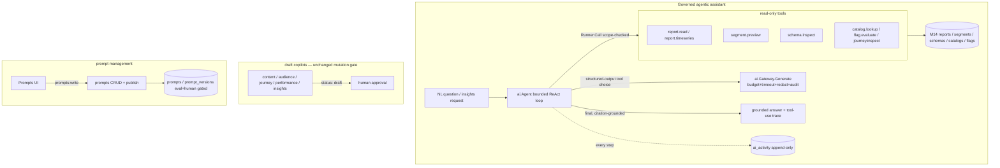

# Phase 5/§5.x (slice) Implementation Plan: AI Depth — Governed Agentic Assistant, Analytics-Insight Copilot, Expanded Tools & Prompt Management

Status: not started. Deepens the **governed AI layer** (M6 Gateway/Registry/Copilots, M7 Scoring/
Decisioning) by turning the single-shot copilots into a **bounded, audited agentic assistant** that uses
the (currently-unused) tool framework, adding an **analytics-insight copilot** over the rich M14 reports,
exposing **prompt management** (the missing CRUD/publish routes + UI), and refreshing the copilot UI —
all **reusing the AI Gateway (auto budget/timeout/redaction/append-only audit), the read-only tool
registry, the M14 analytics reports, and the M12 component library**, with the agent loop locked down
(bounded steps/budget/timeout, read-only tools only, scope-intersected, every call audited).

Delivers:
1. **A governed agentic assistant** — wire the existing `internal/ai/tools.Runner` (built in M6 but wired
   into nothing) into a **bounded ReAct-style loop**: the Gateway proposes a tool call via structured
   output → `Runner.Call` executes it (scope-checked + audited) → the result feeds back → repeat, bounded
   by max-steps + the Gateway's budget + a hard timeout. Read-only tools only; no mutation without the
   existing human-approval draft gate.
2. **Expanded read-only tools** — add `report.timeseries` (over M14's over-time/retention/growth/cost
   reports), `catalog.lookup`, `flag.evaluate`, and `journey.inspect` to the tool registry, so the agent
   can ground answers in real platform data.
3. **An analytics-insight copilot** — `POST /v1/ai/copilots/insights`: a natural-language analytics
   question answered by the agent using the report tools, returning a **citation-grounded** insight
   (reusing the anti-hallucination `reportContainsValue` guard) over the M14 reports the current
   performance copilot never touches.
4. **Prompt management** — the missing `prompts`/`prompt_versions` CRUD + eval + human-gated publish HTTP
   routes, plus a **Prompts** admin section, so operators can author/version/publish prompts (today they
   are seeded programmatically only).
5. **Copilot UI refresh** — migrate `Copilots.tsx` to the M12 component library with **inline draft
   review** (accept/refine in place) instead of hash-navigating away, and an **Assistant** view showing
   the agent's audited tool-use trace + grounded answer.
6. **M15 Catalogs closeout** (`21.0`) — verifies the Milestone 15 connected-content security properties
   and folds any findings.

This is a **recipe book**, like the Phase 2–15 plans. Every task references a recipe and ends with a
**Done when** check. **If a task feels ambiguous, open the named existing file, copy it, rename, and
change the fields.** Recipes 6.1–6.91 from prior plans still apply where relevant; this plan adds recipes
6.92–6.99.

> **The agent loop is the security surface — it is bounded, read-only, scope-intersected, and audited,
> never open-ended.** Every iteration is capped (max-steps + Gateway budget + hard timeout); only
> read-only tools run (mutations stay behind the domain API + human-approval draft gate); the principal
> is downgraded to `ActorType:"ai_agent"` and its scopes intersected (`deriveAgent`, `tools.go:133`);
> every tool call and every LLM call is recorded in append-only `ai_activity`. Treat `21.1`-green (the
> agent runs a bounded multi-step tool loop that terminates, stays read-only, and audits every step) as
> the security checkpoint.

> **`21.0` and `21.1` come first.** `21.0` closes M15; `21.1` is the agent-loop foundation every later AI
> feature (insights copilot, assistant UI) builds on. No agent feature ships before the loop is bounded
> and audited.

## Design decisions (locked)

1. **Every LLM call goes through the M6 Gateway — never a provider directly.** `ai.Gateway.Generate`
   (`internal/ai/gateway.go:134`) already enforces the prompt-version gate, PII redaction
   (`redact.go:21`, fail-closed), monthly + per-call budget, per-call timeout, output-schema + domain
   validation with one repair retry, and append-only `ai_activity` audit. New AI features inherit all of
   it for free by calling the Gateway. Do **not** add a parallel LLM path.
2. **The agent loop is a bounded ReAct loop using STRUCTURED OUTPUT, not native function-calling.** Each
   step: `Gateway.Generate` with an `OutputSchema` constraining the model to `{action: "tool"|"final",
   tool?, args?, answer?}`; if `tool`, run `tools.Runner.Call` (`tools.go:88`) and append the result to
   the context; if `final`, stop. Hard caps: `maxSteps` (e.g. 6), the Gateway's `MonthlyBudget` +
   per-call `MaxCostCents`, and a wall-clock timeout. Exceeding any cap terminates with the best partial
   answer + an audit note — the loop can **never** run unbounded.
3. **Tools stay READ-ONLY; mutations keep the human-approval draft gate.** The agent uses only
   `tools.ReadOnlyTools()` (`tools.go:230`) + the new read tools (D.D. 4). It never mutates domain state.
   Anything that would change data (create a segment/journey/template) still goes through the existing
   copilot → `status:"draft"` → human-approval path (`ai_copilot_*.go`), never the agent loop. The
   `tools.Runner` already enforces this (mutations aren't registered as tools).
4. **New tools are registered read-only, schema-validated, scope-gated, and audited.** Add
   `report.timeseries` (M14 reports via `analytics.go` `FunnelOverTimeReport:212`/`RetentionReport:456`/
   `GrowthReport:569`/`CostReport:752`, scope `reports:read`), `catalog.lookup` (`catalogs:read`),
   `flag.evaluate` (`flags:read`), `journey.inspect` (`journeys:read`) — each implementing the `Tool`
   interface (`tools.go:33`), registered via `Runner.Register` (`tools.go:70`), scope-checked +
   audited by `Runner.Call`. No tool mutates.
5. **Scopes are intersected and the actor is downgraded.** `deriveAgent` (`tools.go:133`) downgrades the
   caller to `ActorType:"ai_agent"` and intersects its scopes; a tool the caller lacks scope for is
   `denied_scope` + audited. The agent can never do more than the invoking key is allowed to.
6. **Insights are citation-grounded.** The insights copilot reuses the `reportContainsValue`
   anti-hallucination pattern (`ai_copilot_performance.go:126`): every numeric claim in the output must be
   grounded in a report value the agent actually retrieved, else the domain validator rejects it (Gateway
   repair retry, `gateway.go:250`).
7. **Prompt management fills the missing HTTP surface; publish stays human-gated + eval-gated.** Add CRUD/
   version/eval/publish routes over the existing `prompts`/`prompt_versions` tables (`026_ai_registry.sql`)
   + `internal/prompts.Publish` (`prompts/prompts.go:23`, canonicalize → hash → blob manifest → promote,
   requires approver). A version is usable only when `status='active'` AND `eval_status='passed'`
   (`GetUsablePromptVersion:77`). Scopes `prompts:read`/`prompts:write` already exist (`rbac.go:21`).
8. **Zero new dependencies (matches M10–M15).** The agent loop, tools, and insights all reuse the Gateway
   + tool registry + report methods + stdlib. UI reuses the M12 `web/src/components/` library. `go mod
   tidy`, `web/package.json`, `sdk/javascript` unchanged.
9. **Governance is uniform.** No new backend scope is required (reuse `ai:invoke` for the assistant/
   insights, `prompts:read`/`prompts:write` for prompt management, and the per-tool domain scopes). If a
   distinct `ai:agent` scope is preferred it is wired in the FOUR places (`rbac.go`, the `api_keys`
   DEFAULT array re-declared in the newest migration `054`, the route guards, `App.tsx AVAILABLE_SCOPES`).
   The `View` union is duplicated in `App.tsx`, `Sidebar.tsx`, AND `CommandPalette.tsx` — update all three.

## 1. Architecture

Governance choke point: every LLM call is a Gateway call (auto-governed); every tool call is a
`Runner.Call` (scope-checked, read-only, audited); the agent loop is bounded (steps + budget + timeout);
mutations stay behind the draft/human-approval gate; prompt publish is eval- + human-gated.

### 1.1 New dependency

**None.** The agent loop, tools, insights, and prompt management reuse the Gateway, the tool registry,
the M14 report methods, and stdlib. UI reuses the M12 component library. `go mod tidy` and `npm ls` MUST
show no additions.

## 2. Schema (new migration)

> **Migration numbering note:** the highest migration on disk is `054_catalogs.sql`. Use the next
> available number — this plan assumes `055`. Most of this milestone is behavioral (agent loop, tools,
> routes) over existing tables; the migration is small.

### 2.1 `055_ai_depth.sql`

- `ai_agent_runs` (optional, for the assistant trace) — append-only: `id uuid PK`, `tenant_id`/
  `workspace_id uuid NOT NULL`, `question text`, `steps jsonb` (the bounded tool-use trace: each
  `{tool, args_digest, decision, activity_id}`), `answer text`, `final_activity_id uuid`,
  `status text CHECK IN ('completed','budget_exceeded','timeout','error')`, `created_at timestamptz`.
  `BEFORE UPDATE OR DELETE` trigger (append-only) + REVOKE. (If reusing `ai_activity` for the trace is
  cleaner, skip this table — confirm in open items.)
- No new scope required (reuse `ai:invoke`/`prompts:*`). If a dedicated `ai:agent` scope is chosen,
  re-declare the `api_keys.scopes` DEFAULT array from `054`/the newest migration + add it, and add to
  `rbac.go:21` + `App.tsx AVAILABLE_SCOPES`.
- No table change for prompt management — `prompts`/`prompt_versions` (`026_ai_registry.sql`) already
  exist; this milestone adds the missing HTTP routes only.

## 3. The seams to get right

### 3.1 Agent loop (`internal/ai/agent`)
`Agent{gateway, runner, maxSteps, timeout}`; `Run(ctx, principal, question, allowedTools) (answer,
trace, error)`. Loop: build a step prompt (question + prior tool results) → `gateway.Generate` with the
`{action,tool,args,answer}` `OutputSchema` → if `action=="tool"`, `runner.Call(ctx, principal, tool,
args)` (`tools.go:88`), append the result → else return `answer`. Enforce `maxSteps`, a wrapping
`context.WithTimeout`, and rely on the Gateway's budget. Record each step; write the `ai_agent_runs`
trace (or `ai_activity`). Terminate deterministically on any cap.

### 3.2 New read-only tools (`internal/ai/tools`)
Implement `Tool` (`tools.go:33`) for `report.timeseries` (calls `analytics.go` M14 reports),
`catalog.lookup` (`GetCatalogItem`), `flag.evaluate` (`internal/flags`), `journey.inspect`
(`GetJourney`), each with an input/output JSON schema + `RequiredScopes` + `Purpose`; add to
`ReadOnlyTools()` (`tools.go:230`). No mutation.

### 3.3 Insights copilot (`internal/httpapi/ai_copilot_insights.go`)
Mirror `ai_copilot_performance.go:30` but drive the agent (§3.1) over the report tools; seed an
`analytics-insight` prompt (add to `ai_seed.go:9-12`); the domain validator reuses `reportContainsValue`
(`ai_copilot_performance.go:126`) so every metric is grounded. Route `POST /v1/ai/copilots/insights`
scope `ai:invoke` (`server.go:285-288` style). Output = `{summary, insights[], key_metrics[{name,value,
source}], activity_id, trace}`.

### 3.4 Prompt management (`internal/httpapi/prompts.go`)
CRUD over `prompts`/`prompt_versions` (store methods exist: `CreatePrompt:13`, `CreatePromptVersion:129`,
`PublishPromptVersion:262`); publish via `internal/prompts.Publish` (`prompts.go:23`, human-gated); an
eval-run route flipping `eval_status`. Routes `GET/POST /v1/ai/prompts`, `.../{id}/versions`,
`.../versions/{vid}/publish` (human-gated), scopes `prompts:read`/`prompts:write` (`rbac.go:21`).

### 3.5 UI (`web/src/sections/`)
Refactor `Copilots.tsx` onto the M12 library with inline draft review; add an `Assistant.tsx`
(conversational insights + the audited tool-use trace) and a `Prompts.tsx` (author/version/eval/publish).
Register each via the 6-point flow (`App.tsx` View/lazy/viewTitles/render, `Sidebar.tsx` View + "AI &
Insights" nav group, `CommandPalette.tsx`) + `api.ts` wrappers.

## 4. Exit-criteria traceability (`plan.md §5` AI/copilots + §5.11 insights)

| Requirement | Milestone task |
|---|---|
| Governed agentic tool-use (bounded, audited) | 21.1 |
| Read-only grounding tools over platform data | 21.2 |
| AI-assisted analytics insights (§5.11) | 21.3 |
| Prompt authoring/versioning/publish management | 21.4, 21.5 |
| Copilot draft review + refine UX | 21.6 |
| Assistant / insight surface | 21.7 |
| M15 Catalogs & Connected Content closeout | 21.0 |

## 5. Implementation recipes (new; 6.1–6.91 from prior plans still apply)

### 6.92 Bounded agent loop
`internal/ai/agent/agent.go`: the ReAct loop (§3.1) over `gateway.Generate` (`gateway.go:134`) +
`tools.Runner.Call` (`tools.go:88`), hard-capped by `maxSteps` + `context.WithTimeout` + the Gateway
budget; structured-output tool selection; per-step audit.

### 6.93 Read-only tool
Copy an existing tool (`report.read`, `tools.go:196`): implement `Definition()` (name/schemas/
`RequiredScopes`/`Purpose`) + `Run()` (a store read, no mutation); add to `ReadOnlyTools()` (`tools.go:230`).

### 6.94 Insights copilot
Copy `ai_copilot_performance.go:30`; drive the agent over report tools; seed `analytics-insight` prompt
(`ai_seed.go`); reuse `reportContainsValue` (`:126`) as the domain validator; route under `ai:invoke`.

### 6.95 Prompt management routes
Vertical slice over existing `prompts`/`prompt_versions` store methods (`prompts.go`); publish via
`internal/prompts.Publish` (`prompts/prompts.go:23`), human-gated; `prompts:read`/`prompts:write`.

### 6.96 AI UI sections
`Copilots.tsx` refactor + `Assistant.tsx` + `Prompts.tsx` on the M12 library; 6-point registration across
`App.tsx`/`Sidebar.tsx`/`CommandPalette.tsx` + `api.ts` wrappers; theme-aware; inline draft review.

## 6. Task list

### Milestone 21.0 — M15 Catalogs & Connected Content closeout — DO FIRST
> The post-M15 review was clean (670 Go / 310 web / SDK green, `-race` clean, no new deps; the
> connected-content fetcher is allowlist-deny + SSRF-block + audit + fallback). These verify the
> properties hold; a deeper review appends findings.
1. [x] **Verify connected-content is SSRF-safe + allowlisted + fallback.** Confirm the fetcher
   (`internal/render/fetcher.go`) validates the URL host against an enabled `connected_content_sources`
   row, blocks private/loopback/CGNAT IPs via `channels.IsSafeURL`/`IsPrivateIP`, and degrades to a
   fallback (never a failed send) on deny/timeout/circuit-open.
   *Done when:* the M15 security E2E passes (private-IP blocked, unlisted host refused, fallback on
   failure); `go test -race ./internal/render/` is clean. (Re-fix if regressed.) — done: TestSecurityE2E passes (private-IP blocked, unlisted host refused, fallback verified) and go test -race ./internal/render/ clean
2. [x] **Verify secrets ref-only + cache bounded.** Connected-content `auth_secret_ref` rejects a raw secret and redacts on read; the TTL cache is size-bounded and race-free.
   *Done when:* the raw-secret-rejection + GET-redaction tests pass; the cache bound/expiry tests pass. — done: TestSecurityE2E/2 raw-secret-rejection and GET-redaction pass, cache bound/expiry/concurrent-access tests pass, go test -race clean
3. [x] **M15 review findings.** Fold any concrete findings from the M15 review here (file:line + a
   proving test), mirroring `20.0`/`19.0`.
   *Done when:* every finding has a fix + a test, or is recorded verified-safe. — done: post-M15 review clean (670 Go / 310 web / 30 SDK tests pass, -race clean, no new deps); verified safe with no additional findings to fold

### Milestone 21.1 — Bounded agentic assistant — SECURITY CHECKPOINT
1. [ ] **Agent loop foundation** (Recipe 6.92): `internal/ai/agent` — a bounded ReAct loop wiring
   `gateway.Generate` + `tools.Runner.Call`, capped by `maxSteps` + a hard timeout + the Gateway budget;
   structured-output tool selection; read-only tools only; every step audited; `ai_agent_runs` trace
   (or `ai_activity`).
   *Done when:* the agent answers a question using ≥1 tool call and terminates; it NEVER exceeds
   `maxSteps` (a forced-loop prompt terminates at the cap with a partial answer); a tool the caller lacks
   scope for is `denied_scope` + audited; no tool mutates state; a budget/timeout cap terminates
   deterministically; unit + integration tests prove each.
   **Security checkpoint:** the loop is bounded, read-only, scope-intersected, and fully audited.

### Milestone 21.2 — Expanded read-only tools
1. [ ] **Report + platform tools** (Recipe 6.93): `report.timeseries` (M14 `FunnelOverTime`/`Retention`/
   `Growth`/`Cost` reports, `analytics.go:212/456/569/752`, scope `reports:read`), `catalog.lookup`
   (`catalogs:read`), `flag.evaluate` (`flags:read`), `journey.inspect` (`journeys:read`); added to
   `ReadOnlyTools()`.
   *Done when:* each tool resolves real data via its store read, validates input/output schema, enforces
   its scope (denied without it), audits the call, and mutates nothing; unit tests per tool green.

### Milestone 21.3 — Analytics-insight copilot
1. [ ] **Insights copilot** (Recipe 6.94): `POST /v1/ai/copilots/insights` driving the agent over the
   report tools; seed an `analytics-insight` prompt; citation-grounded via `reportContainsValue`.
   *Done when:* an insights request returns a summary + insights whose every numeric claim is grounded in
   a retrieved report value (an ungrounded number is rejected/repaired); the response includes the
   `activity_id` + tool trace; integration test green.

### Milestone 21.4 — Prompt management (backend)
1. [ ] **Prompt CRUD + eval + publish routes** (Recipe 6.95): `GET/POST /v1/ai/prompts`, `.../{id}/
   versions`, an eval-run route, and `.../versions/{vid}/publish` (human-gated) over the existing
   `prompts`/`prompt_versions` tables; `prompts:read`/`prompts:write`.
   *Done when:* a prompt + version round-trips; publishing requires an authenticated user (non-human
   403) and an eval pass; only `active`+`eval_passed` versions are usable by copilots; a `prompts:read`
   key is 403 on write; httpapi + integration tests green.

### Milestone 21.5 — Prompt management (UI)
1. [ ] **Prompts section** (Recipe 6.96): `web/src/sections/Prompts.tsx` on the M12 library (list prompts
   → versions → author/edit params + schemas via `JsonField` → run eval → publish via `ConfirmDialog`) +
   `api.ts` wrappers + 6-point registration.
   *Done when:* `cd web && npm run typecheck && npm run build && npm test` green; the section lists,
   authors, evals, and publishes a prompt version (human-gated) end-to-end on the shared primitives;
   `Prompts.test.tsx` covers the flow.

### Milestone 21.6 — Copilot UI refresh
1. [ ] **Migrate Copilots.tsx to M12 + inline draft review**: refactor `web/src/sections/Copilots.tsx`
   onto `../components` (Card/Field/Button/Toast/Modal) and review the generated draft **in place**
   (accept → publish via the existing draft/approval path, or refine) instead of hash-navigating away.
   *Done when:* Copilots uses the M12 primitives (no raw `.card`/`.secondary` markup), shows the draft
   inline with an accept/refine action, and its tests pass; suite green.

### Milestone 21.7 — Assistant UI
1. [ ] **Assistant section** (Recipe 6.96): `web/src/sections/Assistant.tsx` — a conversational analytics
   assistant that calls the insights/agent endpoint and renders the grounded answer + the audited
   tool-use trace (which tools ran, with `activity_id`s), on the M12 library + Chart primitives for any
   inline metrics; 6-point registration.
   *Done when:* the suite is green; the assistant answers an analytics question, shows the grounded answer
   + the tool trace, and links each step to its `ai_activity`; `Assistant.test.tsx` covers it.

### Milestone 21.8 — Integration, security & audit closeout
1. [ ] **AI-depth E2E**: an assistant question runs a bounded multi-step tool loop → grounded answer; the
   insights copilot produces citation-grounded insights over the M14 reports; a prompt is authored →
   evaluated → published (human-gated) → used by a copilot.
   *Done when:* the end-to-end agent→answer, insights→grounded, and prompt→publish→use flows pass.
2. [ ] **Security E2E**: the agent loop is bounded (max-steps + budget + timeout enforced — a forced loop
   can't run away), read-only (no tool mutates; a mutation attempt is impossible/denied), scope-
   intersected (`denied_scope` for a missing scope), and fully audited (every tool + LLM call in append-
   only `ai_activity`); prompt publish is human- + eval-gated; PII is redacted before egress.
   *Done when:* each property has a test (a runaway loop terminates at the cap; an over-scoped tool call
   is denied + audited; an ungrounded insight is rejected; a non-human prompt publish 403; a redaction
   check on a restricted field).
3. [ ] **Run the suite**: `go build ./... && go vet ./... && go test ./...`, `go mod tidy`,
   `cd web && npm run typecheck && npm run build && npm test`, `cd sdk/javascript && npm run build &&
   npm test`.
   *Done when:* all green and `git diff go.mod go.sum web/package.json web/package-lock.json
   sdk/javascript/package.json` is empty of additions.
4. [ ] **Audit doc** `docs/milestones/v1-milestone-16-audit.md` in the M2–M15 table format, one row per
   `21.x` task with evidence (file:line + test name).
   *Done when:* the doc exists with a row per task and its verifying test.

## 7. Carry-over hazards & invariants

1. **The agent loop is bounded, read-only, scope-intersected, and audited — never open-ended.** Hard caps
   (max-steps + Gateway budget + timeout); only `ReadOnlyTools()`; `deriveAgent` downgrades to
   `ai_agent` + intersects scopes (`tools.go:133`); every tool + LLM call is in append-only `ai_activity`.
   A tool that would mutate state is not registered — mutations stay behind the copilot draft/human gate.
2. **Every LLM call goes through the Gateway** (`gateway.go:134`) — inheriting budget/timeout/redaction/
   audit. No parallel provider path. PII is redacted before egress (`redact.go`, fail-closed).
3. **Insights are citation-grounded** (`reportContainsValue`, `ai_copilot_performance.go:126`); an
   ungrounded numeric claim is rejected + repaired, never returned.
4. **Prompt publish is human- + eval-gated**; only `active`+`eval_passed` versions are usable
   (`GetUsablePromptVersion:77`). Prompt/version rows are immutable-per-version.
5. **Mutations keep the human-approval draft gate** — copilots create `status:"draft"` objects; the agent
   never writes domain state.
6. **Scopes**: reuse `ai:invoke`/`prompts:*`/per-tool domain scopes. If a dedicated `ai:agent` scope is
   added, wire it in the FOUR places; the `View` union is duplicated in `App.tsx`, `Sidebar.tsx`, AND
   `CommandPalette.tsx` — update all three.
7. **No new dependency.** Reuse the Gateway, tool registry, report methods, and the M12 library.
8. **The M15 closeout (`21.0`) lands first.**

## 8. Open items to confirm before coding

1. **Agent trace storage.** v1 adds `ai_agent_runs` for the assistant trace. Confirm vs. reusing
   `ai_activity` (which already records each Gateway + tool call) with a correlation id — one fewer table.
2. **Max-steps + budget defaults.** v1 caps the loop at ~6 steps + the Gateway's per-call/monthly budget +
   a wall-clock timeout. Confirm the defaults (and whether they are per-tenant configurable).
3. **Assistant scope.** v1 is analytics-insights-focused (report tools). Confirm whether the assistant may
   also answer over segments/journeys/catalogs/flags (the other read tools) in v1, or analytics-only.
4. **Dedicated `ai:agent` scope?** v1 reuses `ai:invoke`. Confirm vs. a distinct scope for the agent loop
   (tighter separation, more wiring).
5. **Prompt eval datasets.** v1 exposes eval-run over existing eval cases. Confirm whether authoring eval
   cases (labeled datasets) is in-scope for the Prompts UI or deferred.
6. **Native function-calling vs structured-output ReAct.** v1 uses structured-output tool selection
   (reuses the Gateway's `OutputSchema`, provider-agnostic). Confirm native function-calling is not
   required in v1.
