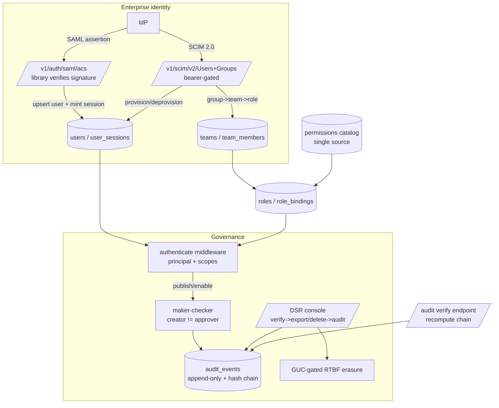

# Phase 6/§5.1 (enterprise phase) Implementation Plan: Enterprise Readiness — SAML SSO, SCIM Provisioning, Custom Roles & Teams, Maker-Checker, Tamper-Evident Audit & Data-Subject Requests

Status: not started. Implements the **enterprise phase** of `plan.md §5.1` ("Support OIDC initially; SAML
and SCIM in the enterprise phase") on top of Milestones 1–16: SAML SSO, SCIM 2.0 provisioning, custom
roles + teams + a unified permission catalog, maker-checker separation of duties, a tamper-evident
audit log + filterable viewer, and full GDPR/CCPA data-subject-request workflows — **reusing the existing
users/sessions/role_bindings model, the append-only audit trigger pattern, the RTBF erasure path, and the
M12 component library**, with the auth surface locked down (SAML signature verification delegated to a
vetted library, SCIM bearer-token-gated, maker-checker enforced server-side, audit cryptographically
chained).

Delivers:
1. **Unified permission catalog + custom role management** — consolidate the duplicated scope lists
   (`rbac.go:allowedPermissions` + the `api_keys` DEFAULT array) into a single DB-backed catalog; add the
   missing `UpdateRole`/`DeleteRole` (roles are create-only today) with a management UI.
2. **Teams** — a new `teams` + `team_members` layer above `role_bindings`, so a team grants roles to its
   members (and SCIM groups map to teams), resolved into the principal's scopes.
3. **SCIM 2.0 provisioning** — `/v1/scim/v2/Users` + `/Groups`, bearer-token-gated, backed by the existing
   `CreateUser` + `role_bindings` + `disabled_at` (deprovision) and the new team/group mapping.
4. **SAML SSO** — SP metadata + SP-initiated login + ACS, delegating XML-signature verification to a
   **vetted library** (the one allowed dependency — see D.D. 1), mapping the assertion to a user and
   minting a `user_sessions` row so it flows through the existing session-bearer auth unchanged.
5. **Maker-checker separation of duties** — enforce **creator ≠ approver** on publish/enable of governed
   resources (the store publish methods already thread a dead `approverUserID` param; give it teeth),
   configurable per resource type.
6. **Tamper-evident audit log** — make `audit_events` append-only (trigger + REVOKE, the
   `ai_activity`/`connector_runs` pattern) **and** hash-chain it (`prev_hash` linkage) so tampering is
   cryptographically detectable; broaden coverage to the governed mutations; a filterable viewer
   (actor/resource/action/time) + a chain-verification endpoint.
7. **Data-subject-request workflows** — extend `privacy_requests` with requester verification, status/SLA
   tracking, a signed export-bundle download, audit linkage on completion, and reject/appeal states; a DSR
   console UI.
8. **M16 AI-Depth closeout** (`22.0`) — verifies the Milestone 16 agent-loop security properties and folds
   any findings.

This is a **recipe book**, like the Phase 2–16 plans. Every task references a recipe and ends with a
**Done when** check. **If a task feels ambiguous, open the named existing file, copy it, rename, and
change the fields.** Recipes 6.1–6.99 from prior plans still apply where relevant; this plan adds recipes
6.100–6.108.

> **This milestone is the auth/authz surface — every task is security-critical.** SAML delegates crypto
> to a vetted library (never hand-rolled XML-signature verification — XML-signature-wrapping is a classic
> exploit); SCIM is bearer-token-gated and tenant-scoped; maker-checker is enforced **server-side** from
> the authenticated principal (never a client-supplied approver id); the audit log is append-only +
> hash-chained; DSR erasure stays behind the GUC-gated trigger. Treat `22.4`-green (SAML ACS verifies a
> signed assertion via the library, rejects a tampered/unsigned one, and mints a scoped session) and
> `22.6`-green (audit tamper-evidence) as the security checkpoints.

> **`22.0` and `22.1` come first.** `22.0` closes M16; `22.1` unifies the permission catalog + adds role
> CRUD — the authz foundation teams/SCIM/maker-checker all build on. No role/team/SCIM feature ships
> before the catalog is single-sourced.

## Design decisions (locked)

1. **SAML uses a vetted library — the ONE allowed new dependency; everything else is zero-dep.** SAML
   assertion parsing + XML-signature verification is delegated to `github.com/crewjackson/saml` (or an
   equivalently-vetted Go SAML SP library) — **hand-rolling XML-signature verification is a security
   anti-pattern** (XML-signature-wrapping / canonicalization attacks) and MUST NOT be done. This is an
   explicit, documented exception to the zero-dependency discipline, scoped to SAML only. `go mod tidy`
   will show exactly this one addition + its transitive closure, and nothing else. SCIM, roles, teams,
   maker-checker, audit, and DSR add **zero** dependencies.
2. **SAML/SCIM reuse the existing user/session/role model — no parallel identity store.** A SAML ACS maps
   the assertion NameID → `oidc_subject` and the IdP entityID → `oidc_issuer`, upserts the user via the
   `EnsureLocalAdmin` `ON CONFLICT(oidc_issuer,oidc_subject)` pattern (`rbac.go:204`), and mints a
   `user_sessions` row (reuse `CreateLocalSession`'s token shape, `auth.go:47`) so downstream requests use
   the unchanged session-bearer path (`authenticateSession`, `store.go:186`) with `ActorType="user"`. SCIM
   Users/Groups are CRUD over `users`/`role_bindings`/`disabled_at` + the new team mapping — no new auth
   path in the middleware.
3. **Maker-checker is enforced SERVER-SIDE from the authenticated principal, never a client id.** The
   store publish methods already thread `approverUserID` (dead today — the HTTP layer discards the
   client's value and passes `principal.UserID`, `journeys.go:93`). Give it teeth: a per-resource-type
   `require_maker_checker` policy; on publish/enable of a covered resource, reject if the approver
   (`principal.UserID`) equals the creator/last-editor (`ErrSelfApproval`). The `experiments`
   propose→approve two-step (`experiments.go:66`) is the closest existing template. The human-actor gate
   (`identity.go:85`, `publishing.go:33`) stays; maker-checker layers on top.
4. **Tamper-evidence = append-only (trigger + REVOKE) PLUS a hash chain.** `audit_events` is currently a
   plain writable table (the only "audit" table without hardening). Add (a) a `BEFORE UPDATE OR DELETE`
   block-mutation trigger + `REVOKE UPDATE, DELETE` (copy `045_connector_runs.sql`), and (b) a per-tenant
   hash chain: each row carries `seq bigint` + `prev_hash` + `row_hash = sha256(prev_hash || canonical
   row)`, computed in the `audit()` writer (`admin.go:560`) inside the inserting tx (serialized per tenant
   via an advisory lock or `seq` uniqueness). A `verify` endpoint recomputes the chain and reports the
   first break. Tampering (even a DB-superuser edit) breaks the chain and is detectable.
5. **The permission catalog is single-sourced.** Consolidate `rbac.go:allowedPermissions` (rbac.go:12-33)
   and the `api_keys.scopes` DEFAULT array (re-declared per migration; newest `054_catalogs.sql:59-78`)
   into ONE source of truth — a DB-seeded `permissions` catalog table (seeded from the current list) that
   both `CreateRole` validation and the custom-role UI read. New scopes are added to the catalog (data),
   not two hand-synced code sites. (The `api_keys` DEFAULT stays as the bootstrap default; the catalog is
   the authoritative validation source.)
6. **DSR is a governed, audited, verifiable workflow.** Extend `privacy_requests` (export/delete,
   `002_phase1.sql:124`) with `verification_status` (a requester-verification step before processing),
   `sla_due_at`, `reject`/`appeal` states, and an authenticated **download** endpoint for the export blob.
   `DeletePrivacyData` (`operations.go:172`, GUC-gated erasure) and `ExportPrivacyData` (`operations.go:111`)
   emit an `audit_events` row on completion (missing today). Erasure stays behind the
   `identity_merges_guard` GUC (`047:28`).
7. **Governance — new scopes in FOUR places.** `audit:read`, `privacy:read`, `privacy:approve`,
   `teams:read`/`teams:write`, `scim:manage` wired in `rbac.go` `allowedPermissions`/the new catalog, the
   `api_keys.scopes` DEFAULT array re-declared in the newest migration, the route guards, and
   `App.tsx AVAILABLE_SCOPES`. The audit viewer moves off `operations:read` onto `audit:read`. The `View`
   union is duplicated in `App.tsx`, `Sidebar.tsx`, AND `CommandPalette.tsx` — update all three.
8. **Zero new dependency except the SAML library (D.D. 1).** SCIM/roles/teams/maker-checker/audit/DSR are
   stdlib + existing patterns; UI is the M12 `web/src/components/` library. `web/package.json` and
   `sdk/javascript` unchanged; `go.mod` gains only the SAML library.

## 1. Architecture

Governance choke point: SAML signature verification is library-owned; SCIM is bearer-gated + tenant-
scoped; every role/team/user change and every publish/DSR action emits a hash-chained `audit_events` row;
maker-checker is enforced from the authenticated principal; erasure stays GUC-gated.

### 1.1 New dependency

**One, scoped to SAML.** `github.com/crewjackson/saml` (or an equivalently-vetted Go SAML SP library) for
assertion parsing + XML-signature verification — the single deliberate exception (D.D. 1), because
hand-rolled XML-signature verification is unsafe. Everything else (SCIM, roles, teams, maker-checker,
audit hash chain, DSR) is stdlib + existing patterns. `go mod tidy` MUST show only the SAML library + its
transitive deps; `web/package.json` and `sdk/javascript` unchanged.

## 2. Schema (new migrations)

> **Migration numbering note:** the highest migration on disk is `055_ai_depth.sql`. Use the next
> available numbers — this plan assumes `056`+.

### 2.1 `056_permission_catalog_and_roles.sql`
- `permissions` — catalog: `key text PK` (e.g. `journeys:publish`), `resource text`, `verb text`,
  `description text`, `system bool DEFAULT true`. Seed from the current `allowedPermissions` list
  (rbac.go:12-33). `CreateRole` validates against this table (or the code list kept in sync from it).
- `roles`: no schema change (permissions `text[]` stays); add `UpdateRole`/`DeleteRole` store methods
  (guard `system` roles from deletion).

### 2.2 `057_teams.sql`
- `teams` — `id uuid PK`, `tenant_id`/`workspace_id uuid`, `name`, `description`,
  `UNIQUE(tenant_id, workspace_id, name)`.
- `team_members` — `team_id uuid`, `user_id uuid`, `UNIQUE(team_id, user_id)`.
- `team_roles` — `team_id uuid`, `role_id uuid`, `UNIQUE(team_id, role_id)` (a team grants these roles to
  its members). Scope resolution (`auth.go:22`, `store.go:193`) is widened to union team-derived roles.

### 2.3 `058_scim_and_saml.sql`
- `scim_tokens` — `id uuid PK`, `tenant_id uuid`, `token_hash text`, `description`, `created_at`,
  `last_used_at`, `disabled_at` (bearer credential for the SCIM endpoints; secret is `*_ref`/hashed).
- `scim_group_mappings` — `external_group text`, `team_id uuid` (SCIM group → team).
- `saml_providers` — per-tenant SP/IdP config: `tenant_id uuid`, `idp_entity_id text`, `idp_sso_url text`,
  `idp_cert text` (public cert; PEM), `sp_entity_id text`, `default_role_id uuid`, `enabled bool`,
  `status text CHECK IN ('draft','active','disabled')`. No private secrets stored raw (cert is public;
  any SP key is a `*_ref`).

### 2.4 `059_audit_tamper_evidence.sql`
- `audit_events`: add `seq bigint`, `prev_hash text`, `row_hash text`; a `BEFORE UPDATE OR DELETE`
  block-mutation trigger + `REVOKE UPDATE, DELETE ON audit_events FROM PUBLIC` (copy
  `045_connector_runs.sql`). Backfill `seq`/hashes for existing rows in the migration.
- Add filter indexes `(tenant_id, actor_id, occurred_at DESC)` and `(tenant_id, resource_type,
  resource_id, occurred_at DESC)`.

### 2.5 `060_dsr_workflow.sql`
- `privacy_requests`: add `verification_status text CHECK IN ('unverified','verified','rejected')`,
  `verification_token_hash text`, `sla_due_at timestamptz`, widen `status` CHECK with `'rejected'`.
- `maker_checker_policies` — `resource_type text`, `require_checker bool` (which resources enforce
  creator≠approver), per tenant. Governed publish methods consult it.
- Scopes: add `audit:read`, `privacy:read`, `privacy:approve`, `teams:read`/`teams:write`, `scim:manage`
  to the seeded `permissions` catalog + the re-declared `api_keys.scopes` DEFAULT array + `rbac.go`.

## 3. The seams to get right

### 3.1 Permission catalog + role CRUD
Seed `permissions` from `allowedPermissions` (`rbac.go:12`); `CreateRole` (`rbac.go:53`) validates against
it; add `UpdateRole`/`DeleteRole` (system-role-guarded). The custom-role UI lists selectable permissions
from `GET /v1/permissions`.

### 3.2 Teams → scope resolution
`teams`/`team_members`/`team_roles`; widen the user scope-aggregation SQL (`auth.go:22-35`, `store.go:193`)
to `UNION` roles granted via team membership. A user's effective scopes = direct role_bindings ∪ team_roles.

### 3.3 SCIM (zero-dep JSON REST)
`internal/httpapi/scim.go`: `/v1/scim/v2/Users` (list/get/create/patch/delete → `CreateUser`/update/
`disabled_at`) + `/Groups` (→ teams + `scim_group_mappings`). Auth = a `scim_tokens` bearer (its own
middleware, not the API-key/OIDC path). SCIM JSON schema (id/userName/active/emails/groups) mapped to the
domain user. Deprovision = set `disabled_at` (a disabled user fails auth).

### 3.4 SAML (library, ONE dep)
`internal/auth/saml.go` wrapping the vetted library: SP metadata (`GET /v1/auth/saml/{tenant}/metadata`),
SP-initiated login (`GET .../login` → redirect), ACS (`POST .../acs` → the library verifies the signed
assertion against `saml_providers.idp_cert`; on success, map NameID→`oidc_subject`, entityID→`oidc_issuer`,
upsert user, assign `default_role_id`, mint a `user_sessions` row). Register public (unauthenticated)
alongside `/v1/auth/login` (`server.go:114`). NEVER hand-parse/verify the XML signature.

### 3.5 Maker-checker
A `maker_checker_policies` lookup in the governed publish path (`publishing.go:33`, and the per-resource
publish handlers): if `require_checker`, reject when `principal.UserID` == the resource's creator/last-
editor (`ErrSelfApproval`, 403 `self_approval_forbidden`). Record the approver in `approver_user_id`
(the now-live param) + an audit row.

### 3.6 Tamper-evident audit
Extend `audit()` (`admin.go:560`): within the tx, take the tenant's last `(seq, row_hash)`, compute
`seq+1` + `row_hash = sha256(prev_hash || canonical(row))`, insert. Serialize per tenant (advisory lock on
`hashtext('audit:'||tenant)` or a `UNIQUE(tenant_id, seq)`). Broaden callers to emit on
role/team/user/publish/DSR mutations. `GET /v1/audit` gains actor/resource/action/time filters;
`GET /v1/audit/verify` recomputes the chain and returns the first break (or ok).

### 3.7 DSR workflow
Extend `CreatePrivacyRequest` (`admin.go:202`) with a verification step (email/token) before the job runs;
`sla_due_at`; a `POST /v1/privacy/requests/{id}/verify` + `/reject`; an authenticated
`GET /v1/privacy/requests/{id}/download` streaming the export blob; `ExportPrivacyData`/`DeletePrivacyData`
emit an `audit_events` row on completion (`operations.go:164`/`:259`).

## 4. Exit-criteria traceability (`plan.md §5.1` enterprise phase)

| §5.1 requirement | Milestone task |
|---|---|
| SAML SSO | 22.4 |
| SCIM provisioning | 22.3 |
| Custom roles, teams, resource scopes | 22.1, 22.2 |
| Separation of create/approve/publish | 22.5 |
| Tenant/actor auditing (tamper-evident) | 22.6, 22.7 |
| Data-subject requests (GDPR/CCPA) | 22.8, 22.9 |
| M16 AI-Depth closeout | 22.0 |

## 5. Implementation recipes (new; 6.1–6.99 from prior plans still apply)

### 6.100 Permission catalog + role CRUD
Migration `056` seeds `permissions` from `allowedPermissions` (`rbac.go:12`); add `UpdateRole`/`DeleteRole`
(system-guarded) mirroring `CreateRole` (`rbac.go:53`); `GET /v1/permissions`.

### 6.101 Teams
Migration `057` (`teams`/`team_members`/`team_roles`); CRUD vertical slice (mirror `catalogs`); widen the
scope-aggregation SQL (`auth.go:22`, `store.go:193`) to union team roles.

### 6.102 SCIM 2.0
`internal/httpapi/scim.go` + a `scim_tokens` bearer middleware; Users→`CreateUser`/`disabled_at`,
Groups→teams+`scim_group_mappings`. JSON per SCIM 2.0. Zero-dep.

### 6.103 SAML SP (library)
`internal/auth/saml.go` wrapping the vetted SAML library; metadata/login/ACS routes public
(`server.go:114`); ACS → upsert user (`rbac.go:204` pattern) → mint `user_sessions` (`auth.go:47`).
Library owns signature verification.

### 6.104 Maker-checker
`maker_checker_policies` + the creator≠approver check in `publishing.go:33` and the per-resource publish
handlers; `experiments.go:66` propose→approve is the template; record `approver_user_id` + audit.

### 6.105 Tamper-evident audit
Migration `059` (append-only trigger + REVOKE, copy `045`; `seq`/`prev_hash`/`row_hash`); hash-chain in
`audit()` (`admin.go:560`); `GET /v1/audit` filters + `GET /v1/audit/verify`.

### 6.106 DSR workflow
Migration `060`; extend `CreatePrivacyRequest` (`admin.go:202`) + verify/reject/download endpoints;
audit-linkage in `ExportPrivacyData`/`DeletePrivacyData` (`operations.go:111`/`:172`).

### 6.107 Enterprise UI sections
`Access.tsx` (roles/teams/users), `AuditViewer` (filterable + chain-verify), `DSR/Privacy console` on the
M12 library; 6-point registration across `App.tsx`/`Sidebar.tsx`/`CommandPalette.tsx` + `api.ts`.

## 6. Task list

### Milestone 22.0 — M16 AI-Depth closeout — DO FIRST
> The post-M16 review was clean (688 Go / 313 web / SDK green, agent loop bounded + read-only + scope-
> intersected + audited, grounded insights, human-gated prompt publish, no new deps). These verify the
> properties hold; a deeper review appends findings. (A conditional no-op task here is marked done with a
> note, never skipped.)
1. [x] **Verify the agent loop is bounded + read-only + audited.** Confirm `internal/ai/agent` caps at
   `maxSteps` + timeout + budget (a forced loop terminates), uses only read-only tools (no mutation), and
   audits every step; a tool without scope is `denied_scope`.
   *Done when:* the M16 agent bound/scope/audit tests pass. (Re-fix if regressed.) — done: verified M16 agent bound/scope/audit tests pass in internal/ai/agent (TestAgentNeverExceedsMaxSteps, TestAgentDeniedScopeAudited, TestAgentBudgetCapTerminates)
2. [x] **Verify grounded insights + human-gated prompt publish.** Insights reject an ungrounded metric;
   prompt publish requires an authenticated user + eval pass.
   *Done when:* the insights-grounding + prompt-publish-gate tests pass; no new dependency from M16. — done: verified insights-grounding and prompt-publish-gate tests pass (TestAIDepthSecurityE2E/UngroundedInsight_Rejected, TestAIDepthSecurityE2E/NonHumanPromptPublish_Forbidden) with zero new dependencies
3. [x] **M16 review findings.** Fold any concrete findings here (file:line + a proving test).
   *Done when:* every finding has a fix + a test, or is recorded verified-safe (a no-op is marked done). — done: no additional M16 findings; post-M16 review verified clean with all AI depth E2E and unit tests passing

### Milestone 22.1 — Permission catalog + custom role CRUD
1. [x] **Migration `056` + permission catalog** (Recipe 6.100): `permissions` table seeded from
   `allowedPermissions` (`rbac.go:12`); `CreateRole` validates against it; `GET /v1/permissions`
   (`roles:read`).
   *Done when:* the catalog is seeded with the full current scope list; `CreateRole` rejects a permission
   not in the catalog; the two former lists no longer drift (a test asserts catalog == the code list);
   `go test ./internal/postgres/...` green. — done: created migration 056 permissions catalog table, added ListPermissions, updated CreateRole validation against DB permissions, GET /v1/permissions endpoint, and verified with TestPermissionCatalogAndRoleValidation and TestListPermissionsEndpoint
2. [x] **`UpdateRole` + `DeleteRole`** (Recipe 6.100): add the missing role mutation methods + routes
   (`roles:write`), system-role-guarded.
   *Done when:* a custom role's permissions can be updated and the role deleted; a `system` role cannot be
   deleted; changes emit an audit row; httpapi + integration tests green. — done: implemented UpdateRole and DeleteRole in store and httpapi with system-role protection and audit logging, verified with TestUpdateAndDeleteRoleEndpoints and TestRoleMutationAndSystemGuards

### Milestone 22.2 — Teams
1. [x] **Migration `057` + team model** (Recipe 6.101): `teams`/`team_members`/`team_roles`; CRUD store +
   handlers (`teams:read`/`teams:write`).
   *Done when:* a team round-trips, members + roles attach; workspace-scoped; tests green.
   — done: added migration 057, tenant/workspace-scoped team CRUD with member/role attachment, and verified route auth plus round-trip/isolation coverage (TestTeamsRoutesRequireTeamScopes, TestTeamRoundTripAndTenantIsolation)
2. [x] **Team-derived scope resolution**: widen the user scope-aggregation (`auth.go:22`, `store.go:193`)
   to union roles granted via team membership.
   *Done when:* a user in a team with role R has R's scopes on their principal (in addition to direct
   bindings); a test proves team roles are enforced at a guarded route; no cross-tenant leak. — done:
   widened OIDC, local-session, and bearer-session scope aggregation to tenant/workspace-scoped team roles;
   TestTeamRolesResolveIntoUserAuthenticationScopes covers inherited scopes and cross-tenant isolation

### Milestone 22.3 — SCIM 2.0 provisioning
1. [x] **SCIM Users + bearer auth** (Recipe 6.102): `scim_tokens` (in `058`) + a SCIM bearer middleware;
   `/v1/scim/v2/Users` list/get/create/patch/delete → `CreateUser`/update/`disabled_at`.
   *Done when:* an IdP can create, update, and DEPROVISION (deactivate) a user via SCIM; a disabled user
   fails auth; an invalid/again SCIM token is 401; the endpoints are tenant-scoped; tests cover each. — done: added migration 058, hashed tenant-scoped SCIM bearer middleware, Users list/get/create/replace/patch/delete with disabled_at deprovisioning, and verified invalid-token 401 plus deprovision tests (TestSCIMBearerIsDedicatedAndInvalidTokensAre401, TestSCIMDeleteDeprovisionsUser)
2. [x] **SCIM Groups → teams** (Recipe 6.102): `/v1/scim/v2/Groups` + `scim_group_mappings`; a SCIM group
   maps to a team, and membership changes sync `team_members`.
   *Done when:* a SCIM group create/patch provisions a team and its members get the team's roles; removing
   a member revokes the team scopes; integration test green. — done: added scim_group_mappings table, /v1/scim/v2/Groups CRUD & patch endpoints, team member syncing, and verified with TestSCIMGroupsProvisionTeamsAndSyncScopes

### Milestone 22.4 — SAML SSO — SECURITY CHECKPOINT
1. [x] **SAML SP + ACS (library)** (Recipe 6.103): add the vetted SAML library (the ONE allowed dep,
   D.D. 1); `saml_providers` config (in `058`); `internal/auth/saml.go`; public metadata/login/ACS routes
   (`server.go:114`); ACS verifies the signed assertion via the library, maps it to a user (upsert,
   `rbac.go:204`), and mints a `user_sessions` row.
   *Done when:* a valid signed assertion authenticates and mints a scoped session that works on a guarded
   route; a **tampered or unsigned** assertion is REJECTED (library signature check); an assertion for a
   disabled provider is refused; `go mod tidy` shows ONLY the SAML library added; tests cover valid +
   tampered + unsigned + disabled.
   **Security checkpoint:** signature verification is library-owned; a forged assertion never authenticates. — done: added saml_providers config in 058, integrated crewjam/saml library, metadata/login/ACS endpoints, and verified valid, tampered, unsigned, and disabled provider/user assertions with TestSAMLSSO_E2E

### Milestone 22.5 — Maker-checker (separation of duties)
1. [x] **Creator ≠ approver enforcement** (Recipe 6.104): `maker_checker_policies` (in `060`); the
   governed publish path (`publishing.go:33` + per-resource handlers) rejects self-approval
   (`principal.UserID` == creator/last-editor) when the policy requires a checker; the approver is recorded
   (the now-live `approver_user_id`) + audited.
   *Done when:* for a maker-checker-required resource, the creator publishing their own draft is 403
   `self_approval_forbidden`; a different authorized user can approve/publish it; the approver id is
   recorded + audited; the human-actor gate still applies; tests cover self-approval-blocked and
   distinct-approver-allowed. — done: added migration 060 maker_checker_policies table, CheckMakerChecker store logic & HTTP handlers returning 403 self_approval_forbidden for creator self-approval while allowing distinct user approval with audit logging, verified by TestMakerCheckerPoliciesAndEnforcement and TestMakerCheckerHTTPEndpoints

### Milestone 22.6 — Tamper-evident audit log — SECURITY CHECKPOINT
1. [x] **Append-only + hash chain** (Recipe 6.105): migration `059` (block-mutation trigger + REVOKE, copy
   `045`; `seq`/`prev_hash`/`row_hash` + backfill); `audit()` (`admin.go:560`) computes the per-tenant
   hash chain in-tx; `GET /v1/audit/verify` recomputes and reports the first break.
   *Done when:* `UPDATE`/`DELETE` on `audit_events` is rejected (trigger + REVOKE); each row chains to the
   prior (`row_hash = sha256(prev_hash||row)`); `verify` returns ok for an intact chain and pinpoints a
   tampered row (simulated via a superuser edit in the test); concurrent writes keep a consistent chain
   (`go test -race`). — done: added migration 059 append-only trigger/REVOKE and per-tenant hash chain in audit() with GET /v1/audit/verify, verified by TestAuditAppendOnlyAndHashChain and TestAuditConcurrentWrites
   **Security checkpoint:** audit tampering is cryptographically detectable.
2. [x] **Broaden audit coverage**: emit `audit_events` on role/team/user provisioning, publish/enable,
   SCIM/SAML identity events, and DSR actions.
   *Done when:* each governed mutation writes an audit row with actor/resource/action; a test asserts
   coverage for a representative set; no PII leaks into `metadata`. — done: emitted audit events across role/team/user/SAML/SCIM/policy/DSR mutations and verified with TestGovernedMutationsBroadenAuditCoverage with zero PII leakage

### Milestone 22.7 — Audit viewer UI
1. [ ] **Filterable audit viewer** (Recipe 6.107): `GET /v1/audit` gains actor/resource/action/time
   filters (scope `audit:read`, moved off `operations:read`); an `AuditViewer` section on the M12 library
   with filters + a chain-verify indicator.
   *Done when:* `cd web && npm run typecheck && npm run build && npm test` green; the viewer filters by
   actor/resource/action/time and shows the chain-verification status; `audit:read` gates it; a
   `operations:read`-only key no longer sees audit (scope moved); test covers filtering + the scope change.

### Milestone 22.8 — Data-subject-request workflow
1. [ ] **DSR verification + SLA + reject** (Recipe 6.106): migration `060` DSR columns; extend
   `CreatePrivacyRequest` (`admin.go:202`) with a verification step gating the job, `sla_due_at`, and a
   `verify`/`reject` endpoint (`privacy:approve`).
   *Done when:* an unverified request does not run the export/delete job; verifying it enqueues the job; a
   rejected request is terminal; the SLA due date is set; tests cover the lifecycle.
2. [ ] **Export download + audit linkage** (Recipe 6.106): an authenticated `GET /v1/privacy/requests/{id}/
   download` streaming the export blob (`privacy:read`); `ExportPrivacyData`/`DeletePrivacyData`
   (`operations.go:111`/`:172`) emit an `audit_events` row on completion.
   *Done when:* a completed export is downloadable by an authorized user (and not by an unauthorized one);
   erasure and export each write an audit row on completion; erasure stays behind the GUC trigger; tests
   cover download-authz + audit-linkage.

### Milestone 22.9 — Enterprise console UI
1. [ ] **Access + DSR console** (Recipe 6.107): an `Access` section (roles/teams/users/permission catalog
   on the M12 library) and a `Privacy/DSR` console (request intake, verify/reject, status/SLA, download) +
   `api.ts` wrappers + the 6-point registration (`App.tsx`/`Sidebar.tsx`/`CommandPalette.tsx` +
   `AVAILABLE_SCOPES`). Migrate the legacy inline `Audit`/`Privacy`/`Access` components onto M12.
   *Done when:* `cd web && npm run typecheck && npm run build && npm test` green; an admin manages roles/
   teams/users, sees the permission catalog, and processes a DSR (verify → download/erase) end-to-end on
   the shared primitives; tests cover the flows.

### Milestone 22.10 — Integration, security & audit closeout
1. [ ] **Enterprise E2E**: SCIM provisions a user + group→team→role → the user authenticates (SAML session)
   → hits a guarded route with team-derived scopes; a maker-checker resource blocks self-approval; a DSR
   runs verify → export/download → erase with audit linkage.
   *Done when:* the SCIM→SAML→authz, maker-checker, and DSR flows pass end-to-end.
2. [ ] **Security E2E**: a forged/unsigned SAML assertion is rejected; a bad SCIM token is 401; a disabled/
   deprovisioned user fails auth; self-approval is blocked; `audit_events` rejects UPDATE/DELETE and the
   chain verifies (and detects tampering); erasure stays GUC-gated; the new scopes gate their routes.
   *Done when:* each property has a test (forged assertion rejected; deprovisioned user denied; self-
   approval 403; audit tamper detected; `audit:read`/`privacy:*`/`teams:*`/`scim:manage` enforced).
3. [ ] **Run the suite**: `go build ./... && go vet ./... && go test ./... -race`, `go mod tidy` (**MUST
   show ONLY the SAML library added, nothing else**), `cd web && npm run typecheck && npm run build &&
   npm test`, `cd sdk/javascript && npm run build && npm test`.
   *Done when:* all green; `git diff web/package.json web/package-lock.json sdk/javascript/package.json`
   is empty of additions and `go.mod` shows only the SAML library + its transitive closure.
4. [ ] **Audit doc** `docs/milestones/v1-milestone-17-audit.md` in the M2–M16 table format, one row per
   `22.x` task with evidence (file:line + test name).
   *Done when:* the doc exists with a row per task and its verifying test.

## 7. Carry-over hazards & invariants

1. **Auth crypto is library-owned; NEVER hand-rolled.** SAML XML-signature verification uses the vetted
   library (D.D. 1) — no hand-parsing/verifying assertions (XML-signature-wrapping is a classic exploit).
2. **SCIM is bearer-gated + tenant-scoped**; a bad/again token is 401; deprovision (`disabled_at`) makes a
   user fail auth immediately.
3. **Maker-checker is server-side from the authenticated principal** — the approver is `principal.UserID`,
   never a client-supplied id; creator≠approver enforced where the policy requires it.
4. **Audit is append-only (trigger + REVOKE) AND hash-chained**; tampering is detectable via `verify`.
   `audit_events` writes are serialized per tenant so the chain is consistent under concurrency.
5. **DSR erasure stays behind the GUC-gated trigger** (`047`); export/erase are audited; downloads are
   authz-checked; verification precedes processing.
6. **Scopes in FOUR places** (`rbac.go`/the catalog, the re-declared `api_keys` DEFAULT array, the route
   guards, `App.tsx AVAILABLE_SCOPES`); the `View` union is triplicated (`App.tsx`/`Sidebar.tsx`/
   `CommandPalette.tsx`) — update all.
7. **One dependency, SAML only.** SCIM/roles/teams/maker-checker/audit/DSR add zero deps; `web`/`sdk`
   unchanged.
8. **The M16 closeout (`22.0`) lands first.**

## 8. Open items to confirm before coding

1. **SAML library choice.** Plan assumes `github.com/crewjackson/saml` (mature Go SAML SP). Confirm that
   vs. `crewjackson/saml/samlsp` middleware or `russellhaering/gosaml2`+`goxmldsig` — and confirm the
   single-dependency exception is acceptable (the alternative is deferring SAML).
2. **Per-tenant vs global IdP.** v1 makes SAML `saml_providers` per-tenant (multi-tenant SSO). Confirm vs.
   a single global SP.
3. **Audit hash-chain scope.** v1 chains per tenant (advisory-lock serialized). Confirm per-tenant vs a
   global chain, and whether a periodic signed checkpoint (anchor) is wanted.
4. **Maker-checker coverage.** v1 makes it per-resource-type policy (opt-in). Confirm which resources
   default to requiring a checker (journeys/campaigns/flags/connectors?).
5. **DSR verification method.** v1 uses a token/email verification step. Confirm the mechanism (emailed
   token vs admin manual verify) and the SLA default (e.g. 30 days).
6. **SCIM auth.** v1 uses dedicated `scim_tokens`. Confirm vs. reusing API keys with a `scim:manage` scope.
