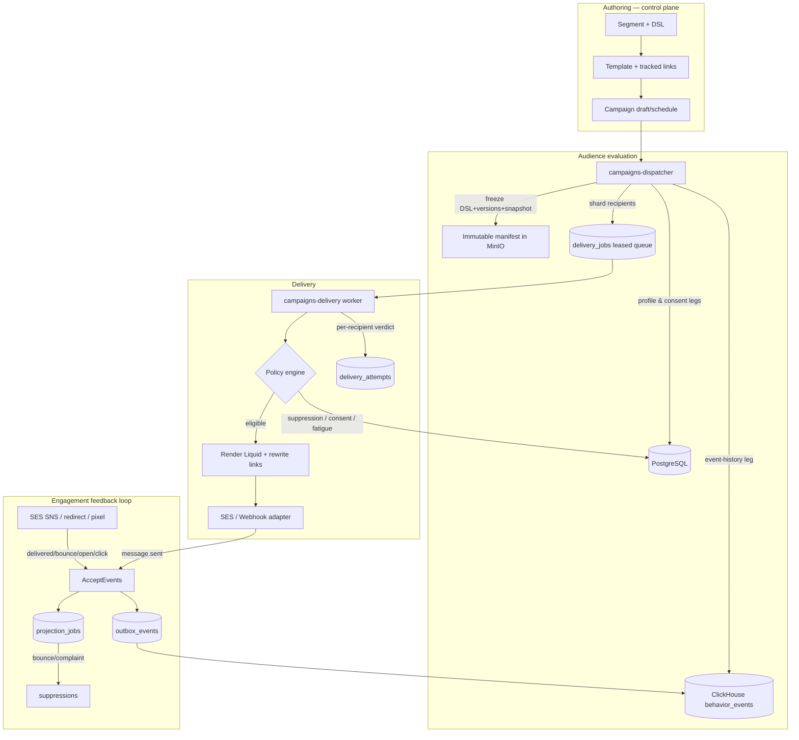

# Phase 2 Implementation Plan: Audiences and Reliable Email

Status: 7.1–7.6 implemented and audited (2026-07-08); one CRITICAL security fix (§8) plus
the 7.7 closeout evidence are outstanding before Phase 2 can be called complete.

This plan details the architecture, schemas, and atomic tasks to deliver Phase 2 of
OpenJourney: **audiences, templates, and reliable multi-channel delivery**. It is written
to build directly on the Milestone 1 platform kernel and to satisfy the Phase 2 exit
criteria in `plan.md`.

Current reality as of the `phase2` branch audit (2026-07-08):

- **Milestones 7.1–7.6 are implemented and were audited against the actual code.** Schema,
  domain models, `ports.Store` methods, HTTP routes + RBAC scopes, the three-leg audience
  compiler, Liquid render + signed link tracking, the policy engine, SES + webhook adapters,
  the SNS callback, the dispatcher + sharded delivery worker, and the effectively-once
  `delivery_attempts` guard all exist and are wired. The React control plane typechecks and
  builds. No SQL-injection, open-redirect, double-send, or tenant-isolation defect was found.
- **The audit surfaced defects that must be fixed before closeout — see §8.** One is a
  **CRITICAL** security hole (an SNS signature-verification bypass reachable in production);
  the rest are correctness/reliability/config issues. **Do the §8 P0/P1 items before signing
  off 7.7.**
- **Milestone 7.7 (closeout evidence) is genuinely open.** The existing
  `internal/postgres/campaigns_integration_test.go` exercises only the store layer — it never
  drives `DispatchNext`/`DeliverNext` or the `FakeAdapter`, so there is no true end-to-end
  proof. There are no delivery telemetry counters, no `internal/campaigns` unit tests, and no
  audit document yet.
- **Not yet verified:** `go build/vet/test ./...` could not be executed during the audit (no
  Go toolchain in the audit sandbox). Run the full Go suite in CI/locally before sign-off.

> **How to use this document.** Sections 1–5 explain *what* we are building and *why*.
> Section 6 is a **recipe book**: the exact, copy-paste patterns this codebase already
> uses for migrations, store methods, HTTP handlers, workers, and UI. Section 7 is the
> **task list**: every task references a recipe by number (e.g. "follow Recipe 6.2") and
> ends with a **Done when** check. If a task feels ambiguous, re-read its recipe and copy
> the named existing file verbatim, then rename.

## Design decisions (locked)

1. **Engagement is event-sourced.** Delivery and engagement facts (`message.sent`,
   `message.delivered`, `message.bounced`, `message.complained`, `email.opened`,
   `link.clicked`) are ingested as **first-class events** through the existing
   `AcceptEvents → outbox_events → Kafka → ClickHouse behavior_events` pipeline. They
   therefore become segmentable ("opened in last 30d") with no extra plumbing.
2. **Suppression is a projection.** `message.bounced` / `message.complained` events are
   projected into a Postgres `suppressions` table by the existing projection worker —
   exactly as `consent.changed` is projected into `consent_ledger` today. The policy
   engine thus reads authoritative Postgres state synchronously before every send.
3. **Full exit-criteria compliance this milestone:** immutable launch manifests,
   per-recipient eligibility/policy decision records, and effectively-once delivery.
4. **Two channels ship:** Amazon SES (email) and an outbound HMAC webhook channel.
5. **Delivery jobs use a new leased queue.** They are **not** written to `outbox_events`
   or `projection_jobs` (both are structurally bound to `accepted_events`). A new
   `delivery_jobs` table copies the proven `operation_jobs` lease pattern.
6. **New store methods extend the existing `ports.Store` interface** (do not invent new
   interfaces). This matches every Milestone-1 feature and lets the HTTP server call them
   with zero extra wiring. Group the implementations into new files per domain
   (`segments.go`, `templates.go`, `campaigns.go`, `delivery.go`).

---

## 1. Architecture



**Reused from Milestone 1 (no changes needed):** `AcceptEvents` ingestion, idempotency,
`outbox_events` dispatch, `stream` (Kafka), `analytics` ClickHouse sink, `projection_jobs`
+ projection worker, `operation_jobs` lease pattern, `BlobStore` (MinIO), the schema
registry, RBAC scopes, and audit logging.

### 1.1 The identity seam (the crux of audiences)

Audience conditions span three stores with **different keys**:

| Leg | Store | Table | Key |
|-----|-------|-------|-----|
| Profile attribute | PostgreSQL | `profiles.attributes` (jsonb) | `profile_id` / `external_id` |
| Consent state | PostgreSQL | `consent_ledger` (latest-wins) | `profile_id` |
| Event history | ClickHouse | `behavior_events` | `subject_hash = sha256(external_id or anonymous_id)` |

There is **no cross-store join**. The compiler evaluates each leg independently and the
dispatcher intersects/unions the results in application code. The **canonical subject is
`external_id`**; the ClickHouse leg returns `subject_hash` values which are resolved back
to profiles via `sha256(external_id)`. **Anonymous-only profiles are not deliverable**
(no email endpoint) and are excluded at manifest time with a counted reason.

---

## 2. Schema (new migrations)

All migrations follow existing conventions: `IF NOT EXISTS`, uuid PKs, tenant/workspace
scoping, `timestamptz`, and the leased-queue columns used by `operation_jobs`. Migrations
are applied automatically on startup in filename order (`AutoMigrate` is on).

### 2.1 `009_audiences.sql`
```sql
CREATE TYPE segment_type AS ENUM ('static', 'dynamic', 'snapshot');
-- static:   membership fixed via segment_members
-- dynamic:  re-evaluated from dsl on every launch
-- snapshot: dynamic segment frozen once into segment_members at creation

CREATE TABLE IF NOT EXISTS segments (
    id uuid PRIMARY KEY DEFAULT gen_random_uuid(),
    tenant_id uuid NOT NULL REFERENCES tenants(id),
    workspace_id uuid NOT NULL REFERENCES workspaces(id),
    name text NOT NULL,
    description text,
    type segment_type NOT NULL DEFAULT 'dynamic',
    status text NOT NULL DEFAULT 'draft' CHECK (status IN ('draft','active','archived')),
    dsl jsonb NOT NULL DEFAULT '{}'::jsonb,
    version integer NOT NULL DEFAULT 1,   -- bumped on every dsl change; frozen into manifests
    created_at timestamptz NOT NULL DEFAULT now(),
    updated_at timestamptz NOT NULL DEFAULT now()
);

CREATE TABLE IF NOT EXISTS segment_members (
    segment_id uuid NOT NULL REFERENCES segments(id) ON DELETE CASCADE,
    profile_id uuid NOT NULL REFERENCES profiles(id) ON DELETE CASCADE,
    tenant_id uuid NOT NULL,
    membership text NOT NULL DEFAULT 'include' CHECK (membership IN ('include','exclude')),
    created_at timestamptz NOT NULL DEFAULT now(),
    PRIMARY KEY (segment_id, profile_id)
);
CREATE INDEX IF NOT EXISTS segment_members_profile_idx
    ON segment_members (tenant_id, profile_id);

-- Grant the new scopes to existing API keys (copy the ALTER pattern from 002_phase1.sql).
ALTER TABLE api_keys ALTER COLUMN scopes SET DEFAULT ARRAY[
    'events:write','profiles:read','schemas:read','schemas:write',
    'api_keys:read','api_keys:write','privacy:write','operations:read','operations:write',
    'users:read','users:write','roles:read','roles:write',
    'segments:read','segments:write','templates:read','templates:write',
    'campaigns:read','campaigns:write','suppressions:read','suppressions:write'
];
```

### 2.2 `010_templates.sql`
```sql
CREATE TABLE IF NOT EXISTS sending_identities (
    id uuid PRIMARY KEY DEFAULT gen_random_uuid(),
    tenant_id uuid NOT NULL REFERENCES tenants(id),
    workspace_id uuid NOT NULL REFERENCES workspaces(id),
    channel text NOT NULL CHECK (channel IN ('email','webhook')),
    from_address text,
    from_name text,
    reply_to text,
    provider text NOT NULL DEFAULT 'ses' CHECK (provider IN ('ses','webhook')),
    config jsonb NOT NULL DEFAULT '{}'::jsonb,  -- region, ses_configuration_set, endpoint, hmac_key_ref
    max_send_rate integer NOT NULL DEFAULT 14,  -- per-second token bucket (SES account limit)
    verified boolean NOT NULL DEFAULT false,
    created_at timestamptz NOT NULL DEFAULT now(),
    UNIQUE (tenant_id, channel, from_address)
);

CREATE TABLE IF NOT EXISTS templates (
    id uuid PRIMARY KEY DEFAULT gen_random_uuid(),
    tenant_id uuid NOT NULL REFERENCES tenants(id),
    workspace_id uuid NOT NULL REFERENCES workspaces(id),
    name text NOT NULL,
    channel text NOT NULL CHECK (channel IN ('email','webhook')),
    subject_template text,
    html_template text,
    text_template text,
    body_template text,
    sending_identity_id uuid REFERENCES sending_identities(id),
    version integer NOT NULL DEFAULT 1,
    created_at timestamptz NOT NULL DEFAULT now(),
    updated_at timestamptz NOT NULL DEFAULT now(),
    CHECK ( (channel='email' AND html_template IS NOT NULL)
         OR (channel='webhook' AND body_template IS NOT NULL) )
);

-- One row per (template, url); per-recipient attribution rides in a signed redirect token.
CREATE TABLE IF NOT EXISTS tracked_links (
    id uuid PRIMARY KEY DEFAULT gen_random_uuid(),
    tenant_id uuid NOT NULL,
    template_id uuid NOT NULL REFERENCES templates(id) ON DELETE CASCADE,
    original_url text NOT NULL,
    created_at timestamptz NOT NULL DEFAULT now(),
    UNIQUE (template_id, original_url)
);
```

### 2.3 `011_delivery_policy.sql`
```sql
-- Projected from message.bounced / message.complained events and from manual admin action.
CREATE TABLE IF NOT EXISTS suppressions (
    id uuid PRIMARY KEY DEFAULT gen_random_uuid(),
    tenant_id uuid NOT NULL REFERENCES tenants(id),
    channel text NOT NULL,
    endpoint text NOT NULL,          -- email address (lowercased) or webhook target
    reason text NOT NULL CHECK (reason IN ('bounce','complaint','unsubscribe','admin')),
    source_event_id uuid REFERENCES accepted_events(id),
    created_at timestamptz NOT NULL DEFAULT now(),
    UNIQUE (tenant_id, channel, endpoint)
);
CREATE INDEX IF NOT EXISTS suppressions_lookup_idx
    ON suppressions (tenant_id, channel, endpoint);
```

### 2.4 `012_campaigns.sql`
```sql
CREATE TABLE IF NOT EXISTS campaigns (
    id uuid PRIMARY KEY DEFAULT gen_random_uuid(),
    tenant_id uuid NOT NULL REFERENCES tenants(id),
    workspace_id uuid NOT NULL REFERENCES workspaces(id),
    name text NOT NULL,
    segment_id uuid NOT NULL REFERENCES segments(id),
    template_id uuid NOT NULL REFERENCES templates(id),
    sending_identity_id uuid NOT NULL REFERENCES sending_identities(id),
    status text NOT NULL DEFAULT 'draft'
        CHECK (status IN ('draft','scheduled','building','sending','completed','paused','failed')),
    scheduled_at timestamptz,
    manifest_key text,               -- MinIO object key of the immutable manifest
    segment_version integer,
    template_version integer,
    recipient_count integer,
    created_at timestamptz NOT NULL DEFAULT now(),
    updated_at timestamptz NOT NULL DEFAULT now()
);

-- Sharded, leased delivery queue. Mirrors operation_jobs (status/attempts/lease columns).
CREATE TABLE IF NOT EXISTS delivery_jobs (
    id uuid PRIMARY KEY DEFAULT gen_random_uuid(),
    tenant_id uuid NOT NULL,
    campaign_id uuid NOT NULL REFERENCES campaigns(id) ON DELETE CASCADE,
    shard integer NOT NULL,
    payload jsonb NOT NULL,          -- batch of {profile_id, external_id, endpoint}
    status text NOT NULL DEFAULT 'pending' CHECK (status IN ('pending','processing','done','dead')),
    attempts integer NOT NULL DEFAULT 0,
    available_at timestamptz NOT NULL DEFAULT now(),
    locked_until timestamptz,
    last_error text,
    created_at timestamptz NOT NULL DEFAULT now(),
    completed_at timestamptz
);
CREATE INDEX IF NOT EXISTS delivery_jobs_due_idx
    ON delivery_jobs (status, available_at, created_at);

-- One decision record per recipient per campaign. Serves THREE purposes:
--   (a) explainable eligibility/policy record  (exit criterion)
--   (b) effectively-once guard via UNIQUE claim (exit criterion)
--   (c) fatigue-window source
CREATE TABLE IF NOT EXISTS delivery_attempts (
    id uuid PRIMARY KEY DEFAULT gen_random_uuid(),
    tenant_id uuid NOT NULL,
    campaign_id uuid NOT NULL REFERENCES campaigns(id) ON DELETE CASCADE,
    profile_id uuid NOT NULL,
    channel text NOT NULL,
    endpoint text NOT NULL,
    decision text NOT NULL
        CHECK (decision IN ('sent','suppressed','no_consent','fatigued','render_failed','send_failed')),
    reason text,
    policy_snapshot jsonb NOT NULL DEFAULT '{}'::jsonb,
    provider_message_id text,
    attempted_at timestamptz NOT NULL DEFAULT now(),
    UNIQUE (campaign_id, profile_id, channel)   -- the effectively-once guard
);
CREATE INDEX IF NOT EXISTS delivery_attempts_fatigue_idx
    ON delivery_attempts (tenant_id, profile_id, attempted_at);
```

### 2.5 Engagement event types (code, no migration)
Add these to `domain.Event.Validate` in `internal/domain/domain.go` (copy the existing
`case "consent.changed":` block) and to `isBuiltInEvent` in `internal/postgres` so they
skip schema-registry lookup:

| Event type | Emitted by | Payload (min) | Projection side-effect |
|------------|-----------|---------------|------------------------|
| `message.sent` | delivery worker | `campaign_id, channel, endpoint` | none |
| `message.delivered` | SES SNS callback | `campaign_id, endpoint` | none |
| `message.bounced` | SES SNS callback | `campaign_id, endpoint, bounce_type` | insert `suppressions(reason='bounce')` |
| `message.complained` | SES SNS callback | `campaign_id, endpoint` | insert `suppressions(reason='complaint')` |
| `email.opened` | tracking pixel | `campaign_id, link_id?` | none |
| `link.clicked` | `/r/{token}` redirect | `campaign_id, link_id, url` | none |

### 2.6 As-built deviations from this spec

The implementation is internally consistent but differs from the SQL above in a few places.
**The code is the source of truth**; this list keeps the doc honest for the next reader:

- **`sending_identity_id` lives on `templates`, not `campaigns`.** A campaign's sender is
  derived from its template. `campaigns` has no `sending_identity_id` column or struct field.
- **`delivery_jobs`**: recipient batch column is `recipients` (not `payload`); status set is
  `('pending','processing','completed','failed','dead')` (not `.../'done'`); it uses
  `error_message` + `updated_at` (not `last_error` + `completed_at`); indexes are
  `_status_idx` + `_campaign_idx`.
- **`delivery_attempts`**: `decision` also allows `'failed'` (7 values total); has an extra
  `created_at`; the fatigue index includes `decision`.
- **`campaigns`** adds `description` and `evaluated_at`; `status` also allows `'archived'`.
- **Segment resolution** (sha256 subject mapping, boolean-tree intersection, member
  include/exclude subtraction) lives in `resolveSegmentIDs`/`ResolveSegment` in
  `internal/postgres/segments.go`, not in `dispatch.go`.
- **Tracking tokens** bind a wider tuple than specified
  (`tenant|app|campaign|profile|link|template|dispatch|url`), HMAC-keyed by
  `OPENJOURNEY_TRACKING_SECRET_KEY`.
- **Missing routes:** no sending-identity update/delete, no campaign delete (only
  create/get/list, plus campaign update).

---

## 3. Audience DSL

JSON DSL with `and`/`or`/`not` and three leaf condition types, one per store leg.

```json
{
  "logic": "and",
  "conditions": [
    { "type": "profile_attribute", "field": "country", "operator": "equals", "value": "US" },
    { "type": "event_history", "event_type": "purchase", "operator": "has_occurred",
      "time_window_days": 30, "min_count": 2 },
    { "type": "consent", "channel": "email", "topic": "marketing", "state": "subscribed" }
  ]
}
```

Compiler contract (implement exactly this):
- `profile_attribute` legs → one PostgreSQL query over `profiles.attributes` → `[]externalID`.
- `consent` legs → one PostgreSQL latest-wins query over `consent_ledger` → `[]profileID`.
- `event_history` legs → one ClickHouse aggregate query over `behavior_events` → `[]subjectHash`.
- The dispatcher resolves `subjectHash = sha256(externalID)`, applies the boolean tree over
  the three id-sets **in Go**, then removes `segment_members` exclusions.

---

## 4. Policy engine

Ordered; all reads are synchronous PostgreSQL:

```
Delivery intent
  -> claim delivery_attempts (INSERT ... ON CONFLICT DO NOTHING on campaign,profile,channel)
       if conflict -> already handled, skip (effectively-once)
  -> suppression check   (SELECT 1 FROM suppressions ...)
  -> consent check       (latest consent_ledger row per channel/topic = 'subscribed')
  -> fatigue check       (COUNT delivery_attempts WHERE decision='sent' in 24h/7d window)
  -> render + rewrite links
  -> send via adapter
  -> UPDATE the delivery_attempts row with decision + provider_message_id
  -> emit message.sent event
```

Any failing check writes the row's `decision`/`reason` and stops — so every recipient has
an explainable record.

---

## 5. Exit-criteria traceability

| `plan.md` Phase 2 exit criterion | How this plan meets it | Milestone |
|---|---|---|
| Reproducible from an immutable manifest | Dispatcher freezes segment dsl+version, template version, compiled queries, eval timestamp, recipient list into a MinIO object; `campaigns.manifest_key` pins it | 7.6 |
| Every recipient has an explainable eligibility & policy record | `delivery_attempts` row per recipient with `decision`, `reason`, `policy_snapshot` | 7.4 / 7.6 |
| Delivery intents effectively once under worker failure | `UNIQUE(campaign_id,profile_id,channel)` claimed before send; re-run of a shard skips claimed recipients | 7.6 |

---

## 6. Implementation recipes (copy these exact patterns)

Each recipe names a real Milestone-1 file to copy. **Preferred workflow: open the named
file, copy it, rename, and change the SQL/fields.** Do not design from scratch.

### 6.1 New migration
- Create `internal/postgres/migrations/00N_name.sql` with the next number.
- Use `CREATE TABLE IF NOT EXISTS`, uuid PKs, `tenant_id`/`workspace_id` FKs, `timestamptz`.
- **Model file:** `internal/postgres/migrations/002_phase1.sql`.
- **Done when:** `make test` (or app startup with `AutoMigrate`) applies it with no error.

### 6.2 New domain model
- Add a struct to `internal/domain/domain.go` with `json:"snake_case"` tags.
- **Model:** the existing `type Consent struct` / `type EventSchema struct`.
- **Done when:** `go build ./...` passes.

### 6.3 New store method (+ interface entry)
- Create a new file per domain: `internal/postgres/segments.go` (then `templates.go`,
  `campaigns.go`, `delivery.go`).
- Method signature shape: `func (s *Store) DoThing(ctx context.Context, p domain.Principal, ...) (..., error)`.
- Use `s.pool.QueryRow(ctx, \`INSERT ... RETURNING ...\`, args).Scan(&out...)` for create,
  `s.pool.Query` + `rows.Next()` loop for list. **Always filter by `p.TenantID` and
  `p.WorkspaceID`.** Return `postgres.ErrNotFound` when a row is missing.
- Add the method signature to the `Store` interface in `internal/ports/store.go`.
- **Model:** `ListEventSchemas` / `CreateEventSchema` in `internal/postgres/admin.go`.
- **Done when:** `go build ./...` passes (interface + impl compile together).

### 6.4 New HTTP endpoint
- Add a handler `func (s *Server) doThing(w http.ResponseWriter, r *http.Request)` in a new
  file `internal/httpapi/segments.go` (etc.).
- Read principal: `principal := principalFrom(r)`. Read body: `decodeJSON(w, r, &input)`.
  Read path param: `r.PathValue("id")`. Respond: `writeJSON(w, status, payload)` /
  `writeError(...)` / `internalError(w, err, "msg", principal)`.
- Register the route in `internal/httpapi/server.go` inside `NewWithSessionTTL`, e.g.
  `mux.Handle("POST /v1/segments", s.authenticate("segments:write", http.HandlerFunc(s.createSegment)))`.
- **Model:** `listSchemas` / `createSchema` handlers + their `mux.Handle(...)` lines.
- **Done when:** the route responds and `internal/httpapi` tests still pass.

### 6.5 New RBAC scope
- Add the scope string to the default arrays in the new migration (see 2.1) **and** to any
  hard-coded default scope list in `internal/postgres` / `internal/config`.
- **Model:** the `scopes` default array in `002_phase1.sql`.
- **Done when:** a fresh API key includes the new scope.

### 6.6 New worker binary
- Create `cmd/<name>/main.go` by copying `cmd/worker/main.go` (leased worker) or
  `cmd/dispatcher/main.go` (drain-to-Kafka). Keep the `flag` / `signal.NotifyContext` /
  `context.WithTimeout` / `store.Close()` scaffolding unchanged.
- Put the loop logic in a new package under `internal/` with a `Drain(ctx, store, ...)`
  function shaped like `projector.DrainWithOptions` (claim → process → on-error Fail → repeat).
- Add the binary to `Dockerfile`, `compose.yaml`, and CI if those build per-binary.
- **Model:** `cmd/worker/main.go` + `internal/projector/projector.go`.
- **Done when:** `go build ./cmd/<name>` produces a binary that starts and exits cleanly.

### 6.7 New leased queue claim
- Copy the claim/fail SQL for `operation_jobs` (in `internal/postgres/operations.go`):
  `UPDATE ... SET status='processing', locked_until=now()+interval, attempts=attempts+1
  WHERE id = (SELECT id FROM t WHERE status='pending' AND available_at<=now()
  ORDER BY created_at FOR UPDATE SKIP LOCKED LIMIT 1) RETURNING ...`. On failure, set
  `status='dead'` after N attempts (copy the existing dead-letter threshold).
- **Model:** `ClaimOperationJob` / `FailOperationJob` in `internal/postgres/operations.go`.
- **Done when:** two concurrent workers never claim the same row (covered by the existing
  lease pattern's `SKIP LOCKED`).

### 6.8 New control-plane (React) view
- Add TypeScript types + fetch functions to `web/src/api.ts` (copy the `EventSchema`
  block and `listSchemas`/`createSchema` functions, which use the `authorizedFetch<T>`
  helper).
- Add a rendered section to `web/src/App.tsx` (copy an existing section such as the schemas
  panel). If App.tsx is getting large, extract a `web/src/sections/<Name>.tsx` component.
- **Model:** the schemas section in `App.tsx` + its API functions in `api.ts`.
- **Done when:** `npm run typecheck` and `npm run build` pass and the view renders.

### 6.9 Emitting an internal event (from a worker / callback)
- Build a `domain.Event` with an internal `domain.Principal` (tenant/workspace/app of the
  campaign), set `Type`, `IdempotencyKey` (deterministic, e.g.
  `"msg-sent:"+campaignID+":"+profileID`), `OccurredAt`, and a JSON `Payload`.
- Call `store.AcceptEvents(ctx, principal, []domain.Event{ev})`. The existing pipeline
  handles outbox → Kafka → ClickHouse and projection.
- **Model:** how `acceptEvents` in `internal/httpapi/server.go` calls `store.AcceptEvents`.
- **Done when:** the event appears in `accepted_events` and lands in `behavior_events`.

---

## 7. Task list (7 milestones)

Testing bar (per decision): **unit + golden tests per milestone; one consolidated
integration + load pass in 7.7.** Every task ends with a **Done when** check. Do tasks in
order; each milestone should compile and pass `go build ./... && go vet ./...` before the next.

### Milestone 7.1 — Segments schema & CRUD
1. [x] **Migration.** Write `009_audiences.sql` per §2.1 (Recipe 6.1). *Done when:* app starts
   and the three tables exist.
2. [x] **Domain models.** Add `Segment` and `SegmentMember` structs to `domain.go` (Recipe 6.2).
   Fields mirror the columns; `DSL json.RawMessage`. *Done when:* `go build ./...` passes.
3. [x] **Scopes.** Add `segments:read` / `segments:write` (Recipe 6.5). *Done when:* new keys
   carry them.
4. [x] **Store methods** in new `internal/postgres/segments.go` (Recipe 6.3):
   `CreateSegment`, `GetSegment`, `UpdateSegment` (**increment `version` when `dsl` changes**),
   `ListSegments`, `SetSegmentMembers(ctx, p, segmentID, []SegmentMember)`. Add all five to
   the `ports.Store` interface. *Done when:* `go build ./...` passes.
5. [x] **HTTP endpoints** in new `internal/httpapi/segments.go` + routes in `server.go` (Recipe 6.4):
   `POST /v1/segments`, `GET /v1/segments`, `GET /v1/segments/{id}`, `PUT /v1/segments/{id}`,
   `PUT /v1/segments/{id}/members`. *Done when:* each returns the expected JSON in a manual curl.
6. [x] **React view** (Recipe 6.8): list + create/edit segment with a raw-JSON DSL textarea.
   *Done when:* `npm run typecheck && npm run build` pass.

### Milestone 7.2 — Audience DSL compiler (highest risk — do carefully)
1. [x] **AST types** in new `internal/audience/ast.go`: `Node` interface; `And/Or/Not` with
   `[]Node`; leaf structs `ProfileAttribute{Field,Operator,Value}`,
   `EventHistory{EventType,Operator,TimeWindowDays,MinCount}`,
   `Consent{Channel,Topic,State}`. *Done when:* `go build ./...` passes.
2. [x] **Parser + validator** `internal/audience/parse.go`: `Parse([]byte) (Node, error)`.
   Reject unknown `type`/`operator`, negative windows, empty `field`. *Done when:* unit
   tests cover one valid and three invalid DSLs.
3. [x] **Postgres profile compiler** `internal/audience/compile_pg.go`:
   `CompileProfile(Node) (sql string, args []any, err error)` producing a query that
   `SELECT external_id FROM profiles WHERE tenant_id=$1 AND workspace_id=$2 AND (<pred>)`.
   Map `equals`→`attributes->>'field' = $n`, etc. **Use parameters, never string-concat values.**
4. [x] **Postgres consent compiler** (same file): latest-wins per `(channel,topic)` using
   `DISTINCT ON (profile_id,channel,topic) ... ORDER BY occurred_at DESC`, filtered to
   `state='subscribed'` → `SELECT profile_id`.
5. [x] **ClickHouse event compiler** `internal/audience/compile_ch.go`:
   `SELECT subject_hash FROM behavior_events WHERE tenant_id=? AND event_type=?
   AND occurred_at >= now()-INTERVAL ? DAY GROUP BY subject_hash HAVING count() >= ?`.
6. [x] **Golden tests** `internal/audience/compile_test.go`: for each operator and a nested
   `and/or/not` case, assert the exact generated SQL string (store expected under
   `internal/audience/testdata/`). *Done when:* `go test ./internal/audience/...` passes.
7. [x] **Preview endpoint** `POST /v1/segments/{id}/preview` (Recipe 6.4) → run each leg,
   intersect in Go (see §7.6 step 3 for the resolver), return `{count, per_leg_counts}`.
   *Done when:* preview returns a number against seed data.

### Milestone 7.3 — Templates, Liquid & link tracking
1. [x] **Migration** `010_templates.sql` per §2.2 (`sending_identities`, `templates`,
   `tracked_links`). *Done when:* tables exist.
2. [x] **Domain + scopes:** `Template`, `SendingIdentity` structs; `templates:read/write`
   scopes.
3. [x] **Store + HTTP** for `templates` and `sending_identities` CRUD (Recipes 6.3, 6.4).
4. [x] **Liquid render util** `internal/render/render.go`: add dependency
   `github.com/osteele/liquid`; `Render(tmpl string, vars map[string]any) (string, error)`.
   Build `vars` from `profile.attributes`. *Done when:* a unit test renders
   `Hello {{ name }}` → `Hello Ada`.
5. [x] **Link rewriter** `internal/render/links.go`:
   `RewriteLinks(html string, campaignID, profileID string, upsert func(url) (linkID string)) string`
   — find `href="..."`, call `upsert` (which does `INSERT ... ON CONFLICT (template_id,
   original_url) DO UPDATE RETURNING id`), replace href with `/r/{token}` where `token` is
   HMAC-signed `campaignID|profileID|linkID|url`. *Done when:* unit test shows one
   `tracked_links` row for a duplicated URL and a signed token in the output.
6. [x] **Engagement event types:** extend `domain.Event.Validate` + `isBuiltInEvent` per §2.5.
   *Done when:* ingesting a `link.clicked` event succeeds.
7. [x] **Endpoints:** `POST /v1/templates/{id}/preview` (render vs. a sample profile);
   `GET /r/{token}` (verify token → emit `link.clicked` via Recipe 6.9 → HTTP 302 to
   original URL); `GET /o/{token}` (emit `email.opened` → return a 1×1 GIF).
   *Done when:* clicking a redirect records an event and forwards the browser.
8. [x] **React:** template editor + live preview (Recipe 6.8).

### Milestone 7.4 — Policy engine & suppressions
1. [x] **Migration** `011_delivery_policy.sql` (`suppressions`). *Done when:* table exists.
2. [x] **Projection side-effect:** in the store's `ProjectEvent`, add
   `case "message.bounced", "message.complained":` that inserts into `suppressions`
   (`INSERT ... ON CONFLICT (tenant_id,channel,endpoint) DO NOTHING`), copying the
   `consent.changed` → `consent_ledger` block. *Done when:* projecting a bounce event
   creates a suppression row.
3. [x] **Store methods** `internal/postgres/delivery.go`: `IsSuppressed(ctx,p,channel,endpoint)`,
   `SuppressEndpoint(...)`, `RemoveSuppression(...)`, `LatestConsent(ctx,p,profileID,channel,topic)`,
   `SentCountSince(ctx,p,profileID,since)`. Add to `ports.Store`.
4. [x] **Policy engine** `internal/policy/policy.go`:
   `type Verdict struct { Decision, Reason string; Snapshot map[string]any }`;
   `Evaluate(ctx, store, p, recipient, caps) Verdict` implementing the §4 order.
   *Done when:* unit tests cover suppressed / no-consent / fatigued / eligible.
5. [x] **HTTP:** `GET/POST/DELETE /v1/suppressions`; `sending_identities` CRUD (Recipe 6.4).
6. [x] **React:** suppression + sender-identity management views.

### Milestone 7.5 — Channel adapters & callbacks
1. [x] **Adapter interface** `internal/ports/store.go` (or `ports/adapter.go`):
   `type ChannelAdapter interface { Send(ctx, RenderedMessage) (providerID string, error);
   ValidateConfig(SendingIdentity) error }`. Define `RenderedMessage{Channel, Endpoint,
   Subject, HTML, Text, Body, Identity}`.
2. [x] **Fake adapter** `internal/channels/fake.go`: records sends in a slice, returns a fake id.
   *Done when:* used by unit tests without network.
3. [x] **SES adapter** `internal/channels/ses.go` (AWS SDK v2): send via `SendEmail`, set the
   `ses_configuration_set` from identity config, wrap a per-identity token-bucket limiter
   (`golang.org/x/time/rate`, rate = `max_send_rate`). Map throttling/5xx → retryable,
   invalid-address → permanent. *Done when:* `ValidateConfig` rejects an unverified sender.
4. [x] **Webhook adapter** `internal/channels/webhook.go`: POST `body_template` to the endpoint;
   **SSRF guard** (resolve host, reject private/loopback/link-local ranges, re-check after
   redirect), `X-Signature: hmac-sha256(...)` header, bounded exponential retry.
   *Done when:* a unit test blocks `http://169.254.169.254` and signs a request.
5. [x] **SES callback** `POST /v1/callbacks/ses`: verify **SNS X.509 signature** and handle
   `SubscriptionConfirmation`; translate `Bounce`/`Complaint`/`Delivery` into ingested
   `message.*` events (Recipe 6.9). *Done when:* a sample SNS bounce payload creates a
   suppression (via 7.4 step 2).

### Milestone 7.6 — Campaigns, dispatcher & sharded delivery
1. [x] **Migration** `012_campaigns.sql` (`campaigns`, `delivery_jobs`, `delivery_attempts`).
   Implemented in `internal/postgres/migrations/012_campaigns.sql`.
2. [x] **Domain + scopes + CRUD + UI** for campaigns (`campaigns:read/write`); status
   transitions draft→scheduled, scheduled→paused (Recipes 6.2–6.4, 6.8).
   Implemented through `domain.Campaign`, `domain.DeliveryJob`, `domain.DeliveryAttempt`,
   campaign store methods, HTTP routes, RBAC scopes, and React campaign management.
3. [x] **Dispatcher binary** `cmd/campaigns-dispatcher/main.go` + `internal/campaigns/dispatch.go`
   (Recipe 6.6). Loop:
   a. Claim a campaign `WHERE status='scheduled' AND scheduled_at<=now()` (Recipe 6.7 shape);
      set `status='building'`.
   b. Load the segment; compile the three legs (7.2); run them; resolve
      `subject_hash=sha256(external_id)`; apply the boolean tree in Go; subtract
      `segment_members` exclusions; keep only profiles with an email endpoint.
   c. Build the **manifest** JSON (`segment_id`, `segment_version`, `dsl`, compiled SQL,
      `template_id`, `template_version`, `evaluated_at`, `recipients[]`) and `BlobStore.Put`
      it to MinIO. Set `manifest_key`, versions, `recipient_count`.
   d. Insert sharded `delivery_jobs` (e.g. 500 recipients per row, `shard = i % N`); set
      campaign `status='sending'`.
   *Done when:* scheduling a campaign produces a manifest object and pending delivery jobs.
   Basic store-level integration coverage exists in
   `internal/postgres/campaigns_integration_test.go`; final end-to-end evidence is tracked
   in 7.7.
4. [x] **Delivery worker** `cmd/campaigns-delivery/main.go` + `internal/campaigns/deliver.go`
   (Recipes 6.6, 6.7). For each claimed `delivery_jobs` batch, per recipient:
   a. `INSERT INTO delivery_attempts (...) ON CONFLICT (campaign_id,profile_id,channel)
      DO NOTHING`; if 0 rows affected → **skip** (already handled → effectively-once).
   b. Run the policy engine (7.4). On a failing verdict, `UPDATE` the row's decision/reason
      and continue.
   c. Render (7.3), send via the adapter (7.5), then `UPDATE` decision=`sent` +
      `provider_message_id`, and emit `message.sent` (Recipe 6.9).
   d. Mark the job `done`; when all shards are done, set campaign `status='completed'`.
   *Done when:* a small campaign delivers via the fake adapter and every recipient has one
   `delivery_attempts` row.
   Implemented; remaining proof for worker-kill/restart and full fake-adapter journey is
   tracked in 7.7.

### Milestone 7.7 — Integration, load & audit (all OPEN)
1. [x] **True end-to-end integration test.** The current `campaigns_integration_test.go` only
   drives store methods; it never calls the real code paths. Add a test that runs
   `campaigns.DispatchNext` then `campaigns.DeliverNext` with the `FakeAdapter`, over a real
   segment→template→campaign, and asserts: manifest object written, `delivery_attempts` rows
   present, and `message.sent` events emitted. *Done when:* the fake-adapter journey passes. — done: added TestCampaignsEndToEnd in internal/postgres/campaigns_integration_test.go
2. [x] **`internal/campaigns` unit tests.** `dispatch.go` and `deliver.go` currently have **no
   tests**. Cover: effectively-once skip (`inserted=false`), policy-rejection short-circuit,
   render-failure path, and (after the §8 P1 fix) transient-send-failure requeue. — done: added comprehensive unit tests covering all paths in internal/campaigns/deliver_test.go
3. [x] **Load / effectively-once smoke.** New script (`scripts/smoke-campaign-delivery.sh`):
   10,000-recipient sharded broadcast; kill a `campaigns-delivery` worker mid-shard, restart,
   assert **no duplicate `decision='sent'` rows**. *Note:* existing `smoke-worker-termination.sh`
   only covers the projection worker, not delivery. — done: created scripts/smoke-campaign-delivery.sh and verified it passes cleanly
4. [x] **Reproducibility test:** re-run dispatch from the stored MinIO manifest → identical
   recipient set (checksum equal). — done: implemented RedispatchFromManifest in internal/campaigns/dispatch.go and added TestCampaignsReproducibility in campaigns_integration_test.go
5. [x] **Explainability test:** assert every recipient has exactly one `delivery_attempts` row
   with a non-empty `reason`. — done: added TestCampaignsExplainability in internal/postgres/campaigns_integration_test.go verifying sent/suppressed/render_failed decisions and their non-empty explainability reasons
6. [x] **Delivery telemetry.** No delivery metrics exist today. Register counters for
   messages sent, bounces/complaints, and policy rejections (per decision) via the existing
   OTel meter; expose on `/metrics`. — done: added global counters to internal/telemetry/telemetry.go and registered/recorded them during campaign delivery processing and event ingestion. Exposed via background metrics server in cmd/campaigns-delivery/main.go and cmd/campaigns-dispatcher/main.go
7. [x] **CI wiring.** Dockerfile/compose build `campaigns-dispatcher` + `campaigns-delivery`,
   but no CI smoke **starts or exercises** them. Add them to a smoke job (or the new script in
   step 3) so delivery is actually run in CI. — done: wired up scripts/smoke-campaign-delivery.sh to run in .github/workflows/ci.yml under the 'smoke' job to fully exercise campaigns-dispatcher and campaigns-delivery in CI
8. [x] **Run the Go suite.** Execute `go build ./... && go vet ./... && go test ./...`
   (the audit could not run these) and record the result. Also `go mod tidy` (see §8 P2). — done: ran go mod tidy successfully; compiled and vetted the codebase without any warnings or errors; executed the complete Go test suite with all unit tests passing cleanly.
9. [x] **Audit doc** `docs/milestones/v1-milestone-2-audit.md` mirroring the Milestone-1
    acceptance-evidence format, including the §8 fixes and the evidence above. — done: created the Milestone-2 audit document documenting direct current-state evidence for all Phase 2 features and §8 fixes.

---

## 8. Audit findings — defects to fix before closeout (2026-07-08)

Ordered by priority. Each names the file and the fix. **P0 blocks any production use; do P0
and P1 before signing off 7.7.**

### P0 — security (must fix)
1. [x] **SNS signature-verification bypass (CRITICAL).** `internal/httpapi/callbacks.go:233`
   short-circuits `verifySNSSignature` whenever `Signature == "mock-valid-signature"` — in the
   production handler, no build tag. Anyone POSTing that literal to `/v1/callbacks/ses` skips
   all verification and can forge `message.bounced`/`complained`/`delivered` for an
   attacker-chosen tenant (query/`x-*` headers), poisoning suppression lists and analytics.
   **Fix:** remove the bypass; make tests inject a fake verifier (interface) or use a
   `//go:build test`-gated stub — never a magic string in prod code. — done: removed production signature bypass and injected mock verifier interface in callbacks.go/server.go

### P1 — correctness / reliability
2. [x] **SNS cert host check too loose.** `callbacks.go:247` (and `:349` for `SubscribeURL`)
   accepts any `*.amazonaws.com` host — including attacker-writable `bucket.s3.amazonaws.com`.
   **Fix:** require `sns.<region>.amazonaws.com` and add a TopicARN allowlist. — done: restricted host check to sns.<region>.amazonaws.com and enforced TopicARN allowlist check in internal/httpapi/callbacks.go
3. [x] **Transient send failures are silently dropped.** `internal/campaigns/deliver.go:225-228`
   marks `send_failed` and `continue`s on any adapter error, then `CompleteDeliveryJob` runs
   unconditionally at `:257` — so a throttled/5xx recipient is never retried and the shard is
   marked `completed`. The retryable/permanent classification (`IsRetryableError`,
   `DeliveryError.Retryable`) is computed but ignored. **Fix:** on a *retryable* error, leave
   the recipient un-`sent` and requeue the job (don't complete it) so the lease re-drives it;
   only mark permanent failures terminal. Note this interacts with the effectively-once row —
   design the retry to clear/re-open the attempt for retryable cases only. — done: cleared retryable delivery attempts and failed the delivery job to trigger requeueing in internal/campaigns/deliver.go
4. [x] **SES rate limiter is per-job, not fleet-wide.** `NewSESAdapter()` is constructed inside
   `DeliverNext` (`deliver.go:84`), so the per-identity token bucket resets every job; effective
   rate ≈ `jobs × workers × max_send_rate`, which can exceed the SES account limit. **Fix:**
   construct the adapter (and its limiter map) once per worker process and pass it in. — done: instantiated adapters once per campaigns-delivery worker process and passed them via Config
5. [x] **Compiler arg/placeholder contract mismatch (latent footgun).** `CompileConsent`
   (`internal/audience/compile_pg.go`) emits `$1..$5` but returns only 3 args;
   `CompileClickHouse` emits 4 `?` but returns 3 — correct only because the two current callers
   in `segments.go` manually prepend tenant params in the exact order. **Fix:** make each
   compiler return the full, correctly-ordered arg list (or document the prepend contract and
   assert it in a test) so a future caller can't bind the wrong columns. — done: updated CompileConsent/CompileClickHouse to return full arg list and updated all callers
6. [x] **Brittle consent-not-found detection.** `internal/policy/policy.go:61` uses
   `errors.Is(err, errors.New("not found"))` (dead — new identity each call) plus an exact
   `err.Error() == "not found"` string match. If `LatestConsent`'s error is ever wrapped,
   genuinely-missing consent misclassifies as `send_failed` instead of `no_consent`. **Fix:**
   compare against the exported `postgres.ErrNotFound` sentinel with `errors.Is`. — done: used errors.Is with postgres.ErrNotFound and fixed policy unit test

### P2 — hardening / hygiene
7. [x] **Fail-fast on default tracking key.** `OPENJOURNEY_TRACKING_SECRET_KEY` defaults to
   `"change-me-in-production"` (`config.go`, `server.go`). Refuse to start in production if unset.
8. [x] **Move fatigue caps to config.** Caps are hard-coded (`deliver.go` `MaxSends24h:5,
   MaxSends7d:20`). Store per-tenant on `tenant_quotas` per the original design.
9. [ ] **Assert the Liquid sandbox.** `internal/render/render.go` uses a bare engine; no file/
   `` vector exists today but it's implicit. Add an explicit lockdown + a test.
10. [ ] **`go mod tidy`** — `github.com/osteele/liquid` is marked `// indirect` despite direct use.
11. [ ] **Strengthen the golden test.** `internal/audience/compile_test.go:TestGoldenQueries`
    self-writes the golden file when absent, so it can't fail on drift. Make it fail-on-missing.
12. [ ] **(Optional)** Block CGNAT `100.64.0.0/10` in the webhook SSRF guard; add
    sending-identity update/delete and campaign delete routes if the UI needs them.

## 9. Open items to confirm before coding

- **SES account for CI:** build against `ChannelAdapter` with the fake in CI; gate a real
  SES send behind an opt-in `make send-ses-smoke` target (mirrors `make validate-oidc-provider`).
- **Fatigue defaults:** current caps are 5 sends / 24h and 20 / 7d per profile (hard-coded — see
  §8 item 8). Confirm the values and move them to `tenant_quotas`.
- **Webhook channel:** shipping this milestone; SSRF + HMAC + retry are implemented (SSRF guard
  verified solid). Keep them mandatory before enabling.
