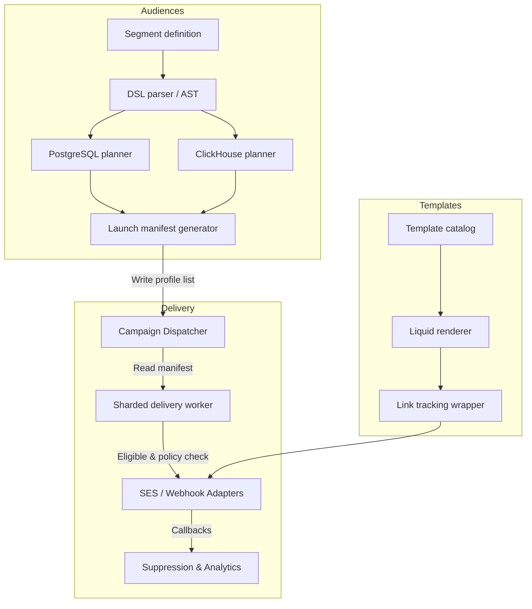

# Phase 2 Implementation Plan: Audiences and Reliable Email

This plan details the architecture, schemas, and step-by-step atomic tasks required to deliver Phase 2 of OpenJourney.

---

## 1. Architectural Components

Phase 2 introduces three key domains:
1. **Audiences & Segmentation**: Query AST, compiler, segment tables, and evaluation engine.
2. **Templates & Content**: Catalog tables, Liquid-compatible rendering, link rewriting, and tracking.
3. **Channel Delivery & Adapters**: Amazon SES and HMAC webhook adapters, policy engine (suppression, consent, fatigue), sharded campaign dispatcher, and callback handlers.



---

## 2. Feature Specifications

### 2.1 Audiences & Segmentation

We will design a JSON-based Audience DSL. The DSL defines a nested tree of conditions with `AND`, `OR`, and `NOT` logic.

#### Example DSL Structure:
```json
{
  "logic": "and",
  "conditions": [
    {
      "type": "profile_attribute",
      "field": "country",
      "operator": "equals",
      "value": "US"
    },
    {
      "type": "event_history",
      "event_type": "purchase",
      "operator": "has_occurred",
      "time_window_days": 30,
      "min_count": 2
    },
    {
      "type": "consent",
      "channel": "email",
      "topic": "marketing",
      "state": "subscribed"
    }
  ]
}
```

#### SQL Schema Updates (PostgreSQL):
```sql
CREATE TYPE segment_type AS ENUM ('static', 'dynamic', 'snapshot');

CREATE TABLE segments (
    id uuid PRIMARY KEY DEFAULT gen_random_uuid(),
    tenant_id uuid NOT NULL REFERENCES tenants(id),
    workspace_id uuid NOT NULL REFERENCES workspaces(id),
    name text NOT NULL,
    description text,
    type segment_type NOT NULL DEFAULT 'dynamic',
    dsl jsonb NOT NULL,
    version integer NOT NULL DEFAULT 1,
    created_at timestamptz NOT NULL DEFAULT now(),
    updated_at timestamptz NOT NULL DEFAULT now()
);

-- For static segments or manual inclusions/exclusions
CREATE TABLE segment_members (
    segment_id uuid NOT NULL REFERENCES segments(id) ON DELETE CASCADE,
    profile_id uuid NOT NULL REFERENCES profiles(id) ON DELETE CASCADE,
    tenant_id uuid NOT NULL,
    created_at timestamptz NOT NULL DEFAULT now(),
    PRIMARY KEY (segment_id, profile_id)
);
CREATE INDEX segment_members_profile_idx ON segment_members(tenant_id, profile_id);
```

---

### 2.2 Templates & Personalization

Templates support dynamic variable interpolation via a safe, sandboxed subset of Liquid template tags.

#### SQL Schema Updates (PostgreSQL):
```sql
CREATE TABLE templates (
    id uuid PRIMARY KEY DEFAULT gen_random_uuid(),
    tenant_id uuid NOT NULL REFERENCES tenants(id),
    workspace_id uuid NOT NULL REFERENCES workspaces(id),
    name text NOT NULL,
    channel text NOT NULL CHECK (channel IN ('email', 'webhook')),
    subject_template text, -- nullable for webhooks
    body_template text NOT NULL,
    version integer NOT NULL DEFAULT 1,
    created_at timestamptz NOT NULL DEFAULT now(),
    updated_at timestamptz NOT NULL DEFAULT now()
);

CREATE TABLE tracked_links (
    id uuid PRIMARY KEY DEFAULT gen_random_uuid(),
    tenant_id uuid NOT NULL,
    campaign_id uuid, -- nullable for transactionals
    original_url text NOT NULL,
    created_at timestamptz NOT NULL DEFAULT now()
);
```

---

### 2.3 Channel Delivery & Policy Engine

All outgoing messages pass through the Policy Engine immediately before delivery.

```
Delivery Intent -> Consent Check -> Suppression Check -> Fatigue Check -> Render -> Send
```

#### SQL Schema Updates (PostgreSQL):
```sql
-- Suppression list (bounces, complaints, manual unsubscribes)
CREATE TABLE suppressions (
    id uuid PRIMARY KEY DEFAULT gen_random_uuid(),
    tenant_id uuid NOT NULL REFERENCES tenants(id),
    channel text NOT NULL,
    endpoint text NOT NULL, -- email address or phone number
    reason text NOT NULL CHECK (reason IN ('bounce', 'complaint', 'unsubscribe', 'admin')),
    created_at timestamptz NOT NULL DEFAULT now(),
    UNIQUE (tenant_id, channel, endpoint)
);
CREATE INDEX suppressions_lookup_idx ON suppressions(tenant_id, channel, endpoint);

-- Fatigue / Frequency cap logs (sliding-window tracker)
CREATE TABLE delivery_logs (
    id uuid PRIMARY KEY DEFAULT gen_random_uuid(),
    tenant_id uuid NOT NULL,
    profile_id uuid NOT NULL REFERENCES profiles(id),
    channel text NOT NULL,
    campaign_id uuid,
    sent_at timestamptz NOT NULL DEFAULT now()
);
CREATE INDEX delivery_logs_fatigue_idx ON delivery_logs(tenant_id, profile_id, sent_at);
```

#### Campaigns & Dispatcher:
```sql
CREATE TABLE campaigns (
    id uuid PRIMARY KEY DEFAULT gen_random_uuid(),
    tenant_id uuid NOT NULL REFERENCES tenants(id),
    workspace_id uuid NOT NULL REFERENCES workspaces(id),
    name text NOT NULL,
    segment_id uuid NOT NULL REFERENCES segments(id),
    template_id uuid NOT NULL REFERENCES templates(id),
    status text NOT NULL DEFAULT 'draft' CHECK (status IN ('draft', 'scheduled', 'sending', 'completed', 'paused')),
    scheduled_at timestamptz,
    created_at timestamptz NOT NULL DEFAULT now(),
    updated_at timestamptz NOT NULL DEFAULT now()
);
```

---

## 3. Atomic Task List

We will implement Phase 2 in 7 sequential milestones:

### Milestone 2.1: Segment SQL Schema & Basic CRUD
- [ ] Create schema migration files for `segments`, `segment_members`.
- [ ] Implement `Segment` domain model in Go `internal/domain`.
- [ ] Implement `store.CreateSegment`, `store.GetSegment`, `store.UpdateSegment`, and `store.ListSegments` in `internal/postgres`.
- [ ] Implement HTTP API endpoints:
  - `POST /v1/segments`
  - `GET /v1/segments`
  - `GET /v1/segments/{id}`
  - `PUT /v1/segments/{id}`
- [ ] Add CRUD views to the React control plane.

### Milestone 2.2: Audience DSL Compiler & Parser
- [ ] Write Go AST structs representing conditions (`And`, `Or`, `Not`, `ProfileField`, `EventHistory`, `ConsentState`).
- [ ] Implement AST parser and validation logic (ensures types and schema fields exist).
- [ ] Implement PostgreSQL SQL Compiler that translates profile-based conditions into Postgres-compatible SQL.
- [ ] Implement ClickHouse SQL Compiler that translates event-history-based conditions into ClickHouse SQL.
- [ ] Write domain unit and golden-output tests for the compilers.

### Milestone 2.3: Templates & Liquid Personalization
- [ ] Create schema migrations for `templates` and `tracked_links`.
- [ ] Implement `Template` CRUD in `internal/postgres` and corresponding HTTP API.
- [ ] Integrate a sandboxed Liquid rendering parser (e.g., `github.com/osteele/liquid`) inside Go template utility.
- [ ] Add Link Rewriting utility that parses templates, finds hrefs, creates `tracked_links` records, and replaces hrefs with redirect URLs.
- [ ] Implement `POST /v1/templates/{id}/preview` API.
- [ ] Implement tracking redirect API: `GET /r/{link_id}` (redirects and publishes event `link.clicked`).
- [ ] Add template management and preview view in React control plane.

### Milestone 2.4: Delivery Policy Engine & Suppressions
- [ ] Create schema migrations for `suppressions` and `delivery_logs`.
- [ ] Implement `store.IsSuppressed`, `store.SuppressEndpoint`, and `store.RemoveSuppression` in `internal/postgres`.
- [ ] Implement HTTP API endpoints:
  - `GET /v1/suppressions`
  - `POST /v1/suppressions`
  - `DELETE /v1/suppressions`
- [ ] Implement the `PolicyEngine` struct in Go that evaluates:
  1. Profile suppression status.
  2. Consent ledger subscriptions.
  3. Frequency capping (counts logs in `delivery_logs` over last 24h/7d).
- [ ] Add suppression management view in React control plane.

### Milestone 2.5: Amazon SES & Webhook Adapters
- [ ] Define Go interface `ports.ChannelAdapter` (`Send`, `ValidateConfig`).
- [ ] Implement SES adapter using AWS SDK (`email` adapter).
- [ ] Implement Webhook adapter (`webhook` adapter) with SSRF validation, header signature, and retry policy.
- [ ] Add HTTP API endpoints for Webhook callbacks (receive bounces/complaints) and update suppressions.

### Milestone 2.6: Campaigns & Sharded Dispatcher
- [ ] Create schema migrations for `campaigns`.
- [ ] Implement Campaign CRUD API and UI.
- [ ] Implement `campaigns-dispatcher` worker binary:
  - Polls `campaigns` table for due runs.
  - Queries compiled segment SQL (joining Postgres + ClickHouse) to generate an audience list.
  - Generates a Campaign launch manifest JSON and saves it in object storage (MinIO).
  - Writes sharded delivery records to `outbox_events` / `projection_jobs`.
- [ ] Implement sharded `campaigns-delivery` worker:
  - Consumes delivery jobs, runs Policy Engine, renders templates, and executes send via Adapters.

### Milestone 2.7: Integration & Load Verification
- [ ] Create a production-load smoke test executing a 10,000-recipient sharded broadcast.
- [ ] Verify at-least-once delivery, circuit breaker triggers, and retry behaviors.
- [ ] Deliver a complete Phase 2 audit check document.
