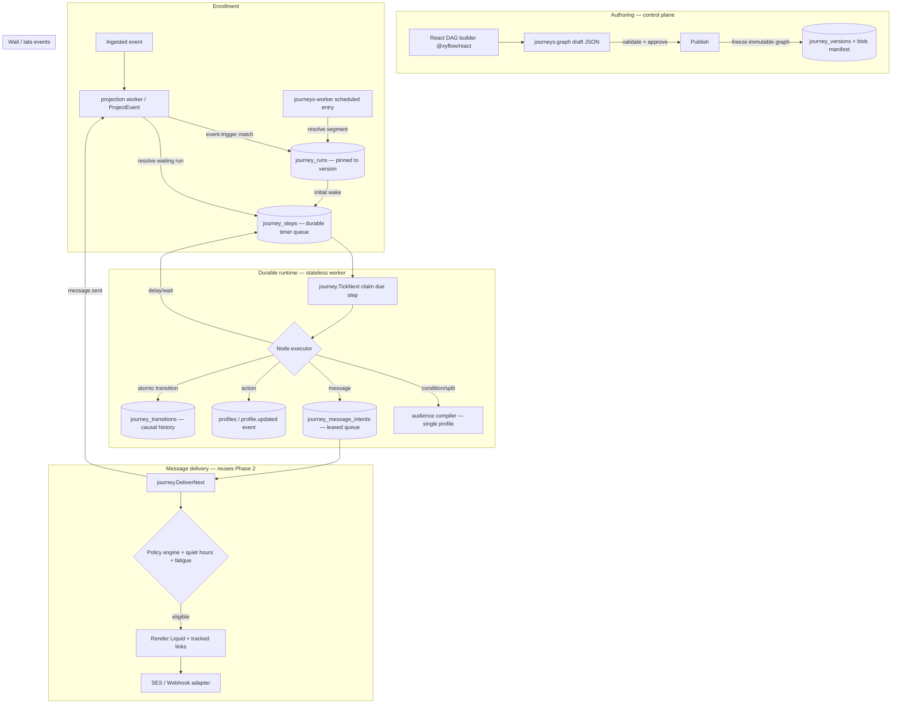

# Phase 3 Implementation Plan: Durable Journeys

Status: proposed. Builds directly on the completed Phase 2 platform (audiences, templates,
policy, channel adapters, campaigns, sharded delivery — see
[`v1-milestone-2-plan.md`](./v1-milestone-2-plan.md) and
[`v1-milestone-2-audit.md`](./v1-milestone-2-audit.md)). Delivers Phase 3 of `plan.md`:
**durable, event- and time-driven journeys** with a visual DAG builder, immutable
published versions, a PostgreSQL-backed durable runtime, and operator tooling.

This document is a **recipe book**, exactly like the Phase 2 plan. Sections 1–6 explain
*what* and *why*; Section 7 is the **task list** where every task references a recipe and
ends with a **Done when** check; Section 8 lists carry-over defects to respect. **If a task
feels ambiguous, open the named existing file, copy it, rename, and change the fields.** Do
not design from scratch — every pattern already exists in the repo.

> The Phase 2 recipes (6.1–6.9 in `v1-milestone-2-plan.md`) still apply verbatim
> (migrations, domain models, store methods, HTTP endpoints, RBAC scopes, worker binaries,
> leased queues, React views, emitting internal events). This plan adds journey-specific
> recipes (6.10–6.16) and re-cites the Phase 2 ones by number.

## Design decisions (locked)

These were confirmed before writing and must not be re-litigated mid-build:

1. **A journey is an immutable published DAG.** Editing produces a new draft graph;
   **publishing freezes it into an immutable `journey_versions` row + a blob manifest**.
   In-flight participants are **pinned to the version they entered on** and never migrate
   automatically. This mirrors how a campaign freezes its segment/template versions and a
   MinIO manifest at dispatch time.
2. **Durable runtime on PostgreSQL only — no extra interface seam.** The engine is
   implemented directly on the existing `ports.Store` and a new leased queue, copying the
   `delivery_jobs` pattern. Temporal is **out of scope**; when it is eventually built it
   will be introduced behind a new interface *at that time*, per `product-decisions.md`. Do
   **not** add a `JourneyRuntime` abstraction now.
3. **Timers are persisted rows, never sleeping goroutines.** Every delay, wait-timeout, and
   scheduled wake is a `journey_steps` row with an `available_at` column. A stateless worker
   claims due rows with `FOR UPDATE SKIP LOCKED`. This is the crux that satisfies exit
   criterion 2 ("no resident process owns workflow truth or sleeping timers").
4. **Orchestration emits intents; it never calls a provider inline.** A `message` node,
   when executed, writes a `journey_message_intents` row (a second leased queue) and advances
   the run in the *same transaction*. A separate delivery loop drains intents through the
   Phase 2 policy engine + channel adapters. This is the journey analog of
   dispatcher→`delivery_jobs`→delivery-worker.
5. **Core node set only.** Ship: `entry` (event-triggered + scheduled/segment), `delay`,
   `condition`, `split` (deterministic random % + audience), `message` (email/webhook),
   `wait_event` (+timeout), `action` (profile-update), `goal`, `exit`. **Deferred to later
   phases** (do not build): AI-decision nodes (Phase 5), feature-flag nodes (Phase 4/6),
   nested-journey entry/exit, webhook/integration action nodes, and experiment/holdout
   splits. Note them as `unsupported` in the graph validator so a draft using them fails
   loudly.
6. **Visual DAG builder via `@xyflow/react`.** This is the *only* place Phase 3 adds a
   frontend dependency; it must pass CI's `npm audit --audit-level=high`
   (`.github/workflows/ci.yml`). The graph is persisted as the same opaque JSON blob pattern
   used by `Segment.dsl` today (`web/src/api.ts:181`).
7. **New store methods extend the existing `ports.Store` interface** (same as every prior
   milestone). Group implementations into new files per domain
   (`journeys.go`, `journey_runtime.go`, `journey_delivery.go`).
8. **Engagement and journey facts stay event-sourced.** Journey message sends emit
   `message.sent` through the existing `AcceptEvents → outbox → Kafka → ClickHouse` pipeline
   (Recipe 6.9), so journeys are analyzable with no new plumbing.

---

## 1. Architecture



**Reused from Phase 1 + 2 with no changes:** `AcceptEvents` ingestion + idempotency, the
per-subject-ordered projection worker (`ClaimProjectionJob`, `internal/postgres/store.go:349`),
`ProjectEvent` side-effect switch (`store.go:394`), the audience AST + compilers
(`internal/audience/`), the policy engine (`internal/policy/policy.go`), the channel adapters
(`internal/channels/`), `BlobStore` (`internal/blob/minio.go`), the leased-queue claim/fail
pattern (`internal/postgres/campaigns.go:153`), telemetry (`internal/telemetry/telemetry.go`),
and the React `requestJSON` helper (`web/src/api.ts:97`).

### 1.1 The three durable tables (the crux)

| Table | Role | Copied from |
|-------|------|-------------|
| `journey_runs` | One row per participant enrollment = the **execution identity** and its current state (node, status, accumulated context, wait condition). | new (state machine) |
| `journey_steps` | The **durable timer/work queue**. One row = "advance run R at/after `available_at`". Stateless worker claims due rows. | `delivery_jobs` (`012_campaigns.sql`) |
| `journey_message_intents` | The **delivery intent queue** emitted by `message` nodes; carries the per-recipient explainable decision record. | `delivery_jobs` + `delivery_attempts` |

There is **one transaction** per step: claim a due `journey_steps` row → load the run and its
pinned graph → execute the node deterministically → update `journey_runs`, insert the next
`journey_steps` row (or complete), record a `journey_transitions` row, and mark the step
`completed` — all atomically. This is the exact shape of `ProjectEvent` (`store.go:394-546`),
which already does "side-effect + job completion in one tx."

### 1.2 Execution identity (effectively-once enrollment)

```
tenant + journey_version_id + profile_id + entry_key + reentry_sequence
```

`entry_key` is deterministic: for event-triggered entry it is the triggering
`accepted_events.id`; for scheduled entry it is `"sched:" + journey_version_id + ":" + <scheduled_run_id>`.
A `UNIQUE (journey_version_id, profile_id, entry_key, reentry_sequence)` constraint + an
`INSERT ... ON CONFLICT DO NOTHING` enrollment (copying the `delivery_attempts` guard,
`campaigns.go:286`) makes enrollment effectively-once under duplicate/reordered events — this
is exit criterion 3.

---

## 2. Schema (new migrations)

Next numbers after `014_robust_delivery.sql`. All follow existing conventions
(`CREATE TABLE IF NOT EXISTS`, uuid PKs via `gen_random_uuid()`, `timestamptz`,
tenant/workspace FKs, CHECK-constrained status columns that include `'dead'` for queues,
`(status, available_at)` due-indexes). Migrations auto-apply on startup in filename order
(`store.go:63` `Migrate`). **Keep filenames zero-padded and lexically ordered.**

### 2.1 `015_journeys.sql`
```sql
-- Draft container + immutable published versions.
CREATE TABLE IF NOT EXISTS journeys (
    id uuid PRIMARY KEY DEFAULT gen_random_uuid(),
    tenant_id uuid NOT NULL REFERENCES tenants(id),
    workspace_id uuid NOT NULL REFERENCES workspaces(id),
    name text NOT NULL,
    description text,
    status text NOT NULL DEFAULT 'draft' CHECK (status IN ('draft','published','archived')),
    graph jsonb NOT NULL DEFAULT '{}'::jsonb,      -- working draft (nodes/edges/entry)
    latest_version integer NOT NULL DEFAULT 0,     -- highest published version number
    current_version_id uuid,                       -- FK set on publish (see below)
    created_at timestamptz NOT NULL DEFAULT now(),
    updated_at timestamptz NOT NULL DEFAULT now()
);
CREATE INDEX IF NOT EXISTS journeys_tenant_idx ON journeys (tenant_id, workspace_id);

CREATE TABLE IF NOT EXISTS journey_versions (
    id uuid PRIMARY KEY DEFAULT gen_random_uuid(),
    journey_id uuid NOT NULL REFERENCES journeys(id) ON DELETE CASCADE,
    tenant_id uuid NOT NULL,
    workspace_id uuid NOT NULL,
    version integer NOT NULL,
    graph jsonb NOT NULL,                           -- frozen, immutable
    manifest_key text,                              -- blob copy for audit/replay
    entry_kind text NOT NULL CHECK (entry_kind IN ('event','scheduled')),
    entry_event_type text,                          -- set when entry_kind='event'
    entry_segment_id uuid REFERENCES segments(id),  -- set when entry_kind='scheduled'
    entry_schedule text,                            -- cron-ish / interval for scheduled entry
    reentry_policy text NOT NULL DEFAULT 'once' CHECK (reentry_policy IN ('once','always','after_exit')),
    max_reentries integer NOT NULL DEFAULT 0,
    late_policy text NOT NULL DEFAULT 'run' CHECK (late_policy IN ('run','skip','reschedule')),
    status text NOT NULL DEFAULT 'active' CHECK (status IN ('active','paused','archived')),
    published_by uuid,                              -- users.id of approver
    published_at timestamptz NOT NULL DEFAULT now(),
    UNIQUE (journey_id, version)
);
CREATE INDEX IF NOT EXISTS journey_versions_active_event_idx
    ON journey_versions (tenant_id, entry_event_type) WHERE status='active' AND entry_kind='event';
CREATE INDEX IF NOT EXISTS journey_versions_scheduled_idx
    ON journey_versions (status, entry_kind) WHERE entry_kind='scheduled';

-- Grant the new scopes to fresh API keys (copy the ALTER pattern from 009_audiences.sql:29).
ALTER TABLE api_keys ALTER COLUMN scopes SET DEFAULT ARRAY[
    'events:write','profiles:read','schemas:read','schemas:write',
    'api_keys:read','api_keys:write','privacy:write','operations:read','operations:write',
    'users:read','users:write','roles:read','roles:write',
    'segments:read','segments:write','templates:read','templates:write',
    'campaigns:read','campaigns:write','suppressions:read','suppressions:write',
    'journeys:read','journeys:write','journeys:publish'
];
```

### 2.2 `016_journey_runtime.sql`
```sql
-- Per-participant durable state = the execution identity.
CREATE TABLE IF NOT EXISTS journey_runs (
    id uuid PRIMARY KEY DEFAULT gen_random_uuid(),
    tenant_id uuid NOT NULL REFERENCES tenants(id),
    workspace_id uuid NOT NULL,
    journey_id uuid NOT NULL REFERENCES journeys(id) ON DELETE CASCADE,
    journey_version_id uuid NOT NULL REFERENCES journey_versions(id),  -- PINNED version
    profile_id uuid NOT NULL REFERENCES profiles(id) ON DELETE CASCADE,
    subject_external_id text,                         -- for wait-for-event matching
    entry_key text NOT NULL,                          -- event id, or "sched:<ver>:<runid>"
    reentry_sequence integer NOT NULL DEFAULT 0,
    status text NOT NULL DEFAULT 'active'
        CHECK (status IN ('active','waiting','completed','exited','failed','canceled')),
    current_node_id text NOT NULL,
    state jsonb NOT NULL DEFAULT '{}'::jsonb,         -- accumulated context + split assignments
    wait_event_type text,                             -- set while status='waiting'
    wait_until timestamptz,                           -- timeout for the wait
    goal_reached boolean NOT NULL DEFAULT false,
    entered_at timestamptz NOT NULL DEFAULT now(),
    updated_at timestamptz NOT NULL DEFAULT now(),
    completed_at timestamptz,
    UNIQUE (journey_version_id, profile_id, entry_key, reentry_sequence)  -- effectively-once
);
CREATE INDEX IF NOT EXISTS journey_runs_wait_idx
    ON journey_runs (tenant_id, wait_event_type, subject_external_id) WHERE status='waiting';
CREATE INDEX IF NOT EXISTS journey_runs_profile_idx ON journey_runs (tenant_id, profile_id);

-- The DURABLE TIMER / WORK QUEUE. Mirrors delivery_jobs (012_campaigns.sql:24).
CREATE TABLE IF NOT EXISTS journey_steps (
    id uuid PRIMARY KEY DEFAULT gen_random_uuid(),
    run_id uuid NOT NULL REFERENCES journey_runs(id) ON DELETE CASCADE,
    tenant_id uuid NOT NULL,
    node_id text NOT NULL,                            -- node to execute when this fires
    kind text NOT NULL DEFAULT 'advance' CHECK (kind IN ('advance','timeout')),
    status text NOT NULL DEFAULT 'pending'
        CHECK (status IN ('pending','processing','completed','failed','dead')),
    attempts integer NOT NULL DEFAULT 0,
    available_at timestamptz NOT NULL DEFAULT now(),  -- THE durable timer
    locked_until timestamptz,
    error_message text,
    created_at timestamptz NOT NULL DEFAULT now(),
    updated_at timestamptz NOT NULL DEFAULT now()
);
CREATE INDEX IF NOT EXISTS journey_steps_due_idx ON journey_steps (status, available_at);
-- At most one live step per run (prevents double-scheduling a participant).
CREATE UNIQUE INDEX IF NOT EXISTS journey_steps_one_live_per_run
    ON journey_steps (run_id) WHERE status IN ('pending','processing');

-- Causal history — explainability + replay comparison.
CREATE TABLE IF NOT EXISTS journey_transitions (
    id uuid PRIMARY KEY DEFAULT gen_random_uuid(),
    run_id uuid NOT NULL REFERENCES journey_runs(id) ON DELETE CASCADE,
    tenant_id uuid NOT NULL,
    from_node text,
    to_node text,
    node_type text NOT NULL,
    outcome text NOT NULL,                            -- e.g. 'advanced','branch:true','waited','sent','exited'
    detail jsonb NOT NULL DEFAULT '{}'::jsonb,
    occurred_at timestamptz NOT NULL DEFAULT now()
);
CREATE INDEX IF NOT EXISTS journey_transitions_run_idx ON journey_transitions (run_id, occurred_at);
```

### 2.3 `017_journey_delivery.sql`
```sql
-- Message-node delivery intents (orchestration emits; delivery worker sends).
-- Carries the per-recipient explainable record (journey analog of delivery_attempts).
CREATE TABLE IF NOT EXISTS journey_message_intents (
    id uuid PRIMARY KEY DEFAULT gen_random_uuid(),
    run_id uuid NOT NULL REFERENCES journey_runs(id) ON DELETE CASCADE,
    tenant_id uuid NOT NULL,
    workspace_id uuid NOT NULL,
    journey_id uuid NOT NULL,
    journey_version_id uuid NOT NULL,
    node_id text NOT NULL,
    profile_id uuid NOT NULL,
    template_id uuid NOT NULL REFERENCES templates(id),
    channel text NOT NULL,
    endpoint text NOT NULL,
    transactional boolean NOT NULL DEFAULT false,     -- bypass quiet-hours/fatigue + priority
    status text NOT NULL DEFAULT 'pending'
        CHECK (status IN ('pending','processing','completed','failed','dead')),
    attempts integer NOT NULL DEFAULT 0,
    available_at timestamptz NOT NULL DEFAULT now(),
    locked_until timestamptz,
    decision text,                                    -- sent/suppressed/no_consent/fatigued/render_failed/send_failed
    reason text,
    provider_message_id text,
    policy_snapshot jsonb NOT NULL DEFAULT '{}'::jsonb,
    error_message text,
    created_at timestamptz NOT NULL DEFAULT now(),
    updated_at timestamptz NOT NULL DEFAULT now(),
    UNIQUE (run_id, node_id)                          -- effectively-once per node execution
);
CREATE INDEX IF NOT EXISTS journey_message_intents_due_idx
    ON journey_message_intents (status, transactional DESC, available_at);

-- Quiet hours + per-tenant journey caps (extend tenant_quotas, like 013_tenant_fatigue_quotas.sql).
ALTER TABLE tenant_quotas
ADD COLUMN IF NOT EXISTS quiet_hours_start integer CHECK (quiet_hours_start BETWEEN 0 AND 23),
ADD COLUMN IF NOT EXISTS quiet_hours_end integer CHECK (quiet_hours_end BETWEEN 0 AND 23),
ADD COLUMN IF NOT EXISTS default_timezone text NOT NULL DEFAULT 'UTC',
ADD COLUMN IF NOT EXISTS max_active_runs_per_profile integer NOT NULL DEFAULT 25 CHECK (max_active_runs_per_profile >= 0);
```

### 2.4 Fatigue must count journey sends (design note)
Phase 2 fatigue reads `delivery_attempts` (`SentCountSince`, `internal/postgres/delivery.go`).
Journey sends land in `journey_message_intents`, **not** `delivery_attempts`. To keep
cross-channel fatigue correct, `SentCountSince` must be extended to **UNION** the two sources
(`delivery_attempts WHERE decision='sent'` + `journey_message_intents WHERE decision='sent'`)
for a profile within the window. This is task 8.6.5. Do not skip it — otherwise a recipient
can be blasted by both a campaign and a journey with no shared cap.

---

## 3. Journey graph DSL

A journey graph is a JSON object with `entry_node_id`, `nodes[]`, and `edges[]`. Node
`config` is per-type. Edge `branch` labels the outgoing path (omitted for single-exit nodes).

```json
{
  "entry_node_id": "n1",
  "nodes": [
    { "id": "n1", "type": "entry",     "config": { "trigger": "event", "event_type": "signup.completed" } },
    { "id": "n2", "type": "delay",     "config": { "duration": "1h" } },
    { "id": "n3", "type": "condition", "config": { "dsl": { "type": "profile_attribute", "field": "country", "operator": "equals", "value": "US" } } },
    { "id": "n4", "type": "split",     "config": { "mode": "random", "branches": [ { "label": "a", "weight": 50 }, { "label": "b", "weight": 50 } ] } },
    { "id": "n5", "type": "message",   "config": { "template_id": "…", "transactional": false } },
    { "id": "n6", "type": "wait_event","config": { "event_type": "email.opened", "timeout": "72h" } },
    { "id": "n7", "type": "action",    "config": { "action": "profile_update", "set": { "stage": "engaged" } } },
    { "id": "n8", "type": "goal",      "config": { "name": "activated" } },
    { "id": "n9", "type": "exit",      "config": { "reason": "completed" } }
  ],
  "edges": [
    { "from": "n1", "to": "n2" },
    { "from": "n2", "to": "n3" },
    { "from": "n3", "to": "n4", "branch": "true" },
    { "from": "n3", "to": "n9", "branch": "false" },
    { "from": "n4", "to": "n5", "branch": "a" },
    { "from": "n4", "to": "n9", "branch": "b" },
    { "from": "n5", "to": "n6" },
    { "from": "n6", "to": "n7", "branch": "success" },
    { "from": "n6", "to": "n9", "branch": "timeout" },
    { "from": "n7", "to": "n8" },
    { "from": "n8", "to": "n9" }
  ]
}
```

**Branch labels by node type** (the validator enforces these exactly):
- `entry`, `delay`, `action`, `message`, `goal` → exactly one unlabeled outgoing edge.
- `condition` → two edges, `branch: "true"` and `branch: "false"`.
- `split` → one edge per `config.branches[].label`.
- `wait_event` → two edges, `branch: "success"` and `branch: "timeout"`.
- `exit` → zero outgoing edges (terminal).

**Durations** (`delay.duration`, `wait_event.timeout`) are Go `time.ParseDuration` strings
(`"1h"`, `"72h"`, `"30m"`). Validate they parse and are ≥ 0.

---

## 4. Runtime semantics (per node)

Executors are **deterministic** and side-effect-light. Each returns: the next `node_id` (or
"complete"), an optional wake delay (→ a new `journey_steps` row), and optional state changes.
All of it is committed in **one transaction** with the step completion.

| Node | Execute does | Emits |
|------|--------------|-------|
| `entry` | immediately advance to its single successor | — |
| `delay` | insert next `journey_steps` (`available_at = clock.Now()+duration`), then wait | timer row |
| `condition` | evaluate the DSL against **this one profile** (Recipe 6.13); pick `true`/`false` edge | — |
| `split` | deterministic bucket `sha256(profile_id+node_id) % 100` vs cumulative weights (random) or audience membership; pick branch; record assignment in `state` | — |
| `message` | `INSERT journey_message_intents (run_id,node_id,…) ON CONFLICT DO NOTHING`, advance to successor in the same tx | intent row |
| `wait_event` | set run `status='waiting'`, `wait_event_type`, `wait_until`; insert a `kind='timeout'` step at `wait_until` | timeout timer |
| `action` (profile_update) | merge `config.set` into `profiles.attributes` + emit `profile.updated` (Recipe 6.9); advance | `profile.updated` event |
| `goal` | set `goal_reached=true`; advance | — |
| `exit` | set run `status='completed'` (or `'exited'`), `completed_at`; **no next step** | — |

**Wait resolution** is *not* the runtime worker's job — an incoming ingested event resolves
waits inside `ProjectEvent` (Recipe 6.12): match `journey_runs WHERE status='waiting' AND
wait_event_type = event.Type AND subject matches`, then insert an `advance` step on the
`success` branch (idempotent). The `timeout` step (already scheduled) fires the `timeout`
branch if the event never arrives; whichever lands first wins (the `journey_steps_one_live_per_run`
unique index + a status re-check prevents a double advance).

**Policy for message sends** (task 8.6): `journey.DeliverNext` drains
`journey_message_intents`, runs `policy.Evaluate` (`internal/policy/policy.go` — suppression →
consent → fatigue), applies quiet-hours (reschedule `available_at` into the recipient's
allowed window unless `transactional=true`), renders (`internal/render`), sends via the
adapter, emits `message.sent`, and writes the `decision`/`reason`/`policy_snapshot` back onto
the intent row. Every intent therefore has an explainable record — the journey analog of the
Phase 2 `delivery_attempts` explainability guarantee.

---

## 5. Exit-criteria traceability

| `plan.md` Phase 3 exit criterion | How this plan meets it | Task |
|---|---|---|
| Event- and time-driven journeys survive all worker restarts | All timers/state are durable rows (`journey_steps` + `journey_runs`); the worker is stateless and reclaims expired leases (`locked_until`); smoke test kills it mid-journey | 8.3, 8.8 |
| No resident process owns workflow truth or sleeping timers | No goroutine sleeps for a delay — a `journey_steps` row with `available_at` is the timer; the worker only claims *due* rows | 8.3 |
| Duplicate/reordered events and late callbacks have deterministic outcomes | `UNIQUE(journey_version_id,profile_id,entry_key,reentry_sequence)` + `ON CONFLICT DO NOTHING` enrollment; per-subject-ordered projection (`store.go:349`); idempotent `journey_message_intents(run_id,node_id)`; late-event policy | 8.5, 8.6, 8.8 |

---

## 6. Implementation recipes

Recipes **6.1–6.9 live in `v1-milestone-2-plan.md`** and apply unchanged (migration, domain
model, store method, HTTP endpoint, RBAC scope, worker binary, leased queue, React view,
emitting an internal event). The journey-specific additions:

### 6.10 New durable timer/work queue
- Copy the `delivery_jobs` column block from `012_campaigns.sql:24` (status CHECK incl.
  `'dead'`, `attempts`, `available_at`, `locked_until`, `error_message`, timestamps) plus a
  `(status, available_at)` index. Add the partial unique index for one-live-step-per-run.
- Copy `ClaimDeliveryJob` (`internal/postgres/campaigns.go:153`, Family-B single-statement
  `UPDATE ... WHERE id=(SELECT ... FOR UPDATE SKIP LOCKED LIMIT 1) RETURNING`) and
  `FailDeliveryJob` (`campaigns.go:227`, dead-letter at `attempts>=N`) — rename to
  `ClaimJourneyStep`/`FailJourneyStep`. **Use a dead-letter threshold of 10** (kernel
  default) not 3, since journey steps are cheaper to retry than sends.
- **Done when:** two concurrent workers never claim the same step (guaranteed by `SKIP LOCKED`).

### 6.11 Atomic node transition (one tx)
- Model it on `ProjectEvent` (`store.go:394-546`): `tx := s.pool.Begin(ctx)` → update
  `journey_runs` → insert next `journey_steps` (or none) → insert `journey_transitions` →
  `UPDATE journey_steps SET status='completed'` for the claimed step → `tx.Commit`. If any
  step fails, the whole transition rolls back and the lease re-drives it.
- **Done when:** a killed worker mid-transition leaves the step re-claimable with no partial
  state (covered by the smoke test 8.8.4).

### 6.12 Event reaction as a projection side-effect
- Copy the `case "consent.changed":` block in `ProjectEvent` (`store.go:421-446`): decode a
  typed payload, do a transactional side-effect keyed with `ON CONFLICT DO NOTHING` for
  idempotency. Add two behaviors inside `ProjectEvent`:
  1. **Enroll**: for each active `event`-entry `journey_versions` row whose `entry_event_type
     = event.Type`, `INSERT journey_runs ... ON CONFLICT DO NOTHING` + an initial
     `journey_steps` row.
  2. **Resolve waits**: `SELECT journey_runs WHERE status='waiting' AND wait_event_type =
     event.Type AND subject matches`; for each, insert an `advance` step on the `success`
     branch.
- This inherits the projection worker's per-subject ordering and idempotency for free.
- **Done when:** ingesting the entry event creates exactly one run; re-ingesting the same
  event (same `accepted_events.id` → same `entry_key`) creates none.

### 6.13 Single-profile condition evaluation
- The Phase 2 compilers are **set-based** (`resolveSegmentIDs` scans all profiles,
  `segments.go:159`). Journey `condition`/`split(audience)` nodes need "does THIS profile
  match?". Add `internal/audience/evaluate.go`: `Matches(ctx, store, p, profileID string,
  node Node) (bool, error)` that reuses `CompileProfile`/`CompileConsent`/`CompileClickHouse`
  (`internal/audience/compile_pg.go`, `compile_ch.go`) but appends `AND profile_id = $k` /
  `AND external_id = $k` and returns a boolean. Reuse the sha256 subject mapping
  (`segments.go:191`) for the ClickHouse leg.
- **Done when:** a unit test shows a US profile matches `country=US` and a non-US one does not.

### 6.14 New journey worker binary
- Copy `cmd/campaigns-delivery/main.go` (adapters constructed **once per process** — the
  Phase 2 §8 fix — stable `workerID`, telemetry `Setup`, a `/metrics` server, and the inline
  `for { … time.Sleep(1s) }` drain loop). Name it `cmd/journeys-worker/main.go`, metrics
  env `OPENJOURNEY_METRICS_ADDRESS_JOURNEYS` default `:8084`. Its loop calls, in order:
  `journey.EnrollScheduledDue(...)` → `journey.TickNext(...)` → `journey.DeliverNext(...)`.
- Add it to `Dockerfile`, `compose.yaml`, and the CI `containers` build.
- **Done when:** `go build ./cmd/journeys-worker` produces a binary that starts and exits
  cleanly on SIGTERM.

### 6.15 Deterministic bucketing (splits, replay-safe)
- `bucket := binary.BigEndian.Uint64(sha256(profileID + ":" + nodeID)[:8]) % 100`, then walk
  `config.branches` accumulating weights until `bucket < cumulative`. Store the chosen label
  in `journey_runs.state` so a replay of the same run picks the same branch. **Never** use
  `math/rand` — it is non-deterministic and breaks replay (exit criterion 3).
- **Done when:** the same `(profileID,nodeID)` always yields the same branch across runs.

### 6.16 React DAG builder (`@xyflow/react`)
- Add `@xyflow/react` to `web/package.json` deps; run `npm install` and confirm `npm audit
  --audit-level=high` is clean (CI gate). Add a `Journeys` component (App.tsx is a monolith
  — either add it there next to `Campaigns` at `App.tsx:1076`, or introduce a
  `web/src/sections/Journeys.tsx` and note the new convention).
- Add `"journeys"` to the `View` union (`App.tsx:16`), the `viewTitles` map (`App.tsx:19`),
  the nav array (`App.tsx:98`) — and **delete the disabled placeholder button**
  `<button disabled>Journeys <small>next</small></button>` (`App.tsx:102`).
- Add `Journey` types + `list/get/create/update/publish` functions to `web/src/api.ts`,
  copying the `Campaign` block (`api.ts:305`) and `requestJSON` helper (`api.ts:97`). Model
  `graph` as `Record<string, unknown>` like `Segment.dsl`.
- The builder edits xyflow nodes/edges in state and serializes to the `graph` JSON on save
  (the same parse-on-submit / pretty-print-on-edit dance as the Segment DSL textarea,
  `App.tsx:482`). Keep a raw-JSON fallback textarea for power users.
- **Done when:** `npm run typecheck && npm run build && npm test` pass and the builder round-trips a graph.

---

## 7. Task list (8 milestones)

Testing bar (matching Phase 2): **unit + golden tests per milestone; one consolidated
integration + fake-clock + load + audit pass in 8.8.** Each milestone must pass
`go build ./... && go vet ./...` (and `npm run build` for UI tasks) before the next. Every
task ends with a **Done when** check.

### Milestone 8.1 — Journey schema & draft CRUD
1. [x] **Migration.** Write `015_journeys.sql` per §2.1 (Recipe 6.1). *Done when:* app starts and
   `journeys` + `journey_versions` exist; a fresh API key carries `journeys:*` scopes. — done: `015_journeys.sql` applies; fresh API key default carries `journeys:*` scopes.
2. [x] **Domain models.** Add `Journey`, `JourneyVersion` structs to `internal/domain/domain.go`
   (Recipe 6.2); `Graph json.RawMessage`, nullables as `*T`, snake_case tags. *Done when:*
   `go build ./...` passes. — done: domain structs added with raw graph JSON and nullable pointer fields; `go build ./...` passes.
3. [x] **Scopes.** Add `journeys:read`/`journeys:write`/`journeys:publish` to `allowedPermissions`
   (`internal/postgres/rbac.go:12`) **and** the migration default array (Recipe 6.5).
   *Done when:* `CreateRole` accepts the new scopes. — done: `allowedPermissions` and `015_journeys.sql` include journeys scopes; `CreateRole` accepts all three.
4. [x] **Store methods** in new `internal/postgres/journeys.go` (Recipe 6.3): `CreateJourney`,
   `GetJourney`, `UpdateJourney` (writes the draft `graph`; blocks edits when
   `status='published'` unless reverting to draft), `ListJourneys`. Add to `ports.Store`.
   *Done when:* `go build ./...` passes. — done: `journeys.go` implements tenant/workspace-scoped CRUD, `ports.Store` includes methods, and `TestJourneysStoreIntegration` passes.
5. [x] **HTTP endpoints** in new `internal/httpapi/journeys.go` + routes in `server.go`
   `buildMux()` (Recipe 6.4): `POST/GET /v1/journeys`, `GET/PUT /v1/journeys/{id}`.
   *Done when:* each returns expected JSON via curl. — done: journey CRUD routes wired; HTTP tests pass; curl POST/list/get/update returned expected JSON against local API.
6. [x] **React scaffold** (Recipe 6.16, list + create only for now; builder in 8.4). Add nav
   entry, delete the disabled placeholder. *Done when:* `npm run build` passes and the list renders. — done: Journeys nav/list/create scaffold renders; `npm run typecheck && npm run build && npm test` pass.
7. [x] **OpenAPI.** Add the new paths to `api/openapi.yaml` (CI `contracts` job runs redocly).
   *Done when:* `npx redocly lint` passes. — done: Journey CRUD paths and schemas added; `npx --yes @redocly/cli@1.34.3 lint api/openapi.yaml` passes.

### Milestone 8.2 — Graph model, validation & immutable publish (highest risk — do carefully)
1. [x] **Graph types** in new `internal/journey/graph.go`: `Graph{EntryNodeID, Nodes, Edges}`,
   `Node{ID, Type, Config json.RawMessage}`, `Edge{From, To, Branch}`. *Done when:* `go build ./...` passes. — done: graph structs added in `internal/journey/graph.go`; `go build ./... && go vet ./... && go test ./...` pass in Go container with `GOFLAGS=-buildvcs=false`.
2. [x] **Parser + per-type config structs** `internal/journey/nodes.go`: decode each node's
   `Config` into a typed struct (`DelayConfig{Duration}`, `ConditionConfig{DSL}`,
   `SplitConfig{Mode,Branches}`, `MessageConfig{TemplateID,Transactional}`,
   `WaitConfig{EventType,Timeout}`, `ActionConfig{Action,Set}`, `EntryConfig{Trigger,EventType,...}`).
   Reject deferred node types (§ decision 5) with a clear `unsupported node type` error.
   *Done when:* unit tests cover one valid config and an unsupported-type rejection per node. — done: `nodes.go` decodes all core node configs and rejects deferred node types; `internal/journey` unit tests plus `go build ./... && go vet ./... && go test ./...` pass in Go container with `GOFLAGS=-buildvcs=false`.
3. [x] **Validator** `Validate(*Graph) error`: exactly one `entry` node = `EntryNodeID`; every
   edge references existing nodes; branch labels match the node type's contract (§3); no
   unreachable nodes (BFS from entry); at least one `exit` reachable; durations parse. **This
   is the crux — treat it like the Phase 2 audience compiler (7.2).** *Done when:* unit tests
   cover a valid graph and ≥5 distinct invalid graphs (missing entry, dangling edge, wrong
   branch labels, unreachable node, no exit). — done: `Validate` enforces graph topology, branch contracts, reachability, exits, and durations; valid graph plus six invalid graph tests pass with `go build ./... && go vet ./... && go test ./...`.
4. [x] **Golden test** `internal/journey/testdata/`: freeze the canonical §3 graph's normalized
   form; assert exact serialization. Copy the fail-on-missing pattern from
   `internal/audience/compile_test.go:128` (**must** `t.Fatalf` when the golden file is
   absent — do not self-write). *Done when:* `go test ./internal/journey/...` passes. — done: canonical graph golden fixture added under `internal/journey/testdata`; fail-on-missing golden test passes with `go build ./... && go vet ./... && go test ./...`.
5. [x] **Publish flow** store method `PublishJourney(ctx, p, journeyID, approverUserID)` +
   `POST /v1/journeys/{id}/publish` (scope `journeys:publish`): validate the draft graph →
   `version = latest_version+1` → insert immutable `journey_versions` row → `BlobStore.Put`
   the graph to `journeys/{tenant}/{journeyID}/v{n}.json` (copy `dispatch.go:151`) → set
   `journeys.status='published'`, `current_version_id`, `latest_version`. Require an approver
   (product-decisions: a human approves publication). *Done when:* publishing a valid journey
   creates a version row + a blob object; publishing an invalid graph returns 422 and creates nothing. — done: publish service, scoped store transaction, HTTP route, blob manifest write, and OpenAPI path added; `go build ./... && go vet ./... && go test ./...`, `TestPublishJourneyIntegration` against PostgreSQL, and Redocly lint pass.

### Milestone 8.3 — Durable runtime core (participant state + timer queue)
1. [x] **Migration.** `016_journey_runtime.sql` per §2.2 (`journey_runs`, `journey_steps`, `journey_transitions`). *Done when:* tables + indexes exist. — done: `016_journey_runtime.sql` applies; `journey_runs`, `journey_steps`, and `journey_transitions` tables and indexes exist.
2. [x] **Domain models.** `JourneyRun`, `JourneyStep`, `JourneyTransition` (Recipe 6.2). — done: models added to `internal/domain/domain.go`; `go build ./...` passes.
3. [x] **Store methods** in new `internal/postgres/journey_runtime.go` (Recipes 6.3, 6.10): `CreateJourneyRun` (`ON CONFLICT (journey_version_id,profile_id,entry_key,reentry_sequence) DO NOTHING` returning `inserted bool`, copying `CreateDeliveryAttempt` `campaigns.go:286`), `GetJourneyRun`, `UpdateJourneyRun`, `ClaimJourneyStep`/`CompleteJourneyStep`/`FailJourneyStep` (copy `ClaimDeliveryJob`/`FailDeliveryJob`), `InsertJourneyStep`, `RecordTransition`, and `AdvanceRunTx(...)` (the atomic transition of Recipe 6.11). Add all to `ports.Store`. — done: methods implemented in `internal/postgres/journey_runtime.go`, added to `ports.Store` interface, and verified by `TestJourneyRuntimeIntegration`.
4. [x] **Clock seam** `internal/journey/clock.go`: `type Clock interface { Now() time.Time }`,
   a real impl and a `FakeClock` (advanceable). Inject into the runtime so tests control time
   (satisfies "fake-clock simulation"). — done: created `internal/journey/clock.go` defining the `Clock` interface, `RealClock`, and `FakeClock`.
5. [x] **Runtime skeleton** `internal/journey/runtime.go`: `TickNext(ctx, store, deps) (bool, error)`
   returning `(processed, err)` in the `DeliverNext` convention (`deliver.go:30`). Claim a due
   step → load run + pinned version graph (from `journey_versions.graph` or blob) → dispatch to
   the node executor (stub: only `entry`/`exit` for now) → `AdvanceRunTx`. — done: `TickNext` skeleton implemented, added `GetJourneyVersion` and `GetJourneyRunSystem` to `ports.Store` + `internal/postgres/`, and verified by `TestTickNextSkeleton` in `runtime_test.go`.

### Milestone 8.4 — Node executors (core set) + visual builder
1. [x] **Executors** in `internal/journey/nodes.go` — implement `Execute` per §4 for: `entry`,
   `delay` (Recipe: `InsertJourneyStep` at `clock.Now()+duration`), `condition` (Recipe 6.13),
   `split` (Recipe 6.15 random % + audience-membership via 6.13), `action`/profile_update
   (merge attributes + emit `profile.updated`, Recipe 6.9), `goal`, `exit`. `message` and
   `wait_event` are stubbed here (full impl in 8.5/8.6). — done: implemented node.Execute and added comprehensive tests in nodes_test.go.
2. [x] **Single-profile evaluator** `internal/audience/evaluate.go` (Recipe 6.13) + golden/unit
   tests. — done: implemented Matches, point queries for profile/consent/clickhouse, and added evaluate_test.go unit tests.
3. [x] **Visual DAG builder** (Recipe 6.16): `@xyflow/react` node/edge editor with a config panel
   per node type (dropdowns for template/segment like `App.tsx:1248`), a validate button
   (calls a dry-run `POST /v1/journeys/{id}/publish?dry_run=true` or a client mirror of the
   validator), and Save → `updateJourney`. — done: created `web/src/sections/Journeys.tsx` incorporating React Flow, interactive visual node/edge connections, sidebar properties configuration, local graph validation, and publish integrations.

### Milestone 8.5 — Entry triggers, re-entry & wait-for-event
1. [x] **Event-triggered enrollment** as a `ProjectEvent` side-effect (Recipe 6.12): match active
   `entry_kind='event'` versions on `event.Type`, enroll with the execution-identity guard;
   honor `reentry_policy`/`max_reentries`. *Done when:* ingesting the entry event creates one
   run; a duplicate event creates none; a second distinct event respects the re-entry policy. — done: active event-entry versions matched on event.Type in ProjectEvent; verified by integration tests.
2. [x] **Wait-for-event node** (`wait_event` executor): set run `waiting` + `wait_event_type` +
   `wait_until`; insert a `kind='timeout'` step at `wait_until`. *Done when:* a run parks in
   `waiting` with a scheduled timeout step. — done: wait_event executor schedules timeout step and parks run in waiting; verified by TestExecuteWaitEvent and integration tests.
3. [x] **Wait resolution** as a `ProjectEvent` side-effect (Recipe 6.12): a matching event inserts
   an `advance` step on the `success` branch; the `journey_steps_one_live_per_run` index +
   status re-check prevents a double advance if the timeout also fires. *Done when:* delivering
   the awaited event advances the run down `success`; letting it lapse advances down `timeout`;
   never both. — done: ProjectEvent inserts success advance step and completes timeout step; timeout step advances down timeout branch; verified by TestJourneyWaitEventResolutionIntegration and TestJourneyWaitEventTimeoutIntegration.
4. [x] **Scheduled/segment entry** `journey.EnrollScheduledDue(ctx, store, clock)`: for due
   `entry_kind='scheduled'` versions, resolve the segment (`ResolveSegment`, `segments.go:383`)
   and enroll each member (`entry_key="sched:<ver>:<runID>"`). *Done when:* scheduling a
   segment-entry journey enrolls exactly its members, once. — done: EnrollScheduledDue retrieves active scheduled journey versions, resolves members via ResolveSegment, and enrolls them with effectively-once entry keys; verified by TestEnrollScheduledDue and TestJourneyScheduledEntryIntegration.

### Milestone 8.6 — Message delivery, policy, quiet hours & fatigue
1. [x] **Migration** `017_journey_delivery.sql` per §2.3 (`journey_message_intents` +
   `tenant_quotas` quiet-hours/journey columns). *Done when:* table + columns exist. — done: created migration file `017_journey_delivery.sql` and verified auto-application during integration tests.
2. [x] **`message` executor** (finalize): `INSERT journey_message_intents ... ON CONFLICT
   (run_id,node_id) DO NOTHING` and advance in the same tx. *Done when:* executing a message
   node produces exactly one intent and advances the run. — done: implemented endpoint resolution using dynamic profile attribute lookup, integrated message intent insert within atomic AdvanceRunTx, and fully verified via unit + Postgres integration tests.
3. [x] **Delivery loop** `internal/journey/deliver.go` `DeliverNext(ctx, store, workerID, cfg)`
   (copy `internal/campaigns/deliver.go`): claim an intent → `policy.Evaluate` → render
   (`internal/render`) → `adapter.Send` → emit `message.sent` (Recipe 6.9) → write
   `decision`/`reason`/`policy_snapshot`/`provider_message_id` onto the intent. Reuse the
   effectively-once resume-by-decision state machine (`deliver.go:141`). *Done when:* a small
   journey delivers via `channels.NewFakeAdapter()` and every intent has a decision. — done: implemented DeliverNext with resume-by-decision state machine, full rendering, and policy evaluations (with transactional bypass), backed by comprehensive unit tests and pg integration tests.
4. [x] **Quiet hours + timezone/DST** `internal/journey/quiethours.go`: compute recipient local
   time from `profiles.attributes.timezone` (fallback `tenant_quotas.default_timezone`) via
   `time.LoadLocation` (handles DST); if now is inside `[quiet_hours_start, quiet_hours_end)`
   and the intent is **not** `transactional`, reschedule `available_at` to the next window
   open. *Done when:* a unit test with a fixed clock defers a marketing send out of quiet
   hours and lets a transactional one through. — done: implemented quiet hours check in internal/journey/quiethours.go with full support for midnight-wrapping, timezone and DST computations, integrated with DeliverNext, and verified via extensive fixed-clock unit tests.
 5. **Fatigue across channels** (§2.4): extend `SentCountSince` (`internal/postgres/delivery.go`)
    to UNION `delivery_attempts` + `journey_message_intents` sends. *Done when:* a profile at
    its cap from campaign sends is `fatigued` for a journey send too. — done: extended `SentCountSince` with a `UNION ALL` query across campaign `delivery_attempts` and journey `journey_message_intents` and verified via a database integration test.
6. [x] **Transactional priority + basic fairness**: the intent due-index already orders
   `transactional DESC`; add a simple per-tenant in-flight cap in the claim so one tenant
   cannot starve others. Full weighted-fair-queue is a §8 hardening item, not a blocker.
   *Done when:* transactional intents drain ahead of marketing ones. — done: implemented a per-tenant in-flight cap of 10 in ClaimJourneyMessageIntent; added integration test asserting priority order and fairness.
7. [x] **Worker binary** `cmd/journeys-worker/main.go` (Recipe 6.14): loop
   `EnrollScheduledDue → TickNext → DeliverNext`; adapters built once; metrics `:8084`. Wire
   into `Dockerfile`, `compose.yaml`, CI `containers`. *Done when:* `go build ./cmd/journeys-worker`
   runs and drains a journey end to end locally. — done: created cmd/journeys-worker/main.go; wired into Dockerfile and compose.yaml; verified go build and test-go pass.

### Milestone 8.7 — Operator tools: pause/resume/cancel, DLQ, replay, backfill
1. [x] **Journey pause/resume** `PUT /v1/journeys/{id}/versions/{v}` sets `journey_versions.status
   = 'paused'|'active'`; the worker skips steps for paused versions (claim excludes them).
   *Done when:* pausing halts new step processing; resuming continues in place. — done: implemented PUT /v1/journeys/{id}/versions/{v} endpoint, updated ClaimJourneyStep/ClaimJourneyMessageIntent to skip paused versions, and added integration test confirming claiming stops on pause and resumes on active.
2. [x] **Participant cancel** `POST /v1/journeys/{id}/runs/{runID}/cancel` sets run
   `status='canceled'` and deletes its live step. *Done when:* a canceled run stops advancing. — done: implemented POST /v1/journeys/{id}/runs/{runID}/cancel endpoint, updated database to set status='canceled' and delete all pending steps, and verified with integration test TestJourneyParticipantCancel.
3. [x] **DLQ inspection** `GET /v1/journeys/dlq` lists `journey_steps` and
   `journey_message_intents` with `status='dead'` (tenant-scoped). *Done when:* a step that
   exhausts attempts appears in the DLQ. — done: implemented GET /v1/journeys/dlq endpoint, updated database store to return dead steps/intents, added OpenAPI spec, and verified with integration test TestJourneyDLQ.
4. [x] **Operator replay** `POST /v1/journeys/dlq/{kind}/{id}/retry`: reset `status='pending'`,
   `attempts=0`, `available_at=now()`, clear `locked_until`. *Done when:* a replayed dead step
   re-drives without duplicating already-committed transitions (guarded by the atomic
   transition + execution identity). — done: implemented POST /v1/journeys/dlq/{kind}/{id}/retry endpoint, added store methods to reset step/intent state, added OpenAPI spec, and verified with integration test TestJourneyDLQ.
5. [x] **Backfill** `POST /v1/journeys/{id}/backfill` (scope `journeys:publish`, requires
   approver — product-decisions: humans approve bulk sends): enroll a segment into the current
   published version on demand. *Done when:* backfilling a segment enrolls its members once. — done: implemented POST /v1/journeys/{id}/backfill, added Backfill function resolving the segment and enrolling members with once policy, and added integration + unit tests.
6. [x] **Late-event / downtime catch-up**: in `TickNext`, if a claimed step's `available_at` is
   older than a threshold, apply the version's `late_policy` (`run`/`skip`/`reschedule`).
   *Done when:* a unit test with a stale step honors each policy. — done: implemented late-event catch-up checking stale steps in TickNext, added RescheduleJourneyStep method to the store and mock interfaces, and verified skip, reschedule, and run behaviors with unit tests.
7. **React operator views**: pause/resume toggle, a run inspector (status + transition
   timeline from `journey_transitions`), a DLQ table with a retry button. *Done when:*
   `npm run build` passes and the views render against seeded data.

### Milestone 8.8 — Fake-clock, replay/determinism, integration, load & audit (closeout)
1. **Fake-clock end-to-end test** in `internal/postgres/journeys_integration_test.go` (copy
   the `TestCampaignsEndToEnd` build, `campaigns_integration_test.go:267`, DB-gated skip on
   `OPENJOURNEY_TEST_DATABASE_URL`): a full `entry→delay→condition→split→message→wait(timeout)→
   goal→exit` journey driven by advancing the `FakeClock`; assert transitions, one intent per
   message node, `message.sent` emitted, run `completed`. *Done when:* the fake-clock journey
   passes without real waiting.
2. **Replay compatibility test**: re-run a recorded step/event sequence against the pinned
   immutable `journey_versions` graph → identical `journey_transitions` checksum (the journey
   analog of `TestCampaignsReproducibility`, `campaigns_integration_test.go:464`). *Done when:*
   two replays of the same version + inputs produce byte-identical transition sequences.
3. **Duplicate/reordered/late-event determinism tests** (exit criterion 3): duplicate entry
   event → one run; the awaited event + its timeout racing → exactly one branch taken. *Done when:*
   all three cases assert single, deterministic outcomes.
4. **Worker-kill load smoke** `scripts/smoke-journeys.sh` (copy
   `scripts/smoke-campaign-delivery.sh`): enroll N participants (event + time driven), kill
   `journeys-worker` mid-flight (`docker kill`), reset `locked_until`, restart, assert no
   duplicate `message.sent`, all runs terminal, deterministic branch counts. `chmod +x`; add
   to the CI `smoke` job (`.github/workflows/ci.yml`) and confirm `sh -n` passes. *Done when:*
   the smoke script passes cleanly in CI.
5. **Telemetry** (Recipe from `telemetry.go:18`): add counters
   `openjourney_journey_enrollments_total`, `_steps_executed_total`, `_messages_sent_total`,
   `_policy_rejections_total`, `_exits_total`, `_dead_lettered_total`; record at the runtime
   and delivery sites; expose on the worker `/metrics`. *Done when:* the counters appear on `:8084/metrics`.
6. **Run the full suite.** `go build ./... && go vet ./... && go test ./...`, `go mod tidy`,
   and `npm run build && npm audit --audit-level=high` (for `@xyflow/react`). Record results.
   *Done when:* all pass.
7. **Audit doc** `docs/milestones/v1-milestone-3-audit.md` mirroring the Milestone-2 audit
   table format (`v1-milestone-2-audit.md`): one row per requirement with direct current-state
   evidence, including exit-criteria coverage and the §8 carry-over items. *Done when:* every
   row is backed by named files/tests.

---

## 8. Carry-over defects & hazards to respect

These are known from the Phase 2 audit + code map. **Do not re-introduce them in journey code.**

### P1 — fix or explicitly account for
1. **`retryable_failed` CHECK-constraint gap (latent Phase 2 bug).** `internal/campaigns/deliver.go`
   writes `decision='retryable_failed'` but `014_robust_delivery.sql`'s CHECK list does **not**
   include it — an `UPDATE` with that value would violate the constraint at runtime. When you
   design `journey_message_intents.decision`, **enumerate every value the code can write in the
   CHECK** (including any intermediate/retry states) and add a test that exercises each. Fix
   the campaigns constraint in the same migration series if you touch it.
2. **Fatigue must be cross-channel (§2.4).** Journey sends bypass `delivery_attempts`; wire
   `SentCountSince` to count both sources (task 8.6.5) or recipients get double-messaged.
3. **Adapters once per process, not per job.** The Phase 2 §8 fix constructed the SES adapter
   (and its rate limiter) once per worker. Copy that in `cmd/journeys-worker` (Recipe 6.14) —
   do not build adapters inside `DeliverNext`.
4. **Never call a provider from the deterministic runtime.** `TickNext` must only *emit*
   intents (decision 4). Sends happen exclusively in `DeliverNext`. Mixing them reintroduces
   the "orchestration owns side-effects" anti-pattern `plan.md` §5.7 forbids.

### P2 — hardening / hygiene
5. **Deterministic bucketing only** (Recipe 6.15) — `math/rand` in a split breaks replay.
6. **Single-profile condition eval efficiency.** `resolveSegmentIDs` loads *all* profiles per
   call (`segments.go:170`); do **not** call it per participant. Use the scoped `Matches`
   evaluator (Recipe 6.13) so a high-throughput journey does not full-scan profiles per step.
7. **Fail-fast config** for any new required secret/interval, mirroring the tracking-key guard
   (`config.go:105`). If `journeys-worker` needs a tick interval, default it (`env(...,"1s")`)
   and validate parse like `MaxBatchSize` (`config.go:87`).
8. **`@xyflow/react` must pass `npm audit --audit-level=high`** — CI blocks otherwise. Pin a
   clean version; if it fails audit, fall back to the JSON-textarea + read-only SVG approach.
9. **OpenAPI + redocly.** Every new route needs an `api/openapi.yaml` entry or the CI
   `contracts` job fails.

---

## 9. Open items to confirm before coding

- **Wait-event subject matching key.** Confirm whether waits match on `external_id`
  (canonical) only, or also `anonymous_id`. Recommendation: `external_id` (deliverable
  subjects), consistent with the audience "canonical subject is `external_id`" rule
  (`v1-milestone-2-plan.md` §1.1).
- **Scheduled-entry cadence.** `entry_schedule` is stored as text; confirm the format
  (interval string vs cron) and whether the `journeys-worker` evaluates it or a cron triggers
  `EnrollScheduledDue`. Recommendation: interval string + worker-evaluated, matching the
  existing hardcoded 1s worker loop convention.
- **Quiet-hours granularity.** Tenant-level (in `tenant_quotas`, as specced) vs per-journey
  override in the entry config. Recommendation: tenant default with an optional per-version
  override field added later; ship tenant-level in 8.6.
- **Delivery split.** This plan folds message delivery into `journeys-worker` for a single new
  binary. If journey send volume grows, split it into `cmd/journeys-delivery` (copy
  `cmd/campaigns-delivery`) exactly as campaigns are split — the `journey_message_intents`
  queue already supports an independent drainer.
