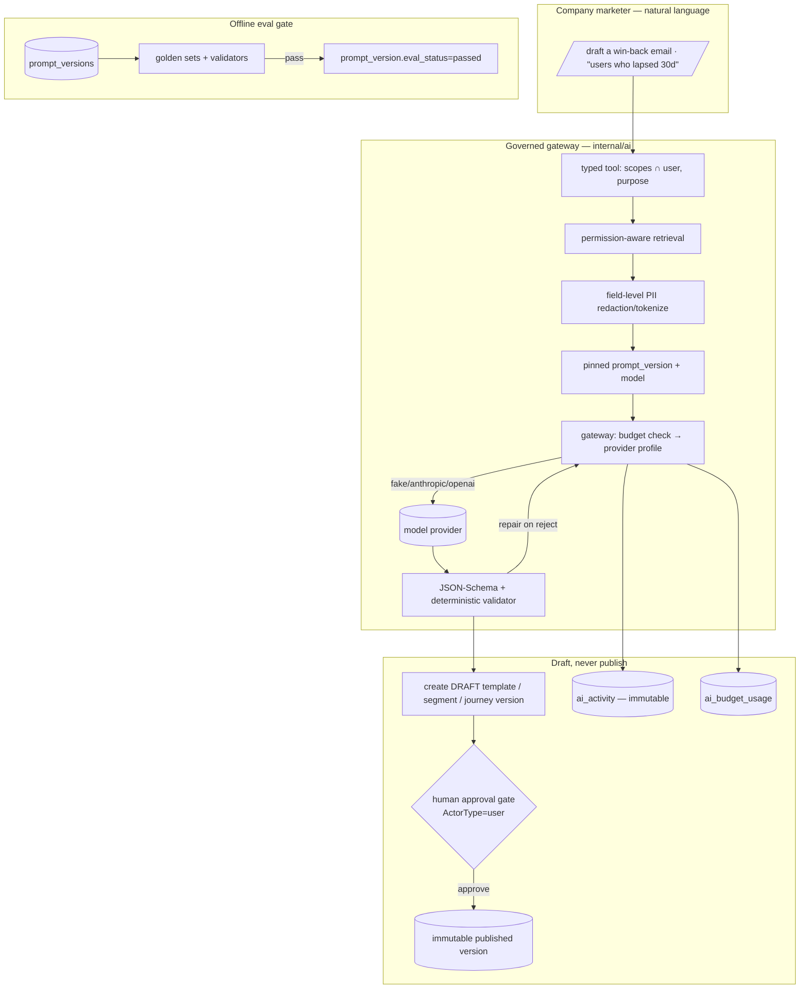

# Phase 5 (slice) Implementation Plan: Governed AI Layer — Gateway, Registry & Copilots

Status: not started. Builds on completed Phase 1–4 (kernel, audiences, email/webhook, durable
journeys, experimentation & analytics, SMS/push). Delivers the **governed AI layer** of
`plan.md` §6 (AI-first specification) + §14 Phase 5 — the slice that makes OpenJourney
**AI-first for company marketing teams**: natural-language authoring of audiences, content, and
journeys, plus performance copilots — while staying **governed and auditable enough for
enterprise trust**. Per `plan.md §6`: *"AI-first means every important operation is exposed
through safe typed APIs and tools. It does **not** mean a nondeterministic model controls every
send."* AI here **drafts and proposes**; a human still approves every publish.

This slice covers `plan.md` **Initial AI deliverables 1–4**: (1) content drafting + localization
+ QA, (2) natural-language→audience-DSL with preview + explainability, (3) journey drafting +
deterministic validation, (4) campaign performance summaries + suggested next version — on top
of the AI gateway, prompt/model registry, typed-tool surface, permission-aware retrieval + PII
redaction, immutable AI-activity audit, budgets, and an offline eval harness. Deliverable 5
(recommendations/predictive scores) and deliverable 6 (bounded realtime decisioning) are
**deferred** — the latter deliberately, since `plan.md §6.3` requires evaluation infrastructure
(built here) to exist first.

This is a **recipe book**, like the Phase 2–5 plans. Every task references a recipe and ends
with a **Done when** check. **If a task feels ambiguous, open the named existing file, copy it,
rename, and change the fields.** Recipes 6.1–6.25 from prior plans still apply verbatim; this
plan adds AI recipes 6.26–6.30.

> **This is a large milestone by design** (you chose the full copilot suite). The substrate
> (11.0–11.7) must land before any copilot (11.8–11.11); each copilot then ships independently.
> Treat 11.7-green as the checkpoint.

> **Milestone 11.0 comes first and is non-negotiable.** It closes a live forgery gap the M5
> review found (push callback skips signature verification when an identity has no
> `webhook_secret`, `internal/httpapi/callbacks.go:750`). Fix it before building the AI layer on
> top.

## Design decisions (locked)

1. **Provider-neutral AI gateway reusing the M5 egress + profile seam.** New `internal/ai`
   package with a `ModelProvider` interface (`Generate` structured, `Embed`, `Moderate`) driven
   by profiles that implement the same shape as M5's `ProviderProfile`
   (`internal/channels/httpprovider.go:31-34`). **Ship profiles:** `fake` (deterministic, for
   tests/CI), `anthropic` (Claude — **Opus 4.8** default for drafting, **Haiku 4.5** for
   QA/classification/cheap calls), `openai` (OpenAI-compatible / local, for self-host/BYO).
   Reuse the SSRF-guarded, TOCTOU-safe HTTP client + `http.ProxyFromEnvironment`
   (`httpprovider.go:40-99`). Per-tenant provider choice, budgets, and fallback live in an
   `ai_provider_configs` row (jsonb config like `sending_identities.config`, secrets via the
   existing `<KEY>_FILE` reference convention `internal/config/config.go:118-132` — **never**
   inline plaintext for a shared build).
2. **Local/self-host endpoints require an explicit per-tenant allowlist — never a blanket SSRF
   bypass.** `IsSafeURL` (`internal/channels/webhook.go:280-316`) correctly blocks private IPs, so
   a local model endpoint (vLLM/Ollama/Bedrock-gateway) is rejected by default. AI egress uses a
   dedicated guard: hosted providers must match a known-provider **domain allowlist**; a private/
   local endpoint is permitted **only** if a tenant admin has explicitly registered it in
   `ai_provider_configs.endpoint_allowlist` (opt-in, audited). The TOCTOU-safe dial guard
   (`httpprovider.go:51-73`) is still applied.
3. **Prompt/model registry with IMMUTABLE versions**, copying the journey publish freeze
   (`internal/journey/publish.go:40-54`: canonicalize → `sha256` → `blob.Put` before the tx →
   immutable version row). A `prompt_versions` row pins: template text, **input JSON Schema**,
   **output JSON Schema**, provider + model + params, and a safety policy. **Every AI call
   references a pinned `prompt_version_id` + model** — never an ad-hoc prompt. There is **no
   generic version registry** to reuse (`journey_versions`/`campaigns` are per-resource), so this
   is a new `*_versions` table built by analogy.
4. **AI is a distinct actor that can draft but never publish.** Add `Principal.ActorType =
   "ai_agent"` (today only `user`/`api_key`/`system` exist, `domain.go:11-19`). The gateway runs
   tools under a **derived principal** whose scopes are the **intersection** of the requesting
   user's scopes and the tool's declared scopes, with `ActorType="ai_agent"` — so it is
   **structurally rejected** by the human-approval gate (`journeys.go:80`, `experiments.go:72`,
   defense-in-depth `publish.go:22-25`). AI creates **draft** resources and proposes **new
   immutable versions**; a human clears the same gate to publish. AI never self-modifies a live
   journey/campaign (`plan.md §6.3`).
5. **Governed typed-tool surface; the domain REST/RPC API stays authoritative** (`plan.md §6.2`).
   Each tool is a typed wrapper (JSON-Schema input/output) over an **existing store method**,
   declaring required scopes + purpose, permission-checked with the caller's `Principal`
   (tenant/workspace/role/field-level). Untrusted data (profile values, catalog, webhook
   payloads) is passed as clearly-delimited **DATA**, isolated from system instructions
   (prompt-injection defense, `plan.md §6.3`). MCP-compatible exposure is a thin optional adapter,
   **deferred** to a later milestone (domain API remains authoritative either way).
6. **Permission-aware retrieval + field-level PII redaction before every model call.** Introduce
   **field-level sensitivity** (extend the coarse event `data_classification` enum
   `public|internal|confidential|restricted`, `002_phase1.sql:11`, down to profile/event
   fields). Before any payload leaves for a provider, a redaction pass **masks/tokenizes** fields
   the caller isn't authorized to see or that policy forbids sending to a model. Retrieval applies
   tenant/workspace/role/purpose/field authorization (`plan.md §6.3`).
7. **Model outputs MUST conform to JSON Schema and pass deterministic validators before use.**
   Structured generation only; schema-reject → bounded **repair** retry → hard fail (telemetry).
   **No free-form model text drives a mutation.** Reuse the existing deterministic validators:
   audience DSL `audience.Parse` (`internal/audience/parse.go:9-147`), journey graph
   `internal/journey/validate`, and template render (`internal/render`).
8. **Immutable AI-activity audit for every AI action** (`plan.md §6.3`/§9): records model/
   provider/version, `prompt_version_id`, retrieval references, tool calls, classification,
   input/output tokens, cost, latency, policy decision, approver, output reference. Stored
   append-only in a **new `ai_activity` table** (NOT the best-effort mutable `audit_events`,
   `admin.go:402-412`), and mirrored as an `ai.action` domain event on the audit stream. An
   **unlogged AI action is a bug**.
9. **Async generation via the generic `operation_jobs` queue** (`002_phase1.sql:139-155`), copying
   the `privacy_requests` "202 Accepted + status resource" pattern (`server.go:369-399`,
   `admin.go:197-241`). Expensive copilots enqueue an `ai.generate` job (widen the `job_type`
   CHECK) and return a status resource; cheap interactive calls run inline under a budget/timeout.
10. **Per-tenant budgets enforced at the gateway**; over-budget → deny with a clear error, no
    silent overspend. Token/cost/latency/schema-rejection/safety telemetry via `mustCounter`
    (`telemetry.go`), adding an `Int64Histogram` helper (none exists today) for latency/cost.
11. **Offline eval harness gates prompt/model versions.** Golden datasets + deterministic
    validators covering hallucination, policy breach, unauthorized retrieval, latency, and cost;
    a `prompt_version` is not `usable` until its eval run passes. The `fake` provider makes CI
    deterministic (mirrors `internal/channels/fake.go` + `golden_test.go`); real-provider evals
    run out-of-band.

---

## 1. Architecture



**Reused unchanged:** the human-approval gate + `Principal`/`authenticate` (`server.go:200-230`),
the immutable-version blob-freeze (`journey/publish.go`, `blob/minio.go`), the generic
`operation_jobs` queue + `internal/operations` worker + `privacy_requests` status pattern, the
audience DSL `Parse`/`Compile`/`PreviewSegment`, journey `validate`, template `render`, the M4
reports service, RBAC/scopes wiring, telemetry, the M5 SSRF-guarded egress client + `ProviderProfile`
seam, and the fake/golden test patterns.

### 1.1 What is greenfield vs reused

| Capability | Reuse | New build |
|---|---|---|
| Gateway transport / SSRF | M5 `httpprovider.go` egress + dial guard | `internal/ai` `ModelProvider` + profiles; **AI endpoint allowlist** |
| Immutable versions | `journey/publish.go` freeze shape | `prompts` + `prompt_versions` tables |
| Async long-op | `operation_jobs` + `privacy_requests` | `ai.generate` job type + `ai_generation_requests` status |
| Approval | `ActorType != "user"` gate | `ActorType="ai_agent"` + scope-intersection principal |
| Audit | `audit_events` free-form `action` (no migration) | immutable `ai_activity` (append-only) |
| Retrieval validators | `audience.Parse`, journey `validate`, `render` | — |
| PII | event-level `data_classification` enum | **field-level** sensitivity + redaction pass |
| Telemetry | `mustCounter` | `Int64Histogram` helper for latency/cost |

---

## 2. Schema (new migrations)

Next numbers after `024_push_delivery_unique.sql`. Conventions as always: `IF NOT EXISTS`, uuid
PKs, `timestamptz`, tenant/workspace FKs, CHECK-constrained enums enumerating **every** value the
code writes.

### 2.1 `025_ai_gateway.sql`
```sql
CREATE TABLE IF NOT EXISTS ai_provider_configs (
    id uuid PRIMARY KEY DEFAULT gen_random_uuid(),
    tenant_id uuid NOT NULL REFERENCES tenants(id),
    workspace_id uuid NOT NULL REFERENCES workspaces(id),
    provider text NOT NULL CHECK (provider IN ('fake','anthropic','openai')),
    is_default boolean NOT NULL DEFAULT false,
    config jsonb NOT NULL DEFAULT '{}'::jsonb,   -- {api_key_ref, base_url, default_model, cheap_model, params}
    endpoint_allowlist text[] NOT NULL DEFAULT '{}',   -- explicit local/self-host hosts (opt-in past SSRF guard)
    fallback_provider text,
    monthly_budget_cents bigint NOT NULL DEFAULT 0,     -- 0 = unlimited (dev only); enforced at gateway
    status text NOT NULL DEFAULT 'active' CHECK (status IN ('active','disabled')),
    created_at timestamptz NOT NULL DEFAULT now(),
    updated_at timestamptz NOT NULL DEFAULT now()
);
CREATE UNIQUE INDEX IF NOT EXISTS ai_provider_default_idx
    ON ai_provider_configs (tenant_id, workspace_id) WHERE is_default;

-- Widen the generic job queue to admit AI generation jobs.
ALTER TABLE operation_jobs DROP CONSTRAINT IF EXISTS operation_jobs_job_type_check;
ALTER TABLE operation_jobs ADD CONSTRAINT operation_jobs_job_type_check
    CHECK (job_type IN ('privacy.export','privacy.delete','profiles.replay','retention.enforce','ai.generate'));

ALTER TABLE api_keys ALTER COLUMN scopes SET DEFAULT ARRAY[
    'events:write','profiles:read','schemas:read','schemas:write',
    'api_keys:read','api_keys:write','privacy:write','operations:read','operations:write',
    'users:read','users:write','roles:read','roles:write',
    'segments:read','segments:write','templates:read','templates:write',
    'campaigns:read','campaigns:write','suppressions:read','suppressions:write',
    'journeys:read','journeys:write','journeys:publish',
    'experiments:read','experiments:write','reports:read',
    'device_tokens:read','device_tokens:write',
    'ai:read','ai:configure','ai:invoke','prompts:read','prompts:write'
];
```

### 2.2 `026_ai_registry.sql`
```sql
CREATE TABLE IF NOT EXISTS prompts (
    id uuid PRIMARY KEY DEFAULT gen_random_uuid(),
    tenant_id uuid NOT NULL REFERENCES tenants(id),
    workspace_id uuid NOT NULL REFERENCES workspaces(id),
    name text NOT NULL,
    task_type text NOT NULL CHECK (task_type IN
        ('content_draft','audience_dsl','journey_draft','performance_summary','moderation')),
    current_version_id uuid,
    latest_version integer NOT NULL DEFAULT 0,
    created_at timestamptz NOT NULL DEFAULT now(),
    updated_at timestamptz NOT NULL DEFAULT now(),
    UNIQUE (tenant_id, workspace_id, name)
);

CREATE TABLE IF NOT EXISTS prompt_versions (
    id uuid PRIMARY KEY DEFAULT gen_random_uuid(),
    prompt_id uuid NOT NULL REFERENCES prompts(id) ON DELETE CASCADE,
    tenant_id uuid NOT NULL,
    version integer NOT NULL,
    template text NOT NULL,                    -- system+instruction template (Liquid)
    input_schema jsonb NOT NULL,               -- JSON Schema the tool input must satisfy
    output_schema jsonb NOT NULL,              -- JSON Schema the model output MUST conform to
    provider text NOT NULL,
    model text NOT NULL,
    params jsonb NOT NULL DEFAULT '{}'::jsonb,  -- temperature, max_tokens, ...
    safety_policy jsonb NOT NULL DEFAULT '{}'::jsonb,
    manifest_key text NOT NULL,                -- content-addressed blob of the frozen version
    status text NOT NULL DEFAULT 'draft' CHECK (status IN ('draft','active','archived')),
    eval_status text NOT NULL DEFAULT 'pending' CHECK (eval_status IN ('pending','passed','failed')),
    published_by uuid,                         -- human approver (NULL until published)
    published_at timestamptz,
    created_at timestamptz NOT NULL DEFAULT now(),
    UNIQUE (prompt_id, version)
);
```

### 2.3 `027_ai_activity.sql`
```sql
-- Immutable, append-only AI-activity audit (distinct from the best-effort audit_events table).
CREATE TABLE IF NOT EXISTS ai_activity (
    id uuid PRIMARY KEY DEFAULT gen_random_uuid(),
    tenant_id uuid NOT NULL,
    workspace_id uuid NOT NULL,
    actor_user_id uuid,                        -- the human on whose behalf the AI acted
    action text NOT NULL,                      -- ai.content_draft, ai.audience_dsl, ai.journey_draft, ...
    provider text NOT NULL,
    model text NOT NULL,
    prompt_version_id uuid REFERENCES prompt_versions(id),
    retrieval_refs jsonb NOT NULL DEFAULT '[]'::jsonb,   -- what was read (ids, not raw PII)
    tool_calls jsonb NOT NULL DEFAULT '[]'::jsonb,
    classification text,                       -- highest data_classification touched
    input_tokens integer NOT NULL DEFAULT 0,
    output_tokens integer NOT NULL DEFAULT 0,
    cost_cents bigint NOT NULL DEFAULT 0,
    latency_ms integer NOT NULL DEFAULT 0,
    policy_decision text NOT NULL,             -- allowed | denied_budget | denied_policy | schema_reject
    approver_user_id uuid,                     -- set only when the produced draft was later published
    output_ref text,                           -- blob key or draft resource id
    created_at timestamptz NOT NULL DEFAULT now()
);
CREATE INDEX IF NOT EXISTS ai_activity_idx ON ai_activity (tenant_id, workspace_id, created_at DESC);

-- Per-tenant budget rollup (cheap read for the gateway's over-budget check).
CREATE TABLE IF NOT EXISTS ai_budget_usage (
    tenant_id uuid NOT NULL,
    workspace_id uuid NOT NULL,
    period text NOT NULL,                      -- 'YYYY-MM'
    cost_cents bigint NOT NULL DEFAULT 0,
    input_tokens bigint NOT NULL DEFAULT 0,
    output_tokens bigint NOT NULL DEFAULT 0,
    updated_at timestamptz NOT NULL DEFAULT now(),
    PRIMARY KEY (tenant_id, workspace_id, period)
);

-- Client-facing status resource for async generation (copy of privacy_requests shape).
CREATE TABLE IF NOT EXISTS ai_generation_requests (
    id uuid PRIMARY KEY DEFAULT gen_random_uuid(),
    tenant_id uuid NOT NULL,
    workspace_id uuid NOT NULL,
    requested_by uuid NOT NULL,
    task_type text NOT NULL,
    status text NOT NULL DEFAULT 'pending' CHECK (status IN ('pending','processing','complete','failed')),
    result_ref text,                           -- draft resource id / blob key
    error text,
    created_at timestamptz NOT NULL DEFAULT now(),
    completed_at timestamptz
);
```

### 2.4 `028_field_sensitivity.sql`
```sql
-- Field-level sensitivity for permission-aware retrieval + redaction before model calls.
CREATE TABLE IF NOT EXISTS field_classifications (
    id uuid PRIMARY KEY DEFAULT gen_random_uuid(),
    tenant_id uuid NOT NULL REFERENCES tenants(id),
    workspace_id uuid NOT NULL REFERENCES workspaces(id),
    entity_type text NOT NULL CHECK (entity_type IN ('profile','event')),
    field_path text NOT NULL,                  -- e.g. 'email', 'phone', 'attributes.ssn'
    classification text NOT NULL
        CHECK (classification IN ('public','internal','confidential','restricted')),
    send_to_model text NOT NULL DEFAULT 'redact'
        CHECK (send_to_model IN ('allow','redact','tokenize','deny')),
    created_at timestamptz NOT NULL DEFAULT now(),
    UNIQUE (tenant_id, workspace_id, entity_type, field_path)
);
-- Default posture (documented, applied in code when no row exists): email/phone => 'redact';
-- anything 'restricted' => 'deny'; unclassified attributes => 'redact' unless the tool's purpose
-- explicitly needs them AND the caller is authorized.
```

### 2.5 `029_ai_eval.sql`
```sql
CREATE TABLE IF NOT EXISTS eval_datasets (
    id uuid PRIMARY KEY DEFAULT gen_random_uuid(),
    tenant_id uuid NOT NULL, workspace_id uuid NOT NULL,
    task_type text NOT NULL, name text NOT NULL,
    created_at timestamptz NOT NULL DEFAULT now(),
    UNIQUE (tenant_id, workspace_id, name)
);
CREATE TABLE IF NOT EXISTS eval_cases (
    id uuid PRIMARY KEY DEFAULT gen_random_uuid(),
    dataset_id uuid NOT NULL REFERENCES eval_datasets(id) ON DELETE CASCADE,
    tenant_id uuid NOT NULL,
    input jsonb NOT NULL,
    expectations jsonb NOT NULL                -- validator rules: must_pass_schema, forbidden_fields, max_latency_ms, ...
);
CREATE TABLE IF NOT EXISTS eval_runs (
    id uuid PRIMARY KEY DEFAULT gen_random_uuid(),
    prompt_version_id uuid NOT NULL REFERENCES prompt_versions(id) ON DELETE CASCADE,
    tenant_id uuid NOT NULL,
    dataset_id uuid NOT NULL,
    passed integer NOT NULL DEFAULT 0, failed integer NOT NULL DEFAULT 0,
    verdict text NOT NULL CHECK (verdict IN ('passed','failed')),
    created_at timestamptz NOT NULL DEFAULT now()
);
```

---

## 3. The seams to get right

### 3.1 Gateway invocation pipeline (`internal/ai/gateway.go`)
```
Invoke(ctx, principal, promptVersionID, input) -> (validatedOutput, activity):
  1. load pinned prompt_version (must be status=active, eval_status=passed)
  2. validate input against prompt_version.input_schema
  3. permission-aware retrieval (only fields the derived principal may read)
  4. PII redaction/tokenize per field_classifications + tool purpose  ← before any egress
  5. budget check (ai_budget_usage vs monthly_budget_cents) → deny if over
  6. render template (Liquid) with DATA clearly delimited from instructions
  7. provider.Generate(structured, output_schema) via profile (fake/anthropic/openai)
  8. validate output against output_schema + deterministic domain validator; on reject → 1 repair retry → hard fail
  9. record ai_activity (append-only) + increment ai_budget_usage; emit ai.action event
 10. return validated output (caller creates a DRAFT resource; never publishes)
```
- The **derived principal** for retrieval/tools: `ActorType="ai_agent"`, scopes =
  `caller.Scopes ∩ tool.RequiredScopes`. It cannot clear the human gate.

### 3.2 Draft-not-publish (every copilot)
- A copilot's terminal action is `store.CreateX(...draft...)` or a proposed **new immutable
  version** — never a publish. Publishing stays behind `journeys.go:80` / `experiments.go:72`
  (a human `user`). Reuse `journey/publish.go`'s freeze for AI-proposed versions.

### 3.3 Redaction before egress
- A pure `redact(payload, fieldClassifications, purpose) -> redactedPayload` runs **before** the
  provider call. Restricted fields → `deny` (fail closed); email/phone → `redact`/`tokenize`.
  Retrieval references stored in `ai_activity.retrieval_refs` are **ids, not raw PII**.

---

## 4. Exit-criteria traceability (`plan.md` §6 + §14 Phase 5)

| Phase 5 / §6 element | How this plan meets it | Milestone |
|---|---|---|
| Provider-neutral gateway; hosted+local; budgets; fallback | `internal/ai` + profiles + `ai_provider_configs` + budget gate | 11.1, 11.2 |
| Prompt/model registry with immutable versions | `prompts`/`prompt_versions` blob-frozen, human-published | 11.3 |
| Structured generation; schema-conformant outputs; validators | output_schema gate + repair + domain validators | 11.3, 11.8–11.11 |
| Typed tool surface; domain API authoritative | scoped typed tools over store methods | 11.4 |
| Field-level authz; redaction/tokenization before model calls | `field_classifications` + redaction pass | 11.5 |
| AI proposes new version, never self-modifies live; human approval | `ai_agent` actor + draft-not-publish + reuse gate | 11.4, 11.8–11.11 |
| Every AI action recorded (model/prompt/cost/policy/approver) | immutable `ai_activity` + `ai.action` event | 11.6 |
| Long operations return an operation id + status | `ai.generate` job + `ai_generation_requests` | 11.7 |
| Content drafting/localization/QA; NL→audience DSL; journey draft; perf summary | the four copilots | 11.8–11.11 |
| Offline eval (hallucination/policy/retrieval/latency/cost) | eval harness + gate | 11.12 |

---

## 5. Implementation recipes (new; 6.1–6.25 from prior plans still apply)

### 6.26 AI provider profile
- Add a profile in `internal/ai/providers/*.go` implementing `Generate(ctx, req) (structured,
  usage, err)` (+ `Embed`/`Moderate` where supported), reusing the M5 egress client + dial guard.
  `fake` returns deterministic golden output keyed by input. **Done when:** a contract test
  asserts request shape + a schema-valid structured response + usage accounting.

### 6.27 Immutable AI registry version
- Copy `journey/publish.go`'s freeze: canonicalize the `prompt_version`, `sha256`, `blob.Put`
  the manifest, insert the immutable row, flip `prompts.current_version_id`. Publish requires the
  human-actor gate; `eval_status` must be `passed`. **Done when:** publishing twice with an
  unchanged version is idempotent; an api_key actor is 403.

### 6.28 Governed typed tool
- Register a tool: JSON-Schema input/output, `RequiredScopes`, `Purpose`; the runner derives an
  `ai_agent` principal (scope intersection), calls the underlying store method, and records the
  tool call in `ai_activity`. **Done when:** a tool called beyond the caller's scopes is denied
  and logged; untrusted field values never appear in the instruction section.

### 6.29 PII redaction pass
- `redact(payload, classifications, purpose)`: `restricted`→deny; `confidential`→tokenize;
  email/phone→redact by default; apply before any provider call. **Done when:** a payload with a
  restricted field fails closed; a redacted email never reaches the provider request (asserted on
  the fake provider's captured request).

### 6.30 Copilot endpoint
- `retrieve → load pinned prompt_version → gateway.Invoke → validate → create DRAFT resource →
  record ai_activity`. Return the draft + the activity id; **never** publish. **Done when:** the
  copilot produces a schema-valid draft that passes the domain validator, and no live resource is
  mutated.

---

## 6. Task list

Testing bar: unit + golden per milestone; the fake provider makes everything deterministic; one
consolidated governance/integration/eval pass in 11.14. Each task ends with a **Done when**. Do
them in order; compile + `go vet` between milestones. **Substrate (11.0–11.7) before copilots
(11.8–11.11).**

### Milestone 11.0 — Fold-in hardening (M5 review fix) — DO FIRST
1. [x] **Push callback signature gap.** In `internal/httpapi/callbacks.go:750`, require signature
   verification for `POST /v1/callbacks/push/{provider}`: if the identity has no `webhook_secret`,
   **reject** (or gate behind an explicit, documented `allow_unsigned` config, default off) — an
   unsigned forged `invalid_token`/`delivered` must not be accepted. *Done when:* a forged
   unsigned push callback is 403 by default; add the negative test. — done: signature verification required by default; added test TestHandlePushCallback_NoSignatureRejectedByDefault.
2. [x] **Correct the two M5 audit slips** in `docs/milestones/v1-milestone-5-audit.md`: the push
   "verify signatures before updating records" wording (now conditional-free), and the migration
   filename (`024_push_delivery_unique.sql`, not `..._fanout_uniqueness.sql`). *Done when:* the
   audit matches the code. — done: corrected push signature verification wording and migration filename in milestone 5 audit.

### Milestone 11.1 — AI gateway core + provider profiles + budgets
1. [x] **Migration** `025_ai_gateway.sql` per §2.1 + scopes `ai:read/configure/invoke`,
   `prompts:read/write` in `rbac.go` allowlist and the `api_keys` default array. *Done when:*
   tables exist; a fresh key carries the scopes. — done: created migration 025_ai_gateway.sql, added scopes to rbac.go, and added integration test TestAIGatewaySchema_11_1_1.
2. [x] **`internal/ai` package**: `ModelProvider` interface + `fake`/`anthropic`/`openai` profiles
   (Recipe 6.26) reusing the M5 egress client. Anthropic default model **Opus 4.8**, cheap model
   **Haiku 4.5**. *Done when:* the fake provider round-trips a structured response in a contract
   test; anthropic/openai profiles build correct requests (table test). — done: implemented ModelProvider interface, fake/anthropic/openai profiles, and verified via TestFakeProviderRoundTrip and TestHTTPModelProvider_SSRFGuard.
3. [x] **Provider config store** `internal/postgres/ai.go` + `ports.Store`: CRUD `ai_provider_configs`
   (tenant+workspace scoped; secret via `_FILE` ref, never returned in reads). *Done when:*
   `go build ./...` passes; a config round-trips without leaking the secret. — done: implemented CRUD in internal/postgres/ai.go and verified via TestAIProviderConfigCRUD_11_1_3.
4. **Budget enforcement + telemetry**: gateway checks `ai_budget_usage` vs `monthly_budget_cents`
   and denies over-budget; add `Int64Histogram` helper to `telemetry.go` + counters for
   tokens/cost/latency/schema-rejection/safety. *Done when:* an over-budget invoke is denied and
   counted; usage increments on success.

### Milestone 11.2 — Egress allowlist (hosted + local)
1. **AI egress guard** `internal/ai/egress.go`: hosted providers must match a known-provider
   domain allowlist; a private/local endpoint is allowed **only** if present in
   `ai_provider_configs.endpoint_allowlist`; still apply the TOCTOU-safe dial guard. *Done when:*
   a hosted call to an unlisted domain is blocked; a local endpoint is blocked unless explicitly
   allowlisted (tests for both).

### Milestone 11.3 — Prompt/model registry (immutable) + output validator
1. **Migration** `026_ai_registry.sql` per §2.2. *Done when:* tables exist.
2. **Registry store + freeze** (Recipe 6.27): `prompts`/`prompt_versions` CRUD; publish freezes to
   blob + immutable row; publish requires the human-actor gate; refuses non-`passed` eval. *Done
   when:* publish is idempotent, api_key→403, unpublished/unevaluated version can't be invoked.
3. **Deterministic output validator** `internal/ai/validate.go`: validate model output against
   `output_schema` (reuse `internal/schemas`), then the task's domain validator; schema-reject →
   one repair retry → hard fail with telemetry. *Done when:* a malformed output is rejected then
   repaired-or-failed, never used.

### Milestone 11.4 — AI actor + governed typed-tool surface
1. **`ActorType="ai_agent"`** added to the actor model; confirm the human gate rejects it
   (add a test asserting an `ai_agent` principal → 403 on publish/rollout). *Done when:* the gate
   test passes.
2. **Tool framework** `internal/ai/tools/*.go` (Recipe 6.28): typed JSON-Schema I/O, `RequiredScopes`,
   `Purpose`; runner derives the scope-intersection `ai_agent` principal, calls the store method,
   records the tool call. Register read-only tools first (schema inspect, segment preview,
   report read). *Done when:* an out-of-scope tool call is denied + logged.
3. **Untrusted-data isolation**: template rendering passes retrieved DATA in a delimited section,
   never interpolated into instructions. *Done when:* a profile attribute containing
   prompt-injection text cannot alter the instruction (test on the fake provider's captured input).

### Milestone 11.5 — Field sensitivity + retrieval + PII redaction
1. **Migration** `028_field_sensitivity.sql` per §2.4 + `field_classifications` CRUD (scope
   `schemas:write`). *Done when:* classifications round-trip.
2. **Permission-aware retrieval** `internal/ai/retrieval.go`: fetch only fields the derived
   principal may read; attach retrieval refs (ids). *Done when:* an unauthorized field is never
   returned.
3. **Redaction pass** (Recipe 6.29): `restricted`→deny, `confidential`→tokenize, email/phone→redact
   before egress; documented default posture when unclassified. *Done when:* a restricted field
   fails closed and a redacted email never reaches the provider request.

### Milestone 11.6 — Immutable AI-activity audit + budget rollup
1. **Migration** `027_ai_activity.sql` per §2.3. *Done when:* tables exist.
2. **Activity recording**: gateway writes an append-only `ai_activity` row for **every** invoke
   (allowed or denied), increments `ai_budget_usage`, and emits an `ai.action` domain event
   (register the event type / add to the built-in allow-list, `admin.go:128`). *Done when:* every
   invoke path produces exactly one activity row; a denied invoke is logged with its
   `policy_decision`.
3. **Query API + scope**: `GET /v1/ai/activity` (scope `ai:read`), tenant+workspace scoped.
   *Done when:* the endpoint returns the tenant's activity, never another tenant's.

### Milestone 11.7 — Async generation (operation id + status)
1. **Migration** already has `ai.generate` job type (11.1) + `ai_generation_requests` (11.6).
   **Enqueue path**: a `POST` that inserts the status row + an `operation_jobs` `ai.generate` in
   one tx and returns `202` + the status resource (copy `CreatePrivacyRequest`/`createPrivacyRequest`).
   *Done when:* the endpoint returns 202 + an id; `GET /v1/ai/generations/{id}` shows status.
2. **Worker case** in `internal/operations`: `case "ai.generate"` runs `gateway.Invoke`, writes
   the draft, sets the status row terminal; reuse the dead-letter/backoff. *Done when:* a queued
   generation completes to `complete` with a `result_ref`; a failing one dead-letters and marks
   `failed`.

### Milestone 11.8 — Copilot: content drafting + localization + QA
1. **Content-draft prompt version** (seeded `prompts`/`prompt_versions`, output_schema = template
   fields incl. M5 `title`/`push_data`). *Done when:* a seeded version is `active`+`passed`.
2. **Endpoint** `POST /v1/ai/copilots/content` (Recipe 6.30): draft subject/body variants +
   localization + a QA pass (brand/compliance policy check) → **creates a DRAFT template**
   (never publishes). Scope `ai:invoke`. *Done when:* the response is a schema-valid draft
   template that renders via `internal/render`; no existing template is mutated.

### Milestone 11.9 — Copilot: NL → audience DSL (preview + explainability)
1. **Audience-DSL prompt version**; output_schema = the audience AST. *Done when:* seeded/`passed`.
2. **Endpoint** `POST /v1/ai/copilots/audience`: NL → JSON-AST that **must pass `audience.Parse`**
   (`parse.go`); return the DSL + a **plan preview** via `PreviewSegment` (count + per-leg) + an
   explanation that **never exposes unauthorized fields**; create a **DRAFT segment**. *Done when:*
   the emitted DSL parses + compiles, the preview count matches a direct `PreviewSegment`, and the
   explanation contains no redacted field values.

### Milestone 11.10 — Copilot: journey drafting + deterministic validation
1. **Journey-draft prompt version**; output_schema = the journey graph AST. *Done when:* seeded/`passed`.
2. **Endpoint** `POST /v1/ai/copilots/journey`: NL → journey graph that **must pass
   `internal/journey/validate`** (graph/reach/consent/provider-readiness) → **DRAFT journey
   version** (not published). *Done when:* the drafted graph validates and is stored as a draft;
   publish still requires a human.

### Milestone 11.11 — Copilot: performance summary + suggested next version
1. **Performance-summary prompt version**; input = M4 report reads (read-only tools). *Done when:*
   seeded/`passed`.
2. **Endpoint** `POST /v1/ai/copilots/performance/{campaignId}`: summarize the campaign/experiment
   report (reusing M4 `CampaignReport`/`ExperimentReport`) and **propose a new immutable version**
   (draft) — never auto-rolls-out (rollout stays behind the human gate + experiment rollout path).
   *Done when:* the summary cites real report numbers and the proposed version is a draft.

### Milestone 11.12 — Offline eval harness + gate
1. **Migration** `029_ai_eval.sql` + eval store CRUD. *Done when:* tables exist.
2. **Eval runner** `internal/ai/eval`: run a prompt_version against a dataset via the **fake**
   provider, apply validators (schema pass, forbidden-field/unauthorized-retrieval, latency, cost,
   basic hallucination checks), write `eval_runs`, and set `prompt_versions.eval_status`. A version
   can't be published/invoked unless `passed`. *Done when:* a version failing a validator is
   `failed` and cannot be published; a clean one is `passed`.

### Milestone 11.13 — UI: copilot surfaces + governance settings
1. **Copilot panels**: content/audience/journey/performance — each shows the AI draft with an
   explicit **"review & approve"** step (approval reuses the human publish flow). *Done when:*
   `npm run build` passes; a content draft round-trips to a saved draft template.
2. **AI governance views**: provider/budget settings, `ai_activity` audit view, field-classification
   editor. *Done when:* activity + budget render; a config edit round-trips (secret never shown).

### Milestone 11.14 — Integration, governance & audit closeout
1. **Governance E2E** (fake provider, DB-gated): prove (a) an unauthorized field is never
   retrieved, (b) a redacted/`restricted` field never reaches the provider request, (c) an
   `ai_agent` principal cannot publish (403), (d) a schema-reject repairs-or-fails and never
   mutates, (e) an over-budget invoke is denied, (f) every invoke wrote exactly one `ai_activity`
   row. *Done when:* all six are asserted.
2. **Copilot correctness**: each copilot's output passes its domain validator and creates only a
   draft. *Done when:* four copilot tests pass.
3. **Eval gate**: an unevaluated/failed prompt_version cannot be invoked or published. *Done when:*
   asserted.
4. **Run the suite**: `go build/vet/test ./...`, `go mod tidy`, `cd web && npm run typecheck &&
   npm run build && npm test`, `npm audit`. *Done when:* green.
5. **Audit doc** `docs/milestones/v1-milestone-6-audit.md` in the M2–M5 table format, one row per
   requirement (11.0–11.14) with direct evidence. *Done when:* every row cites a named file/test.

---

## 7. Carry-over hazards & invariants

1. **Do 11.0 first.** The M5 push-callback signature gap is a live forgery hole; close it before
   building on the callback path.
2. **AI never publishes.** `ai_agent` must structurally fail the human-approval gate; every
   copilot terminal action is a **draft** or a **proposed new immutable version** — never a
   mutation of a live journey/campaign/segment. Reuse the existing gate; do not add an AI bypass.
3. **Redact before egress, fail closed.** No `restricted`/unauthorized field ever leaves for a
   provider; retrieval is permission-aware; untrusted data is isolated from instructions
   (injection defense). A missing classification defaults to redact, not send.
4. **Structured output only.** Model output must pass `output_schema` + the deterministic domain
   validator before any use; schema-reject → bounded repair → hard fail. No free-form text drives
   a mutation.
5. **Pinned immutable prompts/models.** Every invoke references a `prompt_version_id` that is
   `active` + `eval_status='passed'`; changing a prompt = a new version (+ eval + human publish).
6. **Egress safety.** Never blanket-bypass the SSRF private-IP guard; hosted providers via domain
   allowlist, local endpoints only via explicit per-tenant `endpoint_allowlist`; keep the
   TOCTOU-safe dial guard.
7. **Every AI action is logged** in the append-only `ai_activity` (allowed *and* denied), with
   cost/tokens/policy/approver. An unlogged AI action is a bug.
8. **Budgets enforced at the gateway** — over-budget denies; no silent overspend.
9. **Determinism in tests** via the fake provider + golden outputs; no test depends on a live
   model; **no `math/rand`**.
10. **Scopes in three places** (rbac allowlist, `api_keys` default in the new migration, routes);
    widen the `operation_jobs.job_type` CHECK; register the `ai.action` event type; enumerate
    every new enum value.
11. **Reuse existing seams** — `operation_jobs`, `blob` freeze, `audience.Parse`, journey
    `validate`, `render`, M4 reports, M5 egress client — don't reinvent them.

## 8. Open items to confirm before coding

- **Model defaults.** Anthropic profile defaults to **Claude Opus 4.8** (drafting) + **Haiku 4.5**
  (QA/classification). Confirm, and whether exact model IDs are pinned per prompt_version (they
  are, in the registry) vs. per tenant config.
- **Semantic retrieval / embeddings.** v1 retrieval is over **Postgres structured data** only
  (permission-aware). Confirm that embeddings + a vector store (pgvector) for semantic retrieval
  are **deferred** to a later milestone (the `Embed` interface exists but is unused by copilots in
  v1).
- **Redaction vs tokenization.** v1 does one-way **masking/redaction** by default;
  reversible tokenization (needs a token vault) is `confidential`-only and can be deferred.
  Confirm the token-vault approach or keep masking-only for v1.
- **Field-classification source of truth.** A `field_classifications` table with a documented
  default posture (email/phone→redact, restricted→deny). Confirm vs. deriving from
  `event_schemas`.
- **MCP exposure.** The domain API is authoritative; a thin MCP adapter is **deferred**. Confirm.
- **Realtime AI decision node** (`plan.md §6` deliverable 6) is **deferred** until this eval
  infrastructure ships — confirm it stays out of this milestone.
- **Budget unit + granularity.** Per-tenant/workspace monthly `cost_cents`. Confirm the unit and
  whether per-user or per-copilot sub-budgets are needed in v1.
