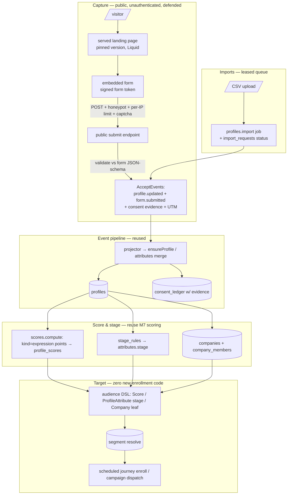

# Phase 4 (final slice) Implementation Plan: Acquisition Baseline — Forms, Pages, Tracking, Scoring, Stages, Companies & Imports

Status: not started. Completes **Phase 4** (channel & acquisition baseline) on top of Milestones
1–7. Delivers `plan.md §5.12` (forms, pages, scoring, baseline automation) + the acquisition half
of §14 Phase 4: the **top-of-funnel capture → score → stage → target** loop that lets a company's
marketing team acquire and grow the audiences the journeys and AI copilots already act on.

Delivers:
1. **Form builder** (typed fields, validation, consent evidence, spam protection, submit actions).
2. **Landing pages** (versioned publication, assets, embedded forms, safe rendering).
3. **Link / UTM tracking** (redirect + attribution, extending the existing tracked-link model).
4. **Rules-based lead scoring + lifecycle stages** (reusing M7's scoring, plus score/stage-triggered
   audiences & journeys).
5. **Company / account (B2B) profiles** and relationship targeting.
6. **Contact/list imports** (CSV) via the leased job queue with per-row results.

This is a **recipe book**, like the Phase 2–7 plans. Every task references a recipe and ends with a
**Done when** check. **If a task feels ambiguous, open the named existing file, copy it, rename, and
change the fields.** Recipes 6.1–6.34 from prior plans still apply verbatim; this plan adds recipes
6.35–6.39.

> **This is a large milestone by design** (the whole acquisition baseline). The foundations (13.0)
> land first; then forms/pages/tracking (13.1–13.4) form the capture core; scoring/stages/companies/
> imports (13.5–13.8) each ship independently. Treat 13.4-green as the "capture works" checkpoint.

> **Milestone 13.0 comes first and is non-negotiable.** Every public-facing surface below is
> **unauthenticated** (a form POST, a served page) and the codebase has **no anti-abuse whatsoever**
> today (no captcha/honeypot/per-IP limit — only per-tenant quotas). 13.0 builds the public-serving +
> anti-abuse substrate before any public endpoint exists.

## Design decisions (locked)

1. **Forms & pages are versioned resources; publish freezes an immutable version to blob.** Reuse
   the journey publish freeze verbatim (`internal/journey/publish.go:22-55`: canonicalize → `sha256`
   → `blob.Put` before the tx → immutable version row) and the `internal/blob/minio.go` store.
   Publishing requires the **human-actor gate** (`journeys.go:80`); a served page/form renders a
   **pinned** version, never the draft.
2. **Public endpoints are unauthenticated but defended.** A public form POST and a served page use
   plain `mux.HandleFunc` (no `s.authenticate`), exactly like the `/r/{token}`, `/o/{token}`, and
   `/v1/callbacks/*` routes (`server.go:137-141`). Because there is **no anti-abuse today**, every
   public write MUST pass: (a) a per-IP rate limiter, (b) a honeypot field, (c) an **HMAC-signed form
   token** issued when the page/form is served (binds a submission to a rendered form + expiry,
   mirroring `SignLinkToken`/`VerifyLinkToken` `render/links.go:66-108`), and (d) an optional pluggable
   captcha hook. A public endpoint without all four is a bug.
3. **Nothing writes `profiles`/`companies` directly — everything rides the event pipeline.** A form
   submission or an import row emits `profile.updated` (+ `identity.*`, + a new `form.submitted` /
   `company.updated` event) through `AcceptEvents` (idempotent on `(tenant,app,idempotency_key)`,
   `store.go:229`), and the projector's `ensureProfile` + `profile.updated` merge
   (`store.go:408,414-425`) creates/updates the row. This preserves idempotency, consent, and merge
   semantics. **Consent evidence** (IP, timestamp, form id) is captured into `consent_ledger.evidence`
   (already supported, `store.go:431-448`).
3b. New event types (`form.submitted`, `company.updated`, `stage.changed`) are added to the built-in
   allowlist `isBuiltInEvent` (`admin.go:129-138`) or registered as schemas.
4. **Link/UTM tracking extends the existing tracked-link model.** Reuse the `/r/{token}` redirect →
   `link.clicked` flow (`templates.go:258-298`) and the HMAC link tokens (`render/links.go`). Add
   **UTM** columns to a generalized short-link/redirect resource (today `tracked_links` is keyed to
   `template_id` with no UTM, `010_templates.sql:35-42`) and capture UTM params on form submissions →
   stamped onto the profile/events for attribution.
5. **Rules-based lead scoring REUSES M7's scoring — no new points table.** A lead score is a
   `scoring_models` row with **`kind='expression'`** (`031_scoring.sql:8` already admits it) whose
   `definition.expr` is a weighted points formula and whose `output_max` is raised; points land in
   `profile_scores.value` (numeric) and are queryable by the existing **`Score` audience leaf**
   (`compile_pg.go:89-118`). The lead-scoring UI is a friendlier authoring surface over an expression
   model. Scoring stays **batch/pull** via the `scores.compute` job (`operations.go:225`); an optional
   projector hook to enqueue recompute for touched profiles is an **enhancement**, not the baseline.
6. **Lifecycle stages are categorical → `profiles.attributes.stage`, not `profile_scores`.**
   (`profile_scores.value` is numeric-only, `031_scoring.sql:42`.) A new **`stage_rules`** resource
   sets `attributes.stage` (via a `stage.changed` → `profile.updated` projection) when a profile
   enters a segment / crosses a score threshold. Stage- and score-triggered audiences reuse the
   existing `ProfileAttribute` / `Score` DSL leaves → **zero new enrollment code** (`ResolveSegment`
   → scheduled `EnrollJourneyRun`, `enroll.go:44,117`).
7. **Company/account (B2B) profiles are a new `companies` table + a `company_members` membership**
   (mirror `segment_members`, `store.go:373-392`). A new **`Company` audience leaf** targets by
   company attribute via a **parameterized** subquery (precedent: the `Score` leaf, fully bound —
   never string-interpolated; keep the `fieldSafetyRegex` allowlist for identifiers). Companies are
   created/updated through events (`company.updated`) and imports too.
8. **Imports run on the leased `operation_jobs` queue.** A new **`profiles.import`** job type (widen
   the CHECK per the `025`/`031` precedent) + an **`import_requests`** status resource (mirror
   `scoring_requests`/`privacy_requests`, `032_scoring_requests.sql`, 202 + status) + per-row results.
   The worker parses CSV, maps columns → attributes/identity/company, and **emits events** via
   `AcceptEvents` (idempotent) — never a direct bulk write. Consent/suppression are honored.
9. **Governance & determinism carry over.** Public endpoints rate-limited + bot-protected + consent-
   evidenced; scopes in three places (`rbac.go:12`, the `api_keys` default array in the new migration,
   routes); every new enum value in a CHECK; no `math/rand`; reuse the schemas validator, blob freeze,
   link tokens, consent ledger, `operation_jobs`, audience DSL, and render engine.

---

## 1. Architecture



**Reused unchanged:** the JSON-Schema validator (`internal/schemas`), the immutable-version blob
freeze (`journey/publish.go` + `blob/minio.go`), the Liquid renderer (`render/render.go`), link
tokens + redirect + `link.clicked` (`render/links.go` + `templates.go:258-339`), the consent ledger
with `evidence` (`store.go:426-451`), the event pipeline + `ensureProfile` projection
(`store.go:196-307,408-425`), M7 scoring (`scoring_models`/`profile_scores`/`Score` leaf/expression
evaluator), the audience DSL + `ResolveSegment` + scheduled enrollment, the `operation_jobs` leased
queue + status-resource pattern, and the three-place scope/RBAC wiring.

### 1.1 What is greenfield vs reused

| Capability | Reuse | New build |
|---|---|---|
| Forms / pages versioning | `journey/publish.go` freeze + `blob` | `forms`/`form_versions`, `pages`/`page_versions` |
| Public serving | `render/render.go` (Liquid) | HTML-serving endpoint (none today) |
| Public submit | callback route pattern (`server.go:139`) | signed form token + honeypot + per-IP limit + captcha hook (**all greenfield**) |
| Profile/company writes | event pipeline (`AcceptEvents`→projection) | `form.submitted`/`company.updated` event types |
| UTM/link tracking | `/r/{token}` + link tokens | UTM columns + generalized short-link resource |
| Lead scoring | M7 `profile_scores` + `Score` leaf + expression eval | expression "points" models (no new table) |
| Lifecycle stages | `attributes.stage` + `ProfileAttribute` leaf | `stage_rules` resource |
| Companies | `segment_members` membership shape | `companies` + `company_members` + `Company` leaf |
| Imports | `operation_jobs` + status-resource pattern | `profiles.import` job + `import_requests` + CSV parse |

---

## 2. Schema (new migrations)

Next numbers after `034_experiment_versions.sql`. Conventions: `IF NOT EXISTS`, uuid PKs,
`timestamptz`, tenant/workspace FKs, CHECK-constrained enums enumerating **every** value the code
writes.

### 2.1 `035_forms.sql`
```sql
CREATE TABLE IF NOT EXISTS forms (
    id uuid PRIMARY KEY DEFAULT gen_random_uuid(),
    tenant_id uuid NOT NULL REFERENCES tenants(id),
    workspace_id uuid NOT NULL REFERENCES workspaces(id),
    name text NOT NULL,
    status text NOT NULL DEFAULT 'draft' CHECK (status IN ('draft','published','archived')),
    draft jsonb NOT NULL DEFAULT '{}'::jsonb,   -- {fields:[{key,type,required,validation,consent?,maps_to}], submit_actions}
    current_version_id uuid,
    latest_version integer NOT NULL DEFAULT 0,
    created_at timestamptz NOT NULL DEFAULT now(),
    updated_at timestamptz NOT NULL DEFAULT now(),
    UNIQUE (tenant_id, workspace_id, name)
);
CREATE TABLE IF NOT EXISTS form_versions (
    id uuid PRIMARY KEY DEFAULT gen_random_uuid(),
    form_id uuid NOT NULL REFERENCES forms(id) ON DELETE CASCADE,
    tenant_id uuid NOT NULL,
    version integer NOT NULL,
    definition jsonb NOT NULL,                  -- frozen fields + JSON Schema + submit actions
    manifest_key text NOT NULL,                 -- content-addressed blob
    published_by uuid NOT NULL,
    published_at timestamptz NOT NULL DEFAULT now(),
    UNIQUE (form_id, version)
);
CREATE TABLE IF NOT EXISTS form_submissions (
    id uuid PRIMARY KEY DEFAULT gen_random_uuid(),
    tenant_id uuid NOT NULL,
    workspace_id uuid NOT NULL,
    app_id uuid NOT NULL,
    form_id uuid NOT NULL REFERENCES forms(id) ON DELETE CASCADE,
    form_version integer NOT NULL,
    profile_id uuid,                            -- resolved after projection
    payload jsonb NOT NULL,                     -- validated field values (PII per classification)
    utm jsonb,                                  -- {source,medium,campaign,term,content}
    source_event_id uuid NOT NULL,              -- the profile.updated/form.submitted event
    submitted_at timestamptz NOT NULL DEFAULT now(),
    UNIQUE (tenant_id, source_event_id)
);
ALTER TABLE api_keys ALTER COLUMN scopes SET DEFAULT ARRAY[
    'events:write','profiles:read','schemas:read','schemas:write',
    'api_keys:read','api_keys:write','privacy:write','operations:read','operations:write',
    'users:read','users:write','roles:read','roles:write',
    'segments:read','segments:write','templates:read','templates:write',
    'campaigns:read','campaigns:write','suppressions:read','suppressions:write',
    'journeys:read','journeys:write','journeys:publish',
    'experiments:read','experiments:write','reports:read',
    'device_tokens:read','device_tokens:write',
    'ai:read','ai:configure','ai:invoke','prompts:read','prompts:write',
    'scoring:read','scoring:write','scoring:compute',
    'forms:read','forms:write','forms:publish','pages:read','pages:write','pages:publish',
    'assets:read','assets:write','links:read','links:write',
    'companies:read','companies:write','stages:read','stages:write','imports:read','imports:write'
];
```

### 2.2 `036_pages_assets.sql`
```sql
CREATE TABLE IF NOT EXISTS landing_pages (
    id uuid PRIMARY KEY DEFAULT gen_random_uuid(),
    tenant_id uuid NOT NULL REFERENCES tenants(id),
    workspace_id uuid NOT NULL REFERENCES workspaces(id),
    slug text NOT NULL,                         -- public path segment
    name text NOT NULL,
    status text NOT NULL DEFAULT 'draft' CHECK (status IN ('draft','published','archived')),
    draft jsonb NOT NULL DEFAULT '{}'::jsonb,   -- {template, form_id?, meta}
    current_version_id uuid,
    latest_version integer NOT NULL DEFAULT 0,
    created_at timestamptz NOT NULL DEFAULT now(),
    updated_at timestamptz NOT NULL DEFAULT now(),
    UNIQUE (tenant_id, workspace_id, slug)
);
CREATE TABLE IF NOT EXISTS page_versions (
    id uuid PRIMARY KEY DEFAULT gen_random_uuid(),
    page_id uuid NOT NULL REFERENCES landing_pages(id) ON DELETE CASCADE,
    tenant_id uuid NOT NULL,
    version integer NOT NULL,
    definition jsonb NOT NULL,                  -- frozen template + form ref + meta
    manifest_key text NOT NULL,
    published_by uuid NOT NULL,
    published_at timestamptz NOT NULL DEFAULT now(),
    UNIQUE (page_id, version)
);
CREATE TABLE IF NOT EXISTS assets (
    id uuid PRIMARY KEY DEFAULT gen_random_uuid(),
    tenant_id uuid NOT NULL REFERENCES tenants(id),
    workspace_id uuid NOT NULL REFERENCES workspaces(id),
    filename text NOT NULL,
    content_type text NOT NULL,
    blob_key text NOT NULL,                     -- content-addressed sha256 key
    size_bytes bigint NOT NULL,
    created_at timestamptz NOT NULL DEFAULT now(),
    UNIQUE (tenant_id, blob_key)
);
```

### 2.3 `037_tracking_companies_stages.sql`
```sql
-- Generalized short link / redirect with UTM (tracked_links stays for email templates).
CREATE TABLE IF NOT EXISTS short_links (
    id uuid PRIMARY KEY DEFAULT gen_random_uuid(),
    tenant_id uuid NOT NULL REFERENCES tenants(id),
    workspace_id uuid NOT NULL REFERENCES workspaces(id),
    slug text NOT NULL,                         -- /s/{slug}
    destination_url text NOT NULL,
    utm jsonb,                                  -- appended on redirect
    created_at timestamptz NOT NULL DEFAULT now(),
    UNIQUE (tenant_id, slug)
);

CREATE TABLE IF NOT EXISTS companies (
    id uuid PRIMARY KEY DEFAULT gen_random_uuid(),
    tenant_id uuid NOT NULL REFERENCES tenants(id),
    workspace_id uuid NOT NULL REFERENCES workspaces(id),
    app_id uuid NOT NULL,
    external_id text,                           -- domain or CRM id
    name text NOT NULL,
    attributes jsonb NOT NULL DEFAULT '{}'::jsonb,
    version integer NOT NULL DEFAULT 1,
    created_at timestamptz NOT NULL DEFAULT now(),
    updated_at timestamptz NOT NULL DEFAULT now(),
    UNIQUE (tenant_id, app_id, external_id)
);
CREATE TABLE IF NOT EXISTS company_members (
    tenant_id uuid NOT NULL,
    company_id uuid NOT NULL REFERENCES companies(id) ON DELETE CASCADE,
    profile_id uuid NOT NULL REFERENCES profiles(id) ON DELETE CASCADE,
    role text,
    created_at timestamptz NOT NULL DEFAULT now(),
    PRIMARY KEY (company_id, profile_id)
);
CREATE INDEX IF NOT EXISTS company_members_profile_idx ON company_members (tenant_id, profile_id);

-- Lifecycle-stage rules: a match → set profiles.attributes.stage (via a stage.changed event).
CREATE TABLE IF NOT EXISTS stage_rules (
    id uuid PRIMARY KEY DEFAULT gen_random_uuid(),
    tenant_id uuid NOT NULL REFERENCES tenants(id),
    workspace_id uuid NOT NULL REFERENCES workspaces(id),
    stage text NOT NULL,                        -- e.g. 'lead','mql','sql','customer'
    segment_id uuid REFERENCES segments(id),    -- membership that assigns the stage
    priority integer NOT NULL DEFAULT 0,        -- highest-priority matching rule wins
    enabled boolean NOT NULL DEFAULT true,
    created_at timestamptz NOT NULL DEFAULT now(),
    UNIQUE (tenant_id, workspace_id, stage)
);
```

### 2.4 `038_imports.sql`
```sql
CREATE TABLE IF NOT EXISTS import_requests (
    id uuid PRIMARY KEY DEFAULT gen_random_uuid(),
    tenant_id uuid NOT NULL,
    workspace_id uuid NOT NULL,
    app_id uuid NOT NULL,
    requested_by uuid NOT NULL,
    kind text NOT NULL CHECK (kind IN ('profiles','companies','suppressions')),
    source_blob_key text NOT NULL,              -- uploaded CSV in blob storage
    mapping jsonb NOT NULL,                     -- column → attribute/identity/company field
    status text NOT NULL DEFAULT 'pending' CHECK (status IN ('pending','processing','complete','failed')),
    total_rows integer NOT NULL DEFAULT 0,
    imported_rows integer NOT NULL DEFAULT 0,
    failed_rows integer NOT NULL DEFAULT 0,
    result_ref text,                            -- per-row results blob
    error text,
    created_at timestamptz NOT NULL DEFAULT now(),
    completed_at timestamptz
);

ALTER TABLE operation_jobs DROP CONSTRAINT IF EXISTS operation_jobs_job_type_check;
ALTER TABLE operation_jobs ADD CONSTRAINT operation_jobs_job_type_check
    CHECK (job_type IN ('privacy.export','privacy.delete','profiles.replay','retention.enforce',
                        'ai.generate','scores.compute','profiles.import'));
```

---

## 3. The seams to get right

### 3.1 Public submit (anti-abuse → events)
```
POST /f/{formId}   (unauthenticated)
  1. per-IP rate limit (in-memory token bucket keyed by client IP)          → 429
  2. honeypot field must be empty                                           → 200 silent-drop
  3. VerifyFormToken(hmac, formId, version, expiry)                         → 403
  4. optional captcha hook (pluggable; no-op if unconfigured)               → 403
  5. validate values vs the pinned form version's JSON Schema               → 422
  6. AcceptEvents([profile.updated{attrs+maps_to}, form.submitted{form,utm}],
        consent.changed{evidence:{ip,ts,form_id}} if a consent field)       (idempotency key = form token id)
  7. record form_submissions (ON CONFLICT source_event_id DO NOTHING)
  8. redirect / thank-you (per submit_actions)
```
- Client IP from a **trusted** header only if a trusted-proxy is configured; else `RemoteAddr`.

### 3.2 Public page serving
- `GET /p/{slug}` (unauthenticated): load the page's **pinned** `page_versions` row, render its
  template via `render.Render` (Liquid, `include` disabled), inject a **signed form token** for any
  embedded form, set `Content-Type: text/html`. Assets served from `GET /a/{blobKey}` via
  `BlobStore.Get`. (No HTML-serving endpoint exists today — this is new.)

### 3.3 Company leaf + stage attribute (audience DSL)
- `Company{Field, Operator, Value}` → parameterized `id IN (SELECT profile_id FROM company_members m
  JOIN companies c ON c.id=m.company_id WHERE c.tenant_id=$n AND c.attributes->>'<field>' <op> $n)`
  (identifier via `fieldSafetyRegex`; values bound). Stage uses the existing `ProfileAttribute` leaf
  on `attributes->>'stage'` — no new leaf needed.

---

## 4. Exit-criteria traceability (`plan.md §5.12` + §14 Phase 4 close)

| Element | How this plan meets it | Milestone |
|---|---|---|
| Form builder: typed fields, validation, consent evidence, spam protection, submit actions | `forms`/`form_versions` + schemas validator + signed-token/honeypot/rate-limit + consent evidence | 13.1, 13.2 |
| Landing pages: versioned publish, assets, safe forms | `landing_pages`/`page_versions` + `assets` + public serving | 13.3 |
| Redirect/link tracking + UTM attribution | `short_links` + UTM on redirect + submissions | 13.4 |
| Rules-based points, stages, score history, score-triggered audiences/journeys | M7 `profile_scores` (expression) + `stage_rules` + DSL leaves | 13.5, 13.6 |
| Company/account profiles + relationship targeting | `companies` + `company_members` + `Company` leaf | 13.7 |
| Imports for contacts/companies/suppressions | `profiles.import` job + `import_requests` + CSV | 13.8 |

---

## 5. Implementation recipes (new; 6.1–6.34 from prior plans still apply)

### 6.35 Versioned public resource (form / page)
- Copy the journey publish freeze (`publish.go:22-55`): draft → canonicalize → `sha256` → `blob.Put`
  → immutable `*_versions` row behind the human gate; flip `current_version_id`. **Done when:** publish
  is idempotent; api_key → 403; the served surface renders the pinned version, not the draft.

### 6.36 Public anti-abuse endpoint
- Plain `mux.HandleFunc` (no auth) + the four defenses (§3.1) + validate vs the form's JSON Schema +
  emit events via `AcceptEvents`. **Done when:** a missing/expired token → 403; a filled honeypot →
  silent 200 with no event; a burst from one IP → 429; a valid submission creates exactly one profile
  (idempotent) with consent evidence.

### 6.37 UTM / short-link tracking
- `short_links` + `GET /s/{slug}` redirect that appends UTM and emits `link.clicked` (reuse the
  `/r/{token}` handler shape, `templates.go:258-298`); capture UTM on form submissions. **Done when:**
  a redirect records a click with UTM and lands on the destination.

### 6.38 Company / account + membership + DSL leaf
- `companies` + `company_members` (upsert via `company.updated` events) + a parameterized `Company`
  audience leaf (§3.3). **Done when:** a segment targeting a company attribute resolves to that
  company's members and the SQL binds every value.

### 6.39 CSV import job
- `import_requests` + `profiles.import` job (widen the CHECK) + a worker `case` that streams CSV,
  maps columns, and emits `profile.updated`/`identity.*`/`company.updated` via `AcceptEvents`
  idempotently; write per-row results. **Done when:** importing the same CSV twice yields one profile
  per row (idempotent) and a per-row result report.

---

## 6. Task list

Testing bar: unit + golden per milestone; one consolidated integration/anti-abuse pass in 13.10.
Each task ends with a **Done when**. Do them in order; compile + `go vet` between milestones.

### Milestone 13.0 — Foundations: public serving + anti-abuse substrate — DO FIRST
1. [x] **Anti-abuse primitives** `internal/httpapi/publicguard.go`: a per-IP token-bucket limiter, a
	honeypot check, an HMAC **form-token** signer/verifier (mirror `render/links.go:66-108`), and a
	pluggable captcha interface (no-op default). *Done when:* unit tests cover limit/honeypot/token
	expiry/tamper. — done: `publicguard_test.go` covers token-bucket limit/refill, honeypot, token
	expiry/tamper, trusted client IP handling, and no-op captcha; full Go build/vet/test passes.
2. [x] **HTML-serving substrate**: a helper that renders a pinned version via `render.Render` and writes
   `Content-Type: text/html` (+ a static asset route `GET /a/{blobKey}` via `BlobStore.Get`). *Done
   when:* a trivial page renders as HTML and an asset streams from blob. — done: `publicserve_test.go` proves Liquid HTML rendering and blob-backed asset streaming; full Go build/vet/test passes.
3. [x] **Versioned-resource scaffold** `internal/publishing`: the shared draft→immutable-published (blob
   freeze) helper reused by forms & pages (Recipe 6.35), behind the human-actor gate. *Done when:* a
   fixture resource publishes idempotently; api_key → 403. — done: `publishing_test.go` proves deterministic blob freeze, idempotent retry, and API-key rejection before commit; full Go build/vet/test passes.

### Milestone 13.1 — Forms (schema + typed fields + versioned publish)
1. [x] **Migration** `035_forms.sql` per §2.1 + scopes `forms:read/write/publish` (and the rest of the
   acquisition scopes) in `rbac.go` allowlist + the `api_keys` default array. *Done when:* tables +
   scopes exist. — done: `035_forms.sql` creates the form/version/submission tables and acquisition
   scopes; RBAC allowlist updated; migration and full Go suite pass.
2. [x] **Form store + CRUD + publish** `internal/postgres/forms.go` + `ports.Store` (Recipes 6.35): draft
   CRUD; publish freezes a `form_versions` row with a compiled JSON Schema. HTTP `/v1/forms`. *Done
   when:* a form round-trips and publishes an immutable version; the schema compiles. — done: typed form schema compilation/validation test, tenant-scoped CRUD, idempotent blob-frozen publish, and authenticated `/v1/forms` routes; full Go build/vet/test passes.

### Milestone 13.2 — Public form submission (capture core)
1. [x] **Public submit** `POST /f/{formId}` (Recipe 6.36) using the 13.0 guard: validate vs the pinned
   version schema, emit `profile.updated` + `form.submitted` (+ `consent.changed` w/ evidence) via
   `AcceptEvents`, record `form_submissions`, capture UTM. Add `form.submitted` to `isBuiltInEvent`.
   *Done when:* a valid submission creates one profile idempotently with consent evidence; honeypot/
   bad-token/over-limit are rejected as in §3.1. — done: `form_submit_test.go` proves defended valid
   capture, idempotent event keys, consent event evidence, honeypot silent-drop, bad-token 403, and
   per-IP 429; full Go build/vet/test passes.

### Milestone 13.3 — Landing pages + assets
1. [x] **Migration** `036_pages_assets.sql` per §2.2 + scopes `pages:*`, `assets:*`. *Done when:* exists. — done: added landing-page/version and content-addressed asset tables with existing page/asset scope wiring; Go build/vet/test pass.
2. [x] **Pages + assets store/CRUD/publish** + asset upload (`POST /v1/assets` → `BlobStore.Put`,
   content-addressed). *Done when:* a page publishes an immutable version; an asset uploads + lists.
   — done: landing-page CRUD/publish and tenant-scoped content-addressed asset APIs added; focused freeze/upload tests plus full Go build/vet/test pass.
3. [x] **Public page serving** `GET /p/{slug}` (§3.2): render the pinned version, inject a signed form
   token for the embedded form. *Done when:* the page serves HTML, embeds a working form, and a
   submission from it succeeds end-to-end. — done: `pages_assets_test.go` proves draft isolation,
   signed-token rendering, and token-backed form submission with event emission; full Go build/vet/test passes.

### Milestone 13.4 — Link / UTM tracking
1. **Migration** `037_tracking_companies_stages.sql` (this task: `short_links`) + scopes `links:*`.
   *Done when:* exists.
2. **Short-link redirect** `GET /s/{slug}` (Recipe 6.37): append UTM, emit `link.clicked`, redirect;
   capture UTM onto form submissions/profile. *Done when:* a redirect records a UTM click and lands.

### Milestone 13.5 — Rules-based lead scoring (reuse M7)
1. **Lead-scoring authoring**: a friendly surface that creates a `kind='expression'` scoring model
   (points formula, `output_max` raised) reusing M7's registry + `scores.compute`; NO new points
   table. *Done when:* a lead-score model computes into `profile_scores` and a `Score` audience leaf
   filters on it. (Optional) a projector hook enqueues recompute for touched profiles.

### Milestone 13.6 — Lifecycle stages
1. **`stage_rules`** (migration §2.3 stage_rules portion) + a `stages.apply` pass (reuse the
   scheduled/enroll cron shape) that sets `attributes.stage` via a `stage.changed`→`profile.updated`
   event when a profile matches a rule's segment (highest priority wins). Add `stage.changed` to
   `isBuiltInEvent`. *Done when:* a profile entering a rule's segment gets the stage, and a
   stage-targeted segment (ProfileAttribute on `attributes.stage`) resolves it.

### Milestone 13.7 — Company / account profiles
1. **Migration** `companies` + `company_members` (§2.3) + scopes `companies:*`. *Done when:* exist.
2. **Companies store + CRUD + membership** (upsert via `company.updated` events) + a **`Company`**
   audience leaf (Recipe 6.38, parameterized). Add `company.updated` to `isBuiltInEvent`. *Done when:*
   a company + members round-trip and a company-attribute segment resolves to its members.

### Milestone 13.8 — Imports (CSV)
1. **Migration** `038_imports.sql` + scopes `imports:*` + the `profiles.import` job type. *Done when:*
   exists.
2. **Import job** (Recipe 6.39): `POST /v1/imports` (upload CSV to blob + enqueue, 202 + status
   resource) + a worker `case "profiles.import"` that streams rows, maps columns, emits events via
   `AcceptEvents`, and writes per-row results. *Done when:* re-importing the same CSV yields one
   profile/company per row (idempotent) with a per-row result report; status reaches `complete`.

### Milestone 13.9 — UI
1. **Form + page builders**: typed-field form builder (with consent + honeypot), landing-page editor
   (embed a form, upload assets, publish). *Done when:* `npm run build` passes; a form and a page
   round-trip and publish.
2. **Acquisition surfaces**: short-links/UTM, lead-scoring rules, lifecycle stages, companies, and an
   import wizard (upload + column mapping + results). *Done when:* each round-trips; the import wizard
   shows per-row results.

### Milestone 13.10 — Integration, anti-abuse, governance & audit closeout
1. **Capture E2E** (DB-gated): serve a page → submit its form → assert one profile created with
   consent evidence + UTM, and a `form.submitted` event. *Done when:* asserted.
2. **Anti-abuse**: honeypot silent-drop, expired/tampered token → 403, per-IP burst → 429, bad values
   → 422 — each proven by a test. *Done when:* asserted.
3. **Idempotency & governance**: re-submitting / re-importing the same input creates no duplicate
   profile; form/page publish requires a human actor (api_key → 403); every capture rides the event
   pipeline (no direct profile write). *Done when:* asserted.
4. **Run the suite**: `go build/vet/test ./...`, `go mod tidy`, `cd web && npm run typecheck &&
   npm run build && npm test`, `npm audit`. *Done when:* green.
5. **Audit doc** `docs/milestones/v1-milestone-8-audit.md` in the M2–M7 table format, one row per
   requirement (13.0–13.10) with direct evidence. *Done when:* every row cites a named file/test.

---

## 7. Carry-over hazards & invariants

1. **Do 13.0 first.** No public endpoint ships before the anti-abuse substrate exists.
2. **Every public write is defended.** Per-IP rate limit + honeypot + signed form token + optional
   captcha + JSON-Schema validation — on every unauthenticated submit. A public endpoint without all
   of these is a bug. Never trust the client IP header unless a trusted proxy is configured.
3. **Nothing writes `profiles`/`companies` directly.** Forms and imports emit events via
   `AcceptEvents` (idempotent) and let the projector create/merge rows — preserving idempotency,
   identity-merge, and consent. Every submission/import row carries an idempotency key.
4. **Rules-based points reuse M7 `profile_scores` (kind='expression')** — do NOT create a parallel
   points table. **Stages are categorical → `attributes.stage`**, never `profile_scores` (numeric).
5. **Forms & pages are immutable once published** (blob freeze); publishing requires the human-actor
   gate; served surfaces render the pinned version, never the draft.
6. **Audience legs (Company, stage, score) are parameterized + scoped.** No value/identifier
   interpolation; keep the `fieldSafetyRegex` allowlist; filter `tenant_id` + `workspace_id`.
7. **Consent + suppression honored on every capture and import**; consent evidence recorded; imports
   never resurrect a suppressed endpoint.
8. **Determinism/governance:** no `math/rand`; scopes in three places (`rbac.go`, `api_keys` default
   in the new migration, routes); widen `operation_jobs.job_type` for `profiles.import`; enumerate
   every new enum value; add new event types to `isBuiltInEvent`.
9. **Reuse existing seams** — schemas validator, blob freeze, link tokens/redirect, consent ledger,
   the event pipeline, M7 scoring, the audience DSL, `operation_jobs` — don't reinvent them.

## 8. Open items to confirm before coding

- **Captcha provider.** v1 ships a pluggable hook + honeypot + per-IP limit; a concrete provider
  (hCaptcha/Turnstile) is optional/config-driven. Confirm whether any concrete provider is required
  in v1 or the hook + honeypot + rate-limit suffice.
- **Page hosting / custom domains.** v1 serves pages under a platform path (`/p/{slug}`); custom
  domains + TLS are deferred to a later milestone. Confirm.
- **Incremental scoring.** Baseline is batch `scores.compute`; an event-triggered recompute hook is an
  optional 13.5 enhancement. Confirm batch-only for v1 or include the hook.
- **Stage storage.** Stages live in `profiles.attributes.stage` (reuse) with `stage_rules` driving
  transitions; a dedicated stage-history table is deferred. Confirm.
- **Company model depth.** v1 is flat `companies` + `company_members`; hierarchies / account
  relationships beyond membership are deferred. Confirm.
- **Imports scope.** v1 is CSV upload only (profiles/companies/suppressions); warehouse/object-store
  connectors are deferred to a later "Data & connectors" milestone. Confirm.
- **Trusted-proxy config** for client-IP extraction (needed for correct per-IP limiting behind a load
  balancer). Confirm the deployment's proxy header.
