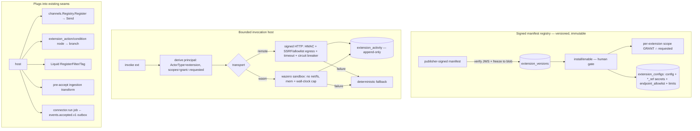

# Phase 4/§10 (slice) Implementation Plan: Extension Ecosystem — Signed Remote & WASI Extensions

Status: not started. Completes the **Remote/Wasm extension protocol** of `plan.md §14 Phase 4` and
implements the §10 Extensibility spec, on top of Milestones 1–8. Delivers a **governed extension
platform** so third parties (and the AI copilots) can add channel providers, journey
actions/conditions, connectors, ingestion transforms, and template functions **without forking the
core** — every extension signed, versioned, permission-scoped, sandboxed, bounded, and audited.

Delivers:
1. **Signed, versioned extension manifest registry** (identity + signature, capabilities + requested
   scopes, config schema + secret refs, subscribed events, actions/conditions I/O schemas, callback
   endpoints or Wasm exports, health/timeout/limits, retry/idempotency semantics — `plan.md §10`).
2. **Signed remote-invocation host** (signed HTTP over the existing SSRF/allowlist-guarded egress) +
   two remote extension types wired into existing seams: a **remote channel provider** and a
   **remote journey action/condition node**.
3. **WASI/Wasm deterministic sandbox** (`wazero`, no default network/fs) powering **ingestion
   transforms** and **template functions**.
4. **Outbound connector** extension (subscribes to the event outbox) + governance: per-extension
   scope grants, audit, health/circuit-breaker, kill switch.

This is a **recipe book**, like the Phase 2–8 plans. Every task references a recipe and ends with a
**Done when** check. **If a task feels ambiguous, open the named existing file, copy it, rename, and
change the fields.** Recipes 6.1–6.39 from prior plans still apply verbatim; this plan adds recipes
6.40–6.44.

> **This is a large, infra-heavy milestone.** The substrate (14.0–14.1: registry + invocation host)
> lands first; then remote extension types (14.2–14.3), then the WASI sandbox + its uses (14.4–14.6),
> then connectors + governance (14.7–14.8). Treat 14.3-green (a remote extension runs, bounded &
> audited) as the checkpoint. Each type ships independently.

> **Milestone 14.0 comes first and is non-negotiable.** No extension can be invoked before the
> signed, scope-granted, versioned registry exists — an unsigned or over-scoped extension is a
> security hole.

## Design decisions (locked)

1. **Extensions are signed, versioned, immutable manifests.** An `extensions` parent +
   `extension_versions` (immutable, manifest blob-frozen via the `journey/publish.go:40-54` freeze,
   publisher **JWS signature** verified with the already-present `go-jose/v4`) mirroring
   `prompt_versions` (`026_ai_registry.sql`) / `scoring_model_versions` (`031_scoring.sql`). The
   manifest declares everything in `plan.md §10`. **Installing/enabling** a version requires the
   **human-actor gate** (`journeys.go:80`); an unverified signature is rejected.
2. **Remote extensions use SIGNED HTTP, not a new RPC framework.** `plan.md §10` permits "signed HTTP
   or Connect RPC"; v1 uses **HMAC-signed HTTP** (reuse `webhook.go:134` signing) over the
   SSRF/allowlist-guarded egress client (`httpprovider.go:51` dial guard + `ai/egress.go:38`
   `IsDomainAllowed`), avoiding a gRPC/Connect dependency. Connect-RPC is a documented later option.
3. **Pure deterministic transforms use WASI/Wasm via `wazero`.** This is the **one new go.mod
   dependency** (pure-Go, CGo-free; defaults to **no host network/filesystem**, matching §10's
   "no default network/filesystem access") — justified like `@xyflow/react` was for the DAG builder.
   Modules are sandboxed with a **memory cap + wall-clock deadline**; typed JSON in → JSON out. **No
   dynamically-loaded native Go plugins** (`plan.md §10`).
4. **Every extension invocation is bounded + governed, and can never stall the host.** Reuse the
   `ai_decision` pattern (`nodes.go:294`): a hard per-call `context.WithTimeout`, a per-call budget +
   rate limit, and a **circuit breaker + health check**. A remote/Wasm failure **never** enters a
   retry/dead-letter loop that stalls the host — it falls back deterministically (a journey extension
   node → its **fallback branch**; an ingestion transform → configured **reject-or-passthrough**;
   a channel provider → the adapter's normal `DeliveryError`).
5. **Extension scopes = caller-granted ∩ manifest-requested.** Reuse `deriveAgent`
   (`internal/ai/tools/tools.go:133`): an extension runs under a derived principal
   (`ActorType="extension"`) limited to the **intersection** of the tenant admin's per-extension
   **grant** and the manifest's **requested scopes**. It CANNOT bypass consent, publish, or
   human-approval gates.
6. **Extensions plug into existing seams — not new ones:**
   - remote channel provider → `channels.Registry.Register(provider, adapter)` (`registry.go:58`),
     invoked unchanged via `cfg.Registry.For(provider)` (`campaigns/deliver.go:436`,
     `journey/deliver.go:157`);
   - remote journey action/condition → new `extension_action`/`extension_condition` node types
     (unblock the rejected set at `nodes.go:146`), bounded like `ai_decision`;
   - AI model/provider → the gateway provider factory (`gateway.go:91` `SetProviderFactory`);
   - template function → Liquid `RegisterFilter/RegisterTag` (`render/render.go:11-15`);
   - outbound connector → consume `events.accepted.v1` (`outbox_events` → `dispatcher.go:17`) and run
     as an `operation_jobs` `connector.run` job;
   - ingestion transform → a **new pre-accept hook** (between schema-validate `server.go:329` and
     `AcceptEvents` `server.go:336`).
7. **Config + secrets follow the `ai_provider_configs` template** (`025_ai_gateway.sql:3-13`): a
   `config jsonb` + `*_ref` secret references resolved via env/`_FILE` (`config.go:118`,
   `gateway.go:482`), an `endpoint_allowlist text[]`, per-extension limits, and `status`. Extensions
   never store raw secrets; a remote endpoint must be on the extension's allowlist (SSRF).
8. **Every extension call is audited** in an immutable `extension_activity` log (mirror `ai_activity`:
   extension+version, invocation kind, derived scopes, input/output refs, latency, cost, policy
   decision, health). An unlogged extension call is a bug.
9. **Governance & determinism carry over.** Verify manifest signatures; no unauthenticated extension
   calls; Wasm transforms are deterministic (no host clock/rand/network); scopes in three places
   (`rbac.go`, the `api_keys` default in the new migration, routes); every new enum in a CHECK; reuse
   the blob freeze, HMAC/egress stack, leased queue, outbox, and `deriveAgent`.

---

## 1. Architecture



**Reused unchanged:** the channel `Registry` + `ChannelAdapter` + `HTTPProviderAdapter`
(`internal/channels`), the journey node executor + `ai_decision` bounded-call pattern
(`internal/journey/nodes.go`), the AI gateway provider factory (`internal/ai/gateway.go`), HMAC
signing + SNS/Twilio/push signature verification (`webhook.go`, `callbacks.go`), the SSRF dial guard
+ `IsDomainAllowed`/`endpoint_allowlist` (`httpprovider.go`, `ai/egress.go`), the immutable-version
blob freeze (`journey/publish.go` + `blob`), `deriveAgent` scope-intersection (`ai/tools/tools.go`),
the Liquid engine registration (`render/render.go`), the leased `operation_jobs` queue + `outbox`
+ `dispatcher` + franz-go, the `_ref`→env/`_FILE` secret convention (`config.go`, `gateway.go`), and
the per-call `WithTimeout` + budget + allowlist sandbox-limit template (`gateway.go:95,208,219`).

### 1.1 New dependency

| Need | Choice | Justification |
|---|---|---|
| WASI/Wasm sandbox | `github.com/tetratelabs/wazero` | Pure-Go, CGo-free; **no default host network/filesystem** (matches §10); the only runtime that fits the reduced-profile, no-native-plugins constraint. One new direct go.mod dep (like `@xyflow/react`). |
| Manifest signatures | `go-jose/go-jose/v4` (**already present** for OIDC) | JWS verify against a publisher key — **no new dep**. |

---

## 2. Schema (new migrations)

Next numbers after `040_imports.sql`. Conventions: `IF NOT EXISTS`, uuid PKs, `timestamptz`,
tenant/workspace FKs, CHECK-constrained enums enumerating **every** value the code writes.

### 2.1 `041_extensions.sql`
```sql
CREATE TABLE IF NOT EXISTS extensions (
    id uuid PRIMARY KEY DEFAULT gen_random_uuid(),
    tenant_id uuid NOT NULL REFERENCES tenants(id),
    workspace_id uuid NOT NULL REFERENCES workspaces(id),
    name text NOT NULL,
    publisher text NOT NULL,
    current_version_id uuid,
    latest_version integer NOT NULL DEFAULT 0,
    status text NOT NULL DEFAULT 'installed' CHECK (status IN ('installed','enabled','disabled')),
    created_at timestamptz NOT NULL DEFAULT now(),
    updated_at timestamptz NOT NULL DEFAULT now(),
    UNIQUE (tenant_id, workspace_id, name)
);
CREATE TABLE IF NOT EXISTS extension_versions (
    id uuid PRIMARY KEY DEFAULT gen_random_uuid(),
    extension_id uuid NOT NULL REFERENCES extensions(id) ON DELETE CASCADE,
    tenant_id uuid NOT NULL,
    version integer NOT NULL,
    kind text NOT NULL CHECK (kind IN
        ('channel_provider','journey_action','journey_condition','ai_provider',
         'ingestion_transform','template_function','connector')),
    transport text NOT NULL CHECK (transport IN ('remote_http','wasm')),
    manifest jsonb NOT NULL,                    -- full §10 manifest (capabilities, io schemas, limits, ...)
    requested_scopes text[] NOT NULL DEFAULT '{}',
    signature text NOT NULL,                    -- publisher JWS over the canonical manifest
    signing_key_id text NOT NULL,               -- which trusted publisher key verified it
    wasm_blob_key text,                         -- content-addressed module (transport='wasm')
    manifest_key text NOT NULL,                 -- content-addressed frozen manifest
    status text NOT NULL DEFAULT 'draft' CHECK (status IN ('draft','active','archived')),
    installed_by uuid,                          -- human approver
    installed_at timestamptz,
    created_at timestamptz NOT NULL DEFAULT now(),
    UNIQUE (extension_id, version)
);

-- Per-extension config + secret refs + network allowlist + limits (copy of ai_provider_configs shape).
CREATE TABLE IF NOT EXISTS extension_configs (
    extension_id uuid PRIMARY KEY REFERENCES extensions(id) ON DELETE CASCADE,
    tenant_id uuid NOT NULL,
    workspace_id uuid NOT NULL,
    config jsonb NOT NULL DEFAULT '{}'::jsonb,  -- {..., *_ref secret names, base_url}
    endpoint_allowlist text[] NOT NULL DEFAULT '{}',
    timeout_ms integer NOT NULL DEFAULT 2000,
    max_memory_mb integer NOT NULL DEFAULT 64,  -- wasm only
    monthly_budget_cents bigint NOT NULL DEFAULT 0,
    rate_per_min integer NOT NULL DEFAULT 600,
    status text NOT NULL DEFAULT 'active' CHECK (status IN ('active','disabled')),
    updated_at timestamptz NOT NULL DEFAULT now()
);

-- Granted scopes (a tenant admin grants a subset the extension asked for).
CREATE TABLE IF NOT EXISTS extension_grants (
    extension_id uuid NOT NULL REFERENCES extensions(id) ON DELETE CASCADE,
    tenant_id uuid NOT NULL,
    scope text NOT NULL,
    granted_by uuid NOT NULL,
    granted_at timestamptz NOT NULL DEFAULT now(),
    PRIMARY KEY (extension_id, scope)
);

-- Outbound connector job type.
ALTER TABLE operation_jobs DROP CONSTRAINT IF EXISTS operation_jobs_job_type_check;
ALTER TABLE operation_jobs ADD CONSTRAINT operation_jobs_job_type_check
    CHECK (job_type IN ('privacy.export','privacy.delete','profiles.replay','retention.enforce',
                        'ai.generate','scores.compute','profiles.import','connector.run'));

ALTER TABLE api_keys ALTER COLUMN scopes SET DEFAULT ARRAY[
    'events:write','profiles:read','schemas:read','schemas:write',
    'api_keys:read','api_keys:write','privacy:write','operations:read','operations:write',
    'users:read','users:write','roles:read','roles:write',
    'segments:read','segments:write','templates:read','templates:write',
    'campaigns:read','campaigns:write','suppressions:read','suppressions:write',
    'journeys:read','journeys:write','journeys:publish',
    'experiments:read','experiments:write','reports:read',
    'device_tokens:read','device_tokens:write',
    'ai:read','ai:configure','ai:invoke','prompts:read','prompts:write',
    'scoring:read','scoring:write','scoring:compute',
    'forms:read','forms:write','forms:publish','pages:read','pages:write','pages:publish',
    'assets:read','assets:write','links:read','links:write',
    'companies:read','companies:write','stages:read','stages:write','imports:read','imports:write',
    'extensions:read','extensions:write','extensions:install'
];
```

### 2.2 `042_extension_activity.sql`
```sql
-- Immutable, append-only extension-invocation audit (mirrors ai_activity + its 030 hardening).
CREATE TABLE IF NOT EXISTS extension_activity (
    id uuid PRIMARY KEY DEFAULT gen_random_uuid(),
    tenant_id uuid NOT NULL,
    workspace_id uuid NOT NULL,
    extension_id uuid NOT NULL,
    extension_version integer NOT NULL,
    kind text NOT NULL,                         -- channel_provider | journey_action | ...
    invocation text NOT NULL,                   -- e.g. 'send', 'decide', 'transform'
    derived_scopes text[] NOT NULL DEFAULT '{}',
    input_ref text, output_ref text,
    latency_ms integer NOT NULL DEFAULT 0,
    cost_cents bigint NOT NULL DEFAULT 0,
    policy_decision text NOT NULL
        CHECK (policy_decision IN ('allowed','denied_scope','denied_budget','denied_rate',
                                   'timeout','circuit_open','error','fallback')),
    created_at timestamptz NOT NULL DEFAULT now()
);
CREATE INDEX IF NOT EXISTS extension_activity_idx
    ON extension_activity (tenant_id, workspace_id, extension_id, created_at DESC);
CREATE OR REPLACE FUNCTION extension_activity_block_mutation() RETURNS trigger AS $$
BEGIN RAISE EXCEPTION 'extension_activity is append-only'; END; $$ LANGUAGE plpgsql;
DROP TRIGGER IF EXISTS extension_activity_no_update ON extension_activity;
CREATE TRIGGER extension_activity_no_update BEFORE UPDATE OR DELETE ON extension_activity
    FOR EACH ROW EXECUTE FUNCTION extension_activity_block_mutation();

-- Per-extension event subscription (which event types an ingestion-transform / connector wants).
CREATE TABLE IF NOT EXISTS extension_subscriptions (
    extension_id uuid NOT NULL REFERENCES extensions(id) ON DELETE CASCADE,
    tenant_id uuid NOT NULL,
    event_type text NOT NULL,
    PRIMARY KEY (extension_id, event_type)
);

-- Circuit-breaker / health state per extension (mutable operational state, not audit).
CREATE TABLE IF NOT EXISTS extension_health (
    extension_id uuid PRIMARY KEY REFERENCES extensions(id) ON DELETE CASCADE,
    tenant_id uuid NOT NULL,
    state text NOT NULL DEFAULT 'closed' CHECK (state IN ('closed','open','half_open')),
    consecutive_failures integer NOT NULL DEFAULT 0,
    opened_at timestamptz,
    updated_at timestamptz NOT NULL DEFAULT now()
);
```

---

## 3. The seams to get right

### 3.1 Bounded invocation host (`internal/extension/host.go`)
```
Invoke(ctx, principal, ext, invocation, input) -> (output, activity):
  1. resolve enabled version + config; check circuit breaker (extension_health) → denied circuit_open
  2. derive principal: ActorType="extension", scopes = grant ∩ manifest.requested_scopes
  3. rate + budget check → denied_rate / denied_budget
  4. ctx2 := context.WithTimeout(ctx, config.timeout_ms)
  5a. transport=remote_http: HMAC-sign request, egress via SSRF/allowlist guard, POST, verify response
  5b. transport=wasm: wazero module (mem cap, no net/fs), call export with JSON, honor ctx2 deadline
  6. validate output vs manifest output schema
  7. on success: record extension_activity(allowed) + reset health; on failure: record + trip breaker + return fallback signal
```
- Failure is a **value**, not a host error: callers (journey node, transform, channel adapter) map it
  to a deterministic fallback. Never propagate as a step/job retry that could dead-letter.

### 3.2 Extension journey node (`extension_action` / `extension_condition`)
- Copy `ai_decision` (`nodes.go:294`): default `branch := cfg.Fallback`; only call `host.Invoke`
  when configured; hard timeout; validate output → declared branch or fallback; stamp
  `extension_activity_id` on the transition. Publish validation in `validateOutgoing`/`validateDurations`.

### 3.3 Ingestion transform hook
- A new middleware between `ValidateEventSchema` (`server.go:329`) and `AcceptEvents`
  (`server.go:336`): for each `extension_subscriptions` match, run the wasm transform (deterministic,
  bounded); on failure apply the manifest's `on_error: reject|passthrough`. The transform may only
  **enrich/annotate** the event payload — it cannot forge identity or bypass consent.

---

## 4. Exit-criteria traceability (`plan.md §10` + §14 Phase 4 "Remote/Wasm extension protocol")

| §10 element | How this plan meets it | Milestone |
|---|---|---|
| Manifest: identity, version, publisher, **signature**, capabilities, requested scopes | signed `extension_versions` + JWS verify | 14.0 |
| Config schema + **secret references** | `extension_configs` + `*_ref`/`_FILE` | 14.0 |
| Subscribed event schemas | `extension_subscriptions` + `events.accepted.v1` | 14.5, 14.7 |
| Actions/conditions + I/O JSON Schemas | `extension_action`/`extension_condition` nodes + schema-validated I/O | 14.3 |
| Callback endpoints **or Wasm exports** | `transport IN ('remote_http','wasm')` | 14.1, 14.4 |
| Health check, timeouts, memory/CPU/network limits | `extension_configs` limits + circuit breaker + wazero caps | 14.1, 14.4, 14.8 |
| Retry, idempotency, rate-limit semantics | host rate/budget + idempotency key + circuit breaker | 14.1, 14.8 |
| Extension types (channel/connector/action/condition/transform/template/AI) | wired into existing seams | 14.2–14.7 |
| Remote = signed HTTP/Connect RPC; transforms = WASI, no default net/fs; no native plugins | signed HTTP + wazero | 14.1, 14.4 |

---

## 5. Implementation recipes (new; 6.1–6.39 from prior plans still apply)

### 6.40 Signed extension manifest (registry)
- Copy the journey freeze (`publish.go:40-54`): canonicalize the manifest, `sha256`, `blob.Put`,
  immutable `extension_versions` row; **verify the publisher JWS** (`go-jose`) against a trusted
  signing key before accepting; install/enable behind the human gate. **Done when:** an unsigned/
  wrong-key manifest is rejected; a valid one installs an immutable version; api_key install → 403.

### 6.41 Bounded remote invocation (signed HTTP)
- `internal/extension/remote.go`: HMAC-sign the request (reuse `webhook.go:134`), egress through the
  SSRF/allowlist guard (`httpprovider.go` + `endpoint_allowlist`), hard `context.WithTimeout`,
  circuit breaker + health, record `extension_activity`. **Done when:** a call past its timeout →
  `timeout` activity + fallback; an off-allowlist endpoint is blocked; repeated failures open the breaker.

### 6.42 Extension-backed seam entry
- Register the extension into an existing seam: a `ChannelAdapter` that delegates to `host.Invoke`
  (via `channels.Registry.Register`), or a new `extension_action`/`extension_condition` node (§3.2).
  **Done when:** a send/decision routes through the extension host and is bounded + audited.

### 6.43 WASI deterministic transform
- `internal/extension/wasm.go` (wazero): instantiate a module with **no host net/fs**, a memory cap,
  and the call bounded by the ctx deadline; pass JSON in, read JSON out. **Done when:** the same input
  yields the same output; an infinite-loop module is killed at the deadline; the module cannot open a
  socket/file.

### 6.44 Extension config / secrets / scope grant
- `extension_configs` (config jsonb + `*_ref`) + `extension_grants`; the host derives
  `ActorType="extension"` scopes = grant ∩ requested (reuse `deriveAgent`, `tools.go:133`). **Done
  when:** an extension calling beyond its granted scopes is `denied_scope` + logged; secrets are never
  stored raw (only `*_ref`).

---

## 6. Task list

Testing bar: unit + golden per milestone; a deterministic fake remote + a tiny fixture Wasm module
keep tests reproducible; one consolidated security/integration pass in 14.10. Each task ends with a
**Done when**. Do them in order; compile + `go vet` between milestones.

### Milestone 14.0 — Foundations: signed manifest registry + config + grants — DO FIRST
1. [x] **Migration** `041_extensions.sql` per §2.1 + scopes `extensions:read/write/install` in `rbac.go`
   allowlist and the `api_keys` default array + the `connector.run` job type. *Done when:* tables +
   scopes exist. — done: created 041_extensions.sql, added scopes to allowedPermissions in rbac.go, and verified via TestExtensionsMigrationAndDefaultScopesIntegration_14_0_1.
2. [x] **Registry store + signed freeze** (Recipe 6.40) `internal/postgres/extensions.go` + `ports.Store`:
   manifest CRUD; install verifies the publisher JWS (`go-jose`) against a configured trusted key and
   freezes an immutable `extension_versions` row (blob); install/enable behind the human-actor gate.
   *Done when:* unsigned/wrong-key → rejected; valid → immutable version; api_key → 403. — done: created extensions.go and registry.go, verified signed JWS and human gate via TestExtensionsIntegration.
3. [x] **Config + grants** (Recipe 6.44): `extension_configs` (config + `*_ref` + allowlist + limits) and
   `extension_grants` CRUD; a resolver that yields the granted∩requested scope set. *Done when:* a
   grant of a subset yields exactly that intersection; secrets resolve via `_ref`/`_FILE`. — done: implemented config & grants CRUD + ResolveScopes & ResolveConfigMap helpers, verified via TestExtensionConfigAndGrants_14_0_3.

### Milestone 14.1 — Bounded remote-invocation host
1. [x] **Host + remote transport** `internal/extension/{host,remote}.go` (Recipe 6.41): derive the
   `extension` principal, rate/budget check, HMAC-signed HTTP via the SSRF/allowlist egress, hard
   timeout, circuit breaker (`extension_health`), and an append-only `extension_activity` record
   (migration `042` §2.2). *Done when:* timeout→`timeout`+fallback; off-allowlist→blocked; N
   consecutive failures open the breaker; every call writes exactly one activity row. — done: implemented bounded invocation host in host.go + migration 042, and verified all requirements via TestHostInvoke suite in host_test.go.


### Milestone 14.2 — Remote channel-provider extension
1. [x] **Extension channel adapter** (Recipe 6.42): a `ChannelAdapter` whose `Send` calls `host.Invoke`;
   register enabled `channel_provider` extensions into `channels.Registry` at worker startup
   (`registry.Register`). *Done when:* a campaign/journey send via an extension provider delivers
   through the host (bounded + audited), and a provider failure surfaces as a normal `DeliveryError`. — done: implemented ExtensionChannelAdapter and RegisterChannelProviders, wired to worker/delivery startup, and verified via TestExtensionChannelAdapter and TestRegisterChannelProviders.

### Milestone 14.3 — Remote journey action/condition node
1. [x] **`extension_action` + `extension_condition` nodes** (§3.2): remove them from the rejected set
   (`nodes.go:146`); executor copies `ai_decision` (bounded inline call + deterministic fallback
   branch); publish-time validation (declared branches incl. fallback; bounded timeout; a pinned
   `extension_id`+version). *Done when:* a slow/failing extension still advances the run to the
   fallback branch; a valid decision takes the extension's branch; the run never dead-letters. — done: registered extension_action/condition, implemented execution delegating to Host with fallback, and verified via TestExtensionNodesExecution.

### Milestone 14.4 — WASI/Wasm sandbox (wazero)
1. [x] **Wasm runtime** `internal/extension/wasm.go` (Recipe 6.43): `wazero` module host with **no
   net/fs**, a memory cap + ctx-deadline kill, JSON in/out; load the signed `wasm_blob_key` module.
   Add `wazero` to `go.mod`. *Done when:* deterministic output; deadline kills a hot loop; no
   socket/file access is possible; `go mod tidy` clean. — done: implemented wazero WASI sandbox in wasm.go with memory limits/close on context done, verified via TestWasm_* unit tests.

### Milestone 14.5 — Ingestion-transform extension
1. [x] **Pre-accept transform hook** (§3.3): between `ValidateEventSchema` and `AcceptEvents`
   (`server.go:329-336`), run subscribed `ingestion_transform` wasm extensions (enrich/annotate only)
   with `on_error: reject|passthrough`. *Done when:* a transform enriches an event deterministically;
   a failing transform rejects-or-passes per policy; it cannot forge identity or bypass consent. — done:
   added the schema-to-accept hook with enrichment-only payload validation and deterministic reject/passthrough tests in TestIngestionTransform.

### Milestone 14.6 — Template-function extension
1. [x] **Custom Liquid functions**: register `template_function` extensions as Liquid filters/tags
   (`render.RegisterFilter/Tag`, `render.go:11-15`) — evaluated via the wasm sandbox (deterministic).
   *Done when:* a template using an extension filter renders; the filter is sandboxed + bounded. — done:
   added manifest-driven Wasm Liquid filter/tag registration with audited Host.Invoke calls and verified
   rendering plus discovery in TestTemplateFunctionFilterUsesWasmAndAudits and TestTemplateFunctionDiscoveryRegistersTag.

### Milestone 14.7 — Outbound connector extension
1. [x] **Connector job** (`connector.run`): subscribe (`extension_subscriptions`) to `events.accepted.v1`
   (outbox → a `connector.run` job) and deliver each event to the extension via `host.Invoke`
   (remote); per-event idempotency + retry/dead-letter via the leased queue. *Done when:* an accepted
   event reaches an enabled outbound connector exactly once (idempotent), bounded + audited. — done:
   atomically enqueues deduplicated connector.run jobs from events.accepted.v1 and executes them through
   the bounded host with stable per-event idempotency; verified by connector worker tests and go build/vet/test ./...

### Milestone 14.8 — Governance, health & kill switch
1. [x] **Circuit breaker + health + kill switch**: `extension_health` state machine (closed/open/
   half_open), a `disabled` kill switch honored everywhere, per-extension rate + budget enforced in
   the host, and `GET /v1/extensions/{id}/activity` (scope `extensions:read`). *Done when:* disabling
   an extension stops all its invocations; an open breaker short-circuits to fallback; activity is
   tenant-scoped. — done: added tenant/workspace-scoped activity + health endpoint and verified
   extensions:read authorization, disabled kill-switch transport short-circuit, and existing breaker tests.

### Milestone 14.9 — UI
1. **Extension registry UI**: install (upload signed manifest), review requested scopes + grant a
   subset, configure (config + secret refs + allowlist + limits), enable/disable, and an
   activity/health panel. *Done when:* `npm run build` passes; an extension installs, grants a scope
   subset, enables, and shows activity.

### Milestone 14.10 — Integration, security & audit closeout
1. **Security E2E**: an unsigned/tampered manifest is rejected; an extension call beyond its granted
   scopes is `denied_scope`; an off-allowlist remote endpoint is blocked; a wasm module cannot reach
   net/fs and is killed at its deadline. *Done when:* all asserted.
2. **Bounded-failure**: a remote timeout / open breaker / wasm trap → deterministic fallback; the host
   never dead-letters a journey run or stalls ingestion. *Done when:* asserted per surface.
3. **Determinism + audit**: the same wasm input yields the same output; every extension invocation
   (allowed and denied) writes exactly one append-only `extension_activity` row (UPDATE raises).
   *Done when:* asserted.
4. **Run the suite**: `go build/vet/test ./...`, `go mod tidy`, `cd web && npm run typecheck &&
   npm run build && npm test`, `npm audit`. *Done when:* green.
5. **Audit doc** `docs/milestones/v1-milestone-9-audit.md` in the M2–M8 table format, one row per
   requirement (14.0–14.10) with direct evidence. *Done when:* every row cites a named file/test.

---

## 7. Carry-over hazards & invariants

1. **Do 14.0 first.** No extension is invoked before the signed, scope-granted, versioned registry
   exists. A manifest with an invalid/absent publisher signature is rejected — always verify before
   install.
2. **Every extension call is bounded and fails to a deterministic value, never to a host retry.** A
   remote timeout / circuit-open / wasm trap returns a fallback signal that the caller maps to a
   deterministic branch / reject-or-passthrough / `DeliveryError` — it must never trigger
   `FailJourneyStep`/job retries that stall or dead-letter the host.
3. **Extensions run under `ActorType="extension"` with scopes = grant ∩ requested.** They cannot
   bypass consent, publish, or human-approval gates; a call beyond the grant is `denied_scope` +
   logged.
4. **WASI transforms are deterministic and sandboxed.** No host network/filesystem, no wall-clock or
   RNG from the host; a memory cap + deadline kill. Ingestion transforms may enrich/annotate only —
   never forge identity or bypass consent.
5. **Remote calls are signed + SSRF-guarded.** HMAC-sign outbound; the endpoint must be on the
   extension's `endpoint_allowlist`; reuse the TOCTOU-safe dial guard; never blanket-bypass the
   private-IP guard.
6. **Every invocation is audited** in append-only `extension_activity` (allowed and denied); an
   unlogged extension call is a bug.
7. **Config carries secret *references*, never raw secrets** (`*_ref` → env/`_FILE`); the kill switch
   (`status='disabled'`) is honored on every path.
8. **Determinism/governance:** no `math/rand`; scopes in three places; widen `operation_jobs.job_type`
   for `connector.run`; enumerate every enum value; reuse the blob freeze, HMAC/egress stack, leased
   queue, outbox, Liquid registration, and `deriveAgent`.
9. **Reuse existing seams** — channel `Registry`, the `ai_decision` node pattern, the gateway provider
   factory, the render engine, the outbox/dispatcher — don't reinvent them; the only new dependency is
   `wazero`.

## 8. Open items to confirm before coding

- **Publisher trust model.** v1 verifies manifest JWS against a configured set of trusted publisher
  keys (operator-managed). A public marketplace / key directory is deferred. Confirm the key source
  (config/env vs a `publisher_keys` table).
- **Remote transport.** v1 = HMAC-signed HTTP (no new dep). Confirm Connect-RPC is deferred.
- **`wazero` dependency.** Confirm adding the one new pure-Go dep for WASI (the alternative — no
  in-process sandbox — would force all transforms to be remote, losing the deterministic no-network
  guarantee).
- **Ingestion-transform power.** v1 transforms may **enrich/annotate** the payload only (not drop the
  event or rewrite identity/consent). Confirm that boundary.
- **Connector delivery guarantee.** v1 = at-least-once with per-event idempotency via the leased
  queue. Confirm (vs exactly-once).
- **AI-provider & inbound-connector extension types.** The host supports them (same invocation path),
  but v1 wires channel/action/condition/transform/template/outbound-connector; AI-provider-as-
  extension and inbound connectors are a fast-follow. Confirm the v1 cut.
- **Split option.** If this is too large for one loop, split the **remote half (14.0–14.3, 14.7)** and
  the **WASI half (14.4–14.6)** into 9a/9b. Confirm.
